# Linux 源码包软件安装操作
一、安装前准备
- 首先关闭防火墙和设置selinux级别为警报
- 准备相关软件源码包
- 解压缩源码包并指定安装目录
- 创建用户( ueradd -M -s /sbin/nologin 用户名)
- 创建组
- 等操作

二、预编译
进行编译时，一定要安装编译器，通常使用的编译器是gcc和gcc-c++，（有的需要java解析环境，下载jdk）如果没有安装这两种编译器，则预编译不会进行

    yum install -y gcc gcc-c++
如果预编译成功，则会生成makefile文件，如果预编译失败，则会打印错误信息，提示安装者解决。
源码包的目录中肯定会存在一个configure的可执行文件。
  
- 安装软件所需的依赖包
- 进入解压后的软件目录，然后执行命令./configure 
- 进行./configure时要使用一些参数，--prefix --user --group --http_..._module 等等

三、编译和安装
所谓编译，就是基于第一步生成的makefile文件，进行源代码的编译。
所谓安装，就是在编译完成后，将相关的可执行文件安装至系统中。

- make (编译)
- make install (安装)
  
四、安装后工作
可以自由的启动，运行，设置自启动等等
#### [参考文档](https://blog.csdn.net/weixin_40228200/article/details/120611400)
---
# [SElinux  安全增强型Linux系统](https://blog.csdn.net/xu710263124/article/details/116017160?)

---
# 网络配置基础
## 使用nmtui进行配置
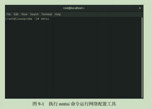
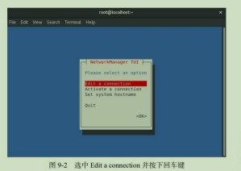
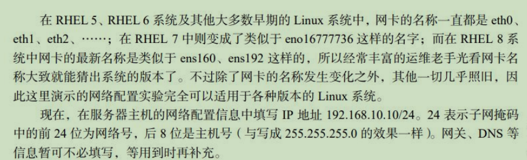
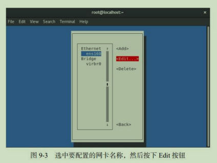
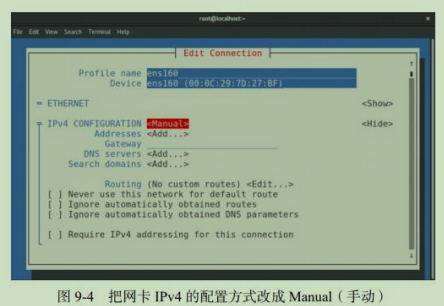
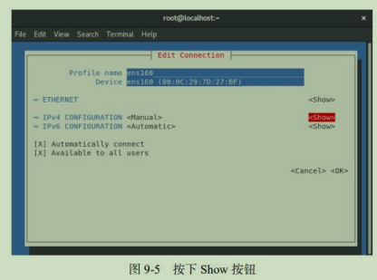
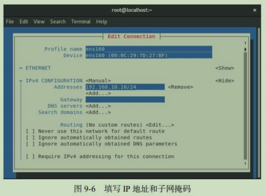
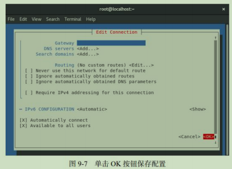
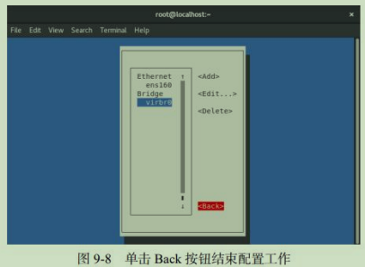
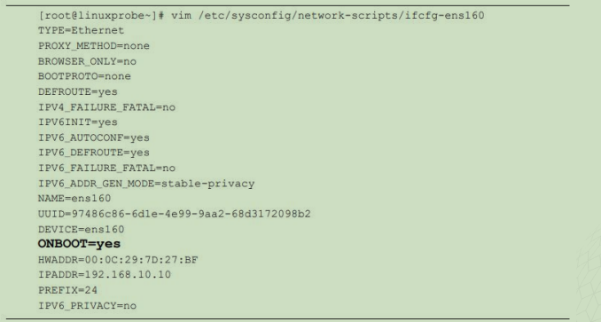
### nmcli
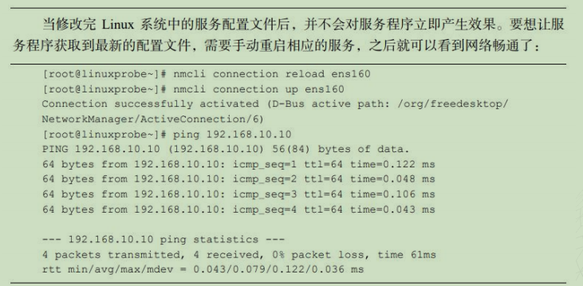
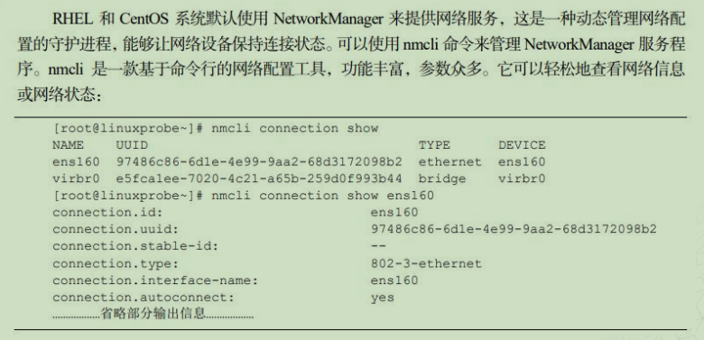


##  连接NET网络
1、首先打开网络适配器，选择NAT模式
2、打开虚拟机网络编辑器，设置虚拟机网络编辑器
3、虚拟机中输入 vi /etc/sysconfig/network-scripts/ifcfg-ens33
4、进入文本编辑模式
BOOTPROTO="static"
ONBOOT="yes"
IPADDR=192.168.XX.XX (第三段要相同 第四段两位随便输入）
NETMASK=255.255.255.0
GATEWAY=192.168.159.2
DNS1=114.114.114.114
退出vi编辑器
5、输入命令 systemctl restart network 重启虚拟机网络适配器
6、输入 ip a 查询连接到网络没
7、打开xshell 输入 ssh 192.168.XX.XX(XX为ip a 查询的ip地址）
8、连接成功 创建xshell会话 登录、设置用户密码
#### 问题

桌面底下的光盘没连接


---

# YUM
日志文件：/var/log/yum.log

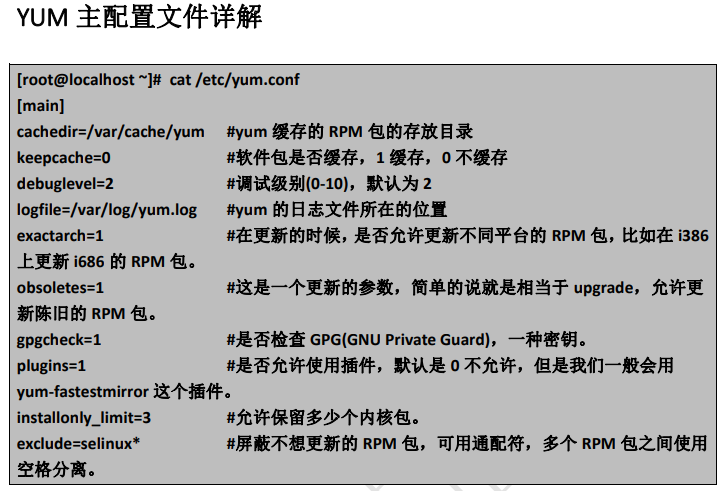
常用指令：

    yum -y install
    yum安装
    
    yum clean all
    清除yum仓库缓存
    
    yum makecache 
    重建yum仓库缓存
    
    yum provides
    查询安装包在哪个位置

    yum repolist (all)
    显示所有仓库
## 简介

    YUM是软件管理仓库。

可以完成安装、卸载、自动升级rpm软件包等任务

能够自动查找并解决 rpm软件包之间的依赖关系

并一次安装所有依赖的相关软件包

    使用python语言开发，后来由linux团队改进


## 软件源服务器

源服务器包含存放各种rpm安装包文件的软件仓库(repository)和仓库数据(repodata)

repodata:

    用来收集仓库目录下各种rpm软件包的头部信息的

repository:

    借助于HTTP或FTP协议进行发布，可以面向网络中的所有服务器，使其他的linux服务器（客户机）直接调用，而无需自己准备软件包


rpm软件包来源：

    Centos发布的软件包集合
    第三方组织发布的软件集合
    用户自定义的软件包集合


在Centos7安装光盘，已经针对Packages目录建立好repodata数据，因此只要简单的将光盘中的内容通过HTTP或FTP协议进行对外发布，就可以作为软件仓库了
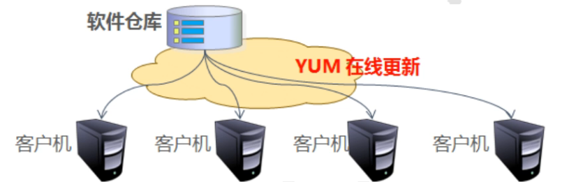
光盘映像文件：里面包含很多的包，很全面，就是不能实时更新。比如创建物理机就是用的：
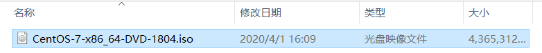
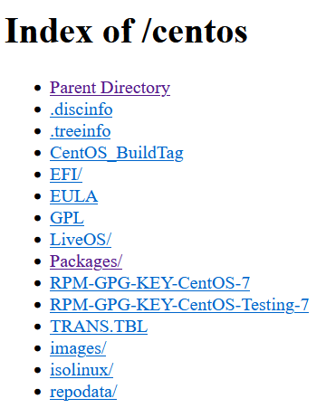

### 配置本地yum源服务器
  ● mkdir /media/iso                                           
  ● mount /dev/sr0  /media/iso                    
  ● cd /etc/yum.repos.d                                     
  ● mkdir bak                                                     
  ● mv ./* bak                                                 
  ● vi local.repo                                                    
       [local]                                                         
       name=local                                                 
       enabled=1                                                     
       gpgcheck=0                                                
       baseurl=file:///media/iso                        
  ● yum clean all                                                
  ● yum makecache                                            
  ● yum -y install gcc gcc-c++                           
  ● yum -y install lrzsz                                       
  ● yum -y install openssl openssl-devel  


#### 配置HTTP协议的YUM源服务器

yum安装httpd根目录是:
        [root@localhost ~]# yum install -y httpd
        [root@localhost ~]# cd /var/www/html/
        [root@localhost html]# ls
        centos(自己创建的)

源码安装httpd的根目录是:

        [root@localhost ~]# cd /usr/local/httpd/htdocs/
        [root@localhost htdocs]# ls
        centos(自己创建)  index.html


配置步骤：

        需要主机A当做服务器，安装Apache，并开启httpd
         把光盘映像文件(/dev/sr0)挂载到centos上
          关闭防火墙
           此时192.168.100.xxx 就配置成功了HTTP协议的YUM源服务器
测试：

            此时我们可以用另一台主机ip与主机A同网段的主机B
            使用主机A-YUM源服务器对自身进行YUM仓库配置
             #cd /etc/yum.repos.d
             #mkdir bak
             #mv ./* bak
             #vim httpd.repo
                [httpd]
                name=httpd
                enable=1
                gpgheck=0(可以为1，不过需要跟baseurl一样，进行路径配置)
                baseurl=http://192.168.100.xxx/centos
              :wq
             #yum clean all
             #yum makecaches
             进行yum安装
            

#### 配置FTP协议的YUM源服务器

安装：

    yum install -y vsftpd.x86_64

根目录:

    /var/ftp/pub
    
如果网页centos打不开
关闭SElinux

    vim /etc/selinux/config
    ----------------------------------------
    SELINUX=disable
    ----------------------------------------
    setenforce 0

配置方法与HTTP一样

## 下载依赖的软件包
    [root@localhost ~]#yum -y --downloadonly --downloaddir=php/ install php php-devel php-mysql

## CentOS7 更换互联网 yum 源

    [root@localhost ~]# yum -y install wget
    [root@localhost ~]# cd /etc/yum.repos.d/ ; mkdir backup
    [root@localhost ~]# mv *.repo backup
    [root@localhost ~]# wget -O /etc/yum.repos.d/CentOS-Base.repo
    http://mirrors.aliyun.com/repo/Centos-7.repo
    [root@localhost ~]# yum clean all && yum makecache fast
    EPEL 源地址
    CentOS6：
    https://mirrors.aliyun.com/epel/epel-release-latest-6.noarch.rpm
    CentOS7：
    https://mirrors.aliyun.com/epel/epel-release-latest-7.noarch.rpm

---
# RSYNC
## 简介
    rsync（Remote Sync，远程同步）是一个开源的快速安全高效的异地备份工具，可以在
    不同的主机之间镜像同步整个目录树，支持增量备份，有保持链接和权限功能，且采用优化
    的同步算法，传输前执行压缩。因此非常适合异地备份，镜像服务等应用，是一种常用的文
    件备份工具。

    rsync 的官方站点：http://rsync.samba.org，目前最新版本是 3.1.2，由 Waync Davison 进
    行维护，作为一种常用的文件备份工具，rsync 往往是 Linux 和 UNIX 系统默认安装的基本组
    件之一。

## 数据备份
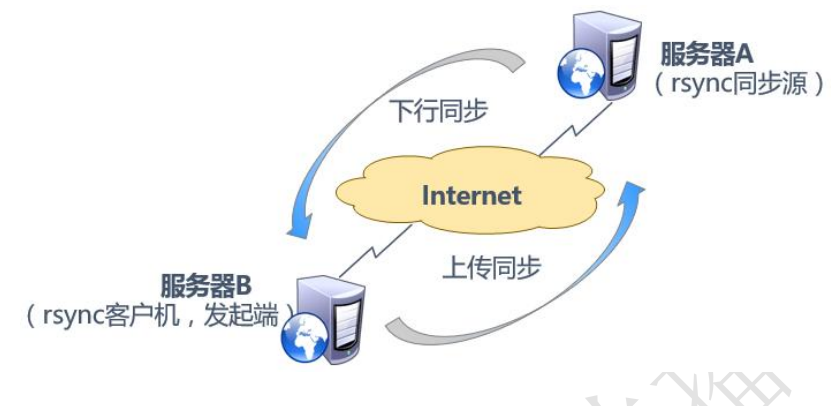
下行：A发生变动后，要求B进行同步
上传：B监控到A发生了变化，跟A申请同步
### 本机备份
在服务器上进行备份
### 异地备份
在另一台主机上进行备份，实时跟踪，自动备份
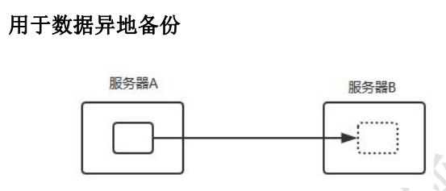
### 周期性备份
crontab
#### 全量备份
直接覆盖目录下所有文件
#### 增量备份
缺什么补什么
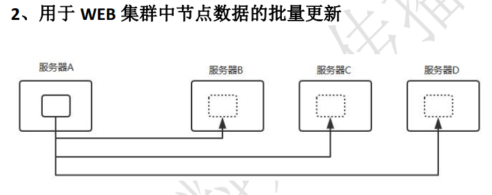
#### 差异备份（高度统一）（在公司内被完全限制，会导致数据直接消失）
B对A进行监控，多的删除，少的补全 

数据都存在磁盘上，对于磁盘来说，inode号在，数据就存在，inode号一旦被删除，代表这个文件磁盘上的位置是空出来的，在网络备份的时候，直接占用这个空间，刷新数据，这个数据就完全消失。
#### YUM源软件更新
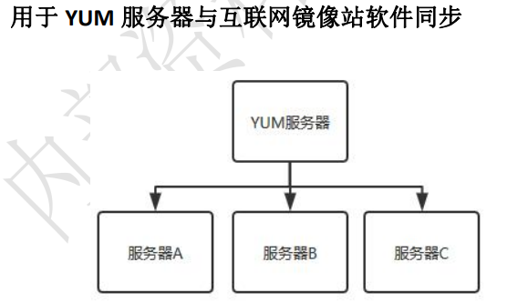

## 配置rsync备份源
守护进程：在后台运行，活着

    rsync 作为同步源时以守护进程运行，为其他客户机提供备份源。配置 rsync 同步源需要
    建立配置文件/etc/rsyncd.conf，备份账号信息，然后将 rsync 程序以守护进程（--daemon 选
    项）方式运行

rsync 不仅用作远程同步发起端（客户端），也可以作为守护进程（服务端），为其他客户机提供备份源。  
1、建立/etc/rsyncd.conf 配置文件
2、为备份账户创建数据文件
3、启动 rsync 服务进

1、安装：

    [root@localhost ~]# yum -y install rsync
    [root@localhost ~]# rpm -q rsync
    rsync-3.1.2-4.el7.x86_64

2、建立/etc/rsyncd.conf 配置文件，以源目录 /var/www/html/，备份帐号 backuper：

    uid = nobody
    gid = nobody
    use chroot = yes
    address = 192.168.100.123
    port = 873
    log file = /var/log/rsyncd.log
    pid file = /var/run/rsyncd.pid
    hosts allow = 192.168.100.0/24
    [wwwroot]
    path = /var/www/html
    comment = Document Root os www.crushlinux.com
    read only = yes
    dont compress = *.gz *.bz2 *.tgz *.zip *.rar *.z
    auth users = wsj
    secrets file = /etc/rsyncd_users.db
    

#### 配置文件注解
    uid = nobody //用户名，nobady任何人都可以使用
    gid = nobody //组名
    use chroot = yes //禁锢在源目录，监牢目录，使指定用户监控指定目录
    address = 192.168.200.111 //监听地址
    port = 873 //监听端口
    log file = /var/log/rsyncd.log //日志文件位置
    pid file = /var/run/rsyncd.pid //存放进程 ID 文件位置，
    一般来说随着进程的开始创建这个文件，随着这个进程的结束，删除这个文件。
    但是对于某些网络服务来说，他关闭的时候并不是直接调用的systemctl这个系统管理程序，
    所以说他有时候不删，那么启动就会出问题。

    hosts allow = 192.168.200.0/24 //允许访问的客户端地址（网段）
    ## hosts deny //不允许访问

    [wwwroot] //共享模块名称(自定义)
    path = /var/www/html //源目录的实际路径
    comment = Document Root os www.crushlinux.com //描述信息
    read only = yes //是否为只读，
    基于安全性考虑，对于 rsync 的备份源最好仅允许以只读的方式做下行同步。

    dont compress = *.gz *.bz2 *.tgz *.zip *.rar *.z //同步时不再压缩的文件类型

    auth users = backuper //备份授权用户

    secrets file = /etc/rsyncd_users.db 
    //存放账户信息的数据文件，需要自己建。授权为600，文件格式：用户名：密码

    ##匿名模式：将其中的"auth users"和"secrets file"配置记录去掉

3、为备份账户创建数据文件，以冒号分割，密码信息在文件中以明文方式存放，为避免信息泄漏，需要调整权限

    [root@rsync-master ~]# vim /etc/rsyncd_users.db
    backuper:pwd123
    [root@rsync-master ~]# chmod 600 /etc/rsyncd_users.db

备份用户 backuper 也需要对/var/www/html/有相应的读取权限，实际上只要 other 组具有读取权限，则备份用户 backuper 和运行 nobody 用户也就有读取权限了。

    [root@localhost ~]# mkdir /var/www/html/ -p
    [root@localhost ~]# ls -ld /var/www/html/
    drwxr-xr-x 2 root root 6 4 月 21 2018 /var/www/h

4、启动服务运行命令为"rsync --daemon"，以独立监听服务的方式运行，若关闭 rsync 服务可采用 kill 进程方式。

    [root@rsync-master ~]# rsync --daemon
    [root@rsync-master ~]# netstat -anpt |grep rsync
    tcp 0 0 192.168.200.117:873 0.0.0.0:* LISTEN
    5125/rsync

关闭 rsync 服务:

    [root@rsync-master ~]# kill $(cat /var/run/rsyncd.pid)
    [root@rsync-master ~]# rm -rf /var/run/rsyncd.pid
    [root@rsync-master ~]# netstat -anpt |grep rsync

## 编写开机自启动脚本

    #!/bin/bash
    #chkconfig:2345 80 20
    #description:rsync server

    start () {
    netstat -lnpt | grep -q :873
    [ $? -ne 0 ] && rsync --daemon
    }

    stop () {
    netstat -lnpt | grep -q :873
    [ $? -eq 0 ] && kill $(cat /var/run/rsyncd.pid) && rm -rf /var/run/rsyncd.pid
    }

    status () {
    netstat -lnpt | grep -q :873
    [ $? -eq 0 ] && echo "Rsync Daemon is running."
    }


    case $1 in
    start)
    start
    ;;
    stop)
    stop
    ;;
    restart|reload)
    $0 stop
    $0 start
    ;;
    status)
    status
    ;;
    *)
    echo "用法: $0 {start|stop|restart|reload|status}" 
    esac

    ##脚本文件有执行权限后可以直接--绝对路径 start\status..
    [root@rsync-master ~]# chmod +x /etc/init.d/rsyncd
    [root@rsync-master ~]# chkconfig --add rsyncd ##检测并设置系统服务配置
    [root@rsync-master ~]#systemctl start rsyncd 
问题1:

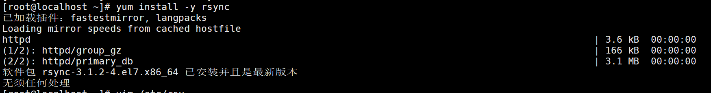
无法启动：
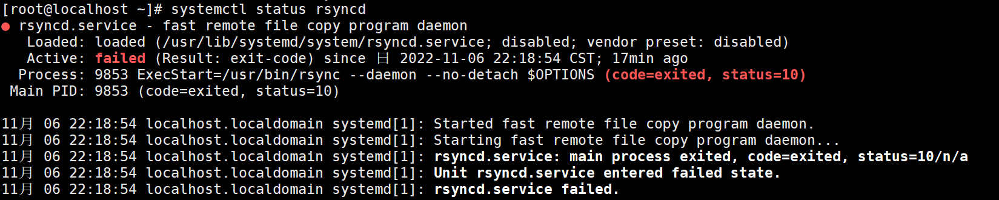
解决方法：

        yum remove -y rsync
        yum install -y rsync
        chkconfig --add rsyncd
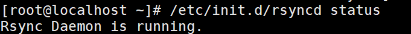

## 测试
[问题总结](https://blog.csdn.net/weixin_30293135/article/details/99398894?spm=1001.2101.3001.6661.1&utm_medium=distribute.pc_relevant_t0.none-task-blog-2%7Edefault%7ECTRLIST%7ERate-1-99398894-blog-92773915.pc_relevant_recovery_v2&depth_1-utm_source=distribute.pc_relevant_t0.none-task-blog-2%7Edefault%7ECTRLIST%7ERate-1-99398894-blog-92773915.pc_relevant_recovery_v2&utm_relevant_index=1)

增量备份：

    rsync -avz wsj@192.168.100.123::wwwroot /root/1

差量备份：

    rsync -avzH --delete wsj@192.168.100.123::wwwroot /root/1

问题1：服务未启动
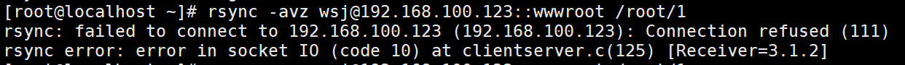

问题2：有文件没有写的权限，导致备份权限不够
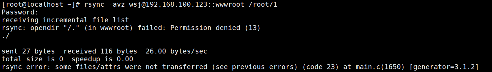
两种解决办法：

    1、将服务端rsyncd.conf配置文件的uid和gid分别修改成root，重载下，/etc/rc.d/init.d/xinetd reload，再次执行同步，同步成功

    2、将需要同步的文件夹及下属文件赋予777权限（chmod -R 777 xxx），再次执行同步，同步成功

    注意：如果使用第一种办法，那么在执行完同步后，为了安全，记得将uid和gid修改回来，或修改成nobody

问题3：一般为密码输入错误，服务器端该模块（tee）需要验证用户名密码，但客户端没有提供正确的用户名密码，认证失败。提供正确的用户名密码解决此问题。
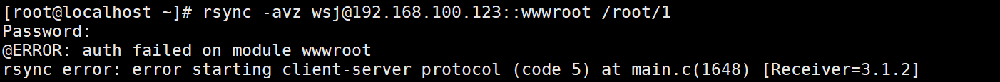

问题4：对方没开机、防火墙阻挡、通过的网络上有防火墙阻挡，都有可能。关闭防火墙，其实就是把tcp udp的873端口打开
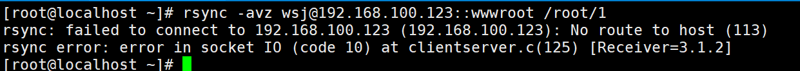


## 编写 rsync 自动备份方案
    实际生产环境中的备份工作通常是按计划重复执行的，例如：每天晚上 22:30 对服务器
    的网站目录做一次同步，定期任务可结合 shell 和 crond 服务来完成。

### rsync 备份源的无交互验证方式
1、通过 export RSYNC_PASSWORD 变量保存密码，rsync 命令执行时可以自动读取该变量的值，在需要时发送给 rsync 服务器来进行验证

    [root@rsync-slave ~]# export RSYNC_PASSWORD=pwd123
    [root@rsync-slave ~]# rsync -avzH --delete backuper@192.168.200.111::wwwroot /myweb/
    取消变量
    [root@rsync-slave ~]# unset RSYNC_PASSWORD

2、通过--password-file 选项指定存储密码的文件

    [root@rsync-slave ~]# vim /etc/server.pass（只编写密码）
    pwd123
    [root@rsync-slave ~]# chmod 600 /etc/server.pass

相对于 SSH 源的免交互措施来说，使用变量存放密码显得不够安全，因此可在脚本中使用，并将脚本的权限严格控制，避免密码泄漏。

    [root@rsync-slave ~]# rsync -az --delete --password-file=/etc/server.pass
    backuper@192.168.200.111::wwwroot /myweb/
    [root@rsync-slave ~]# crontab -e
    30 22 * * * /usr/bin/rsync -az --delete --password-file=/etc/server.pass
    backuper@192.168.200.111::wwwroot /myweb/
    [root@rsync-slave ~]# systemctl restart crond
    [root@rsync-slave ~]# systemctl enable cron


---
---
# DNS域名解析服务
DNS 协议运行在 TCP/UDP 协议之上，使用端口号53。

FQDN 格式（合法的完整域名格式）：

    在常见域名后添加“.”（根域）。例如：www.linuxxu.com.

    . 根域
    .com 顶级域     .cn .net .gov .org .edu
    .baidu  二级域
    www  三级域
==正向解析==：域名——>ip

    根据域名查 IP 地址，即将指定的域名解析为相对应的 IP 地址。域名的正向解析是 DNS服务器最基本的功能，也是最常用的功能。

==反向解析==：ip——>域名

    根据 IP 地址查域名，即将指定的 IP 地址解析为相对应的域名。域名的反向解析不是很常用，只在一些特殊场合才会用到，如可用于反垃圾邮件的验证

### DNS 服务器的分布式结构
通常 Internet 主机域名的一般结构为：主机名.二级域名.顶级域名.。 

Internet 的根域名由Internet 网络协会域名注册查询负责网络地址分配的委员会进行登记和管理，它还为 Internet 的每一台主机分配唯一的 IP 地址。

全世界现有三个大的网络信息中心： 位于美国的 Inter-NIC，负责美国及其他地区； 位于荷兰的 RIPE-NIC，负责欧洲地区；位于日本的 APNIC ，负责亚太地区。

全球共有 13 台根域名服务器。这 13 台根域名服务器中名字分别为“A”至“M”,其中 10 台设置在美国,另外各有一台设置于英国、瑞典和日本。 1 个为主根服务器,放置在美国。其余 12 个均为辅根服务器, 其中 9 个放置在美国,欧洲 2 个,位于英国和瑞典,亚洲 1 个,位于日本。


顶级域含义：

    .com 公司企业
    .cn 中国
    .中国 中国
    .net 具有互联网表示
    .edu 教育
    .org 各类组织机构(主要是非盈利)ZZ
    .gov.cn 中国政府机关单位

==DNS 的分布式数据库是以域名为索引的==，每个域名实际上就是一棵很大的逆向树中路径，这棵逆向树称为域名空间（domain name space）。如图所示树的最大深度不得超过 127 层，树中每个节点都有一个可以长达 63 个字符的文本标号。

## DNS系统类型

根据所管理的区域地址数据的来源不同， DNS 系统可以分为不同的类型。在同一台 DNS 服务器中，相对于不同的区域来说，也拥有不同的身份。常见的几种类型如下：

### 缓存域名服务器：

    只提供域名解析结果的缓存功能，目的在于提高查询速度和效率，但是没有自己控制的区域地址数据。构建缓存域名服务器时，必须设置根域或指定其他 DNS 服务器作为解析
    来源。

### 主域名服务器：

    维护某一个特定 DNS 区域的地址数据库，对其中的解析记录具有自主控制权，是指定区域中唯一存在的权威服务器、官方服务器。构建主域名服务器时，需要自行建立所负责区
    域的地址数据文件。

### 从域名服务器：
    与主域名服务器提供完全相同的 DNS 解析服务，通常用于 DNS 服务器的热备份。对客户机来说，无论使用主域名服务器还是从域名服务器，查询的结果都是一样的。关键区别在于，从域名服务器提供的解析结果并不是由自己决定的，而是来自于主域名服务器。构建从域名服务器时，需要指定主域名服务器的位置，以便服务器能自动同步区域的地址数据库。

### 转发器：

    这台 DNS 发现非本机负责的查询请求时，不再向根域发起请求，而是直接转发给指定的一台或者多台服务器。自身并不缓存查询结果。

## ==DNS服务器的查询模式及域名解析==
### ==域名解析过程==
当一个用户在浏览器地址栏输入 www.linuxxu.com 时，DNS 解析有大致十个过程：
---
==DNS 服务器递归查询==：当客户机向 DNS 服务器发出解析请求，DNS 服务器从服务器本地的唯高速缓存中查询出结果，反馈给客户机，此过程称为递归查询，即 Client-Server
1. ==浏览器先检查自身缓存==中有没有被解析过的这个域名对应的 ip 地址，如果有，解析结束。同时域名被缓存的时间也可通过 TTL 属性来设置。
2. 如果浏览器缓存中没命中，浏览器会==检查操作系统缓存==中有没有对应的已解析过的结果。而操作系统也有一个域名解析的过程。==在 windows 中可通过 c 盘里 hosts 文件==来设置，如果你在这里指定了一个域名对应的 ip 地址，那浏览器会首先使用这个 ip 地址。但是这种操作系统级别的域名解析规程也被很多黑客利用，通过修改你的 hosts 文件里的内容把特定的域名解析到他指定的 ip 地址上，造成所谓的域名劫持。所以在 ==windows7 中将 hosts 文件设置成了 readonly，防止被恶意篡改==。
3. 如果至此还没有命中域名，才会真正的==请求本地域名服务器（LDNS）来解析这个域名==，这台服务器一般在你的城市的某个角落，距离你不会很远，并且这台服务器的性能都很好，一般都会缓存域名解析结果，大约 ==80%的域名解析==到这里就完成了。
---
==DNS服务器迭代查询==：当客户机向 DNS 服务器发出解析请求，DNS 服务器从服务器本地的唯高速缓存中查询发现没有结果，此时该 DNS 服务器以 DNS 客户的身份向其他 DNS服务器发送解析请求或向根域名服务器发送请求，此过程称为迭代查询，即Server-Server。

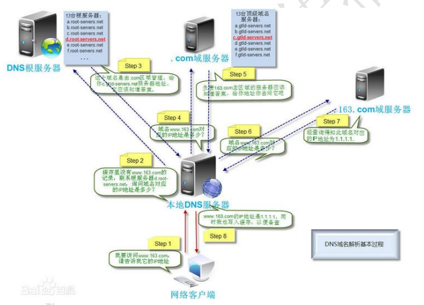
4. 如果 LDNS 仍然没有命中，就==直接跳到根（.）域名服务器请求解析==
5. ==根域名服务器返回给 LDNS 一个所查询域的主域名服务器（GTLD Server，国际顶尖域名服务器，如.com .cn .org 等）地址。
6. 此时 LDNS 再发送请求给上一步返回的 GTLD(类似于.com)。
7. 接受请求的 GTLD 查找并返回这个域名对应的 Name Server 的地址，这个 Name Server 就是网站注册的域名服务器(Linuxxu.com)。
8. Name Server 根据映射关系表找到目标 ip，返回给 LDNS。
9. LDNS 缓存这个域名和对应的 ip。
10. LDNS 把解析的结果返回给用户，用户根据 TTL 值缓存到本地系统缓存中，域名解析过程完毕。

## 安装 DNS 服务器软件
### BIND简介

    BIND（Berkeley Internet Name Domain,伯克利 Internet 域名服务）是一款开放源码的 DNS 服务器软件，
    Bind 由美国加州大学 Berkeley 分校开发和维护的，但不是唯一能够提供域名服务的 DNS 服务程序，
    但 它 却 是 应 用 最 为 广 泛 的 ， BIND 可 以 运 行 在 大 多 数 Linux/UNIX 主 机 中 。
    其 官 方 站 点 位 于 https://www.isc.org/

### 安装及管理 BIND 软件

    在 CentOS7.x 系统中，系统光盘自带了 BIND 服务的多个安装文件，各软件包的主要作用如下。
        bind：提供了域名服务的主要程序及相关文件模板。
        bind-utils：提供了对 DNS 服务器的测试工具程序，如 nslookup 等。
        bind-1ibs：提供了 bind、bind-utils 需要使用的库函数。
        bind-chroot：可选软件包，为 BIND 服务提供一个伪装的根目录（将/var/named/chroot/文件夹作为 BIND 的根目录），以提高安全性。也称为 jail（监牢）机制

### BIND 服务控制
    BIND 软件包安装完毕以后，会自动增加一个名为 named 的系统服务，通过 systemctl 工具都可以控制
    DNS 域名服务的运行。例如，执行以下操作可以查询 named 服务的运行状态

### BIND 服务的配置文件

执行 named-checkconf 命令对 named.conf 文件进行语法检查：

    [root@localhost etc]# named-checkconf -z /etc/named

主配置文件（/etc/named.conf）：

    主配置文件 named.conf 通常位于/etc/目录下，在 named.conf 文件中，主要包括全局配置、区域配置
    两个部分，每一条配置记录的行尾以分号“;”表示结束，以“#”号或者“//”开始的部分表示注释文字
    （大段注释可以使用“/* …… */”的格式）。

全局配置：

    全局配置参数包括在形如“options { };”的大括号
    [root@localhost ~]# cd /etc/
    [root@localhost etc]# vim named.conf …… //省略部分参数
    options {
    listen-on port 53 { 192.168.200.100; }; //监听地址和端口
    directory "/var/named"; //区域数据文件的默认存放位置
    allow-query { 192.168.100.0/24; 192.168.200.0/24; }; //允许使用本 DNS 服务的网段
    };…… //省略部分参数

    上述配置内容中，除了 directory 项通常会保留以外，其他的配置项都可以省略。若不指定 listen-on 配置项时，named 默认在所有接口的 UDP 53 端口监听服务，不指定 allow-query 配置项时，默认会响应所
    有客户机的查询请求。

区域配置：

    区域配置参数使用“zone …… { };”的配置格式，一台 DNS 服务器可以为多个区域提供解析，因此
    在 named.conf 文件中也可以有很多个 zone 配置段。区域类型按照解析方向可分为正向区域、反向区域

    [root@localhost etc]# vim named.conf …… //省略部分参数
    zone "linuxxu.com" IN { //正向"linuxxu.com"区域
    type master; //类型为主区域（master/slave/hint）
    file "linuxxu.zheng"; //区域数据文件为 linuxxu. com. zone
    allow-transfer { 192.168.200.101; }; //允许下载的从服务器地址
    };
    zone "200.168.192.in-addr.arpa" IN { //反向"192.168.200.0/24"区域
    type master;
    file "linuxxu.fan";
    };…… //省略部分参数

    ■ 每个 zone 区域都是可选的（包括根域、回环域、反向域），具体根据实际需要而定，zone 配置部
    分的“IN”关键字也可以省略。
    ■ 反向区域的名称由倒序的网络地址和“in-addr.arpa”组合而成。例如，对于 192.168.200.0/24
    网段，其反向区域名称表示为“200.168.192.in-addr.arpa”。
    ■ file 配置项用于指定实际的区域数据文件，文件名称由管理员自行设置。
    ■ 区域配置中的部分参数（如 allow-transfer）也可以放在全局配置里

区域数据文件/var/named/下的文件：

    在区域数据文件中，主要包括 TTL 配置项、 SOA （Start of Authority，授权信息开始）记录、地址
    解析记录。文件中的注释信息以分号“；”开始。

TTL 配置及 SOA 记录部分：

    第一行的 TTL 配置用于设置默认生存周期，即缓存解析结果的有效时问。 SOA 记录部分用于设置区域
    名称、管理邮箱，以及为从域名服务指定更新参数。

        [root@localhost ~]# cd /var/named/
        [root@localhost named]# vim linuxxu.zheng
        $TTL 86400 ;有效解析记录的生存周期
        @ IN SOA linuxxu.com. admin.linuxxu.com. (  ;SOA 标记、域名、管理邮箱
        2011030501  ;更新序列号，可以是 10 位以内的整数
        3H          ;刷新时间，重新下载地址数据的间隔
        15M         ;重试延时，下载失败后的重试间隔
        1W          ;失效时间，超过该时间仍无法下载则放弃
        1D          ;无效解析记录的生存周期
        )

    上述配置内容中，时间单位默认为秒，也可以使用以下单位: M (分)、H (时)、W (周)、D(天)。文件
    中的“@”符号当于“linuxxu.com.”，“admin.linuxxu.com.”，表示域管理员的电子邮箱地址（由于“@”
    符号已有其他含义，因此将邮件地址中的“@”用代替）。SOA 记录中的更新序列号用来同步主、从服务器
    的区域数据，当从服务器判断区域更新时，若发现主服务器中的序列号与本地区域数据中的序列号相同，
    则不会进行下载。

地址解析记录部分：

    地址解析记录用来设置 DNS 区域内的域名、 IP 地址映射关系，包括正向解析记录和反向解崭记录。

    反向解析记录只能用在反向区域数据文件中。
    [root@localhost named]# vim linuxxu.zheng …… //省略部分参数
    @ IN NS ns1.linuxxu.com.
    IN MX 10 mail.linuxxu.com. ns1 IN A 192.168.200.100
    www IN A 192.168.200.100
    mail IN A 192.168.200.113
    map IN A 192.168.200.114
    ftp IN CNAME www

    ## 检测
    [root@localhost named] # named-checkzone linuxxu.com linuxxu.zheng

    上述配置内容中，用到以下四种常见的地址解析记录。
    ■ NS 域名服务器（Name Server）：记录当前区域的 DNS 服务器的主机地址。
    ■ MX 邮件交换（Mail Exchange）：记录当前区域的邮件服务器的主机地址，数字 10 表示（当有多个
    MX 记录时）选择邮件服务器的优先级，数字越大优先级越低。
    ■ A 地址（Address）：记录正向解析条目（IPV4）。例如，“WWW IN A 192.168.200.100”表示或名
    www.linuxxu.com 对应的 IP 地址是 192.168.200.100。
    LINUX 运维架构师系列
    版权所有©xuyang 11 / 26
    ■ AAAA 地址（Address）：记录正向解析条目（IPV6）。
    ■ CNAME 别名（Canonical Name）：记录某一个正向解析条目的其他名称。例如，“ftp IN CNAME www”
    表示域名 ftp.linuxxu.com 是 www.linuxxu.com 的别名。
    其中，NS、MX 记录行首的“@”符号可以省略（默认继承 SOA 记录行首的@信息），但是必须保留一个
    空格或 Tab 制表位。


    在反向区域数据文件中，不会用到 A 地址记录，而是使用 PTR 指针（Point）记录。例如，对于反向区
    域 linuxxu.fan，添加的反向解析记录可以是以下形式。

        [root@localhost named]# vim linuxxu.fan …… //省略部分参数
        @   IN NS ns1.linuxxu.com.
            IN MX 10 mail.linuxxu.com. 
        100 IN PTR ns1.linuxxu.com. 
        100 IN PTR www.linuxxu.com.
        113 IN PTR mail.linuxxu.com.
        114 IN PTR map.linuxxu.com.

    ##检测：
        [root@localhost named]# named-checkzone 100.168.192.in-addr.arpa linuxwsj.fan

    使用 PTR 记录时，第一列中只需要指明对应 IP 地址的“主机地址”部分即可，如“100”、“113”等，
    系统在查找地址记录时会自动将当前反向域的网络地址作为前缀。例如，上述文件中的“4 IN PTR
    mai1.linuxxu.com.”，表示 IP 地址为 192.168.200.113 的主机的域名是 mail.linuxxu.com.。
    在区域数据配置文件中，凡是不以点号".″结尾的主机地址，系统在查找地址记录时都会自动将当前
    的域名作为后缀。例如，若当前的 DNS 域为“linuxxu.com”，则在文件中的主机地址“www”相当于
    “www.linuxxu.com”。因此，当使用完整的 FQDN 地址时，务必记得地址末尾的点号“.”不能省略。

### 补充
    当一台服务器需要同时承载某个 DNS 区域内的许多个不同的域名时（如 IDC 的虚拟主机服务器、提供
    个人主页空问的网站服务器等），可以在区域数据文件的最后一行添加泛域名解析记录，即使用“*”以匹
    配任意主机名。
    * IN A 192.168.200.100
  
    基于域名解析的负载均衡:同一个域名对应到多个 IP 地址
    www IN A 192.168.200.100
    www IN A 192.168.200.101
    www IN A 192.168.200.113

---
---
# DHCP与DHCP中继原理配置
## 服务概述
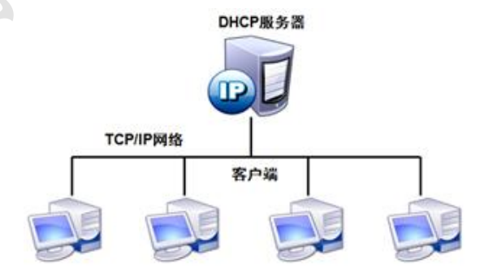

DHCP（Dynamic Host Configuration Protocol）动态主机配置协议

        DHCP 是由 Internet 工作任务小组设计开发的，
        专门用于为 TCP/IP 网络中的计算机自动分配 TCP/IP 参数的协议。

        使用 DHCP 可以减少管理员的工作量，
        避免 IP 地址冲突，
        当网络更改 IP 地址网段时不需要再重新配置每个用户的 IP 地址，
        提高了 IP 地址的利用率，方便客户端的配置。

可分配的地址信息主要包括：

    网卡的 IP 地址、子网掩码、对应的网络地址、广播地址、默认网关地址、DNS 服务器地址等。

DHCP 的分配方式：

    （1）自动分配：分配到一个 IP 地址后永久使用
    （2）手动分配：由 DHCP 服务器管理员专门指定 IP 地址
    （3）动态分配：使用完后释放该 IP，供其他客户机使用、

DHCP 的租约过程：


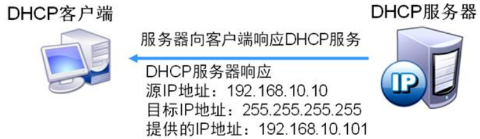
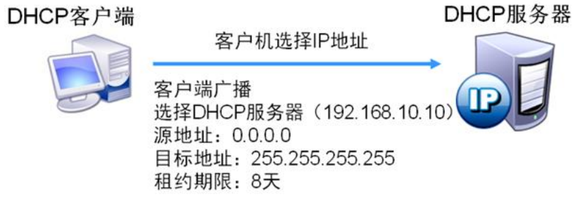


客户机重新登录：


ip地址无法再次分配给原来的客户机时：


==更新租约==：


## DHCP 中继器原理
当企业的内部网络规模较大时，通常被划分为多个不同的子网
网络内配置了 VLAN，VLAN 能隔离广播，而 DHCP 协议使用广播

    DHCP 服务器在 VLAN 100 中，就只有 VLAN 100内的客户机能从 DHCP 服务器那里获取 IP 地址。

解决的办法有两种：
- 为每个网段安装一台 DHCP 服务器：
>
    存在资源上的浪费，而且不利于集中管理

- 在连接不同网段的设备上开启 DHCP 中继功能，
  将 DHCP 这种特殊的广播信息在 VLAN之间转发，
  让其他 VLAN 的客户机也能从 DHCP 服务器那里获得 IP 地址
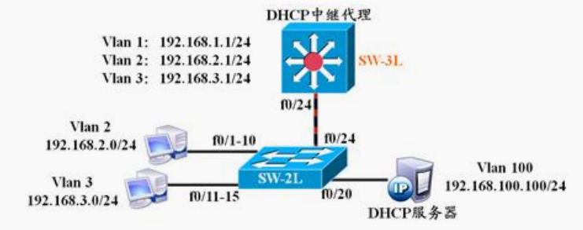

        DHCP 中继的配置命令：
        ip helper-address DHCPsrv-IPAddress
        DHCPsrv-IPAddress 为 DHCP 服务器的 IP 地址


        在三层交换机上配置 DHCP 中继转发，是在不包含 DHCP 服务器的 VLAN 上配置实现的
        SW-3L(config)#interface vlan 2
        SW-3L(config-if)#ip address 192.168.2.1 255.255.255.0
        SW-3L(config-if)#ip helper-address 192.168.100.100
        SW-3L(config-if)#no shutdown
        SW-3L(config)#interface vlan 3
        SW-3L(config-if)#ip address 192.168.3.1 255.255.255.0
        SW-3L(config-if)#ip helper-address 192.168.100.100
        SW-3L(config-if)#no shutdown
        SW-3L(config)#interface vlan 100
        SW-3L(config-if)#ip address 192.168.100.1 255.255.255.0
        SW-3L(config-if)#no shutdown

## linux 中DHCP的安装与配置
### 安装

yum -install -y dhcp*

### 配置 DHCP 服务

主配置文件：/etc/dhcp/dhcpd.conf
执行程序：/usr/sbin/dhcpd
服务脚本名：dhcpd
DHCP 服务端通过监听 UDP 协议 67 端口工作    
客户端通过 UDP 协议 68 端口工作

cat /etc/dhcp/dhcpd.conf

    #
    # DHCP Server Configuration file. 
    # see /usr/share/doc/dhcp*/dhcpd.conf.example(写配置文件的模板)
    # see dhcpd.conf(5) man page
    #

yes |cp /usr/share/doc/dhcp*(不同版本)/dhcpd.conf.example /etc/dhcp/dhcpd.conf

vim /etc/dhcp/dhcpd.conf

    option domain-name "Linuxwsj.com"; //定义分配的域名(主机名)

    option domain-name-servers 192.168.100.123, 8.8.8.8; //定义分配的 DNS 服务器信息

    default-lease-time 21600; //定义分配 IP 地址的默认租约时间，单位是秒

    max-lease-time 43200; //定义分配 IP 地址的最大租约时间，单位是秒


    subnet 192.168.100.0 netmask 255.255.255.0 { //定义分配 IP 地址网段及子网掩码,需要跟你的VMware网络段相同

    range 192.168.100.150 192.168.100.200; //定义分配 IP 地址的地址池范围

    option routers 192.168.100.2; //定义分配网关地址
    }

    针对部分主机可绑定其 MAC 地址为其分配固定 IP 地址:
    [root@localhost ~]# vim /etc/dhcp/dhcpd.conf

    host name { //添加主机定义

    hardware ethernet 00:0c:29:a4:48:bb; //客户机 MAC 地址

    fixed-address 192.168.200.99; //为客户机绑定的 IP 地址

    }

    [root@localhost ~]# systemctl restart dhcpd

    [root@localhost ~]# tail -f /var/log/messages //日志中捕获到的四个过程

#### 问题
    
    问题1：
    systemctl start dhcpd
    Job for dhcpd.service failed because the control process exited with error code. See "systemctl status dhcpd.service" and "journalctl -xe" for details.
    ##解决办法：
    设置subnet的网段不是与你的虚拟网段相同（VMware的网段）

### 客户机配置

Linux 客户机将网络模式设置与 DHCP 服务器相同模式，获取 IP 地址测试。

    [root@localhost ~]# cat /etc/sysconfig/network-scripts/ifcfg-ens32
    TYPE=Ethernet
    PROXY_METHOD=none
    BROWSER_ONLY=no
    BOOTPROTO=dhcp
    DEFROUTE=yes
    IPV4_FAILURE_FATAL=no
    IPV6INIT=no
    IPV6_AUTOCONF=no
    IPV6_DEFROUTE=no
    IPV6_FAILURE_FATAL=no
    IPV6_ADDR_GEN_MODE=stable-privacy
    NAME=ens32
    UUID=b194e583-21c3-4109-a160-3d2a9876a30b
    IPV6_PRIVACY=no
    DEVICE=ens32
    ONBOOT=yes
    [root@localhost ~]# systemctl restart network

###  Linux 中 DHCP 中继配置


---
---
# NFS (Network File System)网络文件系统
## 一、概述
功能是通过网络让不同的机器、不同的操作系统能够分享个人数据，让应用程序通过网络可以访问位于服务器磁盘中的数据

NFS服务端、RPC协议、客户端三者可以理解为房源、中介、租客之间的关系：
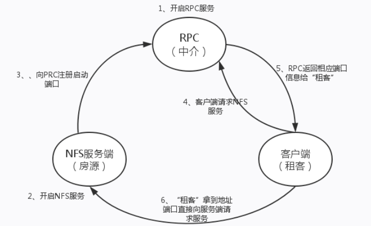 

NFS是一种基于TCP/IP 传输的网络文件系统协议。通过使用NFS协议，客户机可以像访问本地目录一样访问远程服务器中的共享资源

[NAS存储](https://blog.csdn.net/scutlynch/article/details/112725785?ops_request_misc=%257B%2522request%255Fid%2522%253A%2522166823689416800182186041%2522%252request_id=166823689416800182186041&biz_id=0&utm_medium=distribute.pc_search_result.none-task-blog-2~all~top_positive~default-1-112725785-null-null.142^v63^js_top,201^v3^control_2,213^v2^t3_esquery_v3&utm_term=NAS&spm=1018.2226.3001.4187): NFS服务的实现依赖于RPC (Remote Process Call，远端过程调用)机制，以完成远程到本地的映射过程。

在Centos 7系统中，需要安装==nfs-utils、 rpcbind== 软件包来提供NFS共享服务，前者用于NFS共享发布和访问，后者用于RPC支持。

手动加载NFS共享服务时，应该先启动rpcbind， 再启动nfs。
nfs端口：2049
RPC端口：111

特点:

    采用TCP/IP传输网络文件
    安全性低
    简单易操作
    适合局域网环境

适用场景：


    NFS 只能在 linux 上使用 （如果想让 windows 和 Linux 之间实现数据共享建议使用 FTP 或者 samba）；
    NFS 适合在中小型企业使用  ； 

## 二、NFS工作原理

NFS服务器可以让PC将网络中的NFS服务器共享的目录挂载到本地端的文件系统中，而在本地端的系统中来看，那个远程主机的目录就好像是自己的一个磁盘分区一样，在使用上相当便利；

#### 2.1NFS工作流程

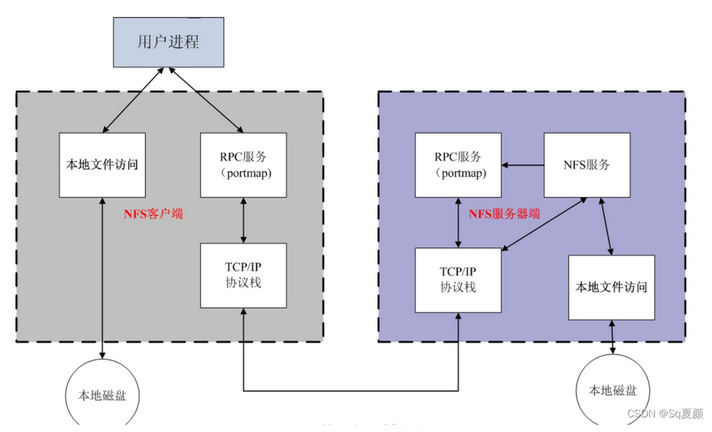
1.首先服务器端启动RPC服务，并开启111端口
2.服务器端启动NFS服务，并向RPC注册端口信息
3.客户端启动RPC（portmap服务），向服务端的RPC(portmap)服务请求服务端的NFS端口
4.服务端的RPC(portmap)服务反馈NFS端口信息给客户端。
5.客户端通过获取的NFS端口来建立和服务端的NFS连接并进行数据的传输。

#### 2.2挂载原理

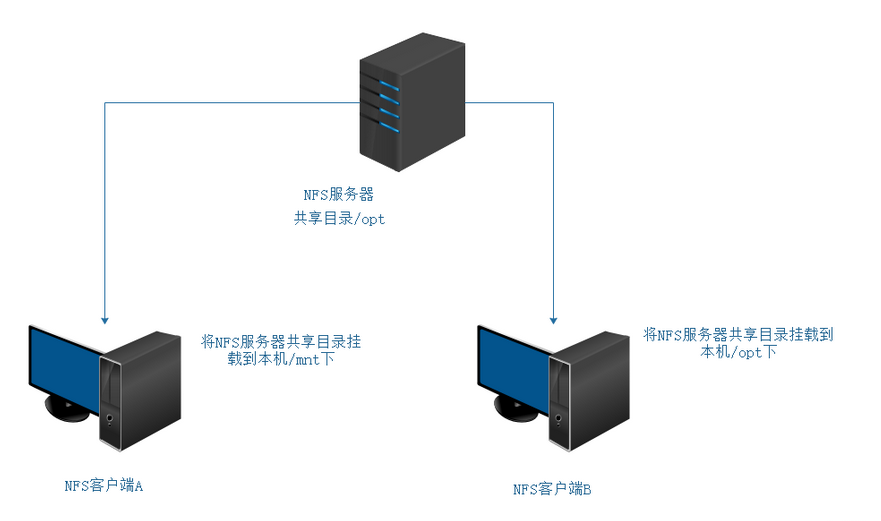

当我们在NFS服务器设置好一个共享目录/opt后，其他的有权访问NFS服务器的NFS客户端就可以将这个目录挂载到自己文件系统的某个挂载点，这个挂载点可以自己定义，如上图客户端A与客户端B挂载的目录就不相同。并且挂载好后我们在本地能够看到服务端/opt的所有数据。

## 三.NFS服务部署
#### 3.1常用命令
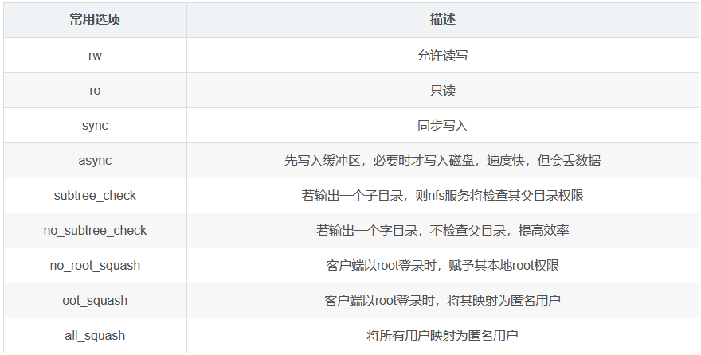
```dotnetcli
注释：
/share：表示共享的目录
10.4.7.*：表示允许访问NFS服务的客户端地址网段
(rw,sync,no_root_squash)：客户端权限

权限说明：
rw：read-write，可读写，注意仅仅这里设置成读写客户端还不能正常读写，还要正确的配置共享目录的权限才可以；
ro：read-only，只读权限；
sync：文件通知写入硬盘和内存；
Async：文件暂时存于内存，不直接写入内存；
no_root_squash：NFS客户端使用root连接时，对于共享目录也具有root权限（不安全）；
root_squash：NFS客户端使用root用户连接时，对于共享目录具有匿名用户的权限；
all_squash：不论客户端使用什么身份连接，对共享目录都只拥有匿名用户的权限；
anonuid：匿名用户的UID值，这个UID的值必须真实存在于/etc/passwd中一般与all_squash一起使用；
anongid：匿名用户的GID值
```
~~~
exportfs -v  //查看详细的nfs信息
exportfs -r  //重读配置文件
showmount -e //查看本机发布的NFS共享目录
showmount -e +IP //查看IP地址发布的NFS共享目录
mount -t nfs 192.168.48.6:/opt /mnt //将NFS服务端192.168.48.6下的/opt挂载到/mnt下
rpcinfo -p localhost  //查看rpc注册的端口信息
~~~
#### 3.2服务器端配置
```
1.检查并安装软件
rpm -q rpcbind nfs-utils
yum install -y rpcbind nfs-utils
2.创建共享目录
vim /etc/exports  //NFS的配置文件，默认文件内容为空（无任何共享）
/opt 192.168.48.0/24(rw,sync,no_root_squash)
//设置/opt为共享目录，允许192.168.48.0网段的IP地址主机访问
3.启动服务
systemctl start rpcbind  //一定要先开启rpcbind服务
systemctl start nfs      //如服务已启动，更改完配置信息后需要重启服务
```
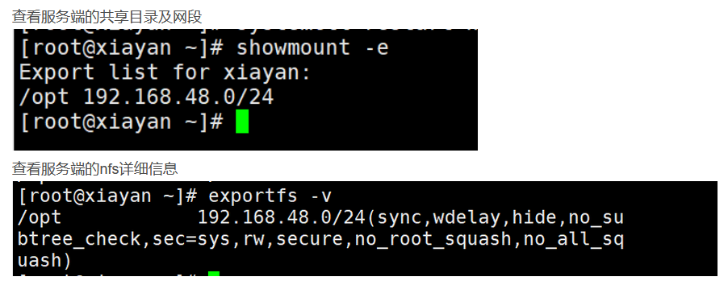
4、修改主机映射名：
```
[root@123 opt]# vim /etc/hosts
127.0.0.1   localhost localhost.localdomain localhost4 localhost4.localdomain4
::1         localhost localhost.localdomain localhost6 localhost6.localdomain6
192.168.100.123 nfs_server
[root@123 ~]# hostnamectl set-hostname nfs_server
注意，nfs会根据主机名进行鉴别，如果未设置主机名映射可能会出现如下报错
[root@123 ~]# showmount -e
clnt_create: RPC: Port mapper failure - Unable to send: errno 22 (Invalid argument)
```
#### 3.3客户端配置
```
1.1.检查并安装软件
rpm -q rpcbind nfs-utils
yum install -y rpcbind nfs-utils
systemctl start rpcbind
systemctl start nfs
2.将共享目录挂载到本地
showmount -e 服务端ip
mount -t nfs 服务端ip:/目录  /客户端挂载目录    
```
#### 3.4服务测试
在目录下进行增删改查等，看服务端与客户端的文件是否同步

## 四、生产优化
### 4.1 nfs端口优化

NFS端口的分配有下面三种：

- TCP/UDP 111 – RPC 4.0 portmapper；
- TCP/UDP 2049 – NFSD (nfs server)；
- Mount端口—系统 RPC服务在 nfs服务启动时默认会为 mountd动态选取一个随机端口（32768--65535）来进行通讯，我们可以在/etc/sysconfig/nfs文件中定义端口。
生产环境中由于不同网段之前都会被网络个隔开，所以我们主机之间调用服务时都需要开通特定端口的网络策略，但是nfs连接使用的都是随机端口，无法开通策略。所以统一网段可以进行mount挂载，但是不同网段可能会出现如下报错：
```al
rpc mount export: RPC: Timed out
```
最大的可能就是网络不通，所以我们需要固定nfs的连接端口
编辑配置文件，固定端口
```al
vim /etc/sysconfig/nfs
RQUOTAD_PORT=6005
LOCKD_TCPPORT=6004
LOCKD_UDPPORT=6004
MOUNTD_PORT=6002
STATD_PORT=6003
STATD_OUTGOING_PORT=6006
```
重启nfs服务
```
[root@100 ~]# systemctl restart nfs
```
开通对应的网络策略（客户端到服务端的111/2049/6002-6006以及111/2049的UDP端口）后测试mount挂载
### 4.2 优化权限

生产环境中使用root用户连接是不安全的，所以我们需要配置只允许特定的用户和用户组进行访问
nfs服务端配置优化


    [root@100 ~]# vim /etc/exports
    /share 10.4.7.*(rw,sync,all_squash,anonuid=1010,anongid=1010)


注释：

- all_squash：表示所有客户端登录后都会被映射为匿名用户；
- anonuid=1010：表示匿名用户的uid=1010；
- anongid=1010：表示匿名用户的gid=1010。
    只需要重新生效一下，不需要重启nfs服务
```
[root@100 ~]# exportfs -r
```
客户端挂载后测试

```al
[root@101 ~]# mount -t nfs 10.4.7.100:/share /client
[root@101 ~]# cd /client/
[root@101 client]# ls
test  test1
[root@101 client]# mkdir 2
mkdir: cannot create directory ‘2’: Permission denied
```
权限分析：
已知目前服务端与客户端都有wyg这个用户，且uid=1000，gid=1000
```al
[root@100 ~]# id wyg
uid=1000(wyg) gid=1000(wyg) groups=1000(wyg)
```
之所以Permission denied是因为共享文件的目录权限是wyg的为uid=1000，gid=1000
```al
[root@100 /]# ll|grep share
drwxr-xr-x    4 wyg  wyg    31 Aug  2 11:28 share
```
需要修改服务端的wyg用户为1010

    [root@100 ~]# usermod -u 1010 wyg
    [root@100 share]# groupmod -g 1010 wyg
    [root@100 share]# id wyg
    uid=1010(wyg) gid=1010(wyg) groups=1010(wyg)
    [root@100 /]# chown -R wyg:wyg /share/

客户端重新挂载

    [root@101 ~]# umount /client
    [root@101 ~]# mount -t nfs 10.4.7.100:/share /client

先用root测试

    [root@101 client]# mkdir 1
    [root@101 client]# ll
    total 0
    drwxr-xr-x 2 1010 1010  6 Aug  2 17:13 1
    drwxr-xr-x 2 1010 1010  6 Aug  2 17:03 test
    drwxr-xr-x 2 1010 1010 15 Aug  2 11:27 test1

再用wyg测试
```al
[root@101 client]# su - wyg
Last login: Mon Aug  2 17:03:01 CST 2021 on pts/0
[wyg@101 ~]$
[wyg@101 ~]$ cd /client/
[wyg@101 client]$ ls
1  test  test1
[wyg@101 client]$
[wyg@101 client]$ mkdir 2
[wyg@101 client]$ ll
total 0
drwxr-xr-x 2 1010 1010  6 Aug  2 17:13 1
drwxrwxr-x 2 1010 1010  6 Aug  2 17:15 2
drwxr-xr-x 2 1010 1010  6 Aug  2 17:03 test
drwxr-xr-x 2 1010 1010 15 Aug  2 11:27 test1
发现他们创建的文件夹的属性都是uid=1010，gid=1010
```
生产上本地服务一般都用普通用户启动，为防止本服务调用共享目录数据时无权限，所以客户端的wyg普通用户也应该和服务端的wyg属性保持一致
修改客户端wyg的属性
```al
[root@101 client]# usermod -u 1010 wyg
[root@101 client]# groupmod -g 1010 wyg
[root@101 client]# ll /client/
total 0
drwxr-xr-x 2 wyg wyg  6 Aug  2 17:13 1
drwxrwxr-x 2 wyg wyg  6 Aug  2 17:15 2
drwxr-xr-x 2 wyg wyg  6 Aug  2 17:03 test
drwxr-xr-x 2 wyg wyg 15 Aug  2 11:27 test1
```
总结：
nfs挂载后用的都是/etc/exports中设置的gid和uid，所以共享目录的gid和uid属性必须和/etc/exports中设置的一样，不然会有权限问题；
服务端和客户端不一定要有对应的gid和uid用户，但是为方便管理，服务端和客户端都有同样的用户，并且用户的uid和gid相同，/etc/exports配置成普通用户的权限
### 4.3 加入开机自动挂载
```al
[root@101 ~]# vim /etc/fstab
10.4.7.100:/share       /client                 nfs     defaults,_rnetdev        0 0
```
注释：

  - ,_rnetdev表示主机无法挂载直接跳过，避免无法挂载造成主机无法启动；
  - 第一个0表示不备份文件系统；
  - 第二个0表示不检测磁盘。

## 五、总结
1.NFS服务多用于局域网内
2.搭建服务时一定要先启动rpc后启动nfs
3.配置文件中的信息格式一定要对，否则报错

#### 常见报错
1、关闭防火墙时报错，可以尝试解锁防火墙状态，如解锁防火墙状态依然无法更改模式，建议重新安装防火墙或者恢复快照（虚拟机情况下）

    [root@localhost ~]# systemctl start friewall
    Failed to start friewall.service: Unit not found.


2、解锁防火墙状态更改

    [root@localhost ~]# systemctl unmask firewalld


3、挂载时报错，提示信息说服务器不存在该目录，检查是否文件夹名字拼写错误，建议直接复制粘贴
```al
[root@cj-host-02 ~]# mount -a
mount.nfs: mounting 172.16.10.10:/storage/CSND_nfs failed, reason given by server: No such file or directory
```

4、查看共享文件错误，查看是否共享目的地地址是否写正确：

    [root@cj-host-02 ~]# showmount -e 172.168.10.10
    clnt_create: RPC: Port mapper failure - Unable to send: errno 101 (Network is unreachable)


#### [参考文章1](https://blog.csdn.net/weixin_44175418/article/details/124286904?)
#### [参考文章2](https://blog.csdn.net/sinat_41075146/article/details/80800812?)
#### [参考文章3](https://www.cnblogs.com/wangyuanguang/p/15094740.html)
#### [报错参考](https://blog.csdn.net/weixin_46532751/article/details/121358261?)
---
---
# OpenSSH 远程及 TCP Wrappers防护
## OpenSSH 远程
#### 一、OpenSSH
OpenSSH 是实现 SSH 协议的开源软件项目，适用于各种 UNIX、Linux 类操作系统。OpenSSH 是 SSH （Secure SHell） 协议的免费开源实现。
OpenSSH 服务器由 openssh-clients、openssh-server 等软件包提供（默认已安装），属于典型的 C/S 结构、并已将 sshd 添加为标准的系统服务。

#### 二、SSH基础
1、SSH（Secure Shell）是一种安全通道协议，主要用来实现字符界面的远程登录、远程命令执行、远程复制等功能。SSH 协议对通信双方的数据传输进行了加密处理，其中包括用户登录时输入的用户口令，SSH 为建立在应用层和传输层基础上的安全协议。对数据进行压缩，加快传输速度。
SSH客户端<---网络（通过网络连接服务端和客户端）--->SSH服务端

2、SSH协议的优点：
- 数据传输是加密的，可以防止信息泄漏
- 数据传输是压缩的，可以提高传输速度

3、SSH 协议默认监听端口：TCP 协议 22

4、SSH 协议版本：V1、V2

5、服务名称：sshd
- 服务端主程序：/usr/sbin/sshd
- 服务端配置文件：==/etc/ssh/sshd_config==
- 客户端配置文件：/etc/ssh/ssh_config
- 启动sshd 服务：systemctl start sshd 

#### 三、SSH原理
(1)公钥传输原理
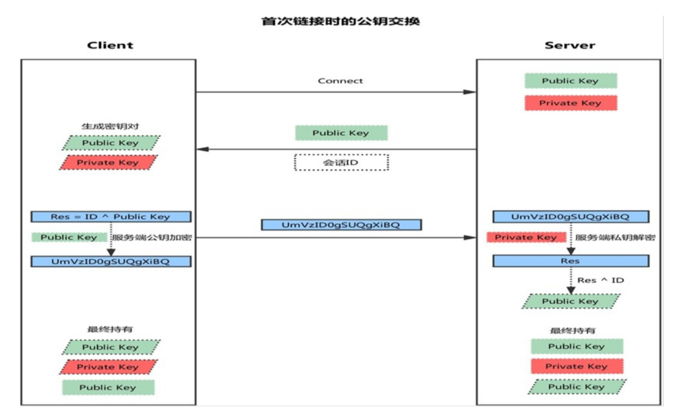
  - 客户端发起链接请求
  - 服务端返回自己的公钥，以及一个会话ID（这一步客户端得到服务端公钥）
  - 客户端生成密钥对
  - 客户端用自己的公钥异或会话ID，计算出一个值Res，并用服务端的公钥加密
  - 客户端发送加密值到服务端，服务端用私钥解密，得到Res
  - 服务端用解密后的值Res异或会话ID，计算出客户端的公钥（这一步服务端得到客户端公钥）
  - 最终：双方各自持有三个秘钥，分别为自己的一对公、私钥，以及对方的公钥，之后的所有通讯都会被加密

#### 四、OpenSSH服务器配置：
==vim /etc/ssh/sshd_config==
  - 服务监听选项：
  
        行号
        17 Port 22 #监听端口，建议修改为其他端口以提高在网络中的隐蔽性
        19 ListenAddress 192.168.200.111 #监听 IP 地址，默认监听到 0.0.0.0 任意地址
        20 protocol 2 #ssh 协议的版本选用 V2 比 V1 的安全性更好
        116 UseDNS no #禁用 DNS 反向解可以提高服务的响应速度

  - 用户登录控制:

        行号
        38 LoginGraceTime 10s #登录验证时间为 10 秒
        39 PermitRootLogin no #禁止 root 用户登录
        41 MaxAuthTries 3 #最大重试次数为 3
        65 PermitEmptyPasswords no #禁止空密码用户登录

    - sshd 服务默认允许 root 用户登录，但在 Internet 中使用时是非常不安全的。普遍的做法如下：先以普通用户远程登入，进入安全 shell 环境后，根据实际需要使用 su -命令切换为 root 用户。

    - OpenSSH 服务访问控制

            行号
            141 AllowUsers tom jerry linuxxu@134.175.27.146
            仅允许 tom jerry linuxxu 等用户登录，其中 linuxxu 用户只能来源于 134.175.27.146

        - AllowUsers 仅允许用户登录
        - DenyUsers 仅禁止用户登录
        注意：
        1）AllowUsers 不要与 DenyUsers 同时使用
        2）当服务器在 Internet 时，控制包含的 IP 地址时应是公司公网地址

  - 登录验证方式
    
        行号
        66 PasswordAuthentication yes #启用密码验证
        44 PubkeyAuthentication yes #启用密钥对验证
        48 AuthorizedKeysFile .ssh/authorized_keys #指定公钥库文件（用于保存多个客户端上传的公
        钥文本）
    
    SSH 服务支持两种验证方式：
    ```可以设置只使用其中一种方式，也可以两种方式都启用,服务器将优先使用密钥对验证。建议将密码验证方式禁用只允许启用密钥对验证方式```
    - 密码验证
        ```
        对服务器中本地系统用户的登录名称、密码进行验证。
        这种方式使用最为简便，但从客户端角度来看，正在连接的服务器有可能被假冒。
        从服务器角度来看，当遭遇穷举(暴力破解)攻击时防御能力比较弱。
        ```
    - 密钥对验证
        ```
        要求提供相匹配的密钥信息才能通过验证。
        通常先在客户端中创建一对密钥文件(公钥/私钥)，然后将公钥文件放到服务器中的指定位置。
        远程登录时，系统将使用公钥私钥进行加密/解密关联验证，大大增强了远程管理的安全性。
        该方式不易被假冒，且可
        以免交互登录，在 Shell 中被广泛使用。
        ```
        1、对称加密
        2、非对称加密

#### 五、使用 SSH 客户端程序
#### 命令程序
（1）ssh 命令（远程安全登录）
格式：ssh user@host （若客户机登录用户与主机用户名相同，可省去 user@）
```格式：ssh user@host command -p 端口号（默认为22）```


```当第一次登录 SSH 服务器时，必须接受服务器发来的 ECDSA 密钥（根据提示输入“yes”）后继续验证。```
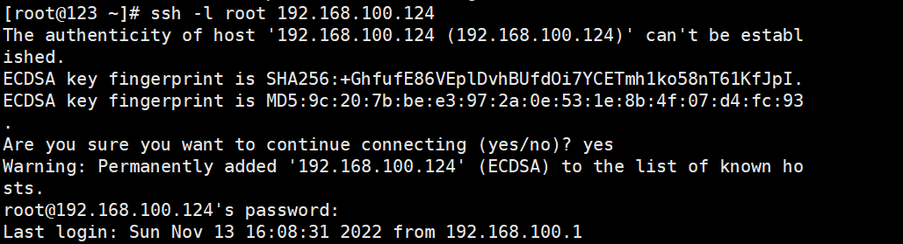
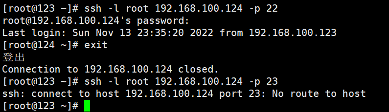
（2）scp 命令（远程安全复制）
```通过 scp 命令可以利用 SSH 安全连接与远程主机相互复制文件。使用 scp 命令时，除了必须指定复制源、目标以外还应指定目标主机地址、登录用户、执行后根据提示输入验证密码即可。```
格式 1：scp [-r] file1 user@host:file2
把主机124下的root目录复制到主机123的/root/1下


格式 2：scp [-r] user@host:file1 file2
把主机123的/root/1复制到主机124的/root下


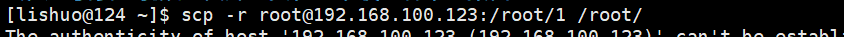
注意：用户名这个部分影响了文件的权限