# 系统管理

---

## SHELL

  ● 是Linux系统中运行的一种特殊程序（软件）
  ● 位于用户和Linux内核之间充当命令解释器（翻译官）
  ● 用户在登录Linux系统时，会被分配到一个Shell程序
  ● Bash是Linux系统中默认使用的Shell程序（文件位于/bin/bash）
  ● Shell负责接收用户输入的操作命令、解释、提交给内核执行

## Linux命令的分类

- 内部命令 外部命令
- 集成于Shell解释器程序内部的一些特殊指令，也成为内建指令 Linux系统中能够完成特定功能的脚本文件或二进制程序文件
- 属于Shell内的一部分 属于Shell解释器程序之外的程序文件
- 没有单独对应的系统文件 每个外部命令对应了系统中的一个程序文件和多个库文件
- shell运行时内部命令自动载入内存，可以直接使用 必须知道其对应的程序文件位置，由Shell加载后才能执行
- Linux系统各文件颜色含义
  蓝色： 目录
  绿色：可执行文件
  红色：压缩文件
  浅蓝色：链接文件
  白色：普通文件
  黄色：设备文件

---

# Linux命令行快捷键

Tab 键：自动补齐或者列出符合开头的命令

反斜杠"\"：强制换行（续行符）和转义

快捷键 Ctrl+u：从光标处清空至行首

快捷键 Ctrl+k：从光标处清空至行尾

快捷键 Ctrl+y：黏贴刚才所删除（剪切）的字符

快捷键 Ctrl+a：快速跳转至行首Home

快捷键 Ctrl+e：快速跳转至行尾 End

快捷键 Ctrl+l：清屏等同于clear命令

快捷键 Ctrl+c：取消本次命令执行

快捷键 Ctrl+r：搜索历史命令（常用并且很好用）

快捷键 Ctrl+D：从shell提示中注销关闭，类似输入exit

快捷键 Ctrl+Z：转入后台运行

---

# CPU 相关信息查看

$查看 CPU 型号：$
grep "model name" /proc/cpuinfo | uniq
dmidecode -s processor-version | uniq

$查看物理 CPU 个数：$
grep 'physical id' /proc/cpuinfo |sort -u |wc -l
grep 'physical id' /proc/cpuinfo |uniq |wc -l

$查看 CPU 核心数：$
grep 'core id' /proc/cpuinfo | sort -u | wc -l
grep 'core id' /proc/cpuinfo | uniq | wc -l

$查看 CPU 线程数：$
grep 'processor' /proc/cpuinfo | sort -u | wc -l
grep 'processor' /proc/cpuinfo | uniq | wc -l
free -m
free -g
df -hT
mii-tool ens33

---

# 系统命令:

## [enable 显示内部指令](https://blog.csdn.net/dengjin20104042056/article/details/100222209?)

## id 查询用户身份标识

    格式：id [用户名]

## [umask 权限掩码](https://blog.csdn.net/weixin_44080445/article/details/105901387?)

    1、作用：控制新建的文件或目录的权限

    2、umask值与新建文件、目录权限对照表

| umask值 | 目录权限值 | 文件权限值 |
| :-----: | :--------: | :--------: |
|    0    |     7     |     6     |
|    1    |     6     |     6     |
|    2    |     5     |     4     |
|    3    |     4     |     4     |
|    4    |     3     |     2     |
|    5    |     2     |     2     |
|    6    |     1     |     0     |
|    7    |     0     |     0     |

    例如：
    umask值为0000，则目录权限值777，文件权限值666
    Umask值为0022，则目录权限值755，文件权限值644

    3、查看umask值
    格式：umask
    [root@localhost ~]# umask
    0022

    4、设置umask值
    格式：umask nnn
    [root@localhost ~]# umask 0044
    [root@localhost ~]# umask
    0044

## [uname 查看系统信息](https://blog.csdn.net/u014630623/article/details/89020131?)

## w

    作用：
    查询一登陆到主机的用户信息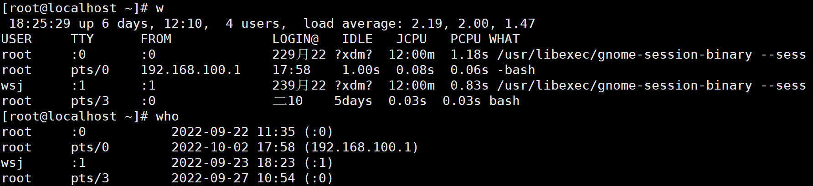

## who

    作用：
    与w命令类似，查询已登录到主机的用户

## whoami

    作用：
    查询当前登录的账号名

## finger

    作用：
    查询账号的详细信息

    格式：
    finger [用户名]

## cat/proc/cpuinfo 查看CPU信息

## lsmod 查看已加载的系统模块

## stat

查看文件的inode信息
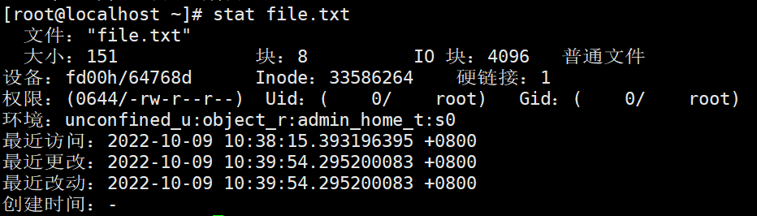

## iostat 查看I/O使用情况

## free 显示系统内存情况

## env 查看环境变量

## uptime 查看系统运行时间、用户数、负载

---

# 磁盘分区与文件系统基础管理

## df 查看磁盘使用情况

    格式：
    df [选项]...[文件系F统]

    常用选项
    -h 显示更易读的容量单位 人性化
    -T 显示对应文件系统的类型
    -i 显示inode数量

## du 查看目录使用情况

    用法：
    du [选项]... [文件或目录]...

    du 用于统计指定目录（或文件）所占用磁盘空间的大小

    du命令常用的几个选项如下：
    -a：统计磁盘空间占用时包括所有的文件，而不仅仅只统计目录
    -h：以更人性化的方式（默认以KB计数，但不显示单位）显示出统计结果
    -s：只统计所占用空间总的（Summary）大小，而不是统计每个子目录、文件的大小

## lsblk 查看磁盘分区

列出当前系统中所有磁盘设备及其分区信息

## blkid 查看分区的UUID号

    1、UUID号：分区必须格式化后才会有UUID号
    2、格式：blkid 分区设备

## [fdisk 磁盘分区](https://blog.csdn.net/weixin_34245749/article/details/90128728)

在交互式的操作环境中管理磁盘分区

    格式：
    fdisk [磁盘设备]

    常用选项：
    l 列出当前系统中所有磁盘设备及其分区信息
    m 查看操作指令的帮助信息
    p 列表查看分区信息
    n 新建分区
    d 删除分区
    t 变更分区类型
    w 保存分区设置并退出
    q 放弃分区设置并退出
    Ctrl+退格键 删除输入的错误字符

## parted

    通常划分分区工具我们用的比较多是 fdisk 命令，但是现在由于磁盘越来越廉价，而且
    磁盘空间越来越大。而 fdisk 工具他对分区是有大小限制的，它只能划分小于 2T 的磁盘。
    现在的磁盘空间已经远远大于 2T，有两个方法来解决这个问题：其一是通过卷管理来实现，
    其二就是通过 Parted 工具来实现对 2T 磁盘进行分区操作。
    GPT 格式的磁盘相当于原来 MBR 磁盘中原来保留 4 个 partition table 的 4*16 个字节，
    只留第一个 16 个字节，类似于扩展分区，真正的 partition table 在 512 字节之后，GPT
    分区方式没有四个主分区的限制，最多可达到 128 个主分

帮助选项：

    -h, --help 显示此求助信息
    -l, --list 列出所有设别的分区信息
    -i, --interactive 在必要时，提示用户
    -s, --script 从不提示用户
    -v, --version 显示版本
操作命令：
    p 查看分区状态

    mklabel 标签类型 #创建新的磁盘标签（分区表）

    mkpart 分区类型 【文件系统类型】起始点 终止点

    print 打印分区表或者分区

    quit 退出程序

    rescue 起始点 终止点 #挽救临近“起始点”、“终止点”的遗失的分区

    rm MINOR #删除编号为 MINOR 的分区

    select 设备 #选择要编辑的设备

### partprobe 重新加载分区

    使用fdisk或parted工具只是将分区信息写入到磁盘，如果需要使用mkfs格式化并使用分区，则需要重新启动系统。partprobe 是一个可以修改kernel中分区表的工具，可以使kernel重新读取分区表而不用重启系统。
partprobe  /dev/vdb

## [mkfs 创建文件系统（格式化）Make Filesystem](https://dongshao.blog.csdn.net/article/details/86822769?spm=1001.2101.3001.6650.1&utm_medium=distribute.pc_relevant.none-task-blog-2%7Edefault%7ECTRLIST%7ERate-1-86822769-blog-120997798.pc_relevant_3mothn_strategy_recovery&depth_1-utm_source=distribute.pc_relevant.none-task-blog-2%7Edefault%7ECTRLIST%7ERate-1-86822769-blog-120997798.pc_relevant_3mothn_strategy_recovery&utm_relevant_index=2)

    格式：
    mkfs -t 文件系统类型 分区设备

    常用选项：
    -f 如果设备内已经有了文件系统，则需要使用-f强制格式化
    -t 指定格式化文件类型
    -b 指定block大小，单位为字节
    -I inode大小
    -U 设置UUID号
    -q 执行时不显示任何信息

 mkfs -V 查看命令版本

格式化分区为xfs类型的文件系统: mkfs.xfs /dev/sdb2

格式化分区为ext4类型的文件系统：mkfs.ext4 /dev/sdb1

格式化分区为FAT32类型的文件系统：mkfs.vfat -F 32 /dev/sdb5

格式化分区为swap类型的文件系统 ：mkswap /dev/sdb6

### xfs_repair 针对xfs文件类型修复

### fsck -y -t ext4 针对ext4文件类型修复

### badblocks 检测磁盘坏道

-s 用于显示进度信息
-v 用于显示详情

### mkswap 创建交换文件系统

    格式：mkswap 分区设备

    交换分区：
    交换分区一般是物理内存的1.5倍-两倍。
    交换分区，就是windows中虚拟内存在linux中的叫法。
    虚拟内存是计算机系统内存管理的一种技术。它使得应用程序认为它拥有连续的可用的内存（一个连续完整的地址空间），而实际上，它通常是被分隔成多个物理内存碎片，还有部分暂时存储在外部磁盘存储器上，在需要时进行数据交换。目前，大多数操作系统都使用了虚拟内存，如Windows家族的“虚拟内存”；Linux的“交换空间”等。

### swapon 开启swap

### swapoff 关闭swap

## mount 挂载文件系统、ISO镜像

    格式:
    mount 查看当前的挂载
    mount -a 挂载/etc/fstab中已记录的所有挂载
    mount -o
    命令语法：mount [-t 文件系统] 设备文件名 挂载点

    举个栗子：mount -t iso9600 /dev/sr0 /mnt/cdrom
        备注：1. -t iso9600 可以不写 因为光盘的文件系统时默固定的。
                2./dev/sr0也可以写成/dev/cdrom，sro是原文件，cdrom是 sr0的软链接，是一个快捷方式。可用命令 ll /dev/cdrom

## umount 卸载已挂载的文件系统

    格式：
    umount 存储设备位置
    umount 挂载点目录
    umount -a 卸载所有/etc/fstab已记录的挂载

---
---
# LVM 逻辑卷与磁盘配额限制

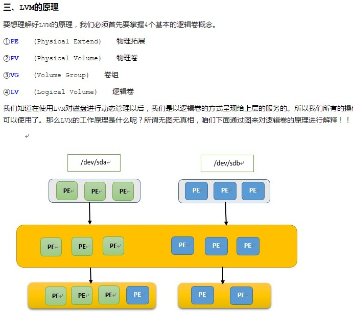
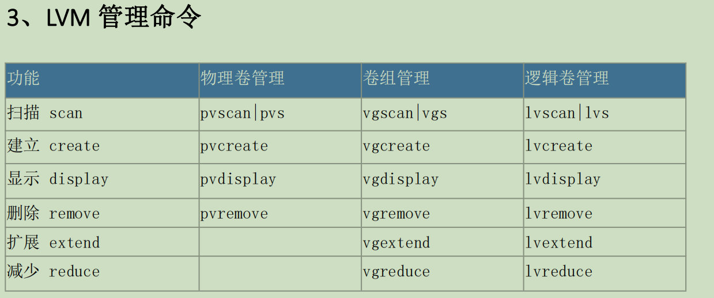

## 物理卷 (physical volume)

### pvscan

    pvscan命令用于扫描系统中所有的物理卷，并输出相关信息。

### pvcreate

    格式：pvcreate 设备1 设备2
    pvcreate命令用于将整个磁盘或分区转换为物理卷，主要是添加LVM属性信息并划分PE存储单位，该命令需要使用硬盘或分区作为参数。

### pvdisplay

    pvdisplay命令用于显示物理卷的详细信息，需要使用指定的物理卷作为命令参数，默认时将显示所有物理卷的信息。

### pvremove

    pvremove命令用于将物理卷还原成普通的分区或磁盘，不在用于LVM体系，被移除的物理卷将无法被pvscan识别。

## 卷组 (volume group)

### vgscan

    vgscan命令用于扫描体系中已建立的LVM卷组及相关信息。

### vgcreate

    用于将一个或多个物理卷创建为一个卷组，第一个命令参数用于设置卷组名称，其后依次指定需要加入该卷组的物理卷作为参数。
    vgcreate 卷组名 物理卷名1 物理卷名2

### vgdisplay

    用于显示系统中各类卷组的详细信息，需要使用指定卷组名作为参数，未指定卷组默认将显示所有卷组的信息。

### vgremove

    用于删除指定的卷组，将指定的卷组名称作为参数即可。删除时应确保该卷组中没有正在使用的逻辑卷。

### vgextend

    用于扩展卷组的磁盘空间，当创建了新的物理卷，需要将其加入到已有的卷组中，就可以使用vgextend命令。该命令的第一个参数为需要扩展容量的卷组名称，其后为需要添加到该卷组中的各物理卷。

### vgreduce

    卷组管理减少

## 逻辑卷 (logical volume)

### lvscan

    用于扫描系统中已建立的逻辑卷及相关信息

### lvcreate

    用于从指定的卷组中分割空间，以创建新的逻辑卷。需要指定逻辑卷的大小，名称及所在的卷组名作为参数。
    格式： lvcreate -L 容量大小 -n 逻辑卷名 卷组名

### lvdisplay

    用于像是逻辑卷的详细信息，可以指定逻辑卷的设备文件作为参数，也可以使用卷组名为参数，以显示该卷组中的所有逻辑卷的信息。

### lvextend

    格式：lvextend -L +1G  /dev/zhenzhen/zz
    用于动态扩展逻辑卷的空间，当目前使用的逻辑卷空间不足时，可以从所在卷组中分割额外的空间进行扩展。
    执行 resize2fs  /dev/卷组名/逻辑卷名  命令以便重新识别文件系统的大小
    ext4文件系统用 resize2fs   xfs文件系统用 xfs_growfs
    xfs文件系统只支持增大分区空间的情况，不支持减小的情况。

#### xfs_growfs

    针对xfs文件类型，以便重新识别件系统大小

#### resize2fs

    针对ext4文件型，以便新识别件统大小

### lvremove

    用于删除指定的逻辑卷，直接使用逻辑卷的设备文件作为参数即可。

### lvreduce

    逻辑卷管理减少

## 磁盘配额(quota)限制

    CentOS 系统的内核中已经包含了 Linux 文件系统的磁盘配额功能。系统中 xfs 文件系
    统配置和管理磁盘配额的工具由 xfsprogs 软件包的 xfs_quota 配额管理程序提供。

    [root@localhost ~]# rpm -q xfsprogs
    xfsprogs-4.5.0-15.el7.x86_64

    [root@localhost ~]# rpm -ql xfsprogs | grep xfs_quota
    /usr/sbin/xfs_quota
    /usr/share/man/man8/xfs_quota.8.gz

    以支持磁盘配额功能的方式挂载文件系统：
    除了内核和 xfs_quota 软件支持外，实施磁盘配额功能还有一个前提条件，即指定的分
    区必须已经挂载且支持磁盘配额功能。
    让分区支持磁盘配额选项：
     usrquota 选项：支持对用户的磁盘配额；
     grpquota 选项：支持对组的磁盘配额；

    示例：
    在配置磁盘配额过程中，可以使用带”-o usrquota,grpquota” 选项的 mount 命令重
    新挂载指定的分区以便增加对用户、组配额功能。需要注意的是 xfs 文件系统只有首次挂载
    时才启动磁盘配额功能。所以不能使用"-o remount"挂载选项。

    [root@localhost ~]# lvcreate -L 8G -n mylv myvg
    WARNING: xfs signature detected on /dev/myvg/mylv at offset 0. Wipe it? [y/n]: y
    Wiping xfs signature on /dev/myvg/mylv. Logical volume "mylv" created. [root@localhost ~]# mkfs -t xfs /dev/myvg/mylv
    [root@localhost ~]# mkdir /data
    [root@localhost ~]# mount -o usrquota,grpquota /dev/myvg/mylv /data
    [root@localhost ~]# mount | grep myvg
    /dev/mapper/myvg-mylv on /data type xfs (rw,relatime,attr2,inode64,usrquota,grpquota)
    [root@localhost ~]# chmod 777 /data

    若需要在每次系统开机后自动以支持磁盘配额的功能方式挂载该分区，可以将 usrquot
    和 grpquota 选项参数写到/etc/fstab 配置文件中。
    [root@localhost ~]# vim /etc/fstab
    /dev/myvg/mylv /data xfs defaults,usrquota,grpquota 0 0
    [root@localhost ~]# mount -a

    使用 quota 命令查看用户 xulinux 的磁盘使用情况：
    [root@localhost ~]# quota -u xulinux
    Disk quotas for user xulinux (uid 1000):
    Filesystem blocks quota limit grace files quota limit grace
    /dev/sdb1 100000* 80000 100000 7days 50 80 100

### xfs_quota

    指定用户 设置磁盘容量 文件数量
    格式：xfs_quota -x -c 'limit -u bsoft=N bhard=N isoft=N ihard=N 用户' 挂载路径
    -u 限制用户

    -g 限制组

    -v 显示细节

    -i 文件数量

    -x  表示启动专家模式

    -c 表示直接调用管理命令，不加-c会执行失败并切入到xfs_quota >交互工作模式

    查看文件容量限制
    xfs_quota -c 'quota -i -ux 用户' /挂载点 或  repquota -avup

    bsoft=N 磁盘容量软限制
    bhard=N 磁盘容量硬限制
    isoft=N 文件数量软限制
    ihard=N 文件数量硬限制

#### 问题:

    问题一:
    [wsj@localhost ~]$ sudo xfs_quota -x -c 'limit -u bsoft=80M bhard=100M isoft=80 ihard=100 wsj' /mnt/lvv1
    [sudo] wsj 的密码：
    xfs_quota: cannot set limits: 函数未实现

    解决方法:
    way1:
    先卸载
    然后:
        mount -o usrquota,grpquota 设备 目录
    way2:
    vim /etc/fstab
    打开后,看自己编辑的自动挂载设备,default改为default,usrquota,grpquota
    还不行,直接重启

### quotacheck 用于检查磁盘的使用空间与限制

    -a：表示扫描所有分区，查看是否有较早版本的配额文件；
    -c：常与 u，g 选项配合使用，创建用户、组的配额文件；

    [root@localhost ~]# quotacheck -ugcv /data
    [root@localhost ~]# ls /data
    aquota.group aquota.user lost+found

### edquota 编辑用户和组的配额限制

    结合-u 和-g 选项可用于编辑用户或组的配额设置；

    在 edquota 的编辑界面中，各字段分别代表的含义如下：
    Filesystem：表示本行配置记录对应的文件系统，即配额的作用范围；
    blocks：表示用户已经使用的磁盘容量，单位为 KB，该值由 edquota 自动计算；
    soft：第 3 列的 soft 对应为磁盘容量的软限制数值；
    hard：第 4 列的 hard 对应为磁盘容量的硬限制数值；
    inodes：表示用户当前已经拥有的文件数量，（i 节点数）有 edquota 自动计算；
    soft：第 6 列的 soft 对应为文件数量的软限制数值；
    hard：第 7 列的 hard 对应为文件数量的硬限制数值；

    [root@localhost ~]# useradd xulinux
    [root@localhost ~]# echo "123456" | passwd --stdin xulinux
    更改用户 xulinux 的密码 。
    passwd：所有的身份验证令牌已经成功更新。
    [root@localhost ~]# edquota -u xulinux
    Disk quotas for user xulinux (uid 1000):
    Filesystem blocks soft hard inodes soft hard
    /dev/sdb1 0 80000 100000 0 80 100

    设置过期时间：
    [root@localhost ~]# edquota -t
    Grace period before enforcing soft limits for users:
    Time units may be: days, hours, minutes, or seconds
    Filesystem Block grace period Inode grace period
    /dev/sdb1 7days 7days

### quotaon 开启磁盘配额

    quotaon -p 查看是否开启磁盘配额；
    [root@localhost ~]# quotaon -ug /data

### quotaoff

    关闭磁盘配额

### repquota -avup 查看配额情况

    [root@localhost ~]# repquota /data *** Report for user quotas on device /dev/sdb1
    Block grace time: 7days; Inode grace time: 7days
    Block limits File limits
    User used soft hard grace used soft hard grace
    ---------------------------------------------------------------------- root -- 20 0 0 2 0 0
    xulinux +- 100000 80000 100000 6days 50 80 100

#### 例如：

    对用户 xulinux 设置磁盘配额：磁盘容量软限制为 80M，硬限制为 100M；文件数量软
    限制为 80 个，硬限制为 100 个；
    [root@localhost ~]# useradd xulinux
    [root@localhost ~]# echo "123456" | passwd --stdin xulinux

    更改用户 xulinux 的密码 。
    passwd：所有的身份验证令牌已经成功更新。
    注意：0 表示无限制
    [root@localhost ~]# xfs_quota -x -c 'limit -u bsoft=80M bhard=100M isoft=80 ihard=100
    xulinux' /data

    仅限制磁盘容量
    [root@localhost ~]# xfs_quota -x -c 'limit -u bsoft=80M bhard=100M xulinux' /data

    仅限制文件数量
    [root@localhost ~]# xfs_quota -x -c 'limit -u isoft=80 ihard=100 xulinux' /data

    查看文件容量限制
    [root@localhost ~]# xfs_quota -c 'quota -uv xulinux' /data
    Disk quotas for User xulinux (1000)
    Filesystem Blocks Quota Limit Warn/Time Mounted on
    /dev/mapper/myvg-mylv
    0 81920 102400 00 [--------] /data

    -i 选项查看文件数量限制
    [root@localhost ~]# xfs_quota -c 'quota -i -uv xulinux' /data
    Disk quotas for User xulinux (1000)
    Filesystem Files Quota Limit Warn/Time Mounted on
    /dev/mapper/myvg-mylv
    0 80 100 00 [--------] /data

    -g 选项指定组账户（限制组内所有用户共同使用）
    [root@localhost ~]# xfs_quota -x -c 'limit -g bsoft=80M bhard=100M isoft=80 ihard=100 user' /data

    [root@localhost ~]# xfs_quota -c 'quota -gv user' /data
    Disk quotas for Group user (1001)
    Filesystem Blocks Quota Limit Warn/Time Mounted on
    /dev/mapper/myvg-mylv
    0 81920 102400 00 [--------] /data

    [root@localhost ~]# xfs_quota -c 'quota -i -gv user' /data
    Disk quotas for Group user (1001)
    Filesystem Files Quota Limit Warn/Time Mounted on
    /dev/mapper/myvg-mylv
    0 80 100 00 [--------] /data

    [root@localhost ~]# chmod 777 /data

    查看磁盘容量配额使用情况
    [root@localhost ~]# xfs_quota -x -c 'report
    -a'

    文件数量配额测试
    [xulinux@localhost ~]$ rm -rf /data/quotafile
    [xulinux@localhost ~]$ touch /data/{1..81}
    [xulinux@localhost ~]$ touch /data/{82..101}
    touch: 无法创建"/data/101": 超出磁盘限额
    [xulinux@localhost ~]$ ls /data
    1 12 16 2 23 27 30 34 38 41 45 49 52 56 6 63 67 70 74 78 81 85 89 92 96
    10 13 17 20 24 28 31 35 39 42 46 5 53 57 60 64 68 71 75 79 82 86 9 93 97
    100 14 18 21 25 29 32 36 4 43 47 50 54 58 61 65 69 72 76 8 83 87 90 94 98
    11 15 19 22 26 3 33 37 40 44 48 51 55 59 62 66 7 73 77 80 84 88 91 95 99

    若想同时查看磁盘容量和文件输出的报告可结合-i 与 -b 选项。
    [root@localhost ~]# xfs_quota -x -c 'report -abi'

    通过 xulinux 用户登录系统，测试配额功能
    [root@localhost ~]# su - xulinux
    [xulinux@localhost ~]$ touch /data/{1..80}
    [xulinux@localhost ~]$ touch /data/81
    sdb1: warning, user file quota exceeded. [xulinux@localhost ~]$ touch /data/{82..100}
    [xulinux@localhost ~]$ touch /data/101
    sdb1: write failed, user file limit reached. touch: 无法创建"/data/101": 超出磁盘限额
    [xulinux@localhost ~]$ rm -rf /data/{50..100}
    [xulinux@localhost ~]$ dd if=/dev/zero of=/data/testfile bs=1M count=80M
    sdb1: warning, user block quota exceeded. sdb1: write failed, user block limit reached. dd: 写入"/data/testfile" 出错: 超出磁盘限额
    记录了 98+0 的读入
    记录了 97+0 的写出
    102400000 字节(102 MB)已复制，2.67873 秒，38.2 MB/秒
    [xulinux@localhost ~]$ dd if=/dev/zero of=/data/testfile bs=1M count=100M
    sdb1: warning, user block quota exceeded. sdb1: write failed, user block limit reached. dd: 写入"/data/testfile" 出错: 超出磁盘限额
    记录了 98+0 的读入
    记录了 97+0 的写出
    102400000 字节(102 MB)已复制，0.419942 秒，244 MB/秒

### dd

格式 dd if=    of=    bs=    count=

    if 指定输入设备（或文件）

    of 指定输出设备（或文件）

    bs 指定读取数据块大小

    count  指定读取数据块的数量

#### 举例

    [xulinux@localhost ~]$ dd if=/dev/zero of=/data/quotafile bs=1M count=81
        记录了 81+0 的读入
        记录了 81+0 的写出
        84934656 字节(85 MB)已复制，0.416635 秒，204 MB/秒
        [xulinux@localhost ~]$ dd if=/dev/zero of=/data/quotafile bs=1M count=100
        记录了 100+0 的读入
        记录了 100+0 的写出
        104857600 字节(105 MB)已复制，1.30462 秒，80.4 MB/秒
        [xulinux@localhost ~]$ dd if=/dev/zero of=/data/quotafile bs=1M count=101
        dd: 写入"/data/quotafile" 出错: 超出磁盘限额
        记录了 101+0 的读入
        记录了 100+0 的写出
        104857600 字节(105 MB)已复制，0.295163 秒，355 MB/秒

---

# 系统操作:

## shutdown 关机

## reboot 重启

---

# 用户相关:

## su 切换用户

## sudo 以管理员身份执行

提升用户的执行权限

## who 查看当前用户名

## logout 注销

## last 显示用户或者终端的登录情况

用于查询成功登录到系统的用户记录，最近的登录情况在最前面。
选项：

    -a：把从何处登录系统的主机名称或IP地址，显示在最后一行

    -d：将IP地址转换成主机名称

    -f [记录文件] ： 指定记录文件

    -R：不显示登入系统的主机名称或IP地址

    -x：显示系统关闭，重新开机，以及执行等级的改变等

    -n：n代表数字，表示最近n次登录的记录

## lastlog

用于显示系统中所有用户最近一次登录信息

## lastab

用于显示用户错误的登陆列表，此指令可以发现系统的登陆异常。

---

# 用户账号管理

## 用户管理概述

    Linux 是一个多用户，多任务，多进程的服务器操作系统

    用户角色：超级用户（管理员），普通用户，程序用户

    用户：使用者在计算机内部的身份标识

    用户账号的常见分类：
    超级用户：root uid=0 gid=0 权限最大（使用需要严谨）。

    普通用户：1000<=uid<=60000 受到权限限制，一般在宿主目录下有完整权限

    程序用户：1=<uid<=999 应用程序运行时需要通过用户身份获取相应的系统资源，通常不能用于登录系统或管理系统。

## [linux 创建用户/添加用户/用户组添加修改删除](https://blog.csdn.net/fenglailea/article/details/37035995?ops_request_misc=)

## useradd 创建用户
        
添加用户帐号：

    useradd [选项]  用户名

常用选项：

    -u 指定uid标记号
    -d 指定宿主目录，默认为/home/用户名
    -e 指定账号失效时间（YYYY-MM-DD)
    -M 不为用户建立初始化宿主目录
    -s 指定用户的登录shell
    -g 指定用户的基本组名（或gid号），系统中创建用户时，默认会创建一个同名的基本组
    -G 指定用户的附加组名（或gid号）
    -c 添加备注，显示在/etc/passwd 第五字段

## passwd 修改密码 （设置/更改用户口令）

==passwd --stdin user < 保存需要更改密码的文件==
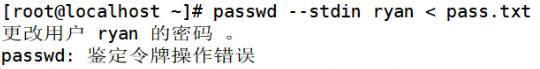
需要关闭防火墙

    格式：
    passwd [选项]...[用户名]

    不指定用户名，默认修改的时当前登录用户的密码，普通用户可以修改自己的密码，root可以修改任意用户的密码。

    常用选项：

    -d： 清空用户密码（和不设置密码不一样）

    -l：锁定用户密码

    -u：解锁用户账号

    -S：查看用户账号的状态（是否被锁定）

    -x：密码的最长有效时限

    -n：密码的最短有效时限

    -w：在密码过期前多少天开始提醒用户

    -i：当密码过期后经过多少天该账号会被禁用

## [usermod 修改用户属性](https://blog.csdn.net/yexiangCSDN/article/details/80734793?ops_request_misc=&request_id=&biz_id=102&utm_term=linux中usermod命令详解&utm_medium=distribute.pc_search_result.none-task-blog-2~all~sobaiduweb~default-4-80734793.142^v51^new_blog_pos_by_title,201^v3^control_2&spm=1018.2226.3001.4187)

#### 格式：usermod[选项]…用户名

#### 常用选项：

    -c<备注>：       修改用户帐号的备注文字；
    -d<登入目录>：修改用户登入时的目录；
    -e<有效期限>：修改帐号的有效期限；
    -f<缓冲天数>： 修改在密码过期后多少天即关闭该帐号；
    -g<群组>：       修改用户所属的群组；
    -G<群组>；      修改用户所属的附加群组；
    -l<帐号名称>： 修改用户帐号名称；
    -L：                   锁定用户密码，使密码无效；
    -U：解锁用户账号（passwd -l 锁定的用户，通过usermod-U 解锁两次）
    -s`<shell>`：       修改用户登入后所使用的shell；
    -u`<uid>`：        修改用户ID；

## userdel 删除用户

删除用户账号

#### 格式：userdel 用户名

#### 常用选项：

    -r：删除用户的同时删除用户的宿主（家）目录

    -f 强制删除在线的用户


---

# 组账号管理

## 组账号概述

    组：用户集合，组的存在便于管理多个用户的权限
    组账号分类：
    基本组（私有组）
    附加组（公共组）

    组账号文件
    /etc/group：保存组账号基本信息
    /etc/gshadow：保存组账号的密码信息（较少使用）
    [root@localhost ~]# head -1 /etc/group
    root❌0:zhangsan

    第1个字段：组名
    第2个字段：密码占位符
    第3个字段：GID
    第4个字段：组内的成员信息
    [root@localhost ~]# head -1 /etc/gshadow
    root:::

## groupadd 创建用户组

    格式：groupadd 选项 组账号名
    常用选项：
    -g GID

    [root@localhost ~]# groupadd students
    [root@localhost ~]# groupadd class
    [root@localhost ~]# tail -2 /etc/group
    students❌1013:
    class❌1014:

## groupdel 删除用户组

    格式：groupdel 组账号名

## groupmod 修改用户组

## gpasswd

设置组账号密码/添加、删除组成员
格式：gpasswd [选项]…组账号名
常用选项：

    -a：向组内添加一个用户

    -d ：从组内删除一个用户成员

    -M：定义组成员列表，以逗号分隔

增加或删除组成员，也可以用vi编辑器对/etc/group 文件直接编译修改

## groupmems 查看组内成员

查看组内成员：
groupmems -g 组名 -l

添加组内成员：
groupmems -g 组名 -a 用户名（与usermod -aG 一样）

删除组内成员：
groupmems -g 组名 -d 用户名

## groups 查询客户所属的组

    格式：groups [用户名]

---

---

# 文件相关

## [pwd](https://blog.csdn.net/u013657581/article/details/84670212?ops_request_misc=%257B%2522request%255Fid%2522%253A%2522166409389116800186514061%2522%252C%2522scm%2522%253A%252220140713.130102334..%2522%257D&request_id=166409389116800186514061&biz_id=0&utm_medium=distribute.pc_search_result.none-task-blog-2~all~sobaiduend~default-2-84670212-null-null.142^v50^new_blog_pos_by_title,201^v3^control_2&utm_term=pwd&spm=1018.2226.3001.4187)

显示当前路径

## cd 切换目录 Change directory

    cd .. 切换到上一级目录
    cd - 切换到上一级目录并打印路径

> - Linux是严格区分大小写的
> - 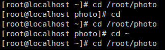

## ls 查看目录列表

ls 显示指定目录（文件夹）下文件的详细信息，默认的操作目录为当前目录

    通配符与 ls 搭配
     ls [123]3.txt  搜查以1或2或3开头的，以3.txt结尾的文件

#### 用法：ls [选项]... [文件或目录]...

文件类型和权限信息-链接数量-所属者-所属工作组-文件大小-最后修改日期-文件名

> r(read) w(write) x(execute)

rwx(所属者)r--（所属组）rxw（其他人）
    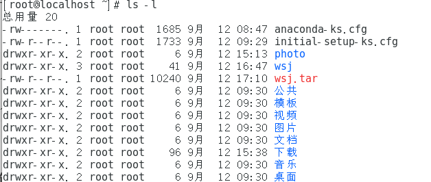

    以-开头的文件是普通文件，如果计算机无法识别的文件也为-
    以d(directory)开头的文件是目录
    以l（link)开头的是符号链接
    以c开头的是字符设备文件
    以b开头的是块设备文件
    以.开头的是隐藏文件

    -l：以长格式（Long）显示文件和目录的列表

    -a：显示所有（All）子目录和文件的信息

    -a 与 -l 可以简写为-al 或-la

    -i 可以查看文件的索引节点号

    -l：以长格式（Long）显示文件和目录的列表

    -a：显示所有（All）子目录和文件的信息

    -A：与-a选项的作用基本类似，但有两个特殊隐藏目录不会显示，“.”和“..”

    -d：显示目录（Directory）本身的属性，而不是显示目录中的内容

    -h：以更人性化（Human）的方式显示出目录或文件的大小，此选项需要结合-l选项一起使用

    -R：以递归（Recursive）的方式显示指定目录及其子目录中的所有内容

--color=auto 使用色彩来区分文件类型的功能:

    红色：压缩文件
    白色：普通文件
    蓝色：目录文件
    绿色：可执行文件
    青色：链接文件（快捷方式）
    黄色：设备文件
    紫色：套接字文件

-t：以时间先后排序
-r：逆序

## mkdir 创建目录（make directory）

#### 用法：mkdir [选项]... 目录...

    make directory 创建新的目录文件
    -p 嵌套创建多层目录
    -v 显示详细信息
    -m 可以指认权限

## rm 删除目录（remove）

[rm安全替换](https://blog.csdn.net/geek64581/article/details/101095854?spm=1001.2014.3001.5506)

#### 用法：rm [选项]... 文件...

remove 删除指定的文件或目录

> -i 删除文件或目录时提醒用户确认
> 
> -f 删除文件或目录时不进行提醒，直接强制删除（非常危险的选项），删除多个一样
> 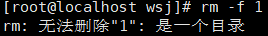
> -r 删除目录时必须使用此选项，表示递归删除所有文件及子目录
> 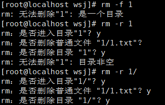
> -rf 强制删除，无提醒
> 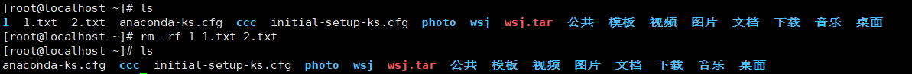
> rm -rf ${find -name /root *.txt}

## [ rmdir（remove directory（目录））](https://blog.csdn.net/qq_33289318/article/details/126441269?spm=1001.2014.3001.5506)

用于删除空目录

-p删除嵌套创建多层空目录
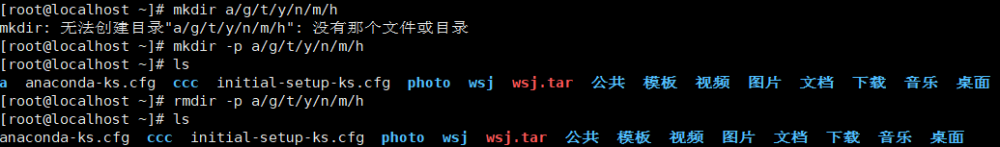

## [touch 新建文件](https://blog.csdn.net/qq_36528114/article/details/79190357?ops_request_misc=%257B%2522request%255Fid%2522%253A%2522166409256016782412557662%2522%252C%2522scm%2522%253A%252220140713.130102334..%2522%257D&request_id=166409256016782412557662&biz_id=0&utm_medium=distribute.pc_search_result.none-task-blog-2~all~top_positive~default-1-79190357-null-null.142^v50^new_blog_pos_by_title,201^v3^control_2&utm_term=touch&spm=1018.2226.3001.4187)

### 用法：touch [选项]... 文件...

如果文件已存在，更新文件的访问时间和修改时间；若文件未存在，则创建新的空文件

    -a 只更改访问时间

    -c, --no-create 不创建任何文件

    -d, --date=字符串 使用指定字符串表示时间而非当前时间

    -m 只更改修改时间

## tree 打印目录树

    如果没有安装tree，需要联网
    安装：yum -y install tree
    卸载：yum -y remove tree

通过tree 命令可以以树状图列出文件目录结构：

第一步:以树状结构显示目录中的文件和目录

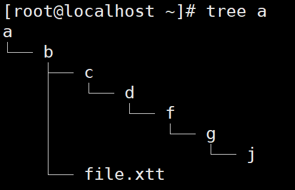

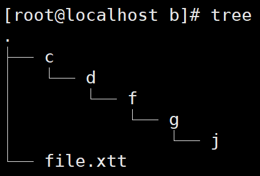
第二步：只显示当前目录中的目录

    tree -d 目录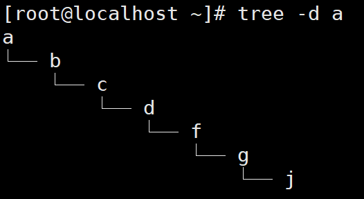
第三步：显示指定的两层

    tree -L n(数字，几层) 目录

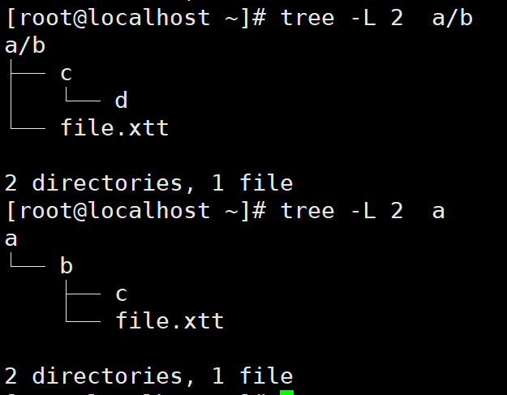

## [cp 复制文件](https://blog.csdn.net/qq_36306340/article/details/82425754?ops_request_misc=%257B%2522request%255Fid%2522%253A%2522166495493216800182196070%2522%252C%2522scm%2522%253A%252220140713.130102334..%2522%257D&request_id=166495493216800182196070&biz_id=0&utm_medium=distribute.pc_search_result.none-task-blog-2~all~baidu_landing_v2~default-3-82425754-null-null.142^v51^new_blog_pos_by_title,201^v3^control_2&utm_term=linux%E4%B8%ADcp%E5%91%BD%E4%BB%A4&spm=1018.2226.3001.4187)

#### 用法：cp [选项]... 源文件... 目录

copy 将需要复制的文件或目录（源）重建一份，并保存为新的文件或目录

- 复制文件到指定路径
- 
- 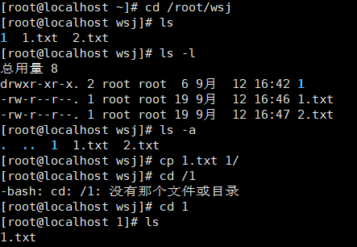
- 复制目录需要加-r,大小写效果一样
- 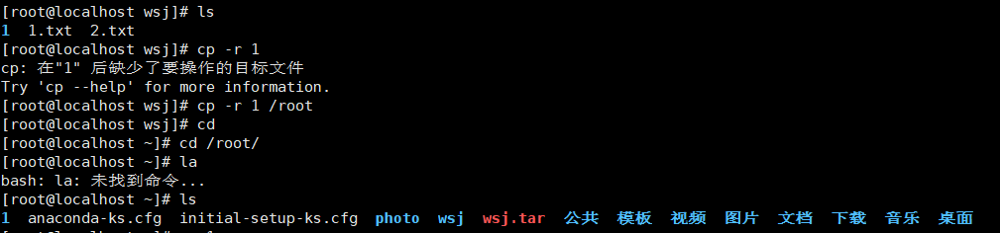
- 文件重复，会进行覆盖
  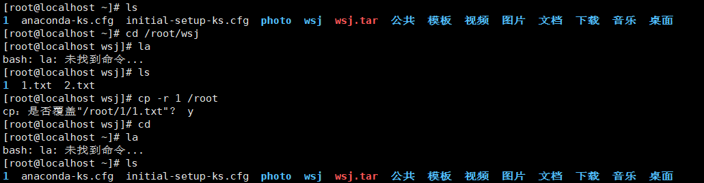
- x*，文件名.x都会被复制
  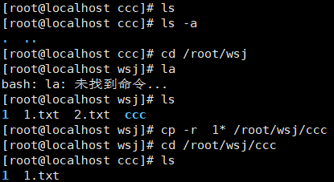

> -f 覆盖目标同名文件或目录时不进行提醒，直接强制复制

> -i 覆盖目标同名文件或目录时提醒用户确认

> -r 复制目录时必须使用此选项，表示递归复制所有文件及子目录

> -p 复制时保持源文件的权限、属主及时间标记等属性不变

> -S 自己定义复制的后缀
> 命令格式为：cp -u 源文件 目标文件
> 这个命令很实用，尤其是在更新文件时。如下图所示，只有源文件比目标文件新时，才会将源文件复制给目标文件，否则，及时执行了命令，也不会执行复制。

> 命令格式为：cp -s 源文件 目标文件
> 也可以用ln命令实现同样的功能。当一个文件路径太深（如下述的a/b/c/d/e/orginalFile.txt），访问起来十分不方便时，就会创建这个文件的软链接，使之访问起来更方便些。软链接就相当于windows上的快捷方式。

- 复制文件并重新命名
  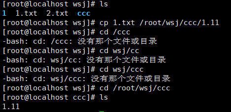
- 同时复制多个文件
  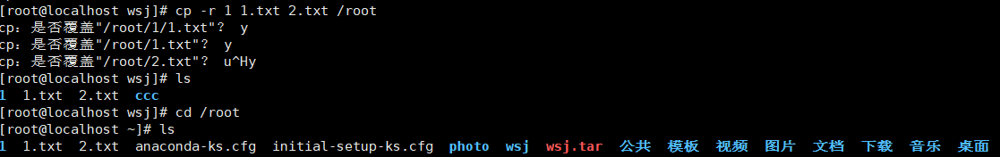
- cp指令也可以创造软硬链接-s
  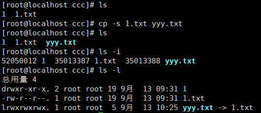

## [mv 移动（剪切）文件](https://blog.csdn.net/weixin_37335761/article/details/121971339?ops_request_misc=%257B%2522request%255Fid%2522%253A%2522166409267116782248592269%2522%252C%2522scm%2522%253A%252220140713.130102334..%2522%257D&request_id=166409267116782248592269&biz_id=0&utm_medium=distribute.pc_search_result.none-task-blog-2~all~top_click~default-1-121971339-null-null.142^v50^new_blog_pos_by_title,201^v3^control_2&utm_term=mv&spm=1018.2226.3001.4187)

mv [选项]... 源文件... 目录

move （重命名）将指定的文件或目录转移位置 如果目标位置与源位置相同，则相当于执行重命名操作，目录与文件操作一样
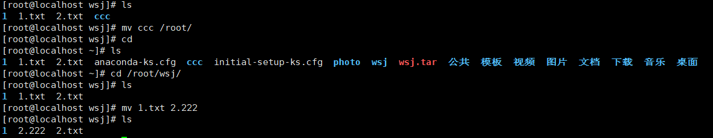

    -f, --force 覆盖前不询问
    -i, --interactive 覆盖前询问
    -n, --no-clobber 不覆盖已存在文件

## file 查看文件的类型

    格式：
    file 文件名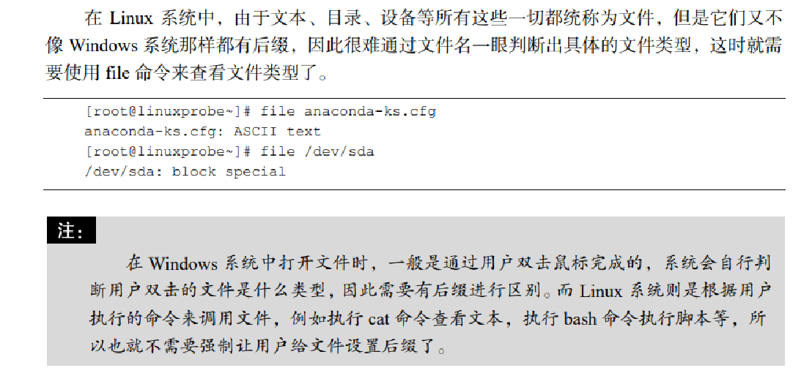

## [find 搜索文件](https://blog.csdn.net/vincen123/article/details/81515101?ops_request_misc=&request_id=&biz_id=102&utm_term=%E6%9F%A5%E6%89%BE/boot%E7%9B%AE%E5%BD%95%E4%B8%8B%E6%89%80%E6%9C%89%E7%9B%AE%E5%BD%95%EF%BC%88d%EF%BC%89&utm_medium=distribute.pc_search_result.none-task-blog-2~all~sobaiduweb~default-0-81515101.142^v62^js_top,201^v3^control_2,213^v1^control&spm=1018.2226.3001.4187)

#### 用法：find [查找范围] [查找条件表达式]

采用递归方式，根据目标的名称、类型、大小等不同属性进行精细查找

    -name 根据目标文件的名称进行查a'l找，允许使用“*”及“?”通配符

    -size 根据目标文件的大小进行查找、 一般使用“＋”、“-”号设置超过或小于指定的大小作为查找条件、常用的容量单位包括 kB（注意 k 是小写）、MB、GB

    -user 根据文件是否属于目标用户进行查找

    -type 根据文件的类型进行查找

    文件类型：
    普通文件（f）、目录（d）、块设备文件（b）、字符设备文件（c）链接文件（l）、管道文件（p）、套接字文件（s：socket）等、块设备是指成块读取数据的设备（如硬盘、内存等），字符设备是指按单个字符读取数据的设备（如键盘、鼠标等）

    各表达式之间使用逻辑运算符 “-a”表示 而且（and） “-o”表示 或者（or）

#### 通配符：

    -inum 指定inode号
    -mtime 多少天内修改过
    * 	代表任意长度任意字符
    ? 	代表一个任意字符

#### 实例：

    /root/wav/目录下存在很多以wav和xml结尾的文件，删除文件大小大于100KB小于400KB的wav文件，使用
    find /root/wav -name "*wav" |xargs rm -rf
    find /root/wav -name "*wav" -exec rm -rf{}\;
    指定inode号删除文件
    find ./ -inum inode号 -exec rm -i {}\;
    find ./ -inum inode号 -delete
    从root目录下查找3天内修改的文件，并复制到/tmp下
    find /root -mtime 3 -a -type f -exec cp {} /tmp \;

## locate 定位文件

## whereis 查看可执行文件的路径

## [which 在PATH指定的路径中，搜索某系统命令的位置](https://blog.csdn.net/yspg_217/article/details/121954145?ops_request_misc=%257B%2522request%255Fid%2522%253A%2522166409333016782390537191%2522%252C%2522scm%2522%253A%252220140713.130102334..%2522%257D&request_id=166409333016782390537191&biz_id=0&utm_medium=distribute.pc_search_result.none-task-blog-2~all~sobaiduend~default-2-121954145-null-null.142^v50^new_blog_pos_by_title,201^v3^control_2&utm_term=linux%E4%B8%ADwhich%E5%91%BD%E4%BB%A4%E7%9A%84%E7%94%A8%E6%B3%95&spm=1018.2226.3001.4187)

    which 查看命令程序文件路径

-a 查询是遍历PATH值中的所有目录
-------------------------------

# 目录文件权限

## [chmod 设置目录权限，chown,chgrp](https://blog.csdn.net/qq_40394792/article/details/104478208?ops_request_misc=)

### 权限及归属管理：

    1、基本访问权限
    读权限r：针对目录可以查看目录的列表（ls），针对文件可以查看文件内容（cat more less head tail）
    写权限w：针对目录可以改动目录的列表内容（rm touch mkdir cp mv）,针对文件可以修改文件内容（vim sed）
    可执行x：针对目录可以切换（cd），针对文件允许运行程序（二进制文件，脚本文件）
    2、归属（所有权）
    属主：拥有该文件的用户账号
    属组：拥有该文件的组账号
    3、查看文件的权限和归属
    第一位表示文件类型
    -：表示一般文件
    d：表示目录
    l：表示软链接（快捷方式）
    p：表示PIPE管道文件
    s：表示socket通信套接字文件
    c：表示字符设备文件
    b：表示块设备文件

各权限的字母及8进制表示:

| 权限   | 字母表示 | 8进制 |
| :----- | -------- | ----- |
| 读权限 | r        | 4     |
| 写权限 | w        | 2     |
| 可执行 | x        | 1     |
| 无权限 | -        | 0     |

    drwxr-xr-x 的意思是一个权限为755的目录
    -rw-r--r-- 的意思是一个权限为644的文件

    目录满权限：777，默认是755
    文件满权限：666，默认是644

#### chmod(change mode):

    第一种方式变更权限
    chmod [{ugoa}{±=}{rwx}] 文件或目录

    第二种方式变更权限
    chmod [mode=421 ] [文件或目录]

    经验技巧
        u:所有者 g:所有组 o:其他人 a:所有人(u、g、o的总和)
    ==r=4 w=2 x=1== rwx=4+2+1=7
    chmod 修改权限

> u+s:特殊权限对文件，使用户为用户所有者
> 

> 例如：u+(-/=)r代表所有者添加或去掉read权限
> chmod 权限 文件
> 
> 

#### chown(change owner) 改变所属者

    基本语法:
    chown [选项] [最终用户] [文件或目录] （功能描述：改变文件或者目录的所有者）
    -R 递归操作：改变文件内的文件所有者
    chown -R 改变后的所属者：改变后的所属组 文件
    chown -R 用户. 文 文件 (改为所属者与所属组同名)

#### chgrp(change group) 改变所属组

    基本语法：
    chgrp [最终用户组] [文件或目录] （功能描述：改变文件或者目录的所属组）
    -R 递归操作：改变文件内的文件所属组

## [setfacl和getfacl的使用方法](https://blog.csdn.net/bpb_cx/article/details/82702989?ops_request_misc=%257B%2522request%255Fid%2522%253A%2522166514694916782428675476%2522%252C%2522scm%2522%253A%252220140713.130102334..%2522%257D&request_id=166514694916782428675476&biz_id=0&utm_medium=distribute.pc_search_result.none-task-blog-2~all~sobaiduend~default-1-82702989-null-null.142^v51^new_blog_pos_by_title,201^v3^control_2&utm_term=setfacl%E5%92%8Cgetfacl%E5%9F%BA%E6%9C%AC%E7%94%A8%E6%B3%95&spm=1018.2226.3001.4187)

    1、ACL概述
             ACL（Access Control List）访问控制列表，主要作用可以提供除属主、属组、其他人的rwx权限之外的细节权限设定。
     
    2、ACL的权限控制
             （1）使用者（user）
             （2）群组（group）
             （3）默认权限掩码（mask）
     
    3、启动ACL
             若未安装，挂载光盘后
    [root@localhost ~]# yum -y install acl

#### setfacl——ACL的设置

> 常用格式：setfacl  -m  u:用户：权限（rwx) file

    ACL参数格式：
    u:用户名:权限        【给某个用户设定权限，若不添加用户名，默认修改属主权限】
    g:组名:权限            【给某个组设定权限，若不添加组名，默认修改属组权限】
    m:权限                   【更改权限掩码】

    语法:
     setfacl [-bkndRLP] { -m|-M|-x|-X ... } file ...

    -m, --modify=acl 更改文件的访问控制列表
    -M, --modify-file=file 从文件读取访问控制列表条目更改
    -x, --remove=acl 根据文件中访问控制列表移除条目
    -X, --remove-file=file 从文件读取访问控制列表条目并删除
    -b, --remove-all 删除所有扩展访问控制列表条目
    -k, --remove-default 移除默认访问控制列表
        --set=acl 设定替换当前的文件访问控制列表
        --set-file=file 从文件中读取访问控制列表条目设定
        --mask 重新计算有效权限掩码
    -n, --no-mask 不重新计算有效权限掩码
    -d, --default 应用到默认访问控制列表的操作
    -R, --recursive 递归操作子目录
    -L, --logical 依照系统逻辑，跟随符号链接
    -P, --physical 依照自然逻辑，不跟随符号链接
        --restore=file 恢复访问控制列表，和“getfacl -R”作用相反
        --test 测试模式，并不真正修改访问控制列表属性
    -v, --version           显示版本并退出
    -h, --help              显示本帮助信息

#### getfacl ——ACL的查询

    使用方法: getfacl  [-aceEsRLPtpndvh]  文件 ...
    -a,  --access           仅显示文件访问控制列表
    -d, --default           仅显示默认的访问控制列表
    -c, --omit-header     不显示注释表头
    -e, --all-effective     显示所有的有效权限
    -E, --no-effective      显示无效权限
    -s, --skip-base         跳过只有基条目(base entries)的文件
    -R, --recursive         递归显示子目录
    -L, --logical           逻辑遍历(跟随符号链接)
    -P, --physical          物理遍历(不跟随符号链接)
    -t, --tabular           使用制表符分隔的输出格式
    -n, --numeric           显示数字的用户/组标识
    -p, --absolute-names    不去除路径前的 '/' 符号
    -v, --version           显示版本并退出
    -h, --help              显示本帮助信息

## 特殊权限  SUID、SGID、SBIT

### SUID（Set UID）概述

    当s标志出现在文件属主权限的x权限上时，例如/usr/bin/passwd这个文件，权限为“-rwsr-x-r-x”，这个文件就具有SUID特殊权限，在执行此命令的时候，执行者在执行的瞬间将拥有文件属主root的身份权限，即/etc/shadow文件，普通用户并没有写入权限，但是普通用户可以执行passwd命令对自己的账号密码进行修改，同时写入/etc/shadow文件，正是因为/usr/bin/passwd这个文件具有SUID这种特殊权限。

    SUID特殊权限的特点：
    SUID权限仅对二进制程序（binary program）有效
    执行者对于改程序需要具有可执行权限
    SUID权限仅在执行该程序的过程中有效
    执行者将具有该程序拥有者的权限
    [root@localhost ~]# ls -l /usr/bin/passwd
    -rwsr-xr-x. 1 root root 27832 6月 10 2014 /usr/bin/passwd
    [root@localhost ~]# ls -l /etc/shadow
    ---------- 1 root root 1256 12月 16 22:08 /etc/shadow
    [root@localhost ~]# useradd teacher
    [root@localhost ~]# echo "123" | passwd --stdin teacher
    更改用户 teacher 的密码 。
    passwd：所有的身份验证令牌已经成功更新。

    [root@localhost ~]# su - teacher
    上一次登录：日 12月 16 22:22:26 CST 2018pts/0 上
    [teacher@localhost ~]$ passwd
    更改用户 teacher 的密码 。
    为 teacher 更改 STRESS 密码。
    （当前）UNIX 密码：
    新的 密码：
    重新输入新的 密码：
    passwd：所有的身份验证令牌已经成功更新。

    [root@localhost ~]# find / -perm 4000

### SGID（Set GID）概述

    当s标志出现在文件属组权限的x权限上时，例如/usr/bin/locate文件的权限为“-rwx--s--x”属组为slocate，当执行者执行locate命令时，将具有slocate组成员的权限。
    [root@localhost ~]# ls -l /usr/bin/locate
    -rwx--s--x. 1 root slocate 40520 4月 11 2018 /usr/bin/locate

    与SUID不同的是，SGID可以针对文件或目录来设定，对于文件来讲，SGID对二进制程序有用，若程序执行者对于该程序来说具备x的权限，则执行者在执行的过程中将会获得该程序群组的支持。
            
             除了与SUID相同的对二进制程序有效以外，SGID还能够用在目录上，当一个目录设定了SGID的权限后，用户若对此目录具有r与x权限，该用户能进入此目录后，在此目录下的有效群组将变为目录的群组，即若该用户具有w权限，新建文件或目录后我们会发现，该用户所建立的文件或目录的属组为上层（具有SGID设置）的目录的属组。
    [root@localhost ~]# chmod 2777 /test/
    [root@localhost ~]# ls -ld /test/
    drwxrwsrwx 3 mariadb mysql 76 12月 16 23:08 /test/
    [root@localhost ~]# chown root:root /test/
    [root@localhost ~]# ls -ld /test/
    drwxrwsrwx 3 root root 76 12月 16 23:08 /test/
    [root@localhost ~]# su - nginx
    [nginx@localhost ~]$ cd /test
    [nginx@localhost test]$ mkdir nginx-dir
    [nginx@localhost test]$ touch nginx-file
    [nginx@localhost test]$ ls -l | grep nginx
    drwxrwsr-x 2 nginx root 6 12月 16 23:15 nginx-dir
    -rw-rw-r-- 1 nginx root 0 12月 16 23:16 nginx-file
             实验发现，当以root用户身份建立/test/目录时并加以SGID权限设置，su到普通用户nginx身份后，在/test/目录下创建文件与目录其属组均为root，且新建目录也具有SGID的特殊权限。可见SGID权限对于目录而言，具有递归式的影响，但对新建文件并没有SGID权限。且即使是以nginx身份复制到/test/目录下一个二进制程序，该文件属组会变为root，但二进制程序仍不具有SGID权限。

### SBIT（Sticky Bit）粘滞位概述

    当目录权限x的位置变为t时，即该目录设有SBIT粘滞位权限，
    主要作用是该目录下的文件和目录，其属主与root用户具有删除该文件或目录的权限，增强安全性。
    （2）示例：创建/test/目录，权限777，root用户创建一测试文件，su到普通用户nginx身份尝试删除该文件。再将/test/增加SBIT粘滞位权限后，再以nginx身份尝试删除该文件。
    [root@localhost ~]# touch /test/sbit.txt
    [root@localhost ~]# ls -l /test/sbit.txt
    -rw-r--r-- 1 root root 0 12月 16 23:18 /test/sbit.txt
    [root@localhost ~]# su - nginx
    上一次登录：日 12月 16 23:15:49 CST 2018pts/0 上
    [nginx@localhost ~]$ rm /test/sbit.txt
    rm：是否删除有写保护的普通空文件 "/test/sbit.txt"？y
    [nginx@localhost ~]$ ls /test/
    123.txt 456.txt 789.txt dir1 file1 nginx-dir nginx-file
     实验发现，虽然普通用户nginx对于sbit.txt文件并没有w权限，但因上层目录/test/具有777的权限，nginx可以删除修改该目录下的所有文件，这对于系统来讲是十分不安全的。可以通过增加SBIT粘滞位权限进行控制。
    [root@localhost ~]# chmod 1777 /test/
    [root@localhost ~]# ls -ld /test/mkdir
    drwxrwsrwt 4 root root 111 12月 16 23:19 /test/
    [root@localhost ~]# touch /test/sbit.txt
    [root@localhost ~]# su - nginx
    上一次登录：日 12月 16 23:18:42 CST 2018pts/0 上
    [nginx@localhost ~]$ rm -rf /test/sbit.txt
    rm: 无法删除"/test/sbit.txt": 不允许的操作
    [nginx@localhost ~]$ touch /test/nginx-sbit.txt
    [nginx@localhost ~]$ exit
    登出
    [root@localhost ~]# su - mariadb
    [mariadb@localhost ~]$ rm -rf /test/nginx-sbit.txt
    rm: 无法删除"/test/nginx-sbit.txt": 不允许的操作
             增加SBIT粘滞位后，/test/目录下的文件仅其属主和root可以删除修改，其他用户无法修改，增加了系统的安全性。
             需要注意的是，SBIT粘滞位仅对目录生效，对文件无效。

### SUID、SGID、SBIT权限的设定

    八进制数设置方法
    方法：在属主、属组、其他人的权限前增加特殊权限的八进制数字表示
    4为SUID chmod 4755 dir
    2为SGID chmod 2755 dir
    1为SBIT chmod 1755 dir
     
    （2）字母设置方法
    chmod u+s
    chmod g+s
    chmod o+t

---

# 输入 输出 查看 计数 替换 对比 排序 过滤

## more/less 查看文件

#### cat

    适合内容少的小文件

#### more

    more 全屏方式分页显示文件内容
    用法：
    more [选项] 文件...

#### less

    less 与more基本相同，但扩展功能更多
    格式：
    less [选项] 文件名  （一般不用选项）

空格和f 是翻下一页
b 是返回上一页
按q即可退出

## cat/tac/nl/rev

### cat 将[文件]或标准输入组合输出到标准输出。

    用法：
    cat [选项]... [文件]...查看文件内容
    (适合用于小文件，如果内容过多的话，查找不方便)

    -n 显示内容的同时显示行号
    -b 跳过空白行进行进行显示行号
    -s 如果有多行的空白行，最后显示为一行
    -A 显示所有的字符，空白后面会显示$ （通常windows系统拷贝过来的文件无法直接cat到，需要加此选项）

    > 创建文件，然后编辑内容，Ctrl+d 退出(如果文件存在，内容会覆盖原内容)
    如果：
    格式# > 文件名 为清空文件内容
    > 文件 <<EOF 覆盖文件原内容，EOF为结束标志（自己任意设置）

> 创建文件：
> 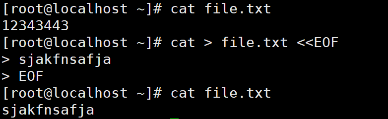

    >> 文件 <<F  在原内容的基础上追加内容(F为任意设置，结束输入标志）

### nl 把文件显示行号输出，与cat -b 效果一样

### tac 与cat用法一致，内容顺序相反,倒序查看文件

### rev 以每一行中的字符为单位，反序输出

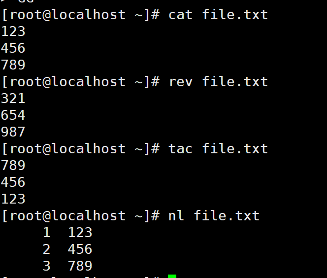

## head/tail 查看文件开头/结尾

#### head 查看文件开头的一部分内容

    head查看文件开头的一部分内容，默认显示10行，可加选项调节
    比如：
    head -2 文件名 显示前两行

    -n 显示行
    -c 显示字节
    head -c 3 file 显示文件前三个字节

#### [tail 查看文件结尾的一部分内容](https://blog.csdn.net/weixin_30564897/article/details/116578466?ops_request_misc=&request_id=&biz_id=102&utm_term=linux%20%E4%B8%ADtail%20-f%20&utm_medium=distribute.pc_search_result.none-task-blog-2~all~sobaiduweb~default-0-116578466.142^v51^new_blog_pos_by_title,201^v3^control_2&spm=1018.2226.3001.4187)

    tail查看文件结尾的一部分内容，默认显示10行，可加选项调节
    比如：tail -2 文件名 显示后两行

## tr 从标准输入中替换、缩减和/或删除字符，并将结果写到标准输出。

### 常用格式：

> 替换：
> 只能单个字母进行替换
> 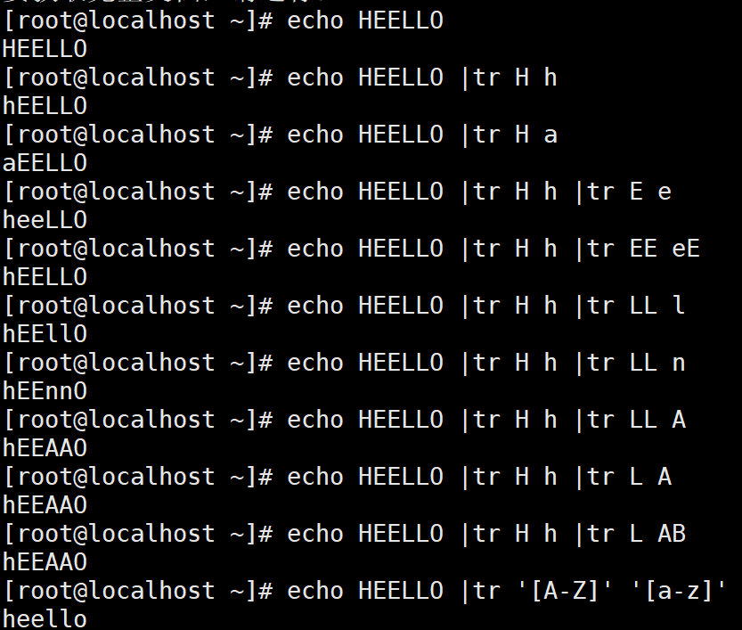

> 删除：
> -d 为空，用空去替换，即为删除
>
> 

计数：

首先，对内容进行排序——把','替换成'\n'

    cat file |tr ',' '\n'

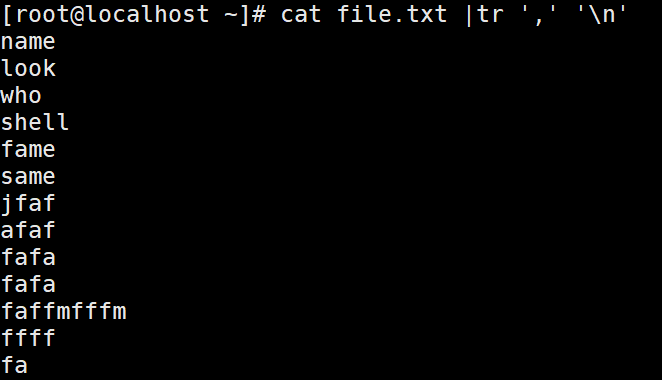

然后：使用uniq进行排序，去重，计数

    [root@localhost ~]# cat file.txt |tr ',' '\n'|sort |uniq -c
        1
        1 afaf
        1 fa
        2 fafa
        1 faffmfffm
        1 fame
        1 ffff
        1 jfaf
        1 look
        1 name
        1 same
        1 shell
        1 who
就完成了计数

### 详细资料：

    格式：
    tr [选项]... SET1  [SET2]

    从标准输入中替换、缩减和/或删除字符，并将结果写到标准输出。(并不修改文件内容，只是对显示的内容进行修改)

    -c, -C, --complement		首先补足SET1
    -d, --delete			删除匹配SET1 的内容，并不作替换
    -s, --squeeze-repeats	如果匹配于SET1 的字符在输入序列中存在连续的重复，在替换时会被统一缩为一个字符的长度
    -t, --truncate-set1		先将SET1 的长度截为和SET2 相等
        --help		显示此帮助信息并退出
        --version		显示版本信息并退出

    SET 是一组字符串，一般都可按照字面含义理解。解析序列如下：

    \NNN	八进制值为NNN 的字符(1 至3 个数位)\\		反斜杠
        \a		终端鸣响
        \b		退格
        \f		换页
        \n		换行
        \r		回车
        \t		水平制表符
        \v		垂直制表符
        字符1-字符2	从字符1 到字符2 的升序递增过程中经历的所有字符
        [字符*]	在SET2 中适用，指定字符会被连续复制直到吻合设置1 的长度
        [字符*次数]	对字符执行指定次数的复制，若次数以 0 开头则被视为八进制数
        [:alnum:]	所有的字母和数字
        [:alpha:]	所有的字母
        [:blank:]	所有呈水平排列的空白字符
        [:cntrl:]	所有的控制字符
        [:digit:]	所有的数字
        [:graph:]	所有的可打印字符，不包括空格
        [:lower:]	所有的小写字母
        [:print:]	所有的可打印字符，包括空格
        [:punct:]	所有的标点字符
        [:space:]	所有呈水平或垂直排列的空白字符
        [:upper:]	所有的大写字母
        [:xdigit:]	所有的十六进制数
        [=字符=]	所有和指定字符相等的字符

    仅在SET1 和SET2 都给出，同时没有-d 选项的时候才会进行替换。

    仅在替换时才可能用到-t 选项。如果需要SET2 将被通过在末尾添加原来的末字符的方式
    补充到同SET1 等长。SET2 中多余的字符将被省略。只有[:lower:] 和[:upper:]

    以升序展开字符；在用于替换时的SET2 中以成对表示大小写转换。-s 作用于SET1，既不
    替换也不删除，否则在替换或展开后使用SET2 缩减。

## wc 统计文件中的单词数量（Word Count）等

用法：wc [选项]... [文件]...

    常用选项：
    -l：统计行数
    -w：统计单词个数
    -c：统计字节数
    [root@localhost ~]# num=`wc -l ip.txt`
    [root@localhost ~]# echo $num
    3 ip.txt
    [root@localhost ~]# num1=`wc -l <ip.txt`
    [root@localhost ~]# echo num1
    num1
    [root@localhost ~]# echo $num1
    3
    [root@localhost ~]# wc -l ip.txt
    3 ip.txt
    [root@localhost ~]#

## echo 回显 将输出内容显示到屏幕上

    （>） 重新定义方向 覆盖
    （>>） 重新定义方向 追加（也叫追加重定向）
    (&>>)  无论输出成功还是失败，都把输出进行追加
    echo 内容 > 文件名   将内容输入到文件名
    echo -e "\033[31m你好\033[0m" 红色字
    echo -e "\033[1;33m你好\033[0m" 黄色字,加粗
    echo $? ##显示上一步操作是否成功，0为成功，1为失败

## read命令

    用来提示用户输入信息，从而实现简单的交互变量设置。将用户输入的信息作为变量值，用户的输入以空格作为分隔符，将读入的各个字段挨个赋值给指定的变量，多余的赋值给最后一个变量。

    格式：-p 设置提示信息

    [root@localhost ~]# read -p "please input your name and age: " name age
    please input your name and age: zhangsan 20
    [root@localhost ~]# echo $name
    zhangsan
    [root@localhost ~]# echo $age
    20

## cut 将每个文件中选定的行部分打印到标准输出。

- [X] 易错点

  GBK编码下，一个汉字占2个字节；
  UTF-8编码下，一个汉字占3个字节
  UTF-8是一种国际通用的一种变长编码，ASCII对应的字符在UTF-8下占1个字符，西方文字（希腊文字）占2个字符，中文占用3个字节数，还有    平面符号占4个字节

        用法：
        cut [选项]... [文件]...
    
        常用格式：
    
        Print selected parts of lines from each FILE to standard output.
    
        长选项的强制参数对于短选项也是强制的。
        ——Mandatory arguments to long options are mandatory for short options too.
    
        -b, --bytes=列表		只选中指定的这些字节
        -c, --characters=列表		只选中指定的这些字符
        -d, --delimiter=分界符	使用指定分界符代替制表符作为区域分界
    
        -f, --fields=LIST       select only these fields;  also print any line
                                    that contains no delimiter character, unless
                                    the -s option is specified
    
        -n                      with -b: don't split multibyte characters
            --complement		补全选中的字节、字符或域
        -s, --only-delimited		不打印没有包含分界符的行
            --output-delimiter=字符串	使用指定的字符串作为输出分界符，默认采用输入
                        的分界符
            --help		显示此帮助信息并退出
            --version		显示版本信息并退出
    
        仅使用f -b, -c 或-f 中的一个。每一个列表都是专门为一个类别作出的，或者您可以用逗号隔
        开要同时显示的不同类别。您的输入顺序将作为读取顺序，每个仅能输入一次。
        每种参数格式表示范围如下：
            N	从第1 个开始数的第N 个字节、字符或域
            N-	从第N 个开始到所在行结束的所有字符、字节或域
            N-M	从第N 个开始到第M 个之间(包括第M 个)的所有字符、字节或域
            -M	从第1 个开始到第M 个之间(包括第M 个)的所有字符、字节或域
    
        当没有文件参数，或者文件不存在时，从标准输入读取
    
        cat testch.txt
        我 的 兴 趣 是
        羽 毛 球 篮 球
    
        cat testch.txt |cut -b 1-3(截取字节位置为1-3)  一个汉字相当于3个byte
        我
        羽
    
        cat testch.txt |cut -c 1-2
        我
        羽
    
        cat testch.txt |cut -b 3-5,8(截取字节位置为3-5和第8个字节)
    
## [diff 比较文件的差异](https://blog.csdn.net/carefree2005/article/details/117710584?)

    用法：

    diff [参数]… 文件

    参数说明:
    参数	参数说明
    –normal	默认输出模式
    -q, --brief	仅显示有无差异，不显示详细的信息。
    -s, --report-identical-files	若没有发现任何差异，仍然显示信息。
    -c, -C NUM, --context[=NUM]	Context模式，显示全部内文，并标出不同之处。
    -u, -U NUM, --unified[=NUM]	Unified模式，以合并的方式来显示文件内容的不同。
    -e, --ed	此参数的输出格式可用于ed的script文件。
    -n, --rcs	将比较结果以RCS的格式来显示。
    -y, --side-by-side	以并列的方式显示文件的异同之处。
    -W, --width=NUM	在使用-y参数时，指定栏宽。
    -p, --show-c-function	若比较的文件为C语言的程序码文件时，显示差异所在的函数名称。
    -t, --expand-tabs	在输出时，将tab字符展开。
    -T, --initial-tab	在每行前面加上tab字符以便对齐。
    -l, --paginate	将结果交由pr程序来分页。
    -r, --recursive	比较子目录中的文件。
    -N, --new-file	在比较目录时，若文件A仅出现在某个目录中，预设会显示。
    -x, --exclude=PAT	不比较选项中所指定的文件或目录
    -X, --exclude-from=FILE	不比较选项中所指定的文件或目录
    -S, --starting-file=FILE	在比较目录时，从指定的文件开始比较。
    -i, --ignore-case	不检查大小写的不同。
    -w, --ignore-all-space	忽略全部的空格字符。
    -B, --ignore-blank-lines	不检查空白行。
    -I, --ignore-matching-lines=RE	若两个文件在某几行有所不同，而这几行同时都包含了选项中指定的字符或字符串，则不显示这两个文件的差异。
    -a, --text	diff预设只会逐行比较文本文件
    -D, --ifdef=NAME	此参数的输出格式可用于前置处理器巨集。
    -d, --minimal	使用不同的演算法，以较小的单位来做比较。
    –help	获取命令帮助
    -v, --version	查看命令版本

## uniq 去重文件的==连续==的记录（相同行）

    一般是配合sort使用:
    cat file |sort |uniq -c

    -c 对重复行进行计数

    去掉文件中的重复行,生成一个新文件：
    cat file |sort |uniq -c >> newfile

    但是它无法进行一对多文件传送内容：
    cat file |sort |uniq -c >> a.txt b.txt行不通[sort -u 与 uniq 的区别  ——先sort再 uniq 跟sort -u 一样](https://blog.csdn.net/liuxiao723846/article/details/72675015?)

## sort 对文本内容进行再排序

### 常用：

    第一步：对字符串排序
        #sort file
    第二步：去重排序
        #sort -u file
    第三步：对数值排序
        #sort -n file  顺序排列
        #sort -r(-nr | -n -r) file 倒序排列
    第四步：对成绩排序
        #sort -t '空格' -k2 file 按照第二列进行排序
    -t 根据什么进行分列
    -k 哪一列

### 详细内容：

    格式：
    sort 参数 file!


## paste 合并文件

## grep/sed/awk   ——shell编程三剑客

### 正则表达式
```sh
1.什么是正则表达式
2.应用场景
3.正则表达式注意事项`


4.正则符号
5.正则VS通配符
```

### grep 在文件中查找并显示包含指定字符串的行

    用法:
     grep [选项]... PATTERN [FILE]...

    常用格式：
    -w: 查找时将条件视为完整单词
    -n：在行首显示行号
    -v：反转查找，输出与条件不相符的行

    -i：查找时忽略大小写
    -E: 查找时支持正则表达式
    -o:只输出匹配的内容
    -q：匹配内容不显示（静默输出）
    -c：只输出匹配行的计数
    --color=auto	匹配的内容显示颜色

    “^…”表示以…开头
    grep -n ^word file (以word开头的哪一行的内容)
    “…$”表示以…结尾：
    grep -n word$ file（以Word结尾的那一行的内容）

    “^$”表示空行

### egrep 增强型过滤（grep -E）

    格式：egrep [选项] “查找条件1|查找条件2|查找条件3…” 目标文件

### awk

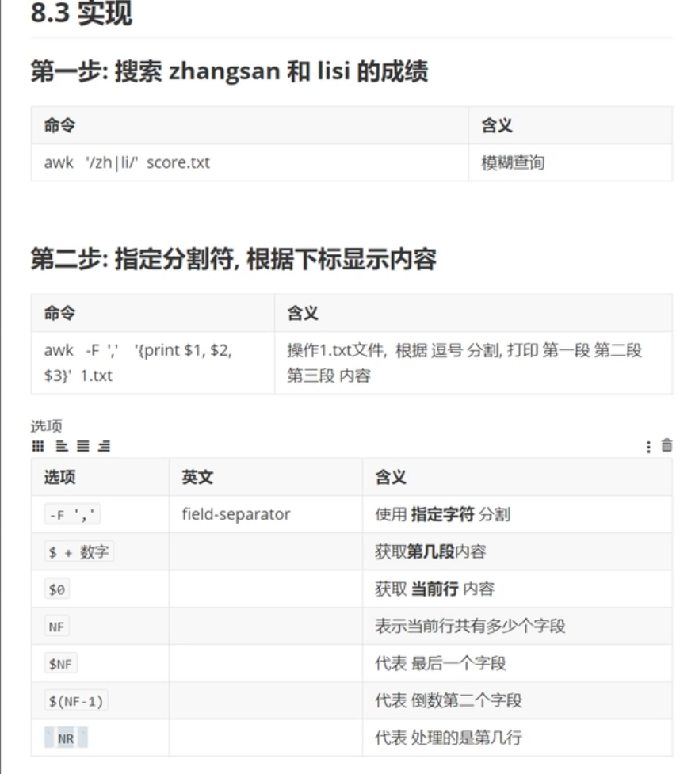
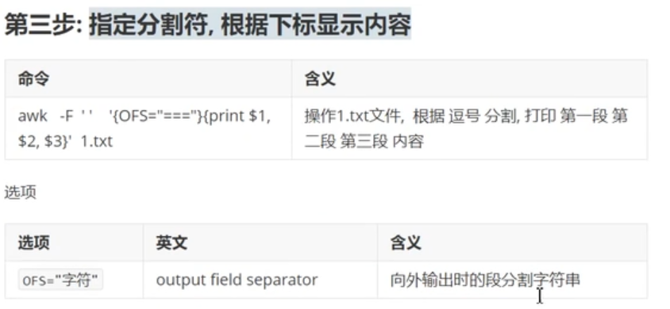
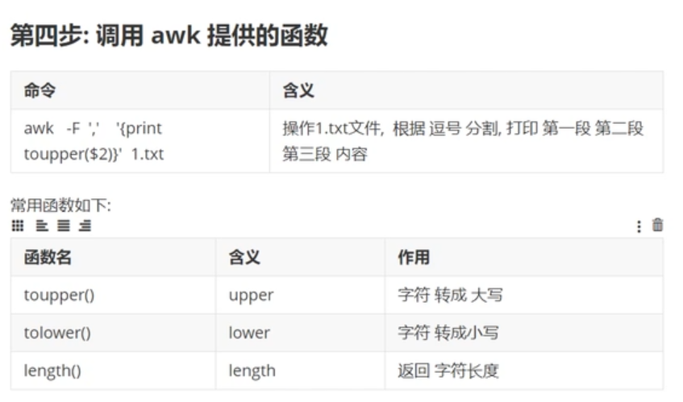
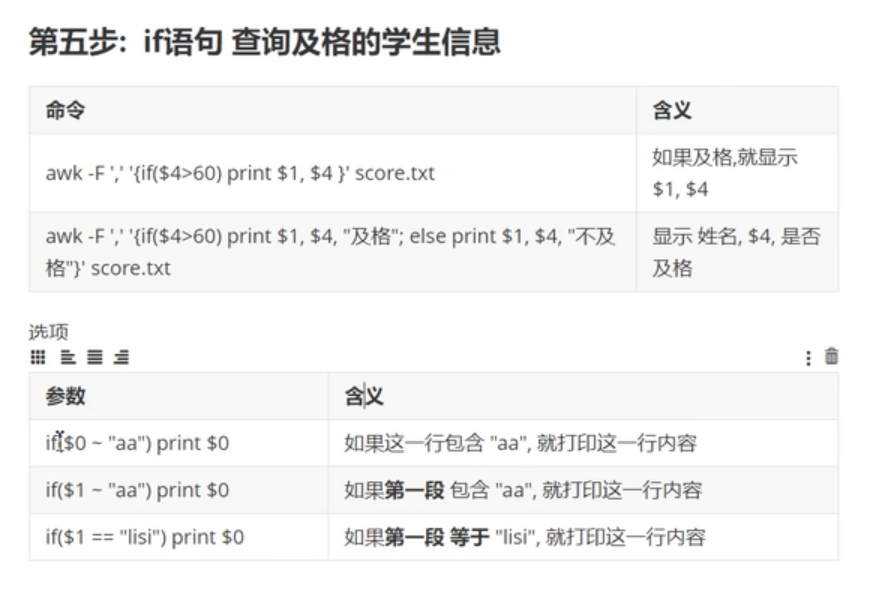
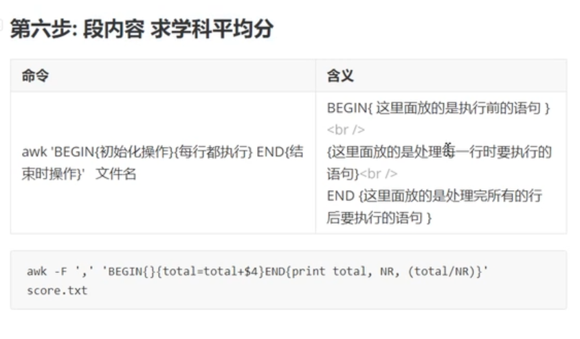

### [sed](https://blog.csdn.net/Cantevenl/article/details/115448029?)

# 打包 分割 压缩

## tar 制作归档文件、释放归档文件

    格式：
    归档：tar【选项 c.......] 归档文件名 源文件或目录
    释放：tar 【选项 x......】归档文件名 【-C 目标目录】

    -c 创建.tar格式的包文件
    -x 解开 .tar格式的包文件
    -v 输出详细信息
    -f 表示使用归档文件 （后面需紧跟归档文件名）
    -p 打包时保留原始文件及目录的权限（不建议使用）
    -t 列表查看包内的文件
    -C 解包时指定释放的目标目录
    -z 调用gzip程序进行压缩和解压
    -j 调用bzip2程序进行压缩或解压
    -P 打包时保留文件及目录的绝对路径（不建议使用）
    --remove 选项打包压缩时可删除源文件

-cvf:

- 打包过程
  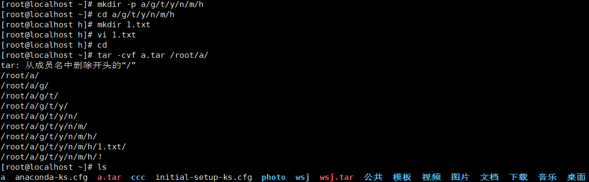

-xvf:

- 解包过程
  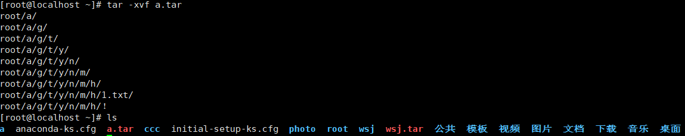

-zcvf gzip打包用的组合
-jcvf bzip2打包用的组合
-xvf 解压的组合


## split 将大文件切分成若干个小文件

    按字节将大文件切割成若干小文件:
        split -b 1k file    byte  将文件切割成若干个1k大小的文件

    按行数讲大文件切割成若干小文件:
        split -l 100 file   line  将文件切割成若干个100行的文件

## zip 压缩格式为zip

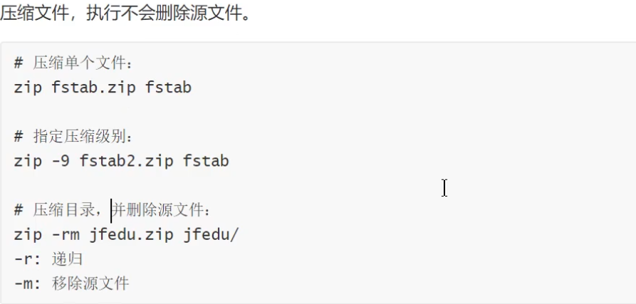

### unzip 解压缩格式为zip的文件

格式：
unzip 文件名

## gzip

作用：压缩，选项为1-9的数字控制压缩级别，数字越大压缩级别越高。压缩后文件格式为“.gz”
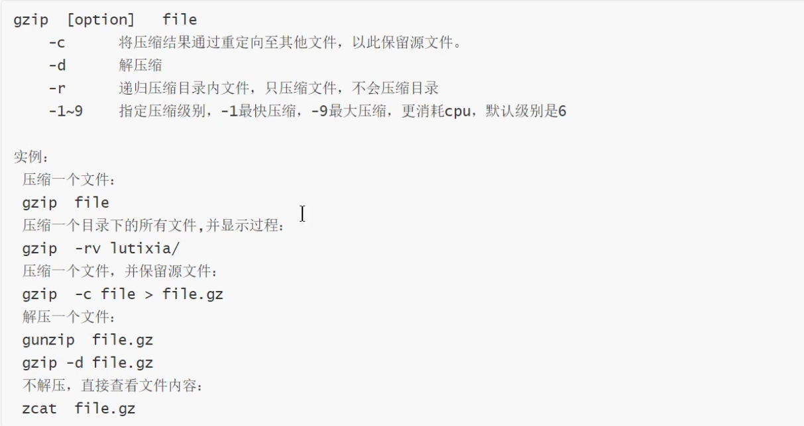

### gunzip、gizp -d

####作用：解压格式为.gz的压缩文件
格式：
gunzip 文件名
gzip -d 文件名

## bzip2

作用：压缩，选项为1-9的数字控制压缩级别，数字越大压缩级别越高。压缩后文件格式为“.bz2”，==压缩率更高==
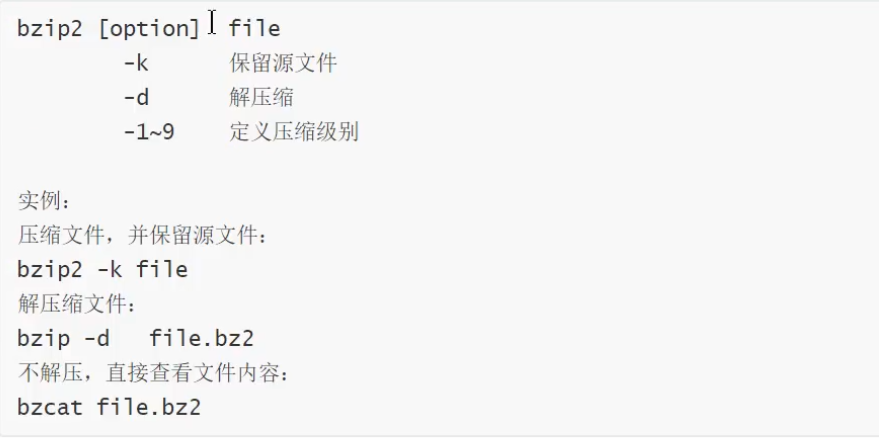

### bunzip2、bzip2 -d

#### 作用：解压缩格式为.bz2的压缩文件

格式：
    bunzip2 文件名
    bzip2 -d 文件名
-------------------

# [vim 文本编辑](https://space.bilibili.com/24715456/video?tid=0&page=2&keyword=&order=pubdate)

VI编辑器是Linux操作系统最基本的文本编辑器:

    三种工作模式 命令模式、输入模式、末行模式

    命令模式：主要做复制，粘贴，剪切，删除等操作
    输入模式：主要处理输入文本信息，编辑等操作
    末行模式：主要处理保存退出等操作
    工作在字符模式下，工作效率高。

    作用：
    可以执行输出、删除、查找、替换、块操作等众多文本操作，而且用户可以根据自己的需要对其进行定制。

    Vi+文件名 或者 Vim+文件名
    q！ 强制退出
    wq 保存退出
    ZZ 保存退出
    x 保存退出

    a 在光标插入内容
    A 在光标所在末尾插入内容
    i  从当前光标前插入内容
    I 在光标所在行行首插入空行
    o 在当前光标下插入空行
    O 在当前光标上插入空行
光标移动:

    方向移动  ↑←↓→、 h、j、k、l

    翻页    pg up、pg dn 向上、向下翻动一整页内容

    行内跳转至行首  Home键或^或0

    行内跳转至行尾  End键或$键

    跳转到文件的首行 1G或  gg(按12 然后按gg,就可以跳到12行)

    跳转到文件的末尾行 G

    行号显示 ：set nu   在编辑器中显示行号

    set nonu 取消编辑器中的行号显示

删除:

    x或Del 删除光标处的单个字符

    d 删除所选的内容

    dd 删除当前光标所在行

    d^ 删除当前光标之前到行首的所有字符

    d$(D) 删除当前光标处到行尾的所有字符

命令组合:
 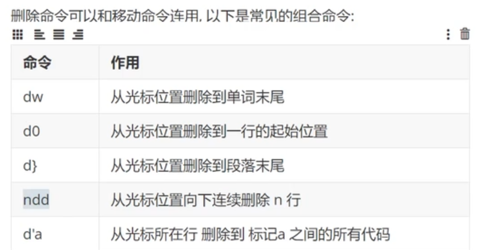

复制和剪切:
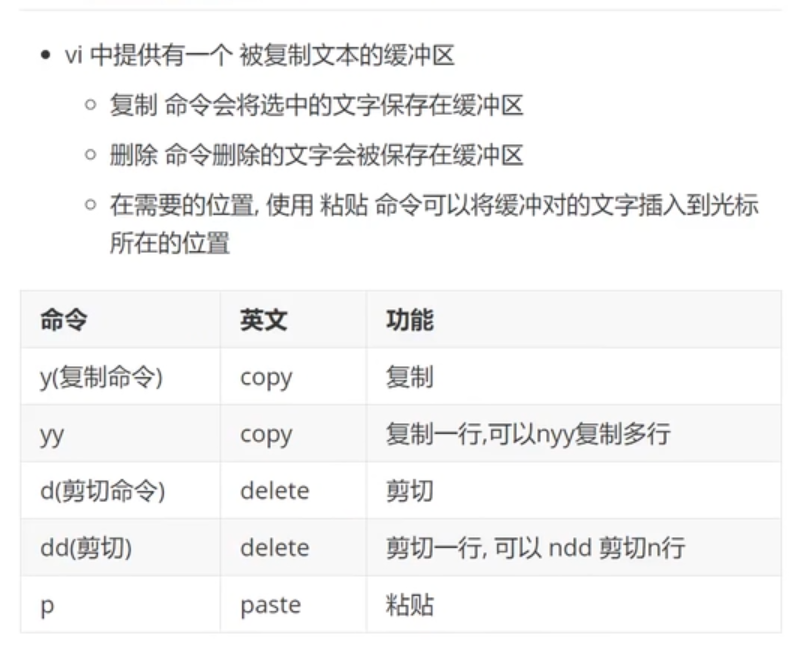

粘贴:

    p 将缓冲区中的内容粘贴到光标位置处之后

    P 粘贴到光标位置处之前

 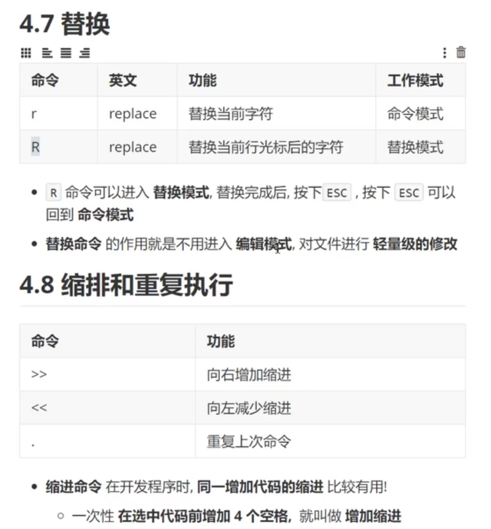

 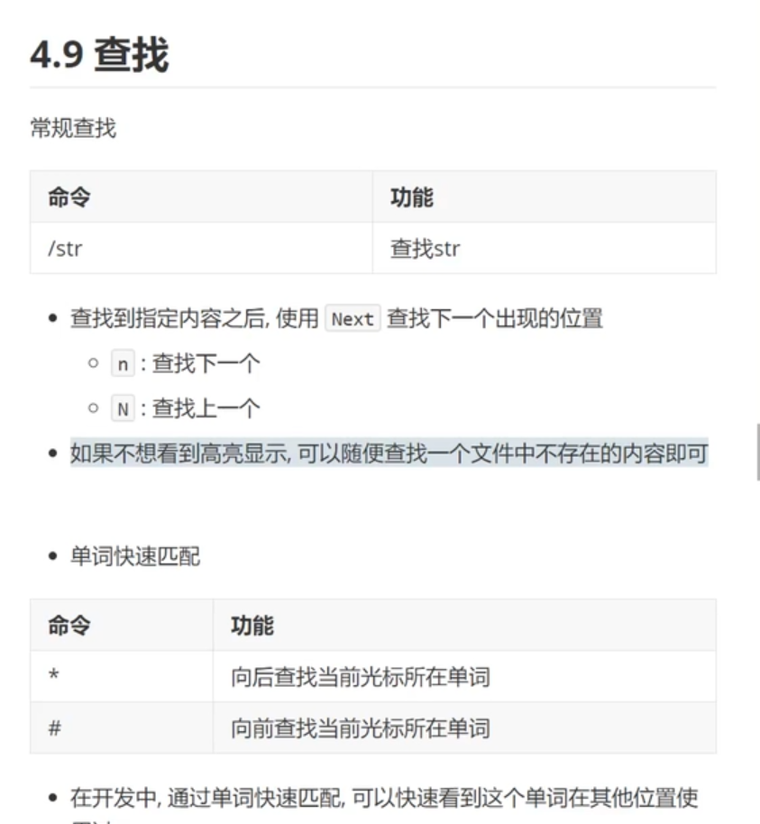
用过


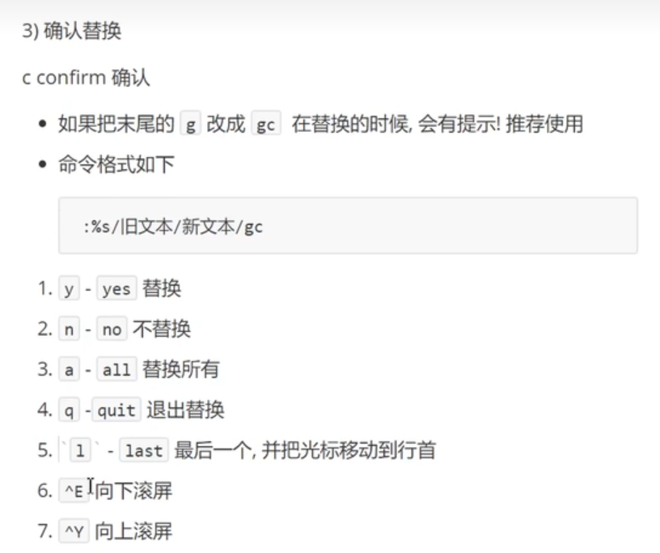
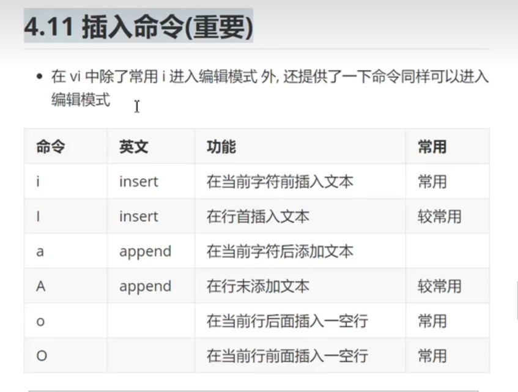

文件内查找:

    /word 从上而下在文件中查找字符串“word”

    ？word 从下而上在文件中查找字符串“word”

    n 定位下一个字符

    N 定位上一个字符

    noh 取消高亮

vimtutor:

vim手册
-------

# 系统进程与计划任务管理

## ps 查看进程（process）静态查询进程指令

常用：

    ps -aux

    ps -eo pid,....

    ps -elf 以长格式显示，显示的更加详细
    ：会显示ppid,为父进程pid

    ps -C 进程名称

查看静态的进程统计信息:

    -A：显示所有进程
    a：显示当前终端下的所有进程信息，包括其他用户的进程。与“x”选项结合时将显示系统中所有的进程信息。
    u：使用以用户为主的格式输出进程信息
    x：显示当前用户在所有终端下的进程信息、
    -e：显示系统内的所有进程信息。
    -l：使用长格式显示进程信息。
    -f：使用完整的格式显示进程信息（显示父进程）。
    -F：显示更完整格式的进程信息
    -H：以进程层级格式显示进程相关信息。

下述输出信息中，第 1 行为列表标题，其中各字段的含义描述如下：

    USER：启动该进程的用户账号的名称。
    PID：该进程在系统中的 PID 号，在当前系统中是唯一的。
    %CPU：CPU 占用的百分比。
    %MEM：内存占用的百分比。
    VSZ：占用虚拟内存 swap 空间的大小。
    RSS：占用常驻内存物理内存的大小。
    TTY：表明该进程在哪个终端上运行。“？”表示未知或不需要终端。
    STAT：显示了进程当前的状态：
    D：不可中断睡眠
    S：可中断的睡眠
    R：就绪或运行状态
    T：中止状态
    Z：僵死状态
    <：高优先级进程
    N：低优先级进程
    +：前台进程组中的进程
    l：多线程的进程
    s：会话进程的首进程
    START：启动该进程的时间。
    TIME：该进程占用的 CPU 时间。
    COMMAND：启动该进程的命令的名称。

## ==top 动态查询进程指令==

    按压1键查看CPU
    按压z键可以换颜色
    僵尸进程，并杀死
    cpu平均负载（load average）
    task会看

    注意：当 CPU 占用率过高时，不应再直接执行 top 命令查看，可以将信息存入一个文件
    内查看，以免 CPU 占用率过高导致崩溃。操作如下平时
    [root@localhost ~]# top -b -n1 > /top.txt
    [root@localhost ~]# cat /top.txt

常用选项：

    -d：指定刷新的间隔时间，单位 秒
    -b：以批量处理模式操作（非交互），一般与-n同时使用
    -n：指定循环显示的次数
    -u：指定用户名
    -p：指定进程号

常用交互指令：

    P：根据 CPU 使用百分比大小进行排序（默认进入时即为此排序）
    M：根据驻留内存大小进行排序
    T：根据累积时间进行排序
    k：终止一个进程
    q：退出程序
    r：重新安排一个进程的优先级别（-20~19）

    上述输出信息中，开头的部分显示了系统任务 Tasks、CPU 占用、内存占用 Mem、交换
    空间 Swap 等信息，下方将依次显示当前进程的排名情况。
    top - 16:58:24：当前系统时间； 1:54：系统已经运行 1 小时 54 分钟； 2 users 当前登录 2 个用户； load average：0.00,0.00,0.00；系统平均负载：（前1 分钟的，前5 分钟的，前15分钟的）状态

    如果是单核 CPU 的话，1.00 就表示 CPU 已经满负荷了，
        如果是多核 CPU 的话，load average 达到 CPU 的核数即说明该 CPU 已经满负荷了，
        如果是多颗物理 CPU，则当 load average 达到所有物理 CPU 的总核数时，说明系统 CPU 满负荷了。

    系统任务 Tasks 信息：total：总进程数；running：正在运行的进程数；sleeping：休眠的进程数；stopped：中止的进程数；zomibe：僵死无响应的进程数。

    CPU 占用信息：us：用户占用；sy：内核占用；ni：优先级调度占用；id：空闲 CPU；wa：I/O 等待占用；hi：硬件中断占用；si：软件中断占用；st：虚拟化占用。Rt：实时变化。

    内存占用 Mem（物理内存） 信息：total，总内存空间；used，已用内存；free，空闲内存；buffers，
    缓冲区域。

    交换空间 swap 占用：total，总交换空间；used，已用交换空间；free，空闲交换空间；cached，缓存空间。

     PID：进程号
     USER：进程所有者的用户名
     PR：优先级
     NI：nice 值。负值表示高优先级，正值表示低优先级
     VIRT：进程使用的虚拟内存总量，单位 kb
     RES：进程使用的、未被换出的物理内存大小，单位 kb
     SHR：共享内存大小，单位 kb
     S：进程状态
     %CPU：上次更新到现在的 CPU 时间占用百分比
     %MEM：进程使用的物理内存百分比
     TIME+：进程使用的 CPU 时间总计，单位 1/100 秒
     COMMAND：命令
    进程优先级分类
     ni: nice 值，普通优先级，值越低优先级越高
     pri: priority 优先级，进程优先级，数值越大优先级越高
     psr: processor CPU 编号
     rtprio: 实时优先级

## pidof

搜索指定进程名称的PID
格式：pidof 进程

## pgrep

常用：

    pgrep  进程名
    pgrep —al 进程名
    pgrep -alU 用户名
    pgrep -P pid -a 此pid的子进程

    查询特定进程信息，使用pgrep命令可以根据进程的名称、运行该进程的用户、进程所在的终端等多种属性查询特定进程的PID号

    -l：显示进程名

    -U：指定特定用户

    -t：指定终端

    -a：显示完整格式的进程名

    -P pid：显示指定进程的子进程

## pstree

    常用：-aup

> yum provides pstree #查看用哪个安装包
> 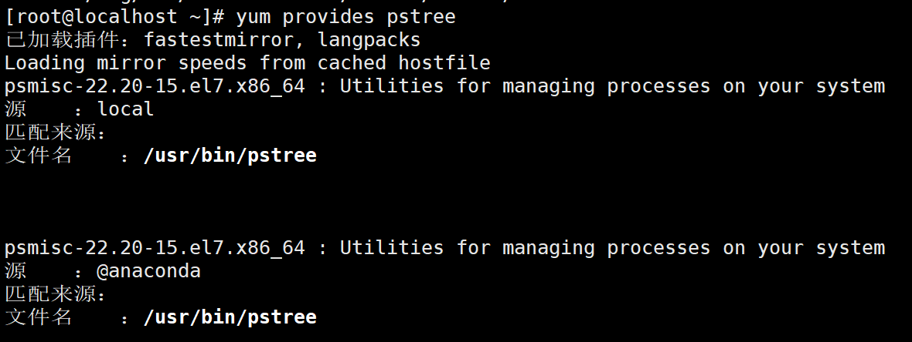

    UTF-8 ：万国字符集

    用ASCII字符显示树状进程结构，pstree命令可以输出Linux系统中各进程的树形结构，判断出各进程之间的相互关系。pstree命令默认情况下只显示各进程的名称。

    -p：选项使用时可以同时列出对应的PID号

    -u：选项可以列出对应的用户名

    -a：选项可以列出完整的命令信息

## 终止进程

### Ctrl+C 中断正在执行的命令

### kill、killall 命令

    kill：向进程发送控制信号，以实现对进程管理

    显示当前系统可用信号：kill -l trap -l

    -l：列出当前 kill 能够使用的信号(注意是小写 L)

    [root@localhost ~]# kill -l
    1) SIGHUP 2) SIGINT 3) SIGQUIT 4) SIGILL 5) SIGTRAP
    2) SIGABRT 7) SIGBUS 8) SIGFPE 9) SIGKILL 10) SIGUSR1
    3)  SIGSEGV 12) SIGUSR2 13) SIGPIPE 14) SIGALRM 15) SIGTERM
    4)  SIGSTKFLT 17) SIGCHLD 18) SIGCONT 19) SIGSTOP 20) SIGTSTP
    5)  SIGTTIN 22) SIGTTOU 23) SIGURG 24) SIGXCPU 25) SIGXFSZ
    6)  SIGVTALRM 27) SIGPROF 28) SIGWINCH 29) SIGIO 30) SIGPWR
    7)  SIGSYS 34) SIGRTMIN 35) SIGRTMIN+1 36) SIGRTMIN+2 37) SIGRTMIN+3
    8)  SIGRTMIN+4 39) SIGRTMIN+5 40) SIGRTMIN+6 41) SIGRTMIN+7 42) SIGRTMIN+8
    9)  SIGRTMIN+9 44) SIGRTMIN+10 45) SIGRTMIN+11 46) SIGRTMIN+12 47) SIGRTMIN+13
    10) SIGRTMIN+14 49) SIGRTMIN+15 50) SIGRTMAX-14 51) SIGRTMAX-13 52) SIGRTMAX-12
    11) SIGRTMAX-11 54) SIGRTMAX-10 55) SIGRTMAX-9 56) SIGRTMAX-8 57) SIGRTMAX-7
    12) SIGRTMAX-6 59) SIGRTMAX-5 60) SIGRTMAX-4 61) SIGRTMAX-3 62) SIGRTMAX-2
    13) SIGRTMAX-1 64) SIGRTMAX

    常用信号：man 7 signal
    1) SIGHUP: 无须关闭进程而让其重读配置文件(重点，很实用)
    2) SIGINT: 终止正在运行的进程；相当于 Ctrl+c
    9) SIGKILL: 杀死正在运行的进程（强制立刻杀死进程）
    15) SIGTERM：终止正在运行的进程（可能不会立即生效，会等进程保存完所有数据才正常退出）

    指定信号的方法：
    (1) 信号的数字标识；1, 2, 9
    (2) 信号完整名称；SIGHUP
    (3) 信号的简写名称；HUP

    kill 用于终止指定 PID 号的进程
    killall 用于终止指定名称的所有进程

    -9 选项用于强制终止

    [root@localhost ~]# pgrep -l "ping" 11260 ping
    [root@localhost ~]# kill 11260
    [root@localhost ~]# killall -9 vim

### pkill 根据特定条件终止相应的进程

常用选项：

    -U：根据进程所属的用户名终止相应进程

    -t：根据进程所在的终端终止相应进程

## 任务管理

### 手动启动

    任务：
    登录系统取得 shell 之后，在单一终端接口下启动的进程

    前台：
    在终端接口上，可以在提示符上用户操作的环境

    后台：
    不显示在终端接口的环境

### 前台启动：用户输入命令，直接执行程序

    ping www.baidu.com

### 后台启动：在命令行尾加入“&”符号

    dd if=/dev/zero of=testfile bs=1M count=2048 &

### nohup是使程序永久执行的方式

    &是指在后台运行，但当用户退出(挂起)的时候，命令自动也跟着退出
    那么，我们可以巧妙的吧他们结合起来用就是
    nohup COMMAND &
    这样就能使命令永久的在后台执行

    cat nohup.out

    另外，nohup 执行后，会产生日子文件，把命令的执行中的消息保存到这个文件中，一般在当前目录下，如果当前目录不可写，那么自动保存到执行这个命令的用户的 home 目录下，例如 root 的话就保存在/root/下这个我们常在运行命令和脚本中常用到的。、

## 进程的前后调度

### ctrl+z 把正在前台运行的任务放到后台暂停

### jobs 查看处于后台的任务列表

    作用：查看处于后台的任务列表

    -l：列出进程ID及其他信息

    -p：仅列出进程ID

    -n：仅列出自从上次输出了状态变化提示后的发生了状态变化的进程

    -r：仅显示运行中的作业

    -s：仅显示停止的作业

    -x：运行命令及其参数，并用新的命令的进程ID替代所匹配的原
    有作业的进程组ID

### fg 将后台进程恢复到前台运行，可指定任务程序号

### bg 将后台暂停的进程调至后台运行

### at 管理一次性任务计划

格式：

    at HH:MM 今天的HH:MM时间执行，若是时间已经超过，则明天的HH:MM时间执行
        hour mintue
    at HH:MM YYYY-MM-DD 指定具体的执行日期和日期
        year month day
    at HH:MM + number {minutes | hours | days | weeks }

基础操作：

    Ctrl+D 保存退出
    atq 查询现有的一次任务计划
    atrm [任务序号] 删除第几项任务 或者at -d 任务序号

### ==crontab 管理周期任务计划。==

vi /etc/crontab 设置自动

    作用：设置用户的周期性计划任务，结合不同的选项可以完成不同的计划任务管理操作。

    -e：编辑计划任务列表

    -u：指定所管理的计划任务属于哪个用户，默认时针对当前登录用户，一般只有root用户有权限使用此选项用户编辑、删除其他用户的计划任务

    -l：列表显示计划任务

    -r：清空计划任务列表

---

# 软件包管理方式

## rpm/yum/apt/apt-get/dpkg

## rpm 查询已安装的RPM软件信息

    格式：
    rpm -q [子选项] [软件名]

    rpm -q 软件名 查询指定软件是否安装（“-q”选项时实际上调用了 “/usr/bin/rpmquery”程序完成查询工作）

    rpm -qa 查询系统已经安装所有的软件信息

    rpm -qa | grep 软件名 查询当前系统安装了哪些与软件名称相关的包

    rpm -qi 软件名 查询已安装软件的详细信息

    rpm -ql 软件名 查询已安装软件安装到什么地方去了

    rpm -qf 文件的绝对路径 查询该文件有哪个软件产生

    rpm -qc 软件名 查询软件生成的配置文件

    rpm -qd 软件名 查询软件生成的文档文件

    rpm -e --nodeps 包（非常危险的指令，不要轻易用）

#### 安装或升级RPM软件

    格式：
    rpm[选项]RPM包文件...

    rpm -ivh 完整软件包名称

    -i 安装一个新的rpm软件包

    -h 以“#”号显示安装的进度

    -v 显示安装过程中的详细信息

    --force 强制安装（主要用在安装旧的软件代替新的软件）

    --nodeps 安装、升级或卸载软件时，忽略依赖关系

    --test 测试安装

#### 卸载指定的RPM软件

    rpm -e 软件名

#### 升级安装

    rpm-Uvh 完整软件包名称 #无论旧版本软件是否安装，都安装新
    版本

    rpm-Fvh 完整软件包名称 #若旧版本软件没有安装，则放弃安装新版本

    重建rpm数据库

    rpm --rebuilddb

    rpm --initdb

## yum

    yum -y install
    yum安装

    yum clean all
    清除yum仓库缓存

    yum makecache
    重建yum仓库缓存

    yum provides
    查询安装包在哪个位置

---

# 引导过程 Troubleshooting 与服务控制

    Linux 操作系统的引导过程一般包括以下几个阶段：
    开机自检、MBR 引导、GRUB 菜单、加载 Linux 内核、init 进程初始化

### systemctl

    Systemd 是 Linux 操作系统的一种 init 软件，CentOS7 系统中采用了全新的 Systemd
    启动方式，取代了传统的 SysVinit。Systemd 启动方式使系统初始化时诸多服务并行启动，
    大大增高了开机效率。CentOS7 系统中"/sbin/init"是"/lib/systemd/systemd"的链接文件，
    换言之，CentOS7 系统中运行的第一个 init 进程是"/lib/systemd/systemd"。

    在 CentOS7 系统中，各种系统服务的控制脚本默认放在/usr/lib/systemd/system/目录下，
    通过 systemctl 命令工具可以实现对指定系统服务的控制，语法格式如下:

    systemctl 控制类型 服务名称[.service]

    对于大多数系统服务来说:常见的几种控制类型如下所述。

    start (启动)：运行指定的系统服务程序，实现服务功能。

    stop (停止)：终止指定的系统服务程序，关闭相应的功能。

    restart (重启)：先退出，再重新运行指定的系统服务程序。

    reload (重载)：不退出服务程序，只是刷新配置，在某些服务中与 restart 的操作相同。

    status(查看状态)：查看指定的系统服务的运行状态及相关信息。

    systemd 守护进程负责 Linux 的系统和服务。

    systemctl 用于控制 Systemd 管理的系统和服务状态。
    systemctl restart sshd.service

    systemctl stop  关闭服务

    systemctl start  开启服务

    systemctl status 查询服务状态

    systemctl disable  永久关闭

    systemctl enable 永久开启

    systemctl restart  先退出，再重新运行运行指定的系统服务程序

    systemctl reload  不退出服务程序，只是刷新配置，在某些服务中与restart的操作相同

    systemctl is-enabled 查看开机启动状态

    systemctl isolate  target (与 init  数字 一样)切换target状态

    完整命令：
    systemctl get-default //查看系统启动时默认运行的 target
    systemctl poweroff //关闭系统
    systemctl reboot //重启系统

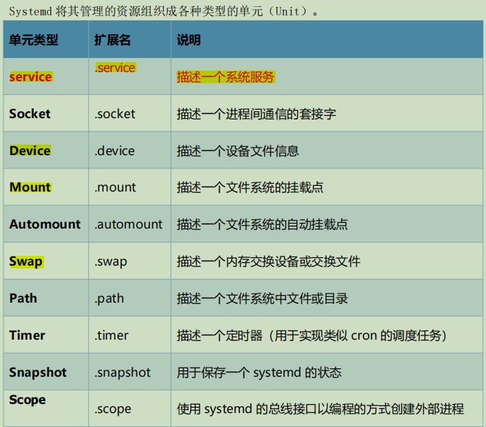

## Linux 中服务的管理方式

    独立管理(门市房)
    systemctl start dhcpd
    systemctl stop dhcpd

    集中管理（商场）xinetd
    vim /etc/xinetd.d/tftp
    disable = no
    systemctl start tftp
    systemctl start xinetd

## target

### init 数字 切换target状态

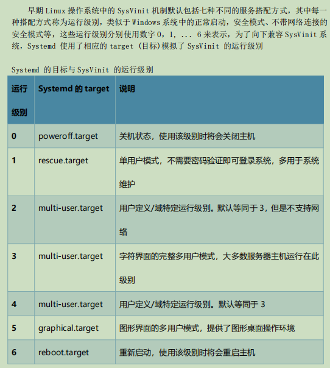

## runlevel 查询当前系统所在的target

    显示结果中的两个字符分别表示切换前的目标、当前的目标。
    若之前尚来切换过运行级别，则第 1 列将显示 N(None)，S（Single）

    若查看系统启动时默认运行的 target
        [root@localhost ~]# systemctl get-default

    将默认运行级别从 multi-user.target 切换为 graphical.target
            [root@localhost ~]# systemctl set-default graphical.target
            [root@localhost ~]# systemctl get-default
            graphical.target

---

----------

# 网络参数管理：

## 查看及测试网络

## ifconfig 查看活动（激活）的网络接口

    ifconfig -a    查看所有网络接口
    ifconfig 设备名	查看指定的网络接口

    ifconfig 命令包含的信息：
    Link encap：Ethernet 以太网 HWaddr：物理地址（MAC 地址）
    inet addr：IPv4 地址 Bcast：广播地址 Mask：子网掩码
    inet6 addr：IPv6 地址
    MTU：最大传输单元（Maximum Transmission Unit） Metric：跳跃点
    RX packets：接收数据包 errors：错误 dropped：丢弃 overruns：过载 frame：帧
    数
    TX packets：发送数据包 errors：错误 dropped：丢弃 overruns：过载 carrier：
    载波
    collisions：冲撞 txqueuelen：发送列队长度
    RX bytes：接收字节数 TX bytes：发送字节数

## 使用 ip、ethtool 命令查看网络接口

### ip

    ip link 查看网络接口的数据链路层信息

    ip a (ip address) 查看网络接口的网络层信息

### ethtool 查看指定网络接口速率、模式等信息

    格式：ethtool 设备名

## 查看主机名、路由表

### hostname 查看主机名

    临时修改主机名称：
        hostname  名字
        bash

    永久修改主机名：
    方法3：
    hostnamectl set-hostname  名字
        bash

    方法 1：编辑/etc/sysconfig/network 配置文件，重启系统后生效
    [root@linuxxu ~]# vim /etc/sysconfig/network
    # Created by anaconda
    HOSTNAME=linuxxu.com

    方法 2：编辑/etc/hostname 配置文件，重启后生效（推荐）
    [root@linuxxu ~]# vim /etc/hostname
    linuxxu.com

### [route 查看主机路由表](https://blog.csdn.net/qq_41453285/article/details/88698675?ops_request_misc=&request_id=&biz_id=102&utm_term=%E6%9F%A5%E7%9C%8B%E5%BD%93%E5%89%8D%E4%B8%BB%E6%9C%BA%E7%9A%84%E8%B7%AF%E7%94%B1%E7%9A%84%E5%91%BD%E4%BB%A4&utm_medium=distribute.pc_search_result.none-task-blog-2~all~sobaiduweb~default-3-88698675.142^v53^js_top,201^v3^control_2&spm=1018.2226.3001.4187)

    格式：
    添加指定网段：route add -net 网段/短格式子网掩码 gw 网关地址
    删除指定网段：route del -net 192.168.2.0/24

    查看：route -n 不执行 DNS 反向查找，直接显示数字形式的 IP 地址

    添加默认网关：route add default gw 网关地址
    删除默认网关：route del default gw 网关地址

### 使用 netstat -r 命令查看路由表

-n：不执行 DNS 反向查找，直接显示数字形式的 IP 地址

## netstat 查看网络连接情况

==选项组合：-anptu|grep ==

    -r：查看路由表

    -a：显示当前主机所有活动的网络连接信息

    -n：显示数字形式的IP地址

    -r：显示路由表信息

    -t：显示TCP协议相关的信息

    -u：显示UDP协议相关的信息

    -p：显示与网络连接相关的进程号、进程名称信息

==-l：查看监听状态的网络连接信息 listen,监听==

## [ss](https://blog.csdn.net/qq_34493319/article/details/124764072?ops_request_misc=&request_id=&biz_id=102&utm_term=linux%E7%9A%84ss%E5%91%BD%E4%BB%A4&utm_medium=distribute.pc_search_result.none-task-blog-2~all~sobaiduweb~default-0-124764072.nonecase&spm=1018.2226.3001.4187)

## ping与traceroute

    常见的 TTL（Time To Live）生存周期值：
        windows：128
        linux：64
        unix：255
        cisco：25

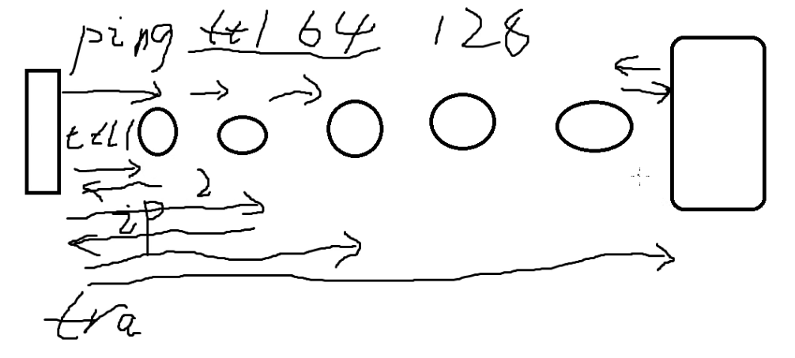


### ping 测试网络连通性

选项：

    -c：指定发送数据包的个数

    -i：当ping通时，指定间隔多少秒发送下一个数据包

    -w：当ping不通时，指定发送的每个数据包的超时时间，单位秒

    -s：指定数据包大小

### traceroute 跟踪数据包的路由途径

    -n：不执行DNS反向查找，直接显示数字形式的IP地址
    用法：traceroute -n www.baidu.com

    Windows中使用 tracert 命令
    tracert -d www.baidu.com

#### windows 中的 tracert 命令

    在 dos 中输入 tracert -d（-d 不将地址解析成主机名）

    C:\Users\Linuxxu> tracert -d www.linuxxu.com
    通过最多 30 个跃点跟踪
    到 www.linuxxu.com [180.153.100.100] 的路

## nslookup 测试DNS域名解析

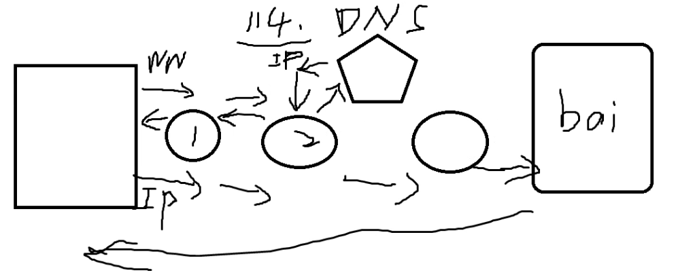

nslookup www.linuxxu.com

    Server: 202.106.0.20
    Address: 202.106.0.20#53
    Non-authoritative answer:
    Name: www.linuxxu.com
    Address: 180.153.100.100
nslookup www.linuxxu.com 8.8.8.8

    Server: 8.8.8.8
    Address: 8.8.8.8#53
    Non-authoritative answer:
    Name: www.linuxxu.com
    Address: 180.153.100.100
[root@localhost ~]# nslookup

    > server 114.114.114.114
    Default server: 114.114.114.114
    Address: 114.114.114.114#53
    > www.linuxxu.com
    Server: 114.114.114.114
    Address: 114.114.114.114#53
    Non-authoritative answer:
    Name: www.linuxxu.com
    Address: 180.153.100.100

## iptables 查看iptables规则

## 设置网络地址参数

1、临时修改网络配置:

    （1）方法一：ifconfig 网络设备 IP 地址[/短格式子网掩码]
    （2）方法二：ifconfig 网络设备 IP 地址 [netmask 子网掩码]
    [root@localhost ~]# ifconfig ens32 192.168.200.111
    [root@localhost ~]# ifconfig ens32 192.168.200.111/24
    [root@localhost ~]# ifconfig ens32 192.168.200.111 netmask 255.255.255.0

2、固定修改网络配置:

    （1）配置文件：/etc/sysconfig/network-scripts/目录下的 ifcfg-对应网络设备名称，
    默认第一块网卡为 ens32 或者 ens33
    （2）编辑配置文件：前面带#表示非必要配置内容
    [root@localhost ~]# cat /etc/sysconfig/network-scripts/ifcfg-ens32
    TYPE=Ethernet #类型（以太网）
    PROXY_METHOD=none
    BROWSER_ONLY=no
    DEFROUTE=yes
    IPV4_FAILURE_FATAL=no
    IPV6INIT=no
    IPV6_AUTOCONF=no
    IPV6_DEFROUTE=no
    IPV6_FAILURE_FATAL=no
    IPV6_ADDR_GEN_MODE=stable-privacy
    NAME=ens32 #设备名
    UUID=b194e583-21c3-4109-a160-3d2a9876a30b #UUID 号
    BOOTPROTO=static #引导协议（dhcp：自动获取；static/none：手动配置）
    DEVICE=ens32 #设备名
    ONBOOT=yes #是否开机自动启用
    IPADDR=192.168.200.111 #IPv4 协议的 IP 地址
    PREFIX=24 #子网掩码 NETMASK=255.255.255.0
    GATEWAY=192.168.200.1 #网关
    DNS1=202.106.0.20 #DNS 域名解析服务
    HWADDR=00:0C:29:8F:D8:E0 #物理地址（MAC 地址）
    IPV6_PRIVACY=no
    [root@localhost ~]# systemctl restart network

3、临时设置网卡子接口:

    方法：ifconfig 网络设备:子接口名称 IP 地址/短格式子网掩码
    [root@localhost ~]# ifconfig ens32:0 192.168.1.1/24
    [root@localhost ~]# ifconfig ens32:sec 192.168.2.1/24
    [root@localhost ~]# ifconfig
    ens32: flags=4163<UP,BROADCAST,RUNNING,MULTICAST> mtu 1500
    inet 192.168.200.111 netmask 255.255.255.0 broadcast 192.168.200.255
    inet6 fe80::20c:29ff:feb6:933c prefixlen 64 scopeid 0x20`<link>`
    ether 00:0c:29:b6:93:3c txqueuelen 1000 (Ethernet)
    RX packets 3111 bytes 261778 (255.6 KiB)
    RX errors 0 dropped 0 overruns 0 frame 0
    TX packets 1931 bytes 225571 (220.2 KiB)
    TX errors 0 dropped 0 overruns 0 carrier 0 collisions 0
    ens32:0: flags=4163<UP,BROADCAST,RUNNING,MULTICAST> mtu 1500
    inet 192.168.1.1 netmask 255.255.255.0 broadcast 192.168.1.255
    ether 00:0c:29:b6:93:3c txqueuelen 1000 (Ethernet)
    ens32:sec: flags=4163<UP,BROADCAST,RUNNING,MULTICAST> mtu 1500
    inet 192.168.2.1 netmask 255.255.255.0 broadcast 192.168.2.255
    ether 00:0c:29:b6:93:3c txqueuelen 1000 (Ethernet)

4、永久设置网卡子接口:

    （1）方法：需要在/etc/sysconfig/network-scrips/目录下手动添加配置文件
    [root@localhost ~]# vim /etc/sysconfig/network-scripts/ifcfg-ens32:0
    TYPE=Ethernet
    PROXY_METHOD=none
    BROWSER_ONLY=no
    BOOTPROTO=static
    DEFROUTE=yes
    IPV4_FAILURE_FATAL=no
    LINUX 运维架构师系列
    IPV6INIT=no
    IPV6_AUTOCONF=no
    IPV6_DEFROUTE=no
    IPV6_FAILURE_FATAL=no
    IPV6_ADDR_GEN_MODE=stable-privacy
    NAME=ens32:0
    DEVICE=ens32:0
    ONBOOT=yes
    IPADDR=192.168.200.11
    PREFIX=24
    GATEWAY=192.168.200.1
    DNS1=202.106.0.20
    IPV6_PRIVACY=no
    [root@localhost ~]# systemctl restart network
    5、临时修改网卡的状态
    （1）方法：ifconfig 网络设备 up/down
    [root@localhost ~]# ifconfig ens32 down && ifconfig ens32 up
6、重新加载网络配置文件:

    （1）重启网络服务以实现重新读取配置文件的目的
    方法：systemctl restart network = service network restart
    [root@localhost ~]# systemctl restart network
    （2）修改某块网卡配置后，仅重启该网卡
    格式：ifdown 网络设备;ifup 网络设备
    [root@localhost ~]# ifdown ens32

## ==单臂路由实验==（公司内部常用的一种内网路由状态）

### 设置网卡子接口 （与路由一样）

    使虚拟机上不同网段的主机之间进行通信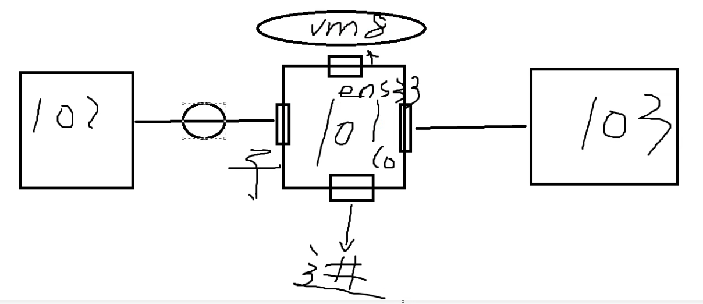
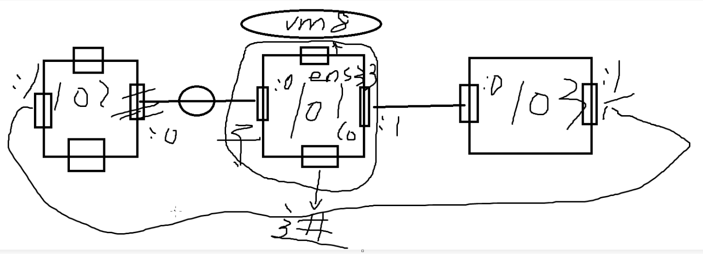

    好比两个之间建立了个路由器
    需要彼此都配置

临时设置网卡子接口:

    方法：ifconfig 网络设备:子接口名称 IP 地址/短格式子网掩码
    [root@localhost ~]# ifconfig ens32:0 192.168.1.1/24
    [root@localhost ~]# ifconfig ens32:sec 192.168.2.1/24
    [root@localhost ~]# ifconfig
    ens32: flags=4163<UP,BROADCAST,RUNNING,MULTICAST> mtu 1500
    inet 192.168.200.111 netmask 255.255.255.0 broadcast 192.168.200.255
    inet6 fe80::20c:29ff:feb6:933c prefixlen 64 scopeid 0x20`<link>`
    ether 00:0c:29:b6:93:3c txqueuelen 1000 (Ethernet)
    RX packets 3111 bytes 261778 (255.6 KiB)
    RX errors 0 dropped 0 overruns 0 frame 0
    TX packets 1931 bytes 225571 (220.2 KiB)
    TX errors 0 dropped 0 overruns 0 carrier 0 collisions 0
    ens32:0: flags=4163<UP,BROADCAST,RUNNING,MULTICAST> mtu 1500
    inet 192.168.1.1 netmask 255.255.255.0 broadcast 192.168.1.255
    ether 00:0c:29:b6:93:3c txqueuelen 1000 (Ethernet)
    ens32:sec: flags=4163<UP,BROADCAST,RUNNING,MULTICAST> mtu 1500
    inet 192.168.2.1 netmask 255.255.255.0 broadcast 192.168.2.255
    ether 00:0c:29:b6:93:3c txqueuelen 1000 (Ethernet)

永久设置网卡子接口:

    （1）方法：需要在/etc/sysconfig/network-scrips/目录下手动添加配置文件
    [root@localhost ~]# vim /etc/sysconfig/network-scripts/ifcfg-ens32:0
    TYPE=Ethernet
    PROXY_METHOD=none
    BROWSER_ONLY=no
    BOOTPROTO=static
    DEFROUTE=yes
    IPV4_FAILURE_FATAL=no
    IPV6INIT=no
    IPV6_AUTOCONF=no
    IPV6_DEFROUTE=no
    IPV6_FAILURE_FATAL=no
    IPV6_ADDR_GEN_MODE=stable-privacy
    NAME=ens32:0
    DEVICE=ens32:0
    ONBOOT=yes
    IPADDR=192.168.200.11
    PREFIX=24
    GATEWAY=192.168.200.1
    DNS1=202.106.0.20
    IPV6_PRIVACY=no
    [root@localhost ~]# systemctl restart network

### 配置路由（静态、动态、默认路由）（此次为添加静态路由）

1、临时配置路由：

    （1）临时添加、删除指定网段的路由记录
    方法：route add -net 网段/短格式子网掩码 gw 网关地址
    route del -net 网段/短格式子网掩码
    [root@linuxxu ~]# route add -net 192.168.2.0/24 gw 192.168.200.1
    [root@linuxxu ~]# route -n
    Kernel IP routing table
    Destination Gateway Genmask Flags Metric Ref Use Iface
    0.0.0.0 192.168.200.1 0.0.0.0 UG 0 0 0 ens32
    169.254.0.0 0.0.0.0 255.255.0.0 U 1002 0 0 ens32
    192.168.2.0 192.168.200.1 255.255.255.0 UG 0 0 0 ens32
    192.168.122.0 0.0.0.0 255.255.255.0 U 0 0 0 virbr0
    192.168.200.0 0.0.0.0 255.255.255.0 U 0 0 0 ens32
    [root@linuxxu ~]# route del -net 192.168.2.0/24
    [root@linuxxu ~]# route -n
    Kernel IP routing table
    Destination Gateway Genmask Flags Metric Ref Use Iface
    0.0.0.0 192.168.200.1 0.0.0.0 UG 0 0 0 ens32
    169.254.0.0 0.0.0.0 255.255.0.0 U 1002 0 0 ens32
    192.168.122.0 0.0.0.0 255.255.255.0 U 0 0 0 virbr0
    192.168.200.0 0.0.0.0 255.255.255.0 U 0 0 0 ens32

    （2）临时添加、删除默认网关记录
    方法：route add default gw 网关地址
    route del default gw 网关地址
    [root@linuxxu ~]# route del default gw 192.168.200.1
    [root@linuxxu ~]# route -n
    Kernel IP routing table
    Destination Gateway Genmask Flags Metric Ref Use Iface
    169.254.0.0 0.0.0.0 255.255.0.0 U 1002 0 0 ens32
    192.168.122.0 0.0.0.0 255.255.255.0 U 0 0 0 virbr0
    192.168.200.0 0.0.0.0 255.255.255.0 U 0 0 0 ens32
    [root@linuxxu ~]# route add default gw 192.168.200.1

2、永久配置路由：

    （1）方法一：在/etc/rc.local 中添加
    /etc/rc.local 是系统开机时最后执行的一个 shell 脚本，可以将命令放到脚本内，实现每
    次开机执行。
    [root@linuxxu ~]# vim /etc/rc.local
    route add -net 192.168.2.0/24 gw 192.168.200.1
    route add -net 192.168.2.0/24 dev ens32

    （2）方法二：在/etc/sysconfig/network 中添加到末尾
    注意：网卡的配置文件中如果有设置了网关，该文件优先级高于此配置文件
    [root@linuxxu ~]# grep "GATEWAY" /etc/sysconfig/network-scripts/ifcfg-ens32
    GATEWAY=192.168.200.1

    （3）方法三：修改/etc/sysconfig/static-routes 配置文件（没有该文件手动建立）
    [root@linuxxu ~]# vim /etc/sysconfig/static-routes
    any net 192.168.1.0/24 gw 192.168.200.1
    any net 192.168.2.0 netmask 255.255.255.0 gw 192.168.200.1
    [root@linuxxu ~]# systemctl restart network
    [root@linuxxu ~]# route -n
    Kernel IP routing table
    Destination Gateway Genmask Flags Metric Ref Use Iface
    0.0.0.0 192.168.200.1 0.0.0.0 UG 0 0 0 ens32
    169.254.0.0 0.0.0.0 255.255.0.0 U 1002 0 0 ens32
    192.168.1.0 192.168.200.1 255.255.255.0 UG 0 0 0 ens32
    192.168.2.0 192.168.200.1 255.255.255.0 UG 0 0 0 ens32
    192.168.122.0 0.0.0.0 255.255.255.0 U 0 0 0 virbr0
    192.168.200.0 0.0.0.0 255.255.255.0 U 0 0 0 ens32

    （4）方法四：开启 IP 转发（路由功能）
    1> echo “1”> /proc/sys/net/ipv4/ip_forward （临时开启）
    2> 编辑/etc/sysctl.conf 文件将 net.ipv4.ip_forward=0 改为 1（永久开启）
    sysctl -p （使 sysctl.conf 文件立即生效）

    临时开启
    [root@linuxxu ~]# cat /proc/sys/net/ipv4/ip_forward
    0
    [root@linuxxu ~]# echo 1 > /proc/sys/net/ipv4/ip_forward

    永久开启
    [root@linuxxu ~]# vim /etc/sysctl.conf
    net.ipv4.ip_forward = 1
    [root@linuxxu ~]# sysctl

## 设置DNS域名解析

1、设置 DNS 域名解析

    （1）方法一：编辑/etc/sysconfig/network-scripts/目录下网络设备的配置文件
    [root@localhost ~]# vim /etc/sysconfig/network-scripts/ifcfg-ens32
    DNS1=202.106.0.20
    DNS2=8.8.8.8
    DNS3=114.114.114.114（国内通用，速度慢）

    （2）方法二：vi 编辑/etc/resolv.conf 文件
    就是定义你的域名解析服务器的ip
    [root@linuxxu ~]# vim /etc/resolv.conf
    # Generated by NetworkManager
    nameserver 202.106.0.20

2、域名解析本地主机映射文件
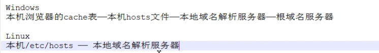

    （1）方法：编辑/etc/hosts 文件
    （2）说明：/etc/hosts 文件优先于 DNS 域名解析服务，也就是说，如果一个域名在 hosts
    文件中已存在映射关系，将不再通过 DNS 服务器进行域名解析。hosts 文件中一个 ip 地址
    可以对应多个域名或者别名。
    Linux：/etc/hosts
    Windows：C:\Windows\System32\drivers\etc\hosts
    [root@linuxxu ~]# vim /etc/hosts
    127.0.0.1 localhost localhost.localdomain localhost4 localhost4.localdomain4
    ::1 localhost localhost.localdomain localhost6 localhost6.localdomain6
    192.168.200.111 www.linuxxu.com
    [root@linuxxu ~]# ping -c 2 www.linuxxu.com
    PING www.linuxxu.com (192.168.200.111) 56(84) bytes of data. 64 bytes from www.linuxxu.com (192.168.200.111): icmp_seq=1 ttl=64 time=0.089 ms
    64 bytes from www.linuxxu.com (192.168.200.111): icmp_seq=2 ttl=64 time=0.109 ms
    --- www.linuxxu.com ping statistics --- 2 packets transmitted, 2 received, 0% packet loss, time 999ms
    rtt min/avg/max/mdev = 0.089/0.099/0.109/0.010 m

windows:域名解析本地主机映射文件
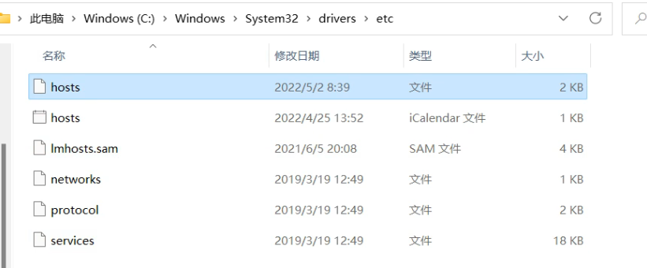

---

# 远程连接

链接xshell用的是ssh协议，用的是sshd进程

## ssh 远程连接

    格式：
    ssh ip地址

## scp 远程复制文件或目录

    格式：
    scp 本地复制文件夹  IP地址：所要复制到文件夹
    参数与cp相似

> 因为发送过去后要反解析，所以时间会慢，可以 vim sshd_config 来提高速度，
> UserDNS no
> 为 no
> 然后systemctl restart sshd 重启这个服务
> 就可以了

    在传输过程中老是需要密码，我么可以配置两台服务器的免密：就是把我们的公钥给到远程的服务器，通过秘钥来进行通信，而不通过用户名和密码的方式来进行认证的。
    怎么做：[ssh-keygen](https://blog.csdn.net/qq_40932679/article/details/117487540?ops_request_misc=%257B%2522request%255Fid%2522%253A%2522166497184616800182191287%2522%252C%2522scm%2522%253A%252220140713.130102334..%2522%257D&request_id=166497184616800182191287&biz_id=0&utm_medium=distribute.pc_search_result.none-task-blog-2~all~top_click~default-2-117487540-null-null.142^v51^new_blog_pos_by_title,201^v3^control_2&utm_term=ssh-keygen&spm=1018.2226.3001.4187)  (如有需要可以进行自定义，不然一路回车)
    ssh-copy-id 远程IP
    然后进行ssh 远程连接就行了

- [X] scp：

  directory/与directory发送的都是这个整个目录和目录下的文件
  directory/*意思是中发送directory下的所有文件

## rsync 远程更新

是一个能够高效远程更新(=在远程主机里存在相同文件时，只传送远程主机里没有的文件==）的文件传输程序，使用快速差分算法。


> 常用格式：rsync -av 文件  IP：目的文件地址

命令格式：
rsync [选项]... 原始位置 目标位置

    -r：递归模式，包含目录及子目录中所有文件
    -l：对于符号链接文件仍然复制为符号链接文件
    -p：保留文件的权限标记
    -t：保留文件的时间标记
    -g：保留文件的属组标记（仅超级用户使用）
    -o：保留文件的属主标记（仅超级用户使用）
    -D：保留设备文件及其他特殊文件

    -a：归档模式，递归并保留对象属性，等同于 -rlptgoD
    -v：显示同步过程的详细（verbose）信息
    -z：在传输文件时进行压缩（compress）
    -H：保留硬连接文件
    -A：保留ACL属性信息
    --delete：删除目标位置有而原始位置没有的文件
    --checksum：根据对象的校验和来决定是否跳过文件

- [X] rsync：

  directory发送的都是这个整个目录和目录下的文件
  directory/意思是中发送directory下的所有文件

---

# 日期和时间

## date 显示系统时间

 查看系统时间：
 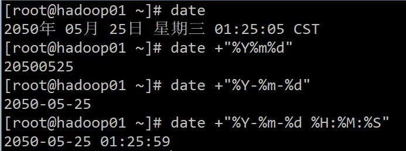

    修改时间：

    date -s "12:00:00"

    算出某个时间点距离1970年1月1日过去多少秒:

    date -d "日期及时间" +%s  ：
    date + '%F' : 全格式显示年、月、日
    date + '%T' : 全格式显示时、分、秒
    date +'%F %T' ：全格式显示日期和时间
    date + '%s' : 1970-01-01到现在时间的秒数
    date + '%Y-%m-%d %H-%M-%S' : 全格式显示日期和时间
    date +%F -d "-1 day"
    date +%N
    echo -n = printf 输出内容不换行
    [root@localhost ~]# ls -ltr passwd-*
    [root@localhost ~]# ls -lt passwd-*

## ntpdate

    和网络上的时间服务器进行同步
    ntpdate time.windows.com

## cal 显示日历

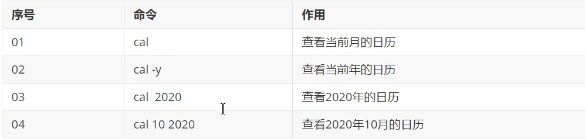

---

# 计算

## bc

---                                        

## history 显示与操作历史

## help 打印通用求助信息，或关于COMMAND的信息

内部命令 help
查看shell内部命令的帮助信息

## man

使用 man 命令阅读手册页
适用于大多数外部命令
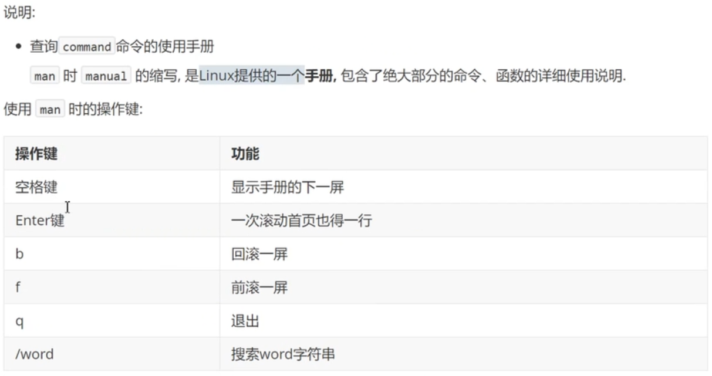

## alias 设置别名

查看系统已设置的别名
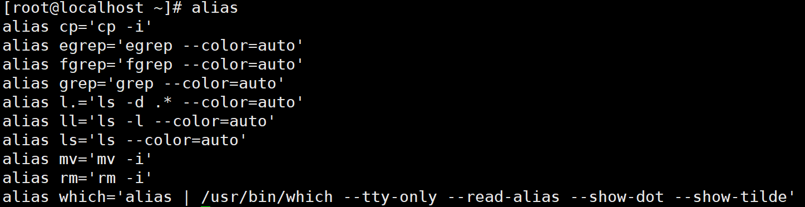

    暂时式格式：
    alias  别名='命令'
    (这种格式只是临时有效，如果再开个shell就会无效)

    永久式格式：
    vim .bashrc
    在编辑模式下
    alias  别名='命令'

暂时：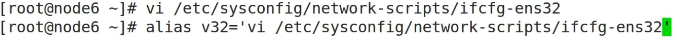

永久：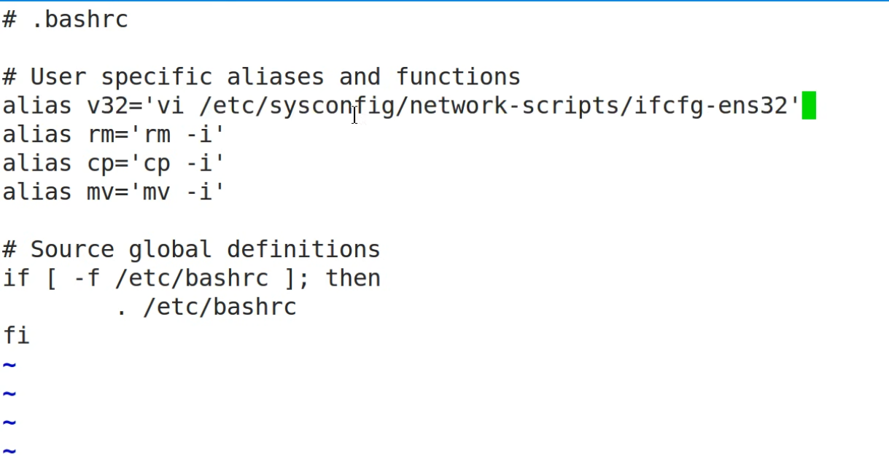
需要设置，比如一些远程连接，脚本就没有alias设置

## unalias 取消别名

    暂时式别名取消格式：

    unalias 设置的别名

    永久式别名取消格式：

    vim .bashrc
    进入编辑模式
    把别名命令删除
    保存

## type

通过type命令查看命令类型

## |（管道）

管道可以将前面命令的执行结果（屏幕回显信息），交管道后的命令作为参数

## tee 可以通过tee将命令结果通过管道 输出到多个文件中,同时创建这些文件

    格式：
        命令结果 |tee file1 file2 ...
        #cat file |sort |uniq -c | tee a.txt b.txt c.txt d.txt ...

## [xargs与管道区别](https://blog.csdn.net/vanturman/article/details/84325846?ops_request_misc=%257B%2522request%255Fid%2522%253A%2522166679423016800192210329%2522%252C%2522scm%2522%253A%252220140713.130102334..%2522%257D&request_id=166679423016800192210329&biz_id=0&utm_medium=distribute.pc_search_result.none-task-blog-2~all~top_positive~default-1-84325846-null-null.142^v62^js_top,201^v3^control_2,213^v1^control&utm_term=xargs&spm=1018.2226.3001.4187)

### [xargs用法](https://blog.csdn.net/daerzei/article/details/114022987?ops_request_misc=&request_id=&biz_id=102&utm_term=xargs&utm_medium=distribute.pc_search_result.none-task-blog-2~all~sobaiduweb~default-2-114022987.nonecase&spm=1018.2226.3001.4187)

无法|xargs cd
建议cd "..."

---

# 软件安装

    ./configure
    进行./configure 配置

    make && make install
    make编译跟安装一起进行

---

# 服务器软硬磁盘阵列

## RAID（ Redundant Array of Inexpensive Disks）称为廉价磁盘冗余阵列。

    RAID 的基本思想是把多个便宜的小磁盘组合到一起，
    组合为一个大磁盘组，使性能达到或超过一个
    容量巨大、价格昂贵、读写速度快的磁盘。

## RAID0：

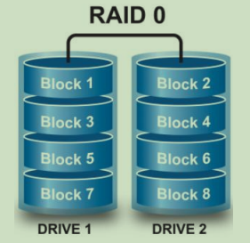

## RAID1：

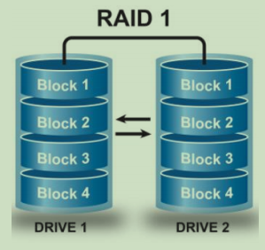

## RAID4：

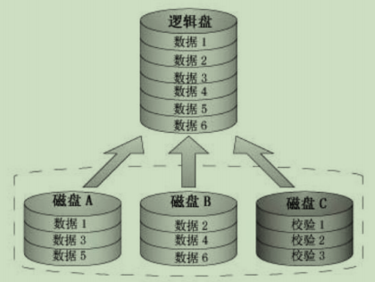

## RAID5：

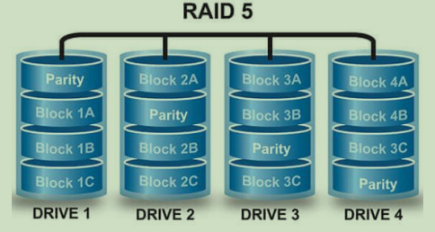

## RAID6：

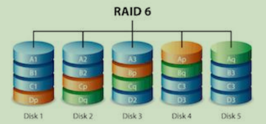

## RAID1+0:

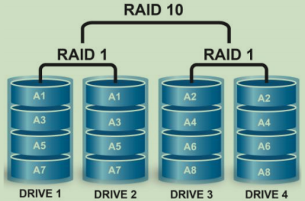

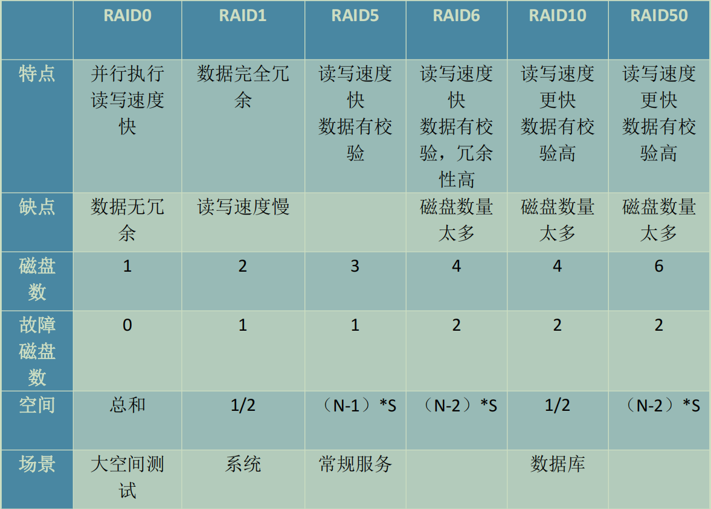

热备盘--出入空闲状态的备份盘

## 阵列卡介绍（raid 控制器）

    阵列卡就是用来实现 RAID 功能的板卡，通常是由 I/O 处理器、硬盘控制器、硬盘连接
    器和缓存等一系列零组件构成的。
    不同的 RAID 卡支持的 RAID 功能不同，例如支持 RAID 0、RAID 1、RAID 5、RAID 6、RAID
    10 等，RAID 卡的接口类型：IDE 接口、SCSI 接口、SATA 接口和 SAS 接口。
    缓存（Cache）是 RAID 卡与外部总线交换数据的场所，RAID 卡先将数据传送到缓存，
    再由缓存和外边数据总线交换数据。它是 RAID 卡电路板上的一块存储芯片，与硬盘盘片相
    比，具有极快的存取速度。
    缓存的大小与速度是直接关系到 RAID 卡的实际传输速度的重要因素，大缓存能够大幅
    度地提高数据命中率从而提高RAID卡整体性能。不同的RAID卡出厂时配置的内存容量不同，
    一般为几兆到数百兆容量不等。
    基于不同的架构，RAID 又可以分为:
    ● 软件 RAID
    ● 硬件 RAID
    ● 外置 RAID (External RAID)
    软件 RAID 很多情况下已经包含在系统之中，并成为其中一个功能，如 Windows、Netware
    及 Linux。软件 RAID 中的所有操作皆由中央处理器负责，所以系统资源的利用率会很高，从
    而使系统性能降低。软件 RAID 是不需要另外添加任何硬件设备，因为它是靠你的系统，主
    要是中央处理器的功能提供所有现成的资源。
    硬件 RAID 通常是一张 PCI 卡，你会看到在这卡上会有处理器及内存。因为这卡上的处
    理器已经可以提供一切 RAID 所需要的资源，所以不会占用系统资源，从而令系统的表现可
    以大大提升。硬件 RAID 可以连接内置硬盘、热插拔背板或外置存储设备。无论连接何种硬
    盘，控制权都是在 RAID 卡上，亦即是由系统所操控。在系统里，硬件 RAID PCI 卡通常都需
    要安驱动程序，否则系统会拒绝支持。
    外置式 RAID 也是属于硬件 RAID 的一种，区别在于 RAID 卡不会安装在服务器内，而是
    LINUX 运维架构师系列
    安装在外置的存储设备内。而这个外置的储存设备则会连接到系统的 SCSI 卡上。系统没有
    任何的 RAID 功能，因为它只有一张 SCSI 卡；所有的 RAID 功能将会移到这个外置存储里。
    好处是外置的存储往往可以连接更多的硬盘，不会受系统机箱的大小所影响。而一些高级的
    技术，如双机容错，是需要多个服务器外连到一个外置储存上，以提供容错能力。

## 软raid创建

### mdadm

    在 Linux 服务器中可通过 mdadm 工具来创建和维护软 RAID 的， mdadm 在创建和管理软 RAID 时非常方便，而且很灵活。

    常用参数：
    -C --create：创建一个软 RAID，后面需要标识 RAID 设备的名称。例如，/dev/md0，
    /dev/md1

    -A --assemble：加载一个已存在的 RAID，后面跟 RAID 以及设备的名称。

    -D --detail：输出指定 RAID 设备的详细信息。

    -S --stop：停止指定的 RAID 设备。

    -l --level：指定 RAID 配置级别，例如，设置“--level=5”则表示创建阵列的级别是 RAID5。

    -n --raid-devices：指定 RAID 中活动磁盘的数目。

    -r --remove：删除 RAID 中的某个磁盘

    -a --add：向 RAID 中添加磁盘

    -x 指定备用磁盘数量

    -s --scan：扫描配置文件/proc/mdstat 来搜索软 RAID 的配置信息，该参数不能单独使用，需要配合其它参数才能使用

### 创建 RAID 的配置文件

    RAID 的配置文件名为“mdadm.conf”，默认是不存在的，所以需要手工创建，该配置
    文件存在的主要作用是系统启动的时候能够自动加载软 RAID，同时也方便日后管理。

    “mdadm.conf”文件内容包括：由 DEVICE 选项指定用于软 RAID 的所有设备，和 ARRAY 选
    项所指定阵列的设备名、 RAID 级别、阵列中活动设备的数目以及设备的 UUID 号。

    生成RAID 配置文件操做如下：
    [root@localhost ~]# mdadm -D -s > /etc/mdadm.conf
    但是当前生成“mdadm.conf”文件的内容并不符合所规定的格式，所以也是不生效的，这
    时需要手工修改该文件内容为如下格式：
    [root@localhost ~]# vim /etc/mdadm.conf
    DEVICE /dev/sdb1 /dev/sdb2 /dev/sdb3 /dev/sdb4
    ARRAY /dev/md5 metadata=1.2 spares=1 name=localhost.localdomain:5
    UUID=307f1234:08c3d0ec:c31390d1:cbbecfc9 auto=yes

    如果没有创建 RAID 的配置文件，那么在每次系统启动后，需要手工加载软 RAID 才能使用，
    手工加载软 RAID 的命令是：
    [root@localhost ~]# mdadm --assemble /dev/md5 /dev/sdb1 /dev/sdb2 /dev/sdb3 /dev/sdb4

### 配置文件系统

跟之前的一样

### 维护RAID

    将/dev/sdb2 标记为出现故障的磁盘:
    [root@localhost ~]# mdadm /dev/md5 --fail /dev/sdb2
    mdadm: set /dev/sdb2 faulty in /dev/md5

    通过“/proc/mdstat”文件可查看到当前阵列的状态:
    [root@localhost ~]# cat /proc/mdstat
    Personalities : [raid6] [raid5] [raid4]
    md5 : active raid5 sdb3[4] sdb4[3] sdb2[1](F) sdb1[0]
    41928704 blocks super 1.2 level 5, 512k chunk, algorithm 2 [3/2] [U_U]
    [==>..................] recovery = 11.9% (2503664/20964352) finish=10.0min
    speed=30455K/sec
    unused devices: `<none>`
    如“sdc1[4](F)”，其中“[3/2]”的第一位数表示阵列所包含的设备数，第二位
    数表示活动的设备数，因为目前有一个故障设备，所以第二位数为 2；这时的阵列以降级模
    式运行，虽然该阵列仍然可用，但是不具有数据冗余；而“[U_U]”表示当前阵列可以正常
    使用的设备是/dev/sdb1 和/dev/sdb3，如果是设备“/dev/sdb1”出现故障时，则将变成[_UU]。
    重建完数据后，再次查看阵列状态时，就会发现当前的 RAID 设备又恢复了正常

    移除故障磁盘:
    [root@localhost ~]# mdadm /dev/md5 --remove /dev/sdb2
    mdadm: hot removed /dev/sdb2 from /dev/md5

    添加新硬盘:
    [root@localhost ~]# mdadm /dev/md5 --add /dev/sdb2
    mdadm: added /dev/sdb2

    停止RAID设备:
    #mdadm -S /dev/

    开启设备：
    [root@yufei ~]# mdadm -A -s /dev/md5

    删除raid里的所有硬盘：
    #mdadm --misc --zero-superblock /dev/sdc

### 删除RAID

    1.先umount组建好的raid:umount /dev/md0

    2.停止raid设备：mdadm -S /dev/md0

    3.此时如果忘了raid中的硬盘名称，要么重启系统，要么运行:mdadm -A -s /dev/md0 然后再用mdadm -D /dev/md0查看raid中包含哪几个硬盘。再次运行第二步停止命令:mdadm -S /dev/md0

    4.删除raid里的所有硬盘：mdadm --misc --zero-superblock /dev/sdc,

    mdadm --misc --zero-superblock /dev/sdd

    mdadm --misc --zero-superblock /dev/sde

    mdadm --misc --zero-superblock /dev/sdf

    有几块硬盘，就按格式删几次，注意最后面的硬盘名称。

    5.删除配置文件：rm -f /etc/mdadm.conf

    6.如果之前将raid相关信息写入了/etc/fstab配置文件中，还需vim /etc/fstab，将raid相关的内容删除即可。

## 硬raid创建

---

# 操作系统安全配置

## chattr

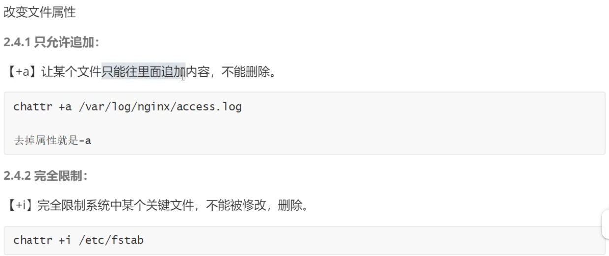

## lsattr 查看文件的锁定状态

    用法：
    lsattr 文件

## 修改/etc/pam.d/su 认证配置以启用 pam_wheel 认证

    启用 pam_wheel 认证以后，未加入到 wheel 组内的其他用户将无法使用 su 命令
    默认所有用户允许使用 su 命令，从而有机会反复尝试其他用户（root）的登陆密码，带来安全风险。可以使用 pam_wheel 认证模块，只允许极个别用户使用 su 命令进行切换

## chage 修改账号和密码的有效期限

    用法：chage -d 0 zhenzhen   #下次登录时，必须更改密码
        chage -M 30 zhenzhen #适用于已存在的用户，密码30天过期

## source 刷新当前的shell环境

    用法: source 文件

## sudo 命令——提升用户的执行权限

    sudo 机制的配置文件为/etc/sudoers。

## ==nmap==

    -p 指定扫描的端口

    -n 禁用反向解析（加快扫描）
    (s:scan)
    -sS：TCP SYN扫描，只向目标发送SYN数据包，如果收到SYN/ACK响应就认为目标正在监听，并立即断开连接；否则就认为目标端口未开放

    -sT:TCP连接扫描，完整的TCP扫描方式，如果成功连接就认为没有标端口正在监听；否则就认为目标端口未开放

    -sF：TCP FIN扫描，开放的端口会忽略，关闭的端口会回应RST(重置)数据包。这种方式扫描可间接检测防火墙的健壮性

    -sU：UDP扫描，探测目标主机提供哪些UDP服务，UDP扫描会比较慢

    -sP：ICMP扫描，快速判断目标主机是否存活，不做其他扫描

    -s0：跳过ping检测，当对方不响应ICMP请求时，使用这种方式可避免因无法ping通而放弃扫描

    -sV：扫描服务软件版本信息

常用操作：

    namp 127.0.0.1   //扫描常用的TCP端口
    namp -sU 127.0.0.1 //扫描常用的UDP端口
    namp -n -p 22 192.168.200.111 //检测主机是否提供SSHD服务
    namp -n -sV -p 22 192.168.200.111 //检测192.168.200.111是否提供SSHD服务
    namp -n -sP 192.168.159.0/24  //检测159网段有哪些主机存活
    namp -p 139,445 192.168.200.10-20  //检测主机是否开启文件共享服务

---

# 解析文件系统原理

    磁盘最小存储单元是扇区(sector) ，每个扇区拥有512字节
    文件最小存储单位是block：由多个扇区的空间组成
    block:存储的是数据——一个文件至少占用一个block
    inode:索引节点，元信息，i节点——一个文件必须占用一个inode，至少占用一个block

    inode不包含文件名。文件名是存储在目录的目录项中（文件名是给用户看的，系统看的是inode）

## stat 查看文件的inode信息

    [wsj@localhost ~]$ stat fb.txt
    文件："fb.txt"
    大小：7         	块：8          IO 块：4096   普通文件
    设备：fd00h/64768d	Inode：1440266     硬链接：1
    权限：(0666/-rw-rw-rw-)  Uid：(    0/    root)   Gid：(    0/    root)
    环境：unconfined_u:object_r:user_home_t:s0
    最近访问：images/2022-10-26 15:14:06.215148100 +0800
    最近更改：images/2022-10-26 15:14:03.102147984 +0800
    最近改动：images/2022-10-26 15:17:04.646154754 +0800
    创建时间：-

时间戳：(记英文,脚本要用)

| 别称  | 英文            | 中文翻译          | 何时修改                               | 查看命令 |
| ----- | --------------- | ----------------- | -------------------------------------- | -------- |
| Atime | (access)        | 访问时间          | 读取                                   | ls -lu   |
| Mtime | (Modify)        | 修改时间          | 写入、修改                             | ls -l    |
| Ctime | (change/create) | 改变时间/创建时间 | 修改文件名、写入、修改、改权限、做链接 | ls -lc   |

> inode号-inode信息-文件信息
> inode一般为128字节或256字节

文件系统访问文件的步骤:

    用户在目录中找到要访问的的文件名
    通过目录的数据找到文件名对应的inode
    通过inode号找到文件的元信息
    根据inode信息，找到存放数据的block，读出数据

inode的存储方式:

    直接:存储的是block块

    间接:记录的block的位置信息
        :每条记录着block号位置的信息占用4字节
        :系统默认的block的大小为4KB
        :1个inode号中有4kB用来记录block的位置信息
        :1个block还记录着对映的block信息

    目前一个文件的最大存储可以达到约4100GB

## 查看文件的inode号码

    ls -i 查看文件的inode号

> 文件名->目录项
> 元信息->inode
> 数据 -> block
> SuperBlock里面存储的文件系统所有inode,block的相关信息

    当一个用户在Linux中试图访问一个文件时,
    系统会先根据文件名去查找它的inode号，
    判断用户是否有访问权限。如果具有权限就会指向相对应的数据block，
    如果没有就返回permission denied(拒绝访问)

## 删除指定inode号所对应的文件

    格式:find ./ -inum inode号 -exec rm -i {}(有空格)\;
    find ./ -inum inode号 -delete

    在root目录下查找3天内修改的文件,并复制到/tmp下:
    find /root/ -mtime -3 -a -type f -exec cp {} /tmp\;

## 查看文件系统的inode与block的信息

    df -i 设备名 (文件系统挂挂载时查询,查询inode总数与已用数量)

    [wsj@localhost ~]$ df -i /dev/sda1
    文件系统        Inode 已用(I) 可用(I) 已用(I)% 挂载点
    /dev/sda1      524288     327  523961       1% /boot

    dumpe2fs -h 设备名(文件系统无需挂载)
    tune2fs -l 设备名(文件系统无需挂载)

    格式化时指定文件系统的inode个数与block大小
    mkfs.ext4 -N inode数 -b block大小(单位字节) 设备名

## 解决inode耗尽导致的磁盘故障mk

方法一：
[root@localhost ~]# mkdir /backup
[root@localhost ~]# mv /test/* /backup/
[root@localhost ~]# umount /test
[root@localhost ~]# mkfs.ext4(保证前后文件系统相同，不然用不了) -N 50000 /dev/sdb2 &> /dev/null(忽略过程)
[root@localhost ~]# mount /dev/sdb2 /test
[root@localhost ~]# mv /backup/* /test
mv: overwrite `/test/lost+found'? y
[root@localhost ~]# touch /test/hello.txt

## ln (link) 创建文件链接

### 硬链接（hard link）

格式：ln 源文件 目标文件
==硬链接指向的文件inode号，新生成的硬链接文件的inode号与源文件的inode号相同==，不可针对目录进行硬链接，必须在同一文件系统内。删除一个文件名，不影响另外一个的访问。

### 软连接（soft link）

格式：ln -s 源文件或目录 目标文件或目录
==软链接又称为符号链接，软链接指向的文件名，新生成的软链接文件的inode号与源文件不同==，目录可以生成软链接，软链接文件与源文件可以不在同一文件系统内，软链接文件的内容是源文件的路径，读取时系统会自动导向源文件路径，根据源文件找到文件内容，但当源文件移动或重命名时，软链接将报错。

ln -s 文件绝对路径  /usr/bin/文件名
可以直接用： 文件名 操作
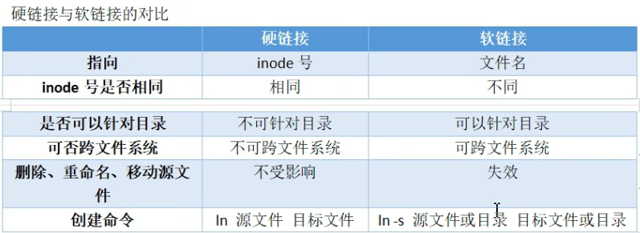

## 恢复误删除的文件

    针对 Linux 下的 EXT 文件系统（日志型文件系统），可用的恢复工具：
        debugfs
        ext3grep（ext3）
        extundelete
    extundelete 的使用：
    extundelete 支持恢复 ext3、ext4 等文件系统

    下载源码包，编译安装
        安装依赖包
         e2fsprogs-libs-1.41.12-18.el6.x86_64.rpm
         e2fsprogs-devel-1.41.12-18.el6.x86_64.rpm
        示例：
        [root@localhost ~]# yum -y install e2fsprogs-libs.x86_64 e2fsprogs-devel.x86_64
        编译安装
        [root@localhost ~]# tar xf extundelete-0.2.4.tar.bz2 -C /usr/src/
        [root@localhost ~]# cd /usr/src/extundelete-0.2.4/
        [root@localhost extundelete-0.2.4]# ./configure --prefix=/usr/local/extundelete && make &&
        make install
        [root@localhost extundelete-0.2.4]# cp /usr/local/extundelete/bin/extundelete /usr/bin/
        [root@localhost extundelete-0.2.4]# cd

    执行恢复操作
    常用选项：
     --inode 数值 指定从 inode 号开始往后查找
     --restore-file 文件名 恢复误删除的某个文件
     --restore-all 恢复全部已删除的文件
     --after dtime 在某个时间点之后删除的文件
     --before dtime 在某个时间点之前删除的文件
    date -d “日期及时间” +%s 算出某个时间点距离 1970 年 1 月 1 日过去了多少秒

    注意：在数据被误删除后，第一时间要做的就是卸载被误删除数据所在的分区，如果是
    根分区的数据遭到误删，就需要将系统进入单用户模式，并且将根分区以只读模式挂载。这
    样做的原因很简单，因为将文件删除后，仅仅是将文件的 inode 节点中的扇区指针清零，实
    际文件还储存在磁盘的 Block 上，如果磁盘继续以读写模式挂载，这些已删除的文件的数据
    块就可能被操作系统重新分配出去，在这些数据将被新的数据覆盖，那么这些数据就真的丢
    失了，恢复工具也无力回天。所以以只读模式挂载磁盘可以尽量降低数据库中数据被覆盖的
    风险，以提高恢复数据成功的比例。
    
    示例：恢复/test/install.log 文件
        模拟误删除
        [root@localhost ~]# cp /root/install.log /data
        [root@localhost ~]# sync
        [root@localhost ~]# ll -i /data
        total 72
        12 -rw-r--r-- 1 0 root 56380 Oct 20 23:53 install.log
        11 drwx------ 2 0 root 16384 Oct 20 23:52 lost+found
        [root@localhost ~]# rm -f /data/install.log
        卸载，查看已删除文件
        [root@localhost ~]# umount /dev/sdb1
        [root@localhost ~]# extundelete /dev/sdb1 --inode 2
        ----------------部分忽略---------------- File name | Inode number | Deleted status
        . 2
        .. 2
        lost+found 11
        install.log 12 Deleted
        恢复 install.log 文件
        [root@localhost ~]# extundelete --restore-file install.log /dev/sdb1
        NOTICE: Extended attributes are not restored. Loading filesystem metadata ... 9 groups loaded. Loading journal descriptors ... 18 descriptors loaded. Successfully restored file install.log
        [root@localhost ~]# ls RECOVERED_FILES/
        install.log
        [root@localhost ~]# mount /dev/sdb1 /data
        [root@localhost ~]# mv RECOVERED_FILES/install.log /data
        [root@localhost ~]# ll -i /data
        total 72
        12 -rw-r--r-- 1 0 root 56380 Oct 20 23:54 install.log
        11 drwx------ 2 0 root 16384 Oct 20 23:52 lost+found

## ==系统日志详解==

    （1）内核及系统日志
        内核及系统日志：这种日志数据由系统服务 rsyslog 同一管理，根据其主配置文件
        LINUX 运维架构师系列
        /etc/rsyslog.conf 中的设置决定将内核消息及各种系统程序消息记录到什么位置。系统中大部
        分的程序会把自己的日志文件交由 rsyslog 管理，因而这些应用程序使用的日志记录格式都
        很相似。
        /etc/rsyslog.conf 配置文件中，常见的配置格式及其含义：
         “.”：比后面等级要高（包含该等级）的都记录。例如：“*.info”  “.=”：只记录该等级。例如：“.=debug”  “!”：除了该等级都记录。例如：“!info”  “-”：当有记录信息需要记录时，先存到缓存中，到一定大小时一次性写入，以减少对
        磁盘读写性能的占用。例如：“-/var/log/maillog”
    （2）用户日志
        用户日志：用于记录 Linux 系统用户登录及退出系统的相关信息，包括用户名、登录的
        终端、登录时间、来源主机、正在使用的进程操作等。
    （3）程序日志
        程序日志：有些应用程序会选择由自己独立管理一份日志文件，而不是交给 rsyslog 服
        务管理，用于记录本程序运行过程中的各种事件信息。由于这些程序只负责管理自己的日志
        文件，因此不同程序所使用的日志记录格式也会存在较大的差异。

    日志文件的位置：

    Linux 系统本身和大部分服务器程序的日志文件默认放在/var/log/下。一部分程序共用
        一个日志文件，一部分程序使用单个日志文件。而有些大型服务器程序日志由于日志文件不
        止一个，所以会在/var/log/目录中建立相应的子目录来存放日志文件，这样既保证了日志文
        件目录的结构清晰，又可以快速定位日志文件。有一部分日志文件只有 root 用户才有权限
        读取，这保证了相关日志信息的安全性。

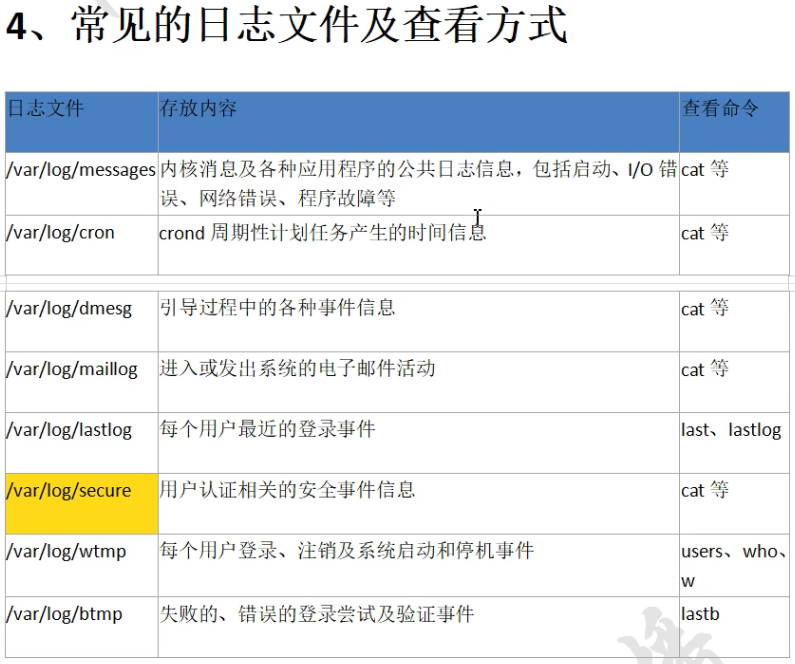

==必背：日志消息的级别==
在 Linux 内核中，根据日志消息的重要程度不同，将其分为不同的有限级别（数字等级越小，优先级越高，消息越重要）
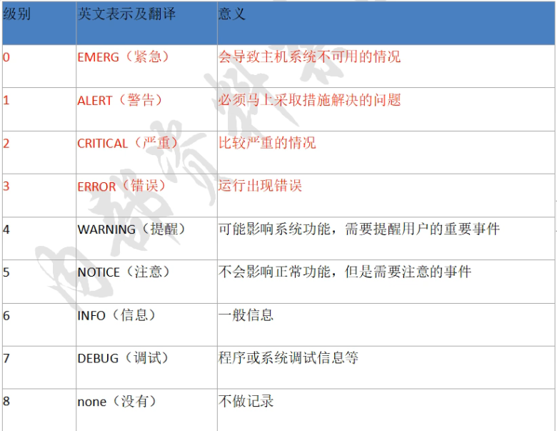

日志文件分析：

    （1）内核及大多数系统消息
    内核及系统日志主要由默认安装的 rsyslog 软件包提供，rsyslog 服务所使用的配置文件为
    /etc/rsyslog.conf，通过查看配置文件内容可以了解到系统默认的日志位置。
        [root@localhost ~]# grep -Ev "^$|^#" /etc/rsyslog.conf
        $ModLoad imuxsock # provides support for local system logging (e.g. via logger command)
        $ModLoad imjournal # provides access to the systemd journal
        $WorkDirectory /var/lib/rsyslog
        $ActionFileDefaultTemplate RSYSLOG_TraditionalFileFormat
        $IncludeConfig /etc/rsyslog.d/*.conf
        $OmitLocalLogging on
        $IMJournalStateFile imjournal.state
        *.info;mail.none;authpriv.none;cron.none /var/log/messages
        authpriv.* /var/log/secure
        mail.* -/var/log/maillog
        cron.* /var/log/cron
        *.emerg :omusrmsg:* uucp,news.crit /var/log/spooler
        local7.* /var/log/boot.log
    内核及大多数系统消息被记录到公共日志文件/var/log/messages 中，而其他一些程序消
    息被记录到各自独的日志文件中，此外日志消息还能够记录到特定的存储设备中，或者直接
    发送给指定用户查看。
        [root@localhost ~]# tail -f /var/log/messages
        Jan 6 21:01:38 localhost chronyd[767]: Source 108.59.2.24 replaced with 193.228.143.22
        Jan 6 21:10:01 localhost systemd: Started Session 36 of user root. Jan 6 21:10:01 localhost systemd: Starting Session 36 of user root. Jan 6 21:15:41 localhost dbus[690]: [system] Activating service
        name='org.freedesktop.problems' (using servicehelper)
        Jan 6 21:15:41 localhost dbus[690]: [system] Successfully activated service

    'org.freedesktop.problems' 格式解释：
     时间标签：消息发出的日期和时间
     主机名：生成消息的计算机的名称
     子系统名称：发出消息的应用程序的名称
     消息：消息级别和具体内容
    rsyslog 日志服务是一个常会被攻击的目标，破坏了它将使运维人员很难发现入侵及入侵
    的痕迹，因此要特别注意监控其守护进程及配置文件。

    （2）用户日志
     存放位置：/var/log/wtmp、/var/log/btmp、/var/log/lastlog
     查询命令：users、who、w、last、lastlog、lastb 等

## users 命令：只是简单的输出当前登录的用户名，每一个显示的用户名对应一个会话。

    [root@localhost ~]# users
    root root

## who 命令：用于报告当前登录到系统中的每个用户的信息。默认输出包括用户名、终端类型、登录日期及远程主机

    [root@localhost ~]# who
        zhangsan tty3 2020-08-20 11:37
        root pts/1 2020-08-20 11:45 (192.168.200.2)
        w 命令：用于显示当前操作系统中的每个用户及其远程所运行的进程信息
        [root@localhost ~]# w
        15:11:22 up 3:37, 2 users, load average: 0.00, 0.01, 0.05
        USER TTY FROM LOGIN@ IDLE JCPU PCPU WHAT
        zhangsan tty3 11:37 3:33m 0.09s 0.09s -bash
        root pts/1 192.168.200.2 11:45 2.00s 0.81s 0.00s w
        [root@localhost ~]# uptime
        15:11:36 up 3:37, 2 users, load average: 0.00, 0.01, 0.05

## last 命令：用于查询成功登录到系统的用户记录，最近的登录情况在最前面。

    通过 last命令可以及时掌握 Linux 主机的登录情况，若发现未经授权的用户登陆过，则表示当前主机
    可能已被入侵。
     -a：把从何处登录系统的主机名称或 IP 地址，显示在最后一行
     -d：将 IP 地址转换成主机名称
     -f [记录文件]：指定记录文件
     -R：不显示登入系统的主机名称或 IP 地址
     -x：显示系统关闭，重新开机，以及执行等级的改变等
     -n：n 代表数字，表示最近 n 次登录的记录
    [root@localhost ~]# last
    root pts/1 192.168.200.2 Thu Aug 20 11:45 still logged in
    zhangsan tty3 Thu Aug 20 11:37 still logged in
    zhangsan tty3 Thu Aug 20 11:36 - 11:37 (00:00)
    root tty3 Thu Aug 20 11:35 - 11:36 (00:00)
    root pts/0 192.168.200.2 Thu Aug 20 11:35 - 15:10 (03:35)
    [root@localhost ~]# last -a
    [root@localhost ~]# last -d
    LINUX 运维架构师系列
    [root@localhost ~]# last -3

## lastlog 命令：用于显示系统中所有用户最近一次登录信息

    [root@localhost ~]# lastlog
    用户名 端口 来自 最后登陆时间
    root pts/1 192.168.200.2 四 8 月 20 11:45:43 +0800 2020
    bin**从未登录过** daemon **从未登录过**
    adm **从未登录过**

## lastb 命令：用于显示用户错误的登录列表，此指令可以发现系统的登录异常。

    如登录的用户名错误，密码不正确等情况都会记录在案，登录失败的情况属于安全事件，因此消失
    可能有人在尝试破解密码。除了使用lastb命令以外，可以直接从安全日志文件/var/log/secure
    中获得相关信息。
    [root@localhost ~]# lastb
    root tty1 Thu Aug 20 11:35 - 11:35 (00:00)
    root tty1 Thu Aug 20 10:44 - 10:44 (00:00)
    lisi pts/0 Thu Aug 20 10:34 - 10:34 (00:00)
    lisi pts/0 Thu Aug 20 10:23 - 10:23 (00:00)
    root :0 :0 Fri May 25 00:19 - 00:19 (00:00)
    安全日志
    [root@localhost ~]# tail -f /var/log/secure

    （3）程序日志
    在 Linux 操作系统中，还有一部分应用程序没有使用 rsyslog 服务来管理日志，而是由程
    序自己维护日志记录。例如：httpd 网站服务程序使用两个日志文件 access_log 和 error_log
    分别记录客户访问事件和错误事件，不同应用程序的日志记录格式差别较大，没有严格使用
    统一的记录格式。

7、日志文件分析注意事项

    总的来说，作为一名合格的系统管理人员，应该提高警惕，随时注意各种可疑的状况，
    定期并随机的检查各种系统日志文件，包括一般信息日志、网络连接日志、文件传输日志及
    用户登录日志记录等。在检查这些日志时，要注意是否有不合常理的时间或操作记录。
    例如出现以下一些现象就应该多加注意：
     用户在非常规的时间登录，或者用户登录系统的 IP 地址和以往不一样的
     用户登录失败的日志记录，尤其是那些一再连续尝试进入失败的日志记录
     非法使用或不正当使用超级用户权限
    LINUX 运维架构师系列
     无故或者非法重新启动各项网络服务的记录
     不正常的日志记录，如日志残缺不全，或者是诸如 wtmp 这样的日志文件无故缺少了中
    间的记录文件
    注意：需要提醒运维人员的是，日志并不是完全可靠的，高明的黑客在入侵系统后经常
    会打扫现场，所以管理人员需要运用综上的所有知识，全面、综合的进行审查和检测。
    日志管理：
     针对日志定期备份、异地备份（保留 1~3 个月的日志记录）
     针对日志定期切割（0 0 * * * mv /var/log/messages /var/log/messages-$(date -d "-1 days" +%F)）
     针对日志的权限要严格（为了防止敏感信息泄露）
     针对日志做集中管理

8、对于日志文件的保护：

    chattr +a 日志文件，a 选项为 append（追加）only，即给日志文件加上 a 权限后，将
        只可以追加，不可以删除和修改之前的内容。
            [root@localhost ~]# cp /var/log/secure ./seccure.txt
            [root@localhost ~]# chattr +a /var/log/secure
            [root@localhost ~]# lsattr /var/log/secure
            -----a---------- /var/log/secure
            [root@localhost ~]# rm -rf /var/log/secure
            rm: 无法删除"/var/log/secure": 不允许的操作
            root 用户在 vi 编辑器的命令模式按 dd 删除了两行内容后进行 wq！强制保存退出，也
            会报错。
            chattr +a -R 递归式增加 a 权限
            [root@localhost ~]# lsattr /var/log/
            ---------------- /var/log/tallylog
            ---------------- /var/log/grubby_prune_debug
            ---------------- /var/log/lastlog
            ---------------- /var/log/wtmp
            ---------------- /var/log/btmp
            ---------------- /var/log/samba
            ---------------- /var/log/ppp
            [root@localhost ~]# chatrr +a -R /var/log/
            [root@localhost ~]# lsattr -R /var/log/
            -----a---------- /var/log/tallylog
            -----a---------- /var/log/grubby_prune_debug
            -----a---------- /var/log/lastlog
            -----a---------- /var/log/wtmp
            -----a---------- /var/log/btmp
            -----a---------- /var/log/samba
            /var/log/samba: -----a---------- /var/log/samba/old
---
