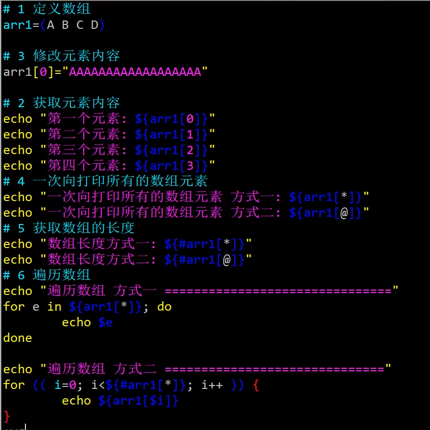

# shell 编程
## 简介

查看shell解释器：

    [wsj@localhost ~]$ cat /etc/shells
    /bin/sh
    /bin/bash
    /sbin/nologin
    /usr/bin/sh
    /usr/bin/bash
    /usr/sbin/nologin
    /bin/tcsh
    /bin/csh
    linux 默认使用 /bin/bash
    IBM AIX(Unix) 默认使用 /bin/ksh

    查看当前用户的默认shell
    [root@localhost ~]# echo $SHELL
    /bin/bash

    切换shell解释器
    [root@localhost ~]# /bin/csh

    切换到子shell
    [root@localhost ~]# bash	#/bin/bash
## 编写Shell脚本的格式：

        1、#!/bin/bash 表示脚本通过以/bin/bash程序来编写
        2、# 表示注释信息，例如：对编写的脚本作用进行解释，每写一段脚本之前都应该用“#”来注释以下命令执行的结果
        3、定义脚本中的变量
        4、定义脚本中的函数
        5、脚本执行语句（判断、循环、选择等语句）
        6、利用 echo 定义输出一些让人更容易看懂得信息（可以是中文也可以是英文）

        脚本后缀名为：
            .sh 表示编写程序为shell
            .pl 表示编写程序为perl
            .py 表示编写程序为python

    vim hello.sh
        #!/bin/bash   (必须写)
        echo "hello word!"
    Esc 
    :wq

    ll /bin/ |grep sh
        会有很多目录，关于解释器
            bin目录下，sh目录是bash的快捷方式

    执行文件:
        way1:
            /bin/bash  hello.sh
            /bin/sh    hello.sh

        way2:
            bash hello.sh
                环境变量里面包含有/bin
                [wsj@localhost 1]$ echo $PATH
                /usr/local/bin:/usr/bin:/usr/local/sbin:/usr/sbin:/home/wsj/.local/bin:/home/wsj/bin
                所以/bin/可以省去
                直接 # bash hello.sh 
            sh   hello.sh

        way3：
            ./hello.sh
                因为权限不够，需要添加r和x的权限

        way4：source hello.sh
        way5: .（空格）hello.sh

# shell 变量 
## 回顾区：

    [wsj@localhost 1]$ ./shell.sh 2 4
    =========== ==== =========
    hello shell!
    第一个参数：2
    第二个参数:4
    6
    文件的名称：./shell.sh
    参数的个数：2
    所有的参数way1：2 4
    $*获取的元素: 2 4
    所有的参数way2：2 4
    $@获取的元素: 2
    $@获取的元素: 4

更改变量赋值：

    #a1="nnn"
    #ech0 $a1
    #a1="bbb"
    #echo $a1
    #echo "i have ${a1}a2a3"
删除变量：

    #unset 变量名

只读变量：  

    #readonly 变量名
    只能读不可以修改

## 自定义变量：

    自定义变量是由用户自己定义的变量，只在用户自己的Shell环境中生效，又称本地变量。
    定义格式：变量名=变量值 		#等号两边没有空格
    变量名必须使用英文字母或是下划线开头，变量名内不允许出现特殊字符，并且区分字母大小写。

    使用echo可以查看定义的变量值，$后面是一个变量名或者${变量名}

    例如：
    [root@localhost ~]# product=cloud
    [root@localhost ~]# version=2.0
    [root@localhost ~]# echo $product
    cloud
    [root@localhost ~]# echo $version
    2.0
    [root@localhost ~]# echo $product$version
    cloud2.0
    [root@localhost ~]# echo $product $version
    cloud 2.0
    [root@localhost ~]# echo $product3.0
    .0
    [root@localhost ~]# echo $product"3.0"
    cloud3.0
    [root@localhost ~]# echo "$product"3.0
    cloud3.0
    [root@localhost ~]# echo $product'3.0'
    cloud3.0
    [root@localhost ~]# echo ${product}3.0
    cloud3.0
    [root@localhost ~]# echo $product\3.0
    cloud3.0

## 特殊符号

    双引号（“”）：可以引用变量，有空格的值。
    [root@localhost ~]# echo "$product $version"
    cloud 2.0

    单引号（‘’）：引号内的内容被视为一个完整的字符串，不能引用变量。
    [root@localhost ~]# echo '$product $version'
    $product $version

    反撇号（``）：引号内的执行结果作为变量名的变量值，引用命令执行结果。反撇号在一行命中不能实现嵌套命令替换操作，所以使用$（）
    [root@localhost ~]# which mkdir
    /usr/bin/mkdir
    [root@localhost ~]# rpm -qf /usr/bin/mkdir
    coreutils-8.22-21.el7.x86_64
    [root@localhost ~]# 
    [root@localhost ~]# rpm -qf `which mkdir`
    coreutils-8.22-21.el7.x86_64
    [root@localhost ~]# rpm -qf $(which mkdir)
    coreutils-8.22-21.el7.x86_64

## read命令

    用来提示用户输入信息，从而实现简单的交互变量设置。将用户输入的信息作为变量值，用户的输入以空格作为分隔符，将读入的各个字段挨个赋值给指定的变量，多余的赋值给最后一个变量。

    格式：
    -p 设置提示信息

    [root@localhost ~]# read -p "please input your name and age: " name age
    please input your name and age: zhangsan 20
    [root@localhost ~]# echo $name
    zhangsan
    [root@localhost ~]# echo $age
    20

## 设置变量生效范围

    新定义的变量只能在当前Shell环境中生效。又称局部变量或者本地变量

    格式:
     export 命令：可以将局部变量发布到全局。

    [root@localhost ~]# echo $product #查看当前shell中变量的值
    cloud
    [root@localhost ~]# bash #切换到新的子Shell环境
    [root@localhost ~]# echo $product #查看变量 （可以看到查不到变量值）

    [root@localhost ~]# exit #退出Shell环境
    exit
    [root@localhost ~]# export product #使用export命令将变量发布到全局 
    [root@localhost ~]# bash #进入到一个新Shell环境
    [root@localhost ~]# echo $product #查看变量值
    cloud

    或者可以在定义变量同时声明
    [root@localhost ~]# export key=vlaue
    注意：export全局发布，只能向下面的子Shell发布，不能向上父Shell发布。

## 数值变量的运算

    使用expr命令进行简单的整数运算，不支持小数运算。

    [root@localhost ~]# X=12
    [root@localhost ~]# Y=22

    way1:
        [root@localhost ~]# expr $X + $Y   加
        34
        [root@localhost ~]# expr $X - $Y   减
        -10
        [root@localhost ~]# expr $X \* $Y  乘
        264
        [root@localhost ~]# expr $X / $Y   除
        0
        [root@localhost ~]# expr $X % $Y  求余
        12

    way2:
        [wsj@localhost 1]$ echo $((x - y))
        -11
        [wsj@localhost 1]$ echo $((x + y))
        33
        [wsj@localhost 1]$ echo $((x * y))
        242
        [wsj@localhost 1]$ echo $((x / y))
        0
        [wsj@localhost 1]$ echo $((x % y))
        11

    way3：
        [wsj@localhost 1]$ echo $[x - y]
        -11
        [wsj@localhost 1]$ echo $[x + y]
        33
        [wsj@localhost 1]$ echo $[x * y]
        242
        [wsj@localhost 1]$ echo $[x / y]
        0
        [wsj@localhost 1]$ echo $[x % y]
        11

    way4:
    [root@localhost ~]# let a=1+2

## 环境变量

    env 命令查看环境变量
    环境变量是指，出于运行需要而由Linux系统提前创建的一类变量，主要用于设置用户的工作环境。

    /etc/profile ： 环境变量的全局配置文件，文件中定义的变量作用于所有用户。

    .bash_profile ：每个用户自己的独立配置文件。

    常用的环境变量：
    HOSTNAME=localhost.localdomain #定义主机名
    PWD=/root #定义当前所在位置
    USER=root #定义登录用户
    ……

    set,env和export这三个命令的区别:

    env 显示用户的环境变量；
    set 显示当前shell的自定义变量，包括用户的环境变量，按变量名称排序；
    export 显示当前导出成用户变量的shell变量，并显示变量的属性(是否只读)，按变量名称排序；
    declare 同set 一样，显示当前shell的定义的变量，包括用户的环境变量；
    unset 取消变量

## 位置变量

    作用：为脚本传递参数
    位置变量也称为位置参数，使用$1、$2、……、$9、${10}...表示
    [root@localhost ~]# vim adder2num.sh
    #!/bin/bash
    SUM=$(expr $1 + $2)
    echo "$1 + $2 = $SUM"
    [root@localhost ~]# ./adder2num.sh 12 34
    12 + 34 = 46

    [root@localhost ~]# vim test.sh 
    #!/bin/bash
    echo "当前的位置变量是：$1"
    echo "当前的位置变量是：$2"
    echo "当前的位置变量是：$3"
    echo "当前的位置变量是：$4"

    [root@localhost ~]# ./test.sh a b c d 
    当前的位置变量是：a
    当前的位置变量是：b
    当前的位置变量是：c
    当前的位置变量是：d

## 预定义变量

    预定义变量是Bash程序预先定义好的一类特殊变量，用户只能使用预定义变量，而不能创建新的预定义变量，也不能直接为预定义变量赋值。
    $*、$@	表示所有位置参数的内容（$*把所有参数视为整体，$@单个参数的组合）
    $0    		表示当前执行的脚本或程序的名称
    $#		表示命令行中位置参数的个数
    $?		表示前一条命令执行后的返回状态，返回值为0表示执行正确，非0值为执行错误。
    [root@localhost ~]# vim test.sh
    #!/bin/bash
    echo "当前的位置变量是：$1"
    echo "当前的位置变量是：$2"
    echo "当前的位置变量是：$3"
    echo "当前的位置变量是：$4"
    echo $#

    [root@localhost ~]# ./test.sh a b c d 
    当前的位置变量是：a
    当前的位置变量是：b
    当前的位置变量是：c
    当前的位置变量是：d
    4 	#统计出运用了几个位置变量参数

    $* 表示所有位置参数的内容
    [root@localhost ~]# vim test.sh
    #!/bin/bash
    echo "当前的位置变量是：$1"
    echo "当前的位置变量是：$2"
    echo "当前的位置变量是：$3"
    echo "当前的位置变量是：$4"
    echo $*

    [root@localhost ~]# ./test.sh a b c d 
    当前的位置变量是：a
    当前的位置变量是：b
    当前的位置变量是：c
    当前的位置变量是：d
    a b c d 	#显示出位置变量的内容（值）

    $? 表示前一条命令执行后的返回状态，返回值为0表示执行正确，非0值为执行错误。
    [root@localhost ~]# cat /etc/passwd
    [root@localhost ~]# echo $?

    0 #返回的值为0，表示前面执行的命令cat /etc/passwd是正确的
    [root@localhost ~]# cat /etc/password
    [root@localhost ~]# echo $?
    1 #返回的值为1，即非0值，表示前面执行的命令cat /etc/password是错误的

    $0 表示当前执行的脚本或程序的名称
    [root@localhost ~]# vim test.sh
    #!/bin/bash
    echo "当前的位置变量是：$1"
    echo "当前的位置变量是：$2"
    echo "当前的位置变量是：$3"
    echo "当前的位置变量是：$4"
    echo $0
    [root@localhost ~]# ./test.sh a b c d 
    当前的位置变量是：a
    当前的位置变量是：b
    当前的位置变量是：c
    当前的位置变量是：d
    ./test.sh 显示执行的脚本或是程序
    $@ 以"参数1" "参数2" ... 形式保存所有参数
    $$ 本程序的(进程ID号)PID

# 条件测试
    -d ：测试是否为目录 directory
    -f ：测试是否为文件 file
    -e ：测试目录或者文件是否存在 exist
    -r ：测试当前用户是否有读取权限 read
    -w ：测试当前用户是否有写入权限 write
    -x ：测试文件是否有执行权限 excute
# 整数值比较
    根据给定的两个整数值，判断第一个数是否大于，小于，等于第二个数
    -eq ： 表示等于 (=) Equal
    -ne ： 表示不等于 (!=) Not Equal
    -gt ： 表示大于 (>) Greatar Than
    -lt ： 表示小于 (<) Lesser Than 
    -le ：表示小于或等于 (<=) 只需要满足其中的任意一个条件 Lesser or Equal
    -ge ： 表示大于或等于 （>=） 只需要满足其中的任意一个条件 Greater or Equa

#  [test](https://blog.csdn.net/weixin_43936969/article/details/104314340?ops_request_misc=&request_id=&biz_id=102&utm_term=linux%E4%B8%ADshell%E8%AF%AD%E8%A8%80if%E8%AF%AD%E5%8F%A5%E4%B8%ADtest%20&utm_medium=distribute.pc_search_result.none-task-blog-2~all~sobaiduweb~default-0-104314340.142^v52^new_blog_pos_by_title,201^v3^control_2&spm=1018.2226.3001.4187)
## if 语句
    if [  ] ;then   或者if test .. ; then
        ...
    elif [ ] ;then 
    ...
    else
    ...
    fi
    # 当不用else elif 时，可以不打   ；符号
# for 语句
    for 变量 in ...;do

        ...
    done

# while 语句
    有限循环：
        while ...;do 
            ...
        done

    无限循环：
        while true;do 
            sleep 1
            date
        done

# break 语句 （跳出整个循环）
    #!/bin/bash
    i=0
    while true ;do
        sleep 1
        echo $i `date +"%Y-%m-%d  %H:%M:%S" `
        i=$[ i + 1 ]
        if [ $i -eq 10 ];then
            break
        fi
    done

# continue 语句 （跳出当前循环）
    #!/bin/bash

            for i in {1..30};do

            if [ $[ i % 3 ] -eq 0 ] ; then
            continue
    fi        
            echo $i
    done        

# 函数

# 数组

# 加载其他文件变量

---
---
# 脚本
## 脚本应用思路

    1. 确定命令操作（设计并执行任务）
    2. 编写Shell脚本（组织任务过程）
    3. 设置计划任务（控制时间，调用任务脚本）

## 实验一：

    数据库备份客户端是：A，192.168.200.111/24 
    数据库服务器是：B，192.168.200.112/24
    数据库服务器：MySQL数据库提供的监听端口：3306

## 备份要求：

    对MySQL服务器中的studydb、coursedb库进行远程备份，每天凌晨2:30执行，每个库备份为独立的.sql文件，然后压缩为.tar.gz (.tgz),文件名中嵌入执行备份时的日期和时刻。

    注：在A/B机器上配置本地yum仓库（务必把光盘镜像文件挂载到/media/cdrom下）
    yum命令：便于自动解决软件包的依赖关系

## 挂载光盘镜像文件：
    [root@localhost ~]# mount | grep "sr0" 查询光盘是否挂载
    [root@localhost ~]# umount /dev/sr0 卸载光盘 /dev/sr0 = /dev/cdrom

    [root@localhost ~]# mkdir /media/cdrom 准备空目录作为挂载点
    [root@localhost ~]# mount /dev/sr0 /media/cdrom 挂载光盘
    [root@localhost ~]# ls -l /media/cdrom/Packages 查看rpm软件包列表

## 修改yum仓库配置文件：
    [root@localhost ~]# cd /etc/yum.repos.d/
    [root@localhost yum.repos.d]# mkdir backup
    [root@localhost yum.repos.d]# mv *.repo backup/ 
    [root@localhost yum.repos.d]# mv backup/CentOS-Media.repo ./
    [root@localhost yum.repos.d]# vim CentOS-Media.repo
    enabled=0 改为 enabled=1

    或者
    [root@localhost yum.repos.d]# vim local.repo 
    [c7-media]
    name=CentOS-Media
    baseurl=file:///media/cdrom
    gpgcheck=1
    enabled=1
    gpgkey=file:///etc/pki/rpm-gpg/RPM-GPG-KEY-CentOS-7

    [root@localhost ~]# yum clean all && yum makecache
    [root@localhost ~]# yum clean all #清楚yum仓库缓存
    [root@localhost ~]# yum makecache #重建yum仓库缓存
    [root@localhost ~]# yum list #显示yum仓库软件列表

## 数据库服务器：
    [root@localhost ~]# yum -y install mariadb-server mariadb mariadb-devel
    [root@localhost ~]# systemctl start mariadb
    [root@localhost ~]# netstat -lnpt | grep :3306
    tcp 0 0 0.0.0.0:3306 0.0.0.0:* LISTEN 70645/mysqld 

## 数据库备份客户端
    [root@localhost ~]# yum -y install mariadb mariadb-devel

    步骤一：（确定命令操作（设计并执行任务））
    在B上为A设置一个远程专用的备份账户：operator
    [root@localhost ~]# mysql 
    MariaDB [(none)]> create database studydb;
    Query OK, 1 row affected (0.00 sec)

    MariaDB [(none)]> create database coursedb;
    Query OK, 1 row affected (0.00 sec)

    MariaDB [(none)]> grant select,lock tables on studydb.* to 'operator'@'192.168.200.111' identified by 'pwd123';
    Query OK, 0 rows affected (0.00 sec)

    MariaDB [(none)]> grant select,lock tables on coursedb.* to 'operator'@'192.168.200.111' identified by 'pwd123';
    Query OK, 0 rows affected (0.00 sec)

    在A上的测试：
    mysqldump -uoperator -ppwd123 -h 192.168.200.112 --databases studydb coursedb > test.sql

    步骤二：（编写Shell脚本（组织任务过程））
    [root@localhost ~]# vim /opt/qnzx_dbbak.sh
    #!/bin/bash
    #这是一个MySQL数据库逻辑备份脚本
    #1、定义数据库链接、目标库信息
    MY_USER="operator"
    MY_PASS="pwd123"
    MY_HOST="192.168.200.112"
    MY_CONN="-u $MY_USER -p$MY_PASS -h $MY_HOST"
    MY_DB1="studydb"
    MY_DB2="coursedb"

    #2、定义备份目录、工具、时间、文件名主体
    [ -d /opt/qnzx_dbbak/ ] || mkdir -p /opt/qnzx_dbbak/
    BF_DIR="/opt/qnzx_dbbak/"
    BF_CMD="/usr/bin/mysqldump"
    BF_TIME=$(date +%Y%m%d-%H%M)
    NAME_1="$MY_DB1-$BF_TIME"
    NAME_2="$MY_DB2-$BF_TIME"

    #3、先导出为.sql脚本，然后再进行压缩（打包后删除原文件）
    cd $BF_DIR
    $BF_CMD $MY_CONN --databases $MY_DB1 > $NAME_1.sql
    $BF_CMD $MY_CONN --databases $MY_DB2 > $NAME_2.sql
    /bin/tar zcf $NAME_1.tar.gz $NAME_1.sql --remove &> /dev/null
    /bin/tar zcf $NAME_2.tar.gz $NAME_2.sql --remove &> /dev/null

    [root@localhost ~]# chmod +x /opt/qnzx_dbbak.sh 
    [root@localhost ~]# /opt/qnzx_dbbak.sh 
    [root@localhost ~]# ls /opt/qnzx_dbbak/*.gz
    coursedb-20181222-0911.tar.gz studydb-20181222-0911.tar.gz
    coursedb-20181222-0912.tar.gz studydb-20181222-0912.tar.gz

    3、设置计划任务（设置计划任务（控制时间，调用任务脚本））
    [root@localhost ~]# crontab -e
    30 2 * * * /opt/qnzx_dbbak.sh
    [root@localhost ~]# systemctl restart crond
    [root@localhost ~]# date
    2018年 12月 23日 星期日 02:29:59 CST
    [root@localhost ~]# date
    2018年 12月 23日 星期日 02:30:00 CST
    [root@localhost ~]# ls /opt/qnzx_dbbak
    coursedb-20181222-0911.tar.gz studydb-20181222-0911.tar.gz
    coursedb-20181222-0912.tar.gz studydb-20181222-0912.tar.gz
    coursedb-20181223-0230.tar.gz studydb-20181223-0230.tar.gz

## MySQL备份恢复脚本
    #!/bin/bash
    #restore_db
    ls /opt/qnzx_dbbak |column -t > /opt/db_list
    read -p "请指定要恢复数据库的备份日期(YYYYMMDD): " dt
    awk -F- '{print $2}' /opt/db_list > /opt/dt.txt
    if [ $dt -ge 20121018 ] && [ $dt -le 20151231 ]; then
    grep -F "$dt" /opt/dt.txt &> /dev/null
    if [ $? -ne 0 ]; then
    echo "很抱歉,您恢复数据库的备份日期不再备份日期范围内"
    else echo "搜索到的可恢复数据库如下: "
    awk -F- /$dt/'{print NR,$1}' /opt/db_list
    read -p "请选择您要恢复数据库的编号: " nb
    nm=$(awk -F- /$dt/'{print NR,$1}' /opt/db_list|awk /$nb/'{print $2}')
    echo "现在开始恢复数据库:$nm到$dt"
    cd /opt/qnzx_dbbak
    onm=$(ls |grep "$nm-$dt")
    mkdir aaa
    tar zxf $onm -C ./aaa
    mysql -uoperator -ppwd123 -h 192.168.3.196 $nm < ./aaa/*
    echo "$nm已经恢复到$dt"
    rm -rf ./aaa
    fi
    else

    echo "很抱歉,您恢复数据库的备份日期不再备份日期范围内"
    fi

## 课后实验
    #!/bin/bash
    #This is a test script!!

    #统计进程数！
    echo -n "Running Processes:"
    ps aux |wc -l

    #统计当前登录用户！！
    echo -n "Login Users:"
    who | wc -l

    #当前根目录使用情况(%)！！！
    echo -n "Usage of / Filesystem:"
    df -Th |grep "/$" |awk '{print $6}'

    #!/bin/bash
    #This is a status script!!

    echo "当前$1服务状态为："
    service $1 status ( stop , start )

## 练习案例
1、编写自动安装dhcp服务脚本
2、编写自动安装DNS服务脚本
3、通过脚本采集CPU、内存、磁盘等硬件统计信息

# 自动挂载脚本：

      centos8：

        #!/bin/bash
        #自动挂载脚本

        ##/bin/bash
        if [ -e /run/media/$USER/CentOS-8-4-2105-x86_64-dvd/ ];then

                sudo umount /run/media/$USER/CentOS-8-4-2105-x86_64-dvd

        elif [ ! -e /opt/cdrom ];then
                        sudo mkdir /opt/cdrom2
                        sudo mount /dev/sr0 /opt/cdrom2
                        lsblk|grep sr0
        else
                        sudo mount /dev/sr0 /opt/cdrom
                        lsblk|grep sr0

        fi
!images/2022-10-12-15-39-17.png)

    centos7:
        #!/bin/bash
        if test -e /run/meida/$user/CentOS 7 x86_64 ;then
                sudo umount /run/meida/$user/CentOS 7 x86_64
        elif test -e /media/iso ;then
                sudo mount /dev/sr0 /media/iso
                lsblk|grep "sr0"
        else
                sudo mkdir /media/iso
                sudo mount /dev/sr0 /media/iso
                lsblk|grep "sr0"
        fi

# nginx 简便操作

    为了使 Nginx 服务的启动、停止、重载等操作更加方便，可以编写 Nginx 服务脚本，并
    使用 chkconfig 和 systemctl 工具来进行管理，也更加符合 RHEL 系统的管理习惯。
    [root@nginx ~]# vim /etc/init.d/nginx
    #!/bin/bash
    # chkconfig: 2345 99 20
    # description: Nginx Server Control Script
    PROG="/usr/local/nginx/sbin/nginx" PIDF="/usr/local/nginx/logs/nginx.pid"
    case "$1" in
    start)
    $PROG
    ;;
    stop)
    kill -s QUIT $(cat $PIDF)
    ;;
    restart)
    $0 stop
    $0 start
    ;;
    reload)
    kill -s HUP $(cat $PIDF)
    ;;*)
    echo "Usage: $0 {start|stop|restart|reload}" exit 1
    esac
    exit 0
    [root@nginx ~]# chmod +x /etc/init.d/nginx
    [root@nginx ~]# chkconfig --add nginx
    [root@nginx ~]# chkconfig nginx on
    [root@nginx ~]# chkconfig --list nginx
    nginx 0:关闭 1:关闭 2:启用 3:启用 4:启用 5:启用 6:关闭
    这样就可以通过 nginx 脚本来启动、停止、重启、重载 Nginx 服务器了。

# 在启动/停止 Nginx 服务器时将 php-fpm 进程也自动启动/停止

    [root@nginx etc]# vim /etc/init.d/nginx
    #!/bin/bash
    # chkconfig: 2345 99 20
    # description: Nginx Server Control Script
    PROG="/usr/local/nginx/sbin/nginx"
    PIDF="/usr/local/nginx/logs/nginx.pid" PROG_FPM="/usr/local/sbin/php-fpm" PIDF_FPM="/usr/local/php5/var/run/php-fpm.pid"
    case "$1" in
    start)
    $PROG
    $PROG_FPM
    ;;
    stop)
    kill -s QUIT $(cat $PIDF)
    kill -s QUIT $(cat $PIDF_FPM)
    ;;
    restart)
    $0 stop
    $0 start
    ;;
    reload)
    kill -s HUP $(cat $PIDF)
    ;;*)
    echo "Usage: $0 (start|stop|restart|reload)" exit 1
    esac
    exit 0

