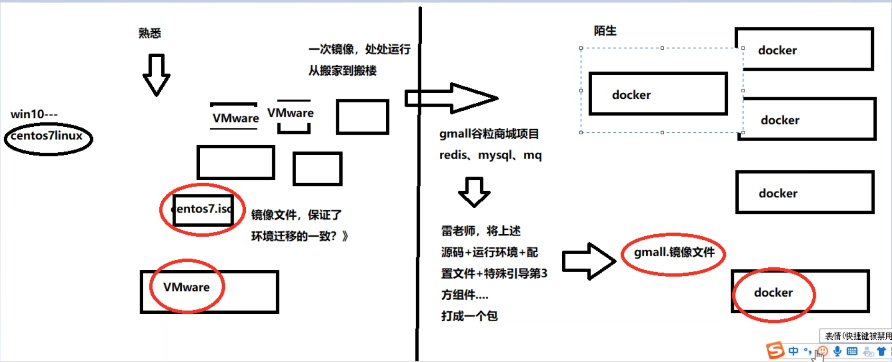
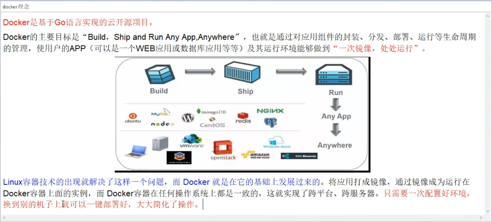
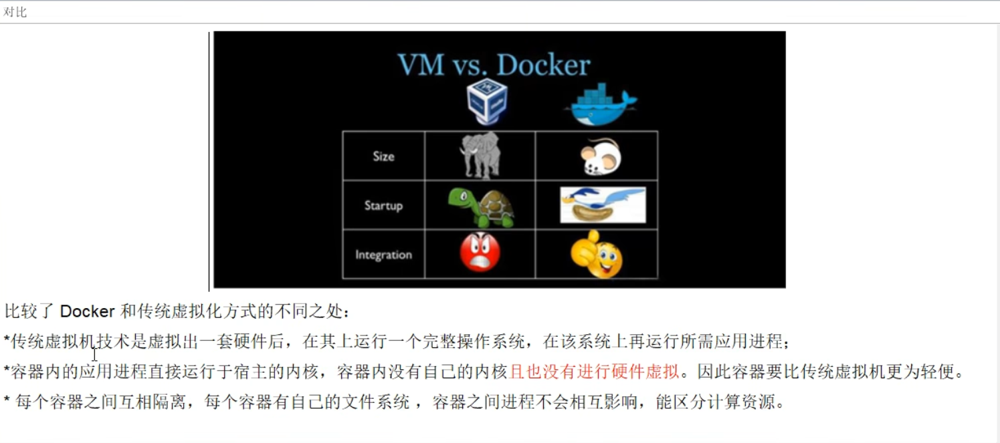

# 🐳docker

$学习路线$

[docker视频课程](https://www.bilibili.com/video/BV1gr4y1U7CY?)

[k8s视频课程](https://www.bilibili.com/video/BV13Q4y1C7hS/?)

[springboot视频课程](https://www.bilibili.com/video/BV19K4y1L7MT/?)

[springcloud视频课程](https://www.bilibili.com/video/BV18E411x7eT/?)

## 前提知识
docker是基于GO语言开发出来的

springboot  springcloud
git push pull redis nginx mysql。。。
Linux centos Ubuntu

## 通俗类比理解
您要如何确保应用能够在这些环境中运行和通过质量检测？并且在部署过程中不出现令人头疼的版本、配置问题，也无需重新编写代码和进行故障修复？
答案是使用docker——⭐️系统平滑移植，容器虚拟化技术

**🐳使用：**
在开发交付给运维进行维护时，因为双方配置环境等可能出现差错导致，开发方可以运行出来，因为不行，此时就是开发方使用docker把整个项目生成一个镜像文件，交给运维，而运维只需要使用docker，使用镜像文件，就可以与开发方的保持一样。

**生成docker.iso作用类举：**
而生成镜像文件的方式就像搬家，你住在新乡10号楼2层226，你要搬到北京，而你希望，搬家后的房屋装扮，家具布局跟之前的一模一样，而在搬家的过程中肯定会有一些变化，所以，我们就是直接把10号楼一整个楼挖走，挖到北京，这样你就也是2层226，房屋布局什么都跟之前一样，但也进行了搬家。

**运维使用docker作用类举：**
好比我们使用镜像文件centos7.iso在VMware创建centos7虚拟机一样，全班的人都是用这个镜像文件，我们起始安装的虚拟机都是一样的。而此时我们把VMware换为docker，而centos.iso换成我们布置项目生成的docker.iso。

**⚡️图例**

## 简介
**docker的理念**

**为什么会有docker**
⭐️解决了运行环境和配置问题的软件容器，方便做持续集成并有助于整体发布的容器虚拟化技术。

**容器与虚拟机的比较**

**能干嘛**

新一代的工程师——运维开发工程师(DevOps)

- 使应用交付和部署更快速
- 使升级和扩缩容更便捷
- 使系统运维更简单
- 使计算机资源利用更高效
  ``docker是内核级虚拟化``

**去哪里下载**

官网 —— dicker官网：http://www.docker.com

仓库 —— Docker Hub: https://hub.docker.com
