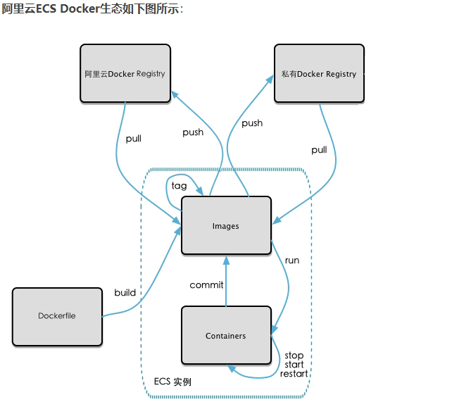
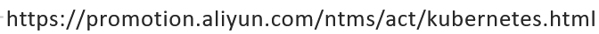

# 🐳本地镜像发布到阿里云

## 本地镜像发布到阿里云流程

## 镜像的生成方法

wayone：docker commit...

waytwo:后面的dockerfile章节

## 将本地镜像推送到阿里云

#### 本地镜像素材原型

centos7/vim

#### 阿里云开发者平台

#### 创建仓库镜像

#### 将镜像推送到阿里云

## 将阿里云的镜像下载到本地
