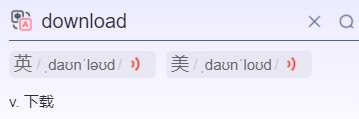

# 🐳docker-compose容器编排

一个一个容器的管理用docker，多个容器的管理用docker-compose
说白了，就是为了快速安装软件，编写了安装脚本，为了运行脚本和开启软件，而编写了yaml文件。而我们在一台新的电脑上运行编写好的LNMP.yaml脚本，我们就可以安装好LAMP架构。【我们使用dockerfile脚本安装和配置软件，每次安装软件，都要开启 ，这么多的软件，开开关关很麻烦，所以呢，我们就写一个docker-compose.yaml文件，来运行多个dockerfile的同时，也开启多个软件(创建容器实例)，就好比在运行一个软件一样。】

CI 持续集成
CD 持续交付和持续部署
Jenkins



## 🌹what is it

Docker-compose是Docker官方的开源项目
负责对Docker容器集群的快速编排

```md
Compose 是 Docker 公司推出的一个工具软件，可以管理多个 Docker 容器组成一个应用。你需要定义一个 YAML 格式的配置文件docker-compose.yml，写好多个容器之间的调用关系。然后，只要一个命令，就能同时启动/关闭这些容器
```

## 🌷what can it do

```md
 docker建议我们每一个容器中只运行一个服务,因为docker容器本身占用资源极少,所以最好是将每个服务单独的分割开来但是这样我们又面临了一个问题？

如果我需要同时部署好多个服务,难道要每个服务单独写Dockerfile然后在构建镜像,构建容器,这样累都累死了,所以docker官方给我们提供了docker-compose多服务部署的工具

例如要实现一个Web微服务项目，除了Web服务容器本身，往往还需要再加上后端的数据库mysql服务容器，redis服务器，注册中心eureka，甚至还包括负载均衡容器等等。。。。。。

Compose允许用户通过一个单独的docker-compose.yml模板文件（YAML 格式）来定义一组相关联的应用容器为一个项目（project）。

可以很容易地用一个配置文件定义一个多容器的应用，然后使用一条指令安装这个应用的所有依赖，完成构建。Docker-Compose 解决了容器与容器之间如何管理编排的问题。
```

## download

文档介绍官网：https://docs.docker.com/compose/compose-file/compose-file-v3/

官网下载：https://docs.docker.com/compose/install/

安装步骤：

```md
curl -L "https://github.com/docker/compose/releases/download/1.29.2/docker-compose-$(uname -s)-$(uname -m)" -o /usr/local/bin/docker-compose
chmod +x /usr/local/bin/docker-compose
docker-compose --version
```

卸载:

```md
sudo /usr/local/bin/docker-compose
```

## compose核心理念

#### 一文件

docker-compose.yml

#### 两要素

工程=多个服务(容器应用实例)

###### service(服务)

·一个个应用容器实例，比如订单微服务、库存微服务、mysql容器、nginx容器或者redis容器

###### project(工程)

·由一组关联的应用容器组成的一个完整业务单元，在 docker-compose.yml 文件中定义。

## compose使用三步骤

1、编写Dockerfile定义各个微服务应用并构建出对应的镜像文件
2、使用 docker-compose.yml 定义一个完整业务单元，安排好整体应用中的各个容器服务。
3、最后，执行docker-compose up命令 来启动并运行整个应用程序，完成一键部署上线

## compose常用选项
```md
docker-compose [-f <args>] [options] [command] [args]
docker-compose 常用选项：
--verbose 
-v,--version
-f,--file FILE     #指定一个备用的撰写文件(default: docker-compose.yml)
--profile NAME     #指定项目名称，默认使用目录名称
```
## compose常用命令

```dockerfile
Compose常用命令:


docker-compose -h                           # 查看帮助

docker-compose up                           # 启动所有docker-compose服务

docker-compose up -d                        # 启动所有docker-compose服务并后台运行

docker-compose down                         # 停止并删除容器、网络、卷、镜像。

docker-compose exec  yml里面的服务id                 # 进入容器实例内部  docker-compose exec docker-compose.yml文件中写的服务id /bin/bash

docker-compose ps                      # 展示当前docker-compose编排过的运行的所有容器

docker-compose top                     # 展示当前docker-compose编排过的容器进程

docker-compose logs  yml里面的服务id     # 查看容器输出日志

docker-compose config     # 检查配置

docker-compose config -q  # 检查配置，有问题才有输出

docker-compose restart   # 重启服务

docker-compose start     # 启动服务

docker-compose stop      # 停止服务

--help或--verbose
commands：
  build              Build or rebuild services
  config             Validate and view the Compose file
  create             Create services
  down               Stop and remove resources
  events             Receive real time events from containers
  exec               Execute a command in a running container
  help               Get help on a command
  images             List images
  kill               Kill containers
  logs               View output from containers
  pause              Pause services
  port               Print the public port for a port binding
  ps                 List containers
  pull               Pull service images
  push               Push service images
  restart            Restart services
  rm                 Remove stopped containers
  run                Run a one-off command
  scale              Set number of containers for a service
  start              Start services
  stop               Stop services
  top                Display the running processes
  unpause            Unpause services
  up                 Create and start containers
  version            Show version information and quit
```
## Yaml简介
[使用](https://www.cnblogs.com/RioTian/p/15872725.html)

