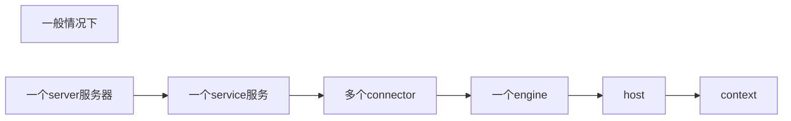
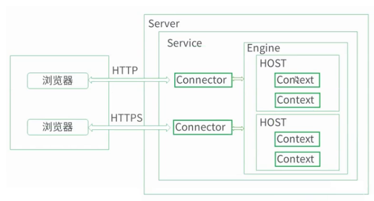
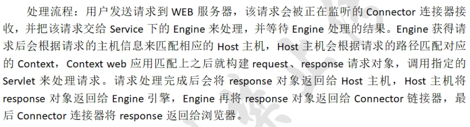
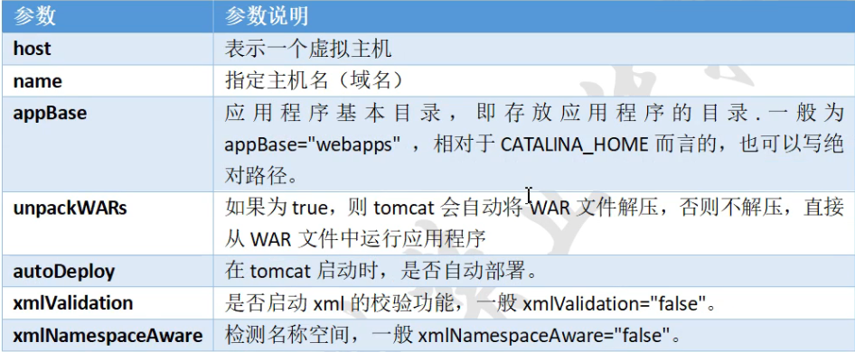
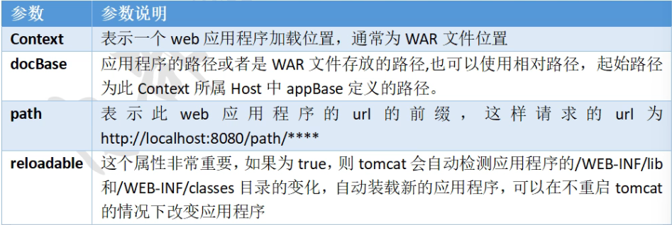

# :zap:tomcat 目录介绍
    # ll /usr/local/tomcat8/
    总用量 92
    drwxr-x---. 2 root root  4096 11月 19 03:48 bin
    drwx------. 3 root root   254 11月 19 03:51 conf
    drwxr-x---. 2 root root  4096 11月 19 03:48 lib
    -rw-r-----. 1 root root 57092 6月  22 2017 LICENSE
    drwxr-x---. 2 root root   197 11月 19 03:51 logs
    -rw-r-----. 1 root root  1723 6月  22 2017 NOTICE
    -rw-r-----. 1 root root  7064 6月  22 2017 RELEASE-NOTES
    -rw-r-----. 1 root root 15946 6月  22 2017 RUNNING.txt
    drwxr-x---. 2 root root    30 11月 19 03:48 temp
    drwxr-x---. 7 root root    81 6月  22 2017 webapps
    drwxr-x---. 3 root root    22 11月 19 03:51 work

### :star:主目录介绍
|dir|meaning|
|:---:|---|
|bin|存放Windows或linux平台上启动或者关闭Tomcat的脚本文件|
|conf|存放Tomcat的各种全局配置文件，其中最重要的是:star:server.xml和web.xml|
|lib|存放Tomcat运行需要的库文件（JARS）|
|logs|存放Tomcat执行的LOG文件|
|webapps|Tomcat的主要web发布目录、类似于nginx的html目录（包括应用程序实例）|
|work|存放jsp编译后产生的.class文件|
|temp|存放临时文件|

#### webapps 目录介绍
|dir|meaning|
|:---:|---|
|docs|Tomcat帮助文档|
|example|web应用实例|
|host-manager|主机管理|
|manager|管理|
|:star:ROOT|默认站点根目录|
#### conf  目录介绍
|dir|meaning|
|:---|:---:|
|catalina.policy|权限控制配置文件|
|catalina.properties|Tomcat属性配置文件|
|:star:context.xml|context用于指定额外的web目录|
|logging.properties|日志log配置文件|
|:star::star:server.xml|主配置文件|
|:star::star:Tomcat-user.xml|manager-gui管理用户配置文件（Tomcat安装后生的管理界面，该文件可开启访问）|
|web.xml|Tomcat的servlet，servlet-mapping，filter，MIME等相关配置|

#### :star:Tomcat主配置文件说明
server.xml 主要配置文件，可修改启动端口，设置网站根目录，虚拟主机，多实例、启动https加密等功能。

**server.xml 的结构构成：**

    <Server>    #模板
        <Service>      #子模板
            <Connector/>    #配置项
                <Engine>    #引擎
                    <Host>  #主机   近似相当于nginx的location
                        <Context>#内容</Context>
                    </Host>
                </Engine>
        </Service>
    </Server>

    <!-- --> 内的内容是注释信息

**请求处理流程：**

**//Tomcat 关闭端口，默认只对本机地址开放，可以在本机通过talnet 127.0.0.1 8005访问，对Tomcat进行关闭从操作。**

    <Server port="8005" shutdown="SHUTDOWN">
**//Tomcat 启动默认端口号8080，可以根据需要进行修改**

    <Connector port="8080" protocol="HTTP/1.1"
                connection Timeout="20000"
                redirectPort="8443"/>
**//tomcat 启动AJP1.3连接器时默认的端口号，可以根据需要进行更改**

     <!-- Define an AJP 1.3 Connector on port 8009 -->
    <Connector port="8009" protocol="AJP/1.3" redirectPort="8443" />

**//以下是Tomcat定义虚拟主机时的配置即日志配置**

    <Host name="localhost"  appBase="webapps"
            unpackWARs="true" autoDeploy="true">

            <Context docBase="/web/webapp" path="" reloadable="flase">
            </Context>
        <Valve className="org.apache.catalina.valves.AccessLogValve" directory="logs"
               prefix="localhost_access_log" suffix=".txt"
               pattern="%h %l %u %t &quot;%r&quot; %s %b" />

    </Host>

#### hsot 参数详解 true （:star:记前五个）

#### Context 参数说明   （:star:记前四项）

### 自定义默认网站目录

