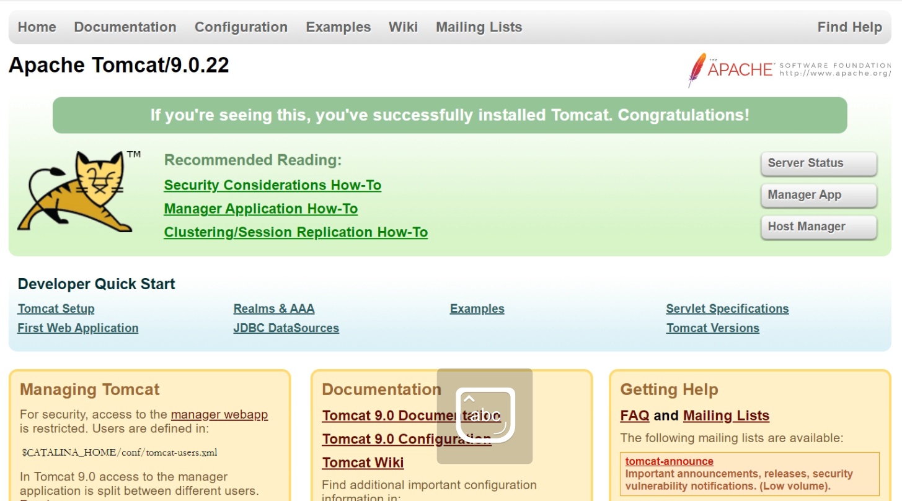

# ⚡️

# [安装Jdk](https://blog.csdn.net/m0_46316970/article/details/117924909)

**检测虚拟机中是否有jdk相关安装：**

    #rpm -qa|grep java*
    #java -version
    #rpm -qa|grep openjdk(centosGUI安装，会自带openjdk，不太好用)
    
**准备jdk的源码包并进行解压缩：**

    #tar xf jdk-8u60-linux-x64.tar.gz #直接解压缩到当前目录
    #ls
    jdk-8u60-linux-x64

**进行安装：**

    #mkdir /usr/local/java
    #mv jdk-8u60-linux-x64/* /usr/local/java/

**配置环境：**

    #vim /etc/profile    #配置错误会打不开jdk
        export JAVA_HOME=/usr/local/java
        export PATH=$PATH:$JAVA_HOME/bin
    :wq
    #source /etc/profile

**检验是否安装成功**

    #java -version  #出现版本号为成功
        java version "1.8.0_60"
        Java(TM) SE Runtime Environment (build 1.8.0_60-b27)
        Java HotSpot(TM) 64-Bit Server VM (build 25.60-b23, mixed mode)
-----------------------------------------------------------------------

# :*

# Tomcat安装过程

**准备Tomcat源码包并进行解压缩**

    tar xf apache-tomcat-8.5.16.tar.gz #解压到当前目录
    
**安装**

    #mkdir /usr/local/tomcat8
    #mv apache-tomcat-8.5.16/* /usr/local/tomcat8/
    #ls /usr/local/tomcat8/
        bin   lib      logs    RELEASE-NOTES  temp     work
        conf  LICENSE  NOTICE  RUNNING.txt    webapps
        
**安装快捷启动关闭命令**

    #ls /usr/local/tomcat8/bin
        bootstrap.jar                 setclasspath.sh
        catalina.bat                  shutdown.bat
        catalina.sh                   shutdown.sh
        catalina-tasks.xml            startup.bat
        commons-daemon.jar            startup.sh
        commons-daemon-native.tar.gz  tomcat-juli.jar
        configtest.bat                tomcat-native.tar.gz
        configtest.sh                 tool-wrapper.bat
        daemon.sh                     tool-wrapper.sh
        digest.bat                    version.bat
        digest.sh                     version.sh
        setclasspath.bat
    #ln -s /usr/local/tomcat8/bin/startup.sh  /usr/local/bin/tomcat
    #ln -s /usr/local/tomcat8/bin/shutdown.sh  /usr/local/bin/tomcatstop
    #tomcat
        Using CATALINA_BASE:   /usr/local/tomcat8
        Using CATALINA_HOME:   /usr/local/tomcat8
        Using CATALINA_TMPDIR: /usr/local/tomcat8/temp
        Using JRE_HOME:        /usr/local/java
        Using CLASSPATH:       /usr/local/tomcat8/bin/bootstrap.jar:/usr/local/tomcat8/bin/tomcat-juli.jar
        Tomcat started.

**查看Tomcat是否启动成功**

    #Tomcat默认端口号是8080
    [root@localhost ~]# netstat -anpt | grep 8080
    tcp6  0  0 :::8080  :::*  LISTEN 11346/java

**进行测试**

浏览器访问8080端口

**关闭**

    #tomcatstop
        Using CATALINA_BASE:   /usr/local/tomcat8
        Using CATALINA_HOME:   /usr/local/tomcat8
        Using CATALINA_TMPDIR: /usr/local/tomcat8/temp
        Using JRE_HOME:        /usr/local/java
        Using CLASSPATH:       /usr/local/tomcat8/bin/bootstrap.jar:/usr/local/tomcat8/bin/tomcat-juli.jar
    #如果关闭后还进行Tomcat操作会出现错码，只要能正常启动都没问题
-----------------------------------------------------------------
