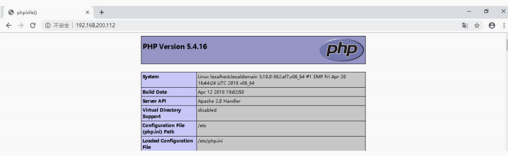

# Nginx 静动分离
$LAMP架构(Linux,Apache,Mysql,Php)$

实验环境：两台服务器
192.168.100.123 Nginx 服务器
192.168.100.124 LAMP 服务器

$LAMP \ rpm \ 方式搭建$

    [root@localhost ~]# yum -y install httpd mariadb mariadb-devel mariadb-server php
    [root@localhost ~]# systemctl start httpd
    [root@localhost ~]# systemctl start mariadb
    [root@localhost ~]# cat /var/www/html/index.php
    <?php
    phpinfo();
    ?>

宿主机测试：

$配置 Nginx 动静分离$
修改 nginx.conf 主配置文件:

    location ~* \.(png|bmp|jpg)$ {
        root /usr/local/nginx/html/images;
            }
    location ~* \.php$ {
        proxy_pass http://192.168.200.112;
    }

    #killall -HUP nginx

浏览器访问测试图片文件：

    [root@nginx ~]# cd /usr/local/nginx/html/
    [root@124 html]# tree
    .
    ├── 50x.html
    ├── cloud
    │   └── index.html
    ├── images
    │   └── \346\265\267\350\264\274\347\216\213.jpg
    ├── index.html
    ├── linuxxu
    │   └── index.html
    ├── mysql.php
    └── php.php