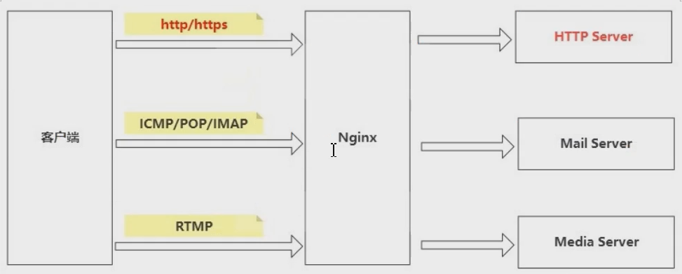
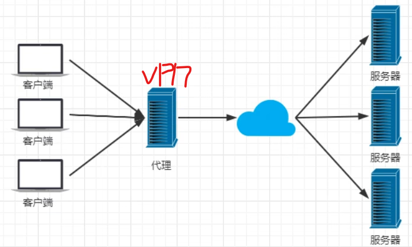
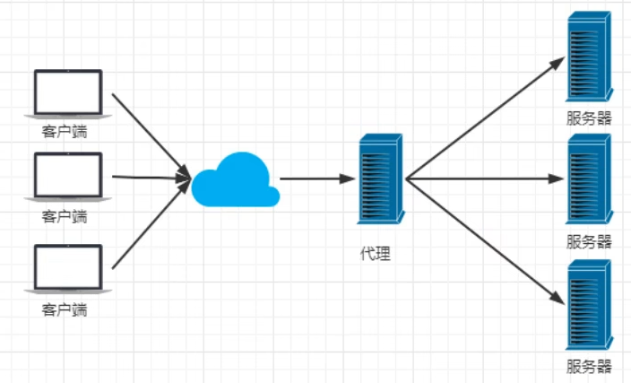
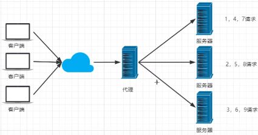
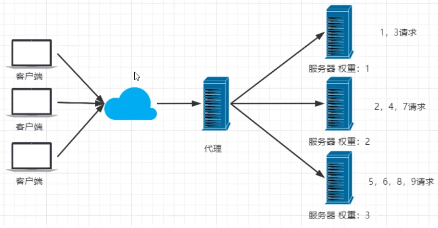
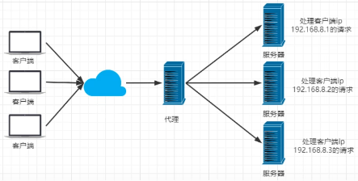
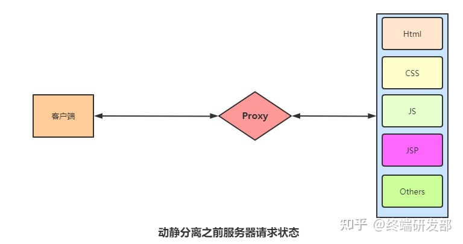
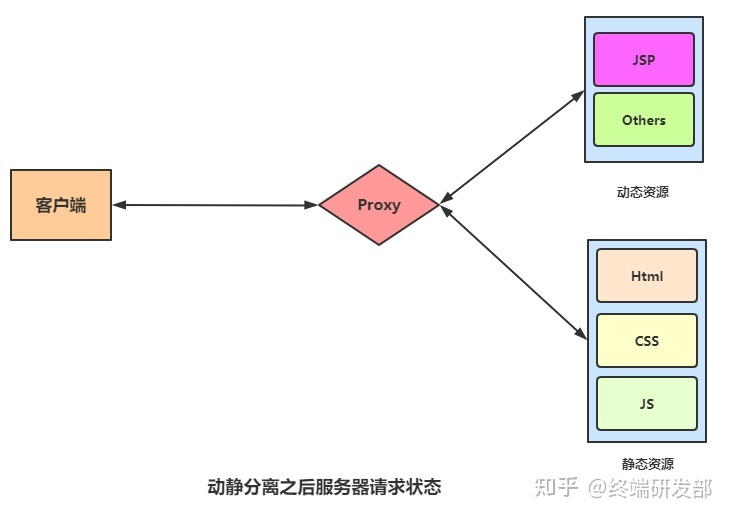

#🔥 [nginx](https://www.cnblogs.com/chenglc/p/8024994.html)
## 概述

1、跟http一样，是个中间件

2、Nginx（发音 engine x）专为性能优化而开发的开源软件，是 HTTP 及较好的反向代理软件

#### 特点

Nginx 专为性能优化而开发，性能是其最重要的要求，十分注重效率，有报告 Nginx 能支持高达 50000 个并发连接数。

## 功能

#### 代理 proxy

就好比去买二手房，client是买房者，nginx是中介中心，server是卖房者，Tomcat类似于卖房者。


#### 正向代理 代理客户端

局域网中的电脑用户想要直接访问服务器是不可行的，服务器可能Hold不住,只能通过代理服务器来访问，这种代理服务就被称为正向代理,特点是客户端知道自己访问的是代理服务器。

```md
举例描述:访问外网，需要给电脑做个vpn，帮你去请求外部的资源，好比代理服务器在香港，然后香港的服务器去访问美国的服务器...

VPN（虚拟通道）:其实就是把不能访问外网地区的ip换成了可以访问外网的地区的ip
```


#### 反向代理 代理服务端

客户端无法感知代理，因为客户端访问网络不需要配置，只要把请求发送到反向代理服务器，由反向代理服务器去选择目标服务器获取数据，然后再返回到客户端。

此时反向代理服务器和目标服务器对外就是一个服务器，暴露的是代理服务器地址，隐藏了真实服务器 IP 地址。

```md
举例描述：好比去访问www.baidu.com,百度肯定不止一个服务器，好比在北京的服务器，在上海的服务器等，这时候，你访问www.baidu.com，代理服务器会让你访问其中一个服务器，访问其中哪个会进行负载均衡。
```


#### ⭐️负载均衡

nginx提供的负载均衡的策略有两种：内置策略和扩展策略

- 内置策略：

  - 轮询：依次循环
    
  - 加权轮询:性能越高的服务器，权重越高
    
  - iphash：iphash对客户端请求的ip进行hash操作，然后根据hash结果将同一个客户端ip的请求分发给同一台服务器进行处理，可以解决session不共享的问题。（不建议，做session共享建议Redis）
    
- 扩展策略：天马行空，只有想不到，没有做不到。

#### 动静分离

为了加快网站的解析速度，可以把动态页面和静态页面交给不同的服务器来解析，加快解析的速度，降低由单个服务器的压力。

**动静分离之前的状态**


**动静分离之后的状态**


```md
光看两张图可能有人不理解这样做的意义是什么,我们在进行数据请求时,以淘宝购物为例,商品详情页有很多东西是动态的,随着登录人员的不同而改变,例如用户ID,用户头像,但是有些内容是静态的,例如商品详情页,那么我们可以通过CDN(全局负载均衡与CDN内容分发)将静态资源部署在用户较近的服务器中,用户数据信息安全性要更高,可以放在某处集中,这样相对于将说有数据放在一起,能分担主服务器的压力,也能加速商品详情页等内容传输速度。
```

## 参考文档
[终端研发部](https://zhuanlan.zhihu.com/p/531915310)