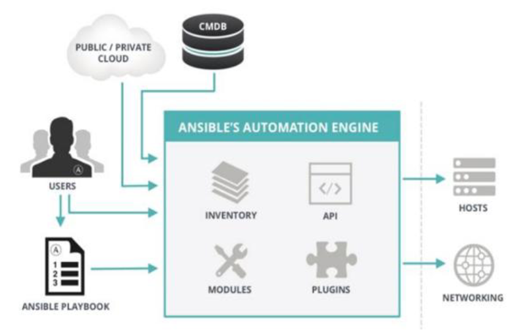

**1**、**ansible的特点**：

1. Ansible 基于 python 开发，运维工程师对其二次开发相对较容易；
2. Ansible 拥有丰富的内置模块，基本可以满足一切要求；
3. 管理模式非常简单，一条命令可以影响上千台机器；
4. 无客户端模式设计，底层基于 SSH 通信；

**2**、**ansible的角色分类**：

**3**、**ansible的交互的方式**：

如图所示：Ansible 使用者可以采用多种方式和 Ansible 交互，图中我们展示了四种方式
- CMDB：CMDB 系统存储和管理着企业 IT 架构中的各种配置信息，是构建 ITL 项目核心工具，运维人员可以组合 CMDB 和 Ansible，通过 CMDB 直接下发指令调用 Ansible 工具完成操作者所希望达到的目标。
- PUBLIC/PRIVATE 方式，Ansible 除了丰富的内置模块外。同时提供丰富的 API 语言接口，
如 PHP，Python，PERL 等多种流行语言，基于 PUBLIC/PRIVATE，Ansible 以 API 调用的方式运行。
- Ad-Hoc 命令集，Users 直接通过 Ad-Hoc 命令集调用 Ansible 工具来完成工作。
- Playbooks：Users 预先编写好 Ansible Playbooks，通过执行 Playbooks 中预先编排好的任务集按序执行命令。

**4**、**ansible的工具集**：

**5**、**ansible的作用对象**：

**6**、**sshpass命令使用方法**：

**7**、**ansible的基础命令**：

**8**、**ansible命令的选项**：