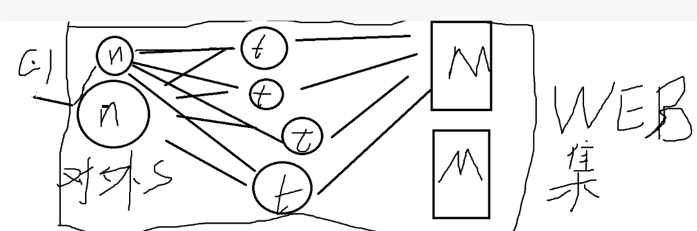
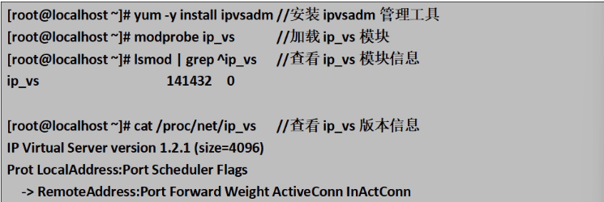
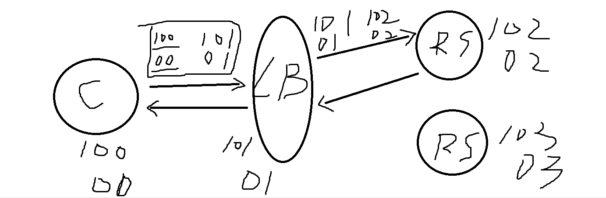
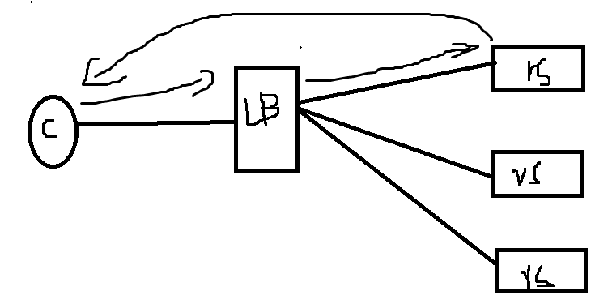
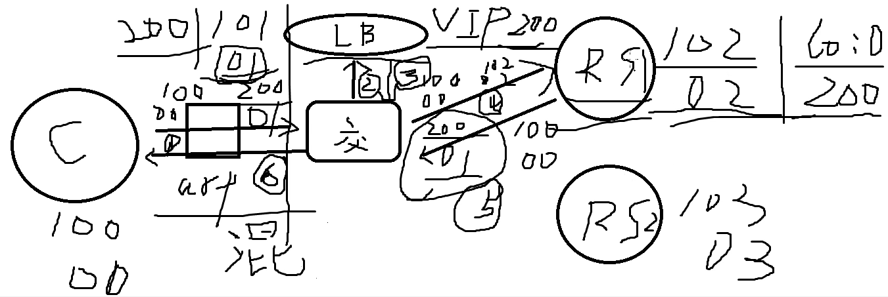
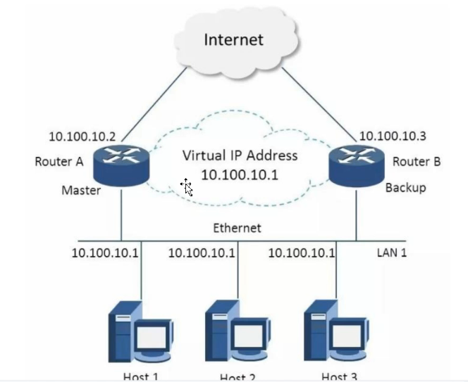

# 集群



## 英文单词🌻

iptables：IP信息包过滤系统
netfilter：网络过滤器、网页内容过滤器
proxy: 代理权，代表权；代理人，代表

LVS：linux virtual server
LB：load balance cluster
VIP：virtual ip
RIP：real ip
RS：real server

## 掌握知识⭐️

1、多台服务器提供相同的服务的一组序列就叫集群，集群就是一组计算机，他们作为一个整体向用户提供服务。

2、集群分三种：

- 负载均衡集群(load balance cluster)
- 高可用集群(high availability cluster)
- 高性能运算集群(high performance computer cluster)

3、常用软件

- 负载均衡集群常用软件软件有：linux virtual server(lvs),Haproxy,nginx。
- 高可用集群常用著名软件是：  Heartbeat、Keepalived。

4、负载均衡层级关系是：

```md
第一层，负载调度器：这是访问整个集群系统的唯一入口，对外使用所有服务器共有的VIP地址，也称为集群IP地址。
第二层，服务器池：集群所提供的应用服务由服务器池承担，其中的每个节点具有独立的RIP地址，只处理调度器分发过来的客户机请求。
第三层，共享存储：为服务器池中的所有节点提供稳定、一致的文件存取服务，确保整个集群的统一性。
```

5、LVS、LB、VIP、RIP、RS分别代表什么？

```md
LVS：Linux的虚拟服务
LB：负载均衡集群
VIP：虚拟IP地址
RIP：真实IP地址
RS：真实服务器
```

6、LVS如何启动？

```md
LVS本身不属于一种服务，所以不存在一种启动的概念。
（systemctl start 是可以启动的，lvs本身配置好一堆策略之后，保存成一个策略，然后systemctl只是加载这些策略而已）
LVS本身或者ip_vs命令是一个系统内核模块，是在需要的时候自动调用的一个模块，所以不存在一种启动的概念。
```



7、LVS三种模式

- NAT模式（网络地址转换 network address translation）
  
- IP TUN模式（IP Tunneling IP隧道）
  
- DR模式（Direct Routing直接路由）
  
- NAT模式特点：

```md
    安全性最高
    响应速度慢
    LB的处理能力会成为整个集群的瓶颈
```

- DR模式特点：

```md
    安全性较差
    网络要求：局域网和广域网
    必须支持IP隧道协议，目前只由Linux支持
    可以支持100个节点
    扩展性很好
```

- TUN模式特点：

```md
    支持虚拟网卡，且可以禁用ARP响应
    极大地提高了LVS的调度处理能力  
    网络要求：局域网
    可以支持到100个节点
    安全性较差，real server容易暴露
    拓展性好
    可以修改MAC地址
```

三种模式对比

|              | NAT模式                     | IP TUN模式                                                | DR模式                                                    |
| ------------ | --------------------------- | --------------------------------------------------------- | --------------------------------------------------------- |
| 对服务器要求 | 任何操作系统均支持          | 必须支持IP隧道协议，目前只有Linux支持                     | 支持虚拟网卡，且可以禁用ARP响应                           |
| 网络要求     | 局域网                      | 局域网或广域网                                            | 局域网                                                    |
| 支持的节点数 | 10~20个                     | 可以支持到100个节点                                       | 可以支持到100个节点                                       |
| 安全性       | 较高，可隐藏real server     | 较差，real server容易暴露                                 | 较差，real server容易暴露                                 |
| IP要求       | 仅需要一个合法IP地址作为VIP | 除VIP外，每个服务器需要拥有合法IP地址可以直接路由至客户端 | 除VIP外，每个服务器需要拥有合法IP地址可以直接路由至客户端 |
| 拓展性       | 差                          | 很好                                                      | 好                                                        |
| 特点         | 地址转换                    | 封装IP                                                    | 修改MAC地址                                               |

8、DR模式数据流向深入分析

```md
    客户段向VIP发出请求，经过路由器，路由器经过广播，只有LVS（负载均衡服务器）做出回应（防止ARP混淆），负载均衡服务器根据负载均衡算法去选择RS1，不去修改也不封装IP报文，只将数据帧中的源MAC地址改成负载均衡服务器，将目标MAC地址改为RS1的，然后在局域网中发送。RS1接收到这个数据帧，解封装后处理数据，随后重新封装数据，发送到局域网，因为没有源MAC地址，所以会进行ARP请求，以RIP去请求，请求到源MAC地址后，再以源IP为VIP去源MAC为RS1的去发送数据，ARP缓存也不会因为VIP跟不同的MAC地址而产生ARP混淆。客户端接收到信息后，会认为得到正常的服务，而不知道RS的IP地址
```

9、ARP混淆的参数及各自的含义：

```md
解决ARP混淆的方法：
arp_ignore=1 系统只响应目标IP为本地RIP的ARP请求
arp_announce = 2  来解决节点服务器向路由器发送arp请求时，将使用自己的RIP地址，而不是VIP地址，防止路由器更新ARP缓存表时，出现问题。

arp_ignore = 1含义：
当客户端给出的VIP经过路由器时，会进行广播，因为LVS和RS都有这个VIP，所以设置这条参数的话，RS就不会进行应答，只有LVS做出应答，这样就避免了ARP混淆

arp_announce = 2 含义：
正常情况下，RS在接收到这条数据后，会以VIP去请求源MAC地址，那么这样的话，路由器内的ARP缓存表会同时有LVS跟RS的MAC地址跟VIP，这样会造成ARP混淆，那么就要设置这条参数，设置之后，RS收到数据包后，没有数据包的源MAC地址，所以RS会以RIP去发送ARP请求，接收到源MAC地址再以VIP去发送数据包。就是说：不使用VIP作为ARP请求，而是选择RIP做请求，当请求回来的源MAC地址时，再以VIP去发送数据避免了ARP混淆，也不会暴露RS1的RIP。
```

10、Keepalived(保持 活着)

```md
    搭建负载调度器主从服务
  
    LVS具有检测服务器池中是否可以正常运行，如果出现rs故障，LVS会把它踢出服务器池，等它修复好后再加入。
  
    搭建一个LVS的从服务器，（两个服务器都运行，从服务器不工作，只做热备）当主服务器出现异常时，把主服务上的所有服务瞬间转移到从服务器，然后去修复主服务器，修复完后，主服务器继续进行服务，从服务器继续做热备。
```



Keepalived自身基于VRRP协议  --虚拟路由冗余协议

Keepalived的三大核心模块:

- core模块：为keepalived的核心组件，负责主进程的启动、维护以及全局配置文件的加载和分析
- check模块：负责real server 节点池内的节点的健康检测
- VRRP模块：在master与backup之间执行心跳检测

Keepalived的工作原理:

```md
正常情况下，LVS(负载均衡服务器)相当于RS1的入口，当LVS坏死时，RS1也无法提供服务，所以，这个时候Keepalived诞生了，Keepalived可以设置这两个LVS，一个作为主的LVS，一个作为从的LVS，当主LVS坏死时，从LVS可以无缝衔接的瞬间切换（热备），保证集群服务的稳定性和持续性。并且当主LVS修复好时，从LVS将自动退出，主LVS还是主的。
```

脑裂的现象及原因、后果:

```md
在keepalived的配置文件中，vrrp instance模块中的virtual_router_id 51（虚拟路由器的id号） 当两台LVS的id号不同时，就会产生脑裂。
原因：如果不相同时，两台LVS会认为对方不是同一个组的，不管哪一台都会认为对方已经死了，就会启动自己的VIP
后果：如果后台连接的存储数据的，那么会产生两台LVS同时向存储设备的写入数据，而且是往一个位置上写，后台存储设备会崩掉。
```

## 参考文档

[晴天M雨天（讲解很细，先看这个）(LVS)](https://blog.csdn.net/weixin_38738049/article/details/125749863)

[全栈程序员站长(LVS)](https://cloud.tencent.com/developer/article/2054205)

[交换机与路由器](https://blog.csdn.net/baidu_32045201/article/details/78305586?)

[arp混淆](https://blog.csdn.net/weixin_30500289/article/details/96641168?)
