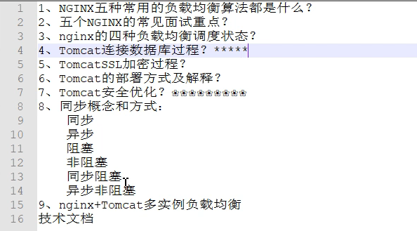

# :cat:Tomcat：

$简单总结下:$
一个很强大的翻译官
tomcat是一个中间件，在B/S架构中，浏览器发出的http请求经过tomcat中间件，转发到最终的目的服务器上，响应消息再通过tomcat返回给浏览器。

$tomcat所做的事情主要有：$
开启监听端口监听用户的请求，
解析用户发来的http请求然后访问到你指定的应用系统，然后你返回的页面经过tomcat返回给用户。

中间件产品：RedHat JBoss、Oracle Tuxedo、==caucho Resin==

$Apache,Nginx和Tomcat的区别：$

    Apache全称是 Apache Http Server Project, Tomcat全称是 Apache Tomcat。

    Apache和 Nginx用于处理静态资源， tomcat用来处理动态资源。

    Apache和Nginx相比，Nginx适合做前端服务器，适合做负载均衡。

    一般情况下，使用的时候，都是 Apache+Tomcat一起使用或者 Nginx+tomcat一起使用。
