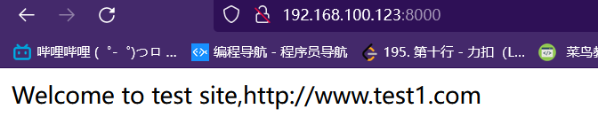

# :zap:[服务器](https://www.cnblogs.com/wml3030/p/15320945.html) :zap: 

1、首先准备个又有Tomcat和nginx的虚拟机

    nginx和Tomcat的安装部署看别的文档
2、在目录下创建一个web目录，并在里面创建一个webapp目录，用于存放网站文件

    mkdir -pv /web/webapp/
3、创建网站文件index.jsp，并在里面编写代码

    #vim index.jsp

    <%@ page language="java" import="java.util.*" pageEncoding="UTF-8"%>
    <html>
    <head>
            <title>JSP test1 page</title>
    </head>
    <body>
            <% out.println("Welcome to test site,http://www.test1.com");%>
    </body>
    </html>
4、修改Tomcat的server.conf文件
:star::star::star:为server.xml文件做备份 

    cp /usr/local/tomcat8/conf/server.xml{,.-$(date(空格)+%F)}
定义一个虚拟主机，并将网站文件路径指向已经建立的/web/webapp,在host段增加context段

    #vim /usr/local/tomcat8/conf/server.xml

    <Host name="localhost"  appBase="webapps"
                unpackWARs="true" autoDeploy="true">
                <Context docBase="/web/webapp" path="" reloadable="false">
            </Context>
5、关闭Tomcat

    #tomcatstop（做得链接）

    #/usr/local/tomcat8/bin/shutdown.sh(没做链接)

6、启动Tomcat

    #tomcat （做得链接）

    #/usr/local/tomcat8/bin/startup.sh（没做链接）
7、测试
进入浏览器：
