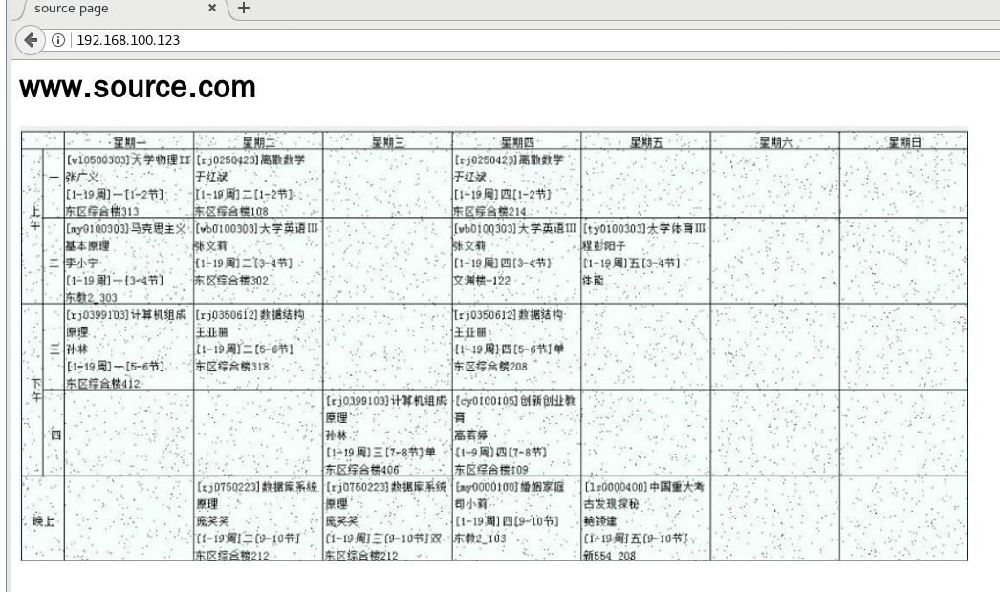
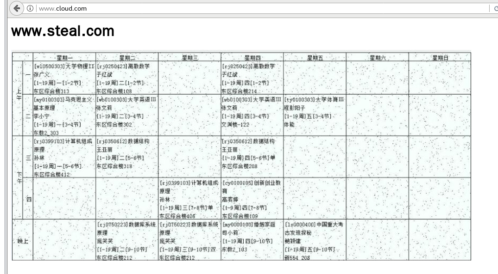
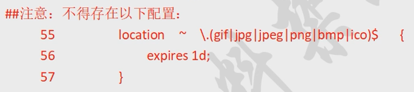
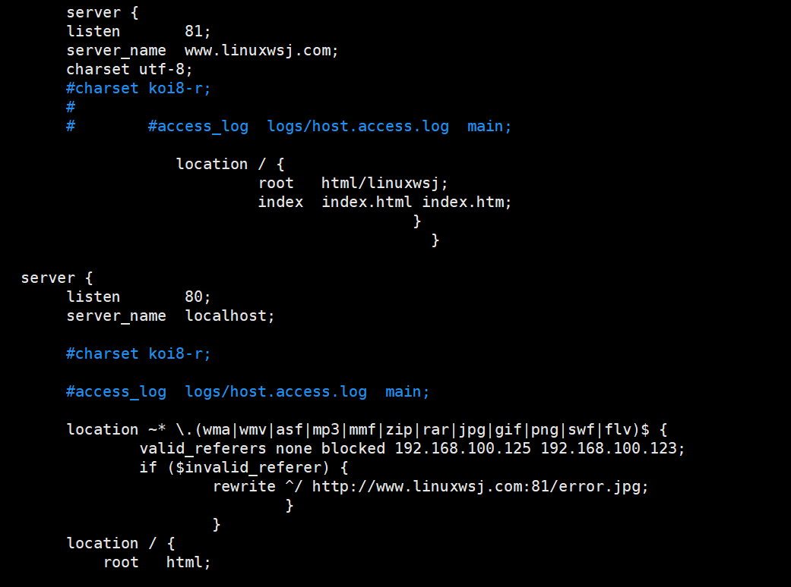
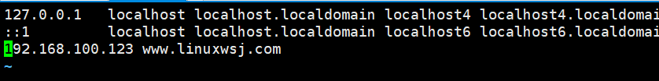
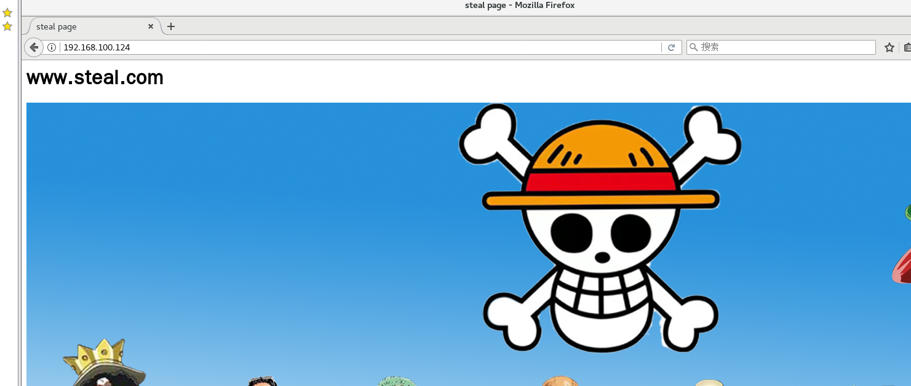

# 配置 Nginx 实现防盗链功能
    Nginx 防盗链功能也非常强大，在默认情况下只需要进行简单的配置，即可实现防盗处理
$实验环境：$

    资源主机 www.source.com 192.168.200.123
    盗链主机 www.steal.com 192.168.200.124
#### 建立资源主机的测试主页
    [root@localhost ~]# vim /usr/local/nginx/html/index.html
    <html>
    <head>
    <title>source page</title>
    </head>
    <body>
    <h1>www.source.com</h1>
    
    </body>
    </html>
    [root@localhost ~]# ls /usr/local/nginx/html/
    50x.html error.jpg index.html linux.png

#### 建立盗链主机的测试主页

    [root@localhost ~]# vim /usr/local/nginx/html/index.html
    <html>
    <head>
    <title>steal page</title>
    </head>
    <body>
    <h1>www.steal.com</h1>
    
    </body>
    </html>


这样124就把123的课表照片给盗取了，商业违法。

#### 资源主机设置防盗链
$配置说明：$
valid_referers 设置信任网站
- none 浏览器中 referer（==Referer 是 header 的一部分，当浏览器向 web 服务器发送请求的时候，一般会带上 Referer，告诉服务器我是从哪个页面链接过来的，服务器基此可以获得一些信息用于处理==）为空的情况，就直接在浏览器访问图片
- blocked referer 不为空的情况，但是值被代理或防火墙删除了，这些值不以http://或 https://开头
```nginx
[root@localhost ~]# ls /var/www/
error.jpg index.html test.jpg
[root@localhost ~]# vim /usr/local/nginx/conf/nginx.conf
    location ~* \.(wma|wmv|asf|mp3|mmf|zip|rar|jpg|gif|png|swf|flv)$ {
        valid_referers none blocked *.source.com source.com;
        if ($invalid_referer) {
            rewrite ^/ http://www.source.com/error.txt;
        }
    }
[root@localhost ~]# nginx -t
nginx: the configuration file /usr/local/nginx/conf/nginx.conf syntax is ok
nginx: configuration file /usr/local/nginx/conf/nginx.conf test is successful
[root@localhost ~]# killall -HUP nginx
```
第一行：wma|wmv|asf|mp3|mmf|zip|rar|jpg|gif|png|swf|flv 表示对这些后缀的文件实行防盗链

第二行：none blocked *.source.com source.com; //不区分大小写表示 referers 信息中匹配 none blocked *.source.com source.com (*代表任何，任何的二级域名)

if{}里面内容的意思是，如果链接不是来自第二行指定的就强制跳转到 403 错误页面，当然直接返回 404 也是可以的，也可以是图片。
注意：设置客户机的 hosts 文件
“~*不区分大小写的匹配”


$测试$
$source机配置：$

$steal机配置：$




