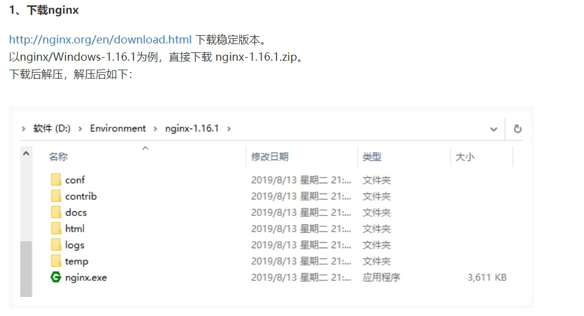
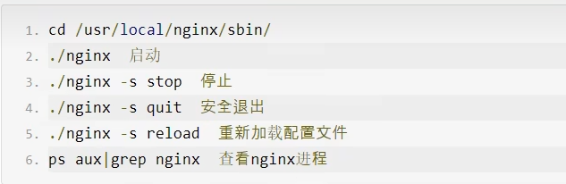
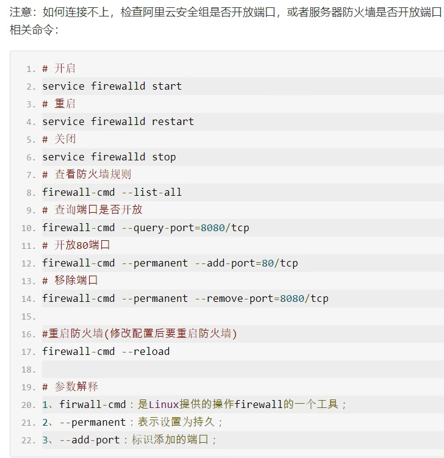

# nginx部署
http://nginx.org/en/download.html
#### windows安装

在windowsD盘（要求无中文）终端运行nginx.exe
然后进入浏览器；


#### linux 部署nginx
1、关闭防火墙，使selinux为警告

2、安装支持软件：
Nginx 的配置及运行需要 pcre、zlib 等软件包的支持，因此应预先安装这些软件的开发包（devel），以便提供相应的库和头文件，确保 Nginx 的安装顺利完成。
```yum -y install pcre-devel zlib-devel openssl-devel```

3、Nginx 服务程序默认以 nobody 身份运行，建议为其创建专门的用户账号，以便更准确地控制其访问权限，增加灵活性、降低安全风险。
如：创建一个名为 nginx 的用户，不建立宿主目录，也禁止登录到 shell 环境。
```[root@nginx ~]# useradd -M -s /sbin/nologin nginx```

4、编译安装nginx
释放nginx源码包
```# tar xf nginx-1.18.0.tar.gz -C /usr/src/```

5、配置编译

    [root@nginx ~]# cd /usr/src/nginx-1.18.0/

    [root@nginx nginx-1.18.0]# ./configure
    --prefix=/usr/local/nginx   #设定nginx的安装目录
    --user=nginx    #指定nginx的用户
    --group=nginx   #指定nginx的组
    --with-http_stub_status_module  #启用--with-http_stub_status_module模块以支持状态统计
    --with-http_ssl_module  #启用SSL模块
    --with-http_flv_module  #启用FLV模块，提供寻求内存使用基于时间的偏移量文件
    --with-http_gzip_static_module  #启用扩展压缩模块
    && make && make install #编译会使用命令make，而安装则会使用命令make install

6、可以为主程序 nginx 创建链接文件，以便管理员直接执行 nginx 命令就可以调用 Nginx 的主程序。

    ln -s /usr/local/nginx/sbin/nginx /usr/local/bin/

7、对配置文件进行检查，以便找出不当或错误的配置
配置文件 nginx.conf 默认位于安装**目录/usr/local/nginx/conf/目录**中
**Nginx 的主程序也提供了"-t"选项用来对配置文件进行检查**
若要检查位于其他位置的配置文件，可使用"-c"选项来指定路径。

    #nginx -t
    nginx: the configuration file /usr/local/nginx/conf/nginx.conf syntax is ok
    nginx: configuration file /usr/local/nginx/conf/nginx.conf test is successful
8、启动、停止 Nginx、

    [root@nginx conf]# ./nginx
    [root@nginx conf]# netstat -anpt |grep :80
    tcp 0 0 0.0.0.0:80 0.0.0.0:* LISTEN
    6810/nginx: master
9、卸载nginx

    [root@124 ~]# cd /usr/src/nginx-1.14.2/
    [root@124 nginx-1.14.2]# make clean
    rm -rf Makefile objs
    [root@124 nginx-1.14.2]# cd 
    [root@124 ~]# rm -rf /usr/src/nginx-1.14.2/
    
## nginx命令




## 问题
[问题参考文档](https://blog.csdn.net/blocalhost/article/details/98503172?)


