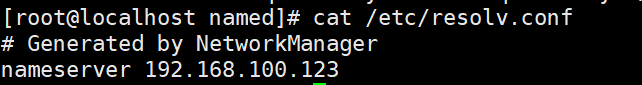
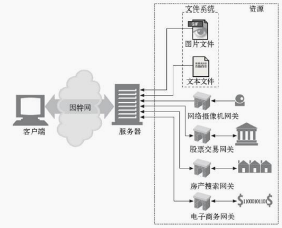
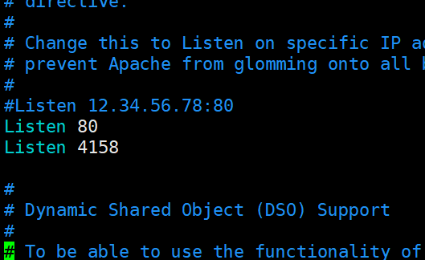
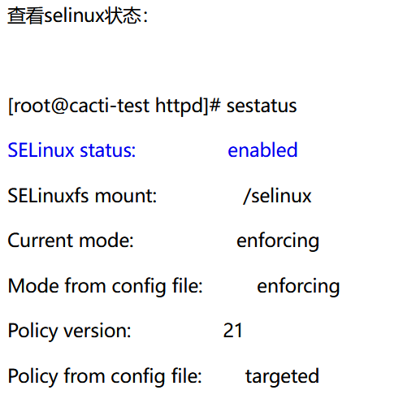
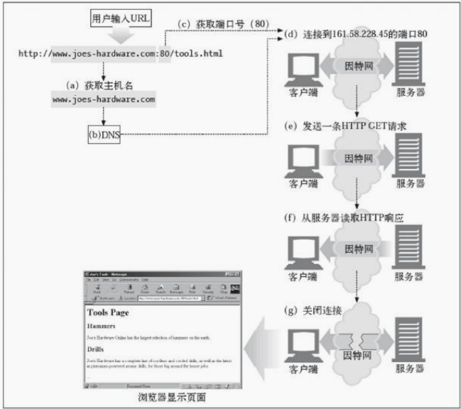
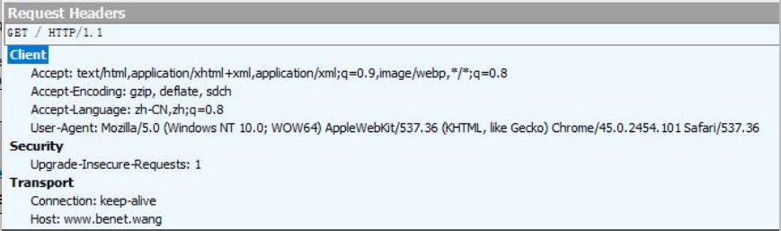
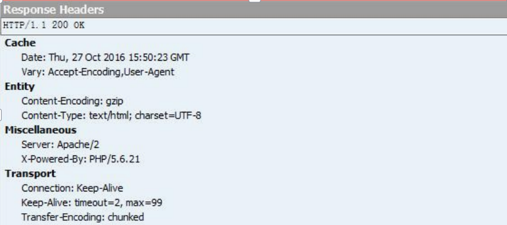
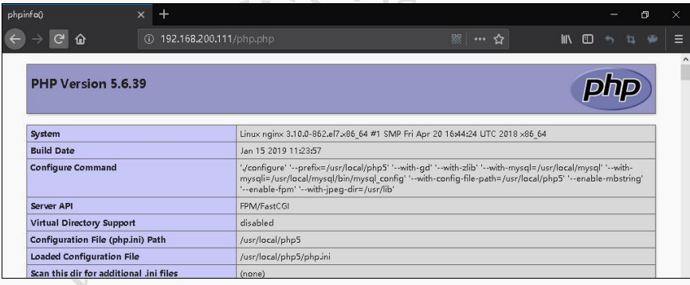
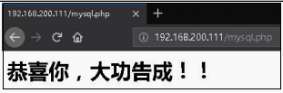

# WEB 基础原理
## 域名概述
域名解析的作用：

    主机数量增多时，IP 地址不容易记忆，域名方便记忆。域名记忆更加直观。

hosts 文件：

    早期通过 hosts 文件进行域名的解析，
    Linux 系统中 hosts 文件存放路径为/etc/hosts，
    Windows 系统中存放路径为 C:\Windows\System32\drivers\etc\hosts 内。


    hosts 文件以不足以存放，
    再加上主机名称数量庞大、主机维护困难等问题，出现了 DNS 域名解析服务
        1. 加快用户查询速度
        2. 便于管理服务器

DNS（Domain Name System）域名系统：

    （1）两大特点：分布式、层次性
    （2）域名空间结构：根域、顶级域（国家/地区域名）、二级域
    （3）完整域名格式：FQDN=主机名.DNS 后缀，例：www.sohu.com.


## 网页基本术语概述
- 网页：纯文本格式文件，其编写语言为 HTML，在用户的浏览器中被“翻译”成网页形
式显示出来
- 网站：网站是由一个一个页面构成的，是多个网页的结合体
- 主页：打开网站后出现的第一个网页称为网站主页（或首页 index.html）
- 域名：浏览网页时输入的网址（例如：www.sohu.com）
- HTTP：用来传输网页的通信协议（超文本传输协议）
- URL：是一种万维网寻址系统（统一资源定位符）
    http://www.baidu.com/jpg/1.jpg
- HTML：用来编写网页的超文本标记语言
- 超链接：将网站中不同网页链接起来的功能
- 发布(上线)：将制作好的网页上传到服务器供用户访问的过程
  
## Web 概述
Web 内容储存在 Web 服务器上，最简单的 Web 资源就是 Web 服务器文件系统中的静态文件，这些文件可以包含任意内容：文本文件、HTML 文件、微软的 Word 文件、Adobe的 Acrobat 文件、JPEG 图片文件、AVI 电影文件。
资源不一定是静态文件，资源还可以是根据需要生成内容的软件程序。
这些动态内容资源可以根据你的用户身份、所请求的信息或每天的不同时段来产生内容。

#### WEB1.0 与 WEB2.0（我们都在用，外网大部分是2.0）

    Web1.0 是以编辑为特征，网站到用户的单向行为。
    Web2.0 更注重用户的实时交互作用，实现了网站与用户双向的交流与参与。

#### 静态网页与动态网页：

静态网页：

    在网站设计中，纯粹 HTML 格式的网页通常被称为“静态网页”

    静态网页是标准的 HTML文件，扩展名是.htm、.html，
    可包含文本、图像、声音、FLASH 动画、客户端脚本和 ActiveX控件及 JAVA 小程序等

    适用于一般更新叫少的展示型网站（公司首页）

    ==每一个静态网页都有一个固定的 URL==，且 URL 以.htm、.html、.shtml 等常见形式为后缀，而不含有“?”

    静态网页是网站的基础
    静态网页是实实在在保存在服务器上的文件
    静态网页的内容相对稳定，因此容易被搜索引擎检索。

    静态网页没有数据库的支持，在网站制作和维护方面工作量非常大，当网站信息量很大时完全依靠静态网页制作方式比较困难

    静态网页的交互性极差

    废话：页面浏览速度迅速

==URL：统一资源定位符==
URI：URL一定是URI,URI不一定是URL
资源的位置


动态网页：

    动态网页是与静态网页相对应的、

    网页 URL 的后缀是以.aspx、.asp、.jsp、.php、.perl、.cgi 等形式为后缀，并且在动态网页网址中有一个==标志性的符号——“?”（URL是不固定的）（静态网页和动态网页的区别标志性"?"）==

    动态网页显示的内容可以随着时间、环境或者数据库操作的结果而发生改变  

    只要是采用了动态网站技术生产的网页都可以称为“动态网页”

    动态网页是基本的 html 语法与 Java、PHP 等高级程序设计语言、数据库编程等多种技术的融合，
    以实现对网站内容和风格的高效、动态和交互式管理。

    动态网页一般以数据库技术为基础，可以大大降低网站维护的工作量

    动态网页实际上并不是独立存在于服务器上的网页文件，
    只有当用户请求时服务器才返回一个完整的网页。

    动态页面中的“?”对搜索引擎检索存在一定的问题，搜索引擎一般不可能从一个网站
    的数据库中访问全部网页，或者处于技术方面的考虑，搜索之中不去抓取网址中“?”后面
    的内容，因此采用动态网页的网站在进行搜索引擎推广时需要做一定的技术处理（伪静态）才能适应搜索引擎的要求。

    动态网页语言是指编写动态网页相关程序的计算机高级语言。
    目前，最常用的动态网页语言有 ASP(Active Server Pages)，JSP(Java Server Pages)，PHP (Hypertext Preprocessor)

        ASP 只能运行于微软的服务器产品上。
        Unix 下也有 ChiliSoft 的插件来支持 ASP，
        但是 ASP 本身的功能有限，必须通过 ASP+COM 的组合来扩充，Unix 下的 COM实现起来非常困难。

        PHP3 可在 Windows、Unix、Linux 的 Web 服务器上正常运行,
        还支持IIS,Apache 等通用 Web 服务器,用户更换平台时,无需变换 PHP3 代码,可即拿即用.

        JSP 同PHP3 类似，几乎可以运行于所有平台
        台。如 Win NT、Linux、Unix。NT 下 IIS 通过一个插件，例如 JRUN 或者 ServletExec，就能支持 JSP。著名的 Web 服务器 Apache 已经能够支持 JSP.

    从一个平台移植到另外一个平台，JSP 和 JavaBean 甚至不用重新编译，
    因为 Java 字节码都是标准的和与平台无关的

# HTTP 超文本传输协议
端口号：

    http->80
    https->443
    
概述：

    HTTP 可以通过遍布全世界的 Web 服务器上将这些信息快迅速、便捷、可靠地搬移到人们桌面上的 Web 浏览器上去

    HTTP 协议是互联网上应用最为广泛的一种网络协议，设计这个协议的目的是为了发布和接收 Web 服务器上的 HTML 页面。
==HTTP/1.1 相较于 HTTP/1.0 协议的区别主要体现在：==（必背）
1. 缓存处理
2. 带宽优化及网络连接的使用
3. 错误通知的管理
4. 消息在网络中的发送
5. 互联网地址的维护
6. 安全性及完整性

HTTP 2.0
==HTTP 2.0 将只用于 https://网址==
而 http://网址将继续使用 HTTP/1
目的是在开放互联网上增加使用加密技术，以提供强有力的保护去遏制主动攻击
## HTTP方法
|方法|解释|用百度网盘和邮件通俗解释|
|:---:|---|---|---|
|GET|从服务器向客户端发送命名资源|在网盘里下载东西|
|PUT|将来自客户端的数据存储到一个命名的服务器资源中去|往网盘上传|文件
|DELETE|从服务器中删除命名资源|删除百度网盘里的资源|
|POST|将客户端数据发送到一个服务器网关应用程序|a用户通过服务器给b发送邮件|
|HEAD|仅发送命名资源响应中的HTTP首部|写信需要收件人信息，地址等|

## Apache httpd修改端口号
vim /etc/httpd/conf/httpd.conf

    注：4158是我们要求的端口，这样是允许使用4158端口


systemctl restart httpd.server
systemctl status httpd.server

如果重启失败：

或者

    [root@localhost named]# getenforce 
    Enforcing
    关闭selinux状态：（使用无启重启系统的方法）
    [root@localhost named]# setenforce 0  关闭命令
    [root@localhost named]# getenforce 
    Permissive  重新查看selinux状态
    [root@localhost named]# systemctl start httpd  

>注：如果这个还是不行，先把80端口删除，然后成功后再进行添加尝试
如果在浏览器里https：//www.wo..com:4158,用http://www.wo.com:4158
[selinux 管理命令semanage详解](https://blog.csdn.net/xu710263124/article/details/116017160?ops_request_misc=%257B%2522request%255Fid%2522%253A%2522166807167516800184183503%2522%252C%2522scm%2522%253A%252220140713.130102334..%2522%257D&request_id=166807167516800184183503&biz_id=0&utm_medium=distribute.pc_search_result.none-task-blog-2~all~top_positive~default-1-116017160-null-null.142^v63^js_top,201^v3^control_2,213^v2^t3_esquery_v3&utm_term=selinux%20&spm=1018.2226.3001.4187)
## ==http状态码==（必背）
当使用浏览器访问某一个 URL，会根据请求 URL 返回状态码
（通常）正常状态码：2xx,3xx
异常状态码：4xx,5xx

1、2xx

    200 OK
    请求成功

    201 Create
    请求已经被实现，而且有一个新的资源已经依据请求的需要而建立，且其 URI 已经随Location 头信息返回

    202 Accepted
    服务器已接受请求，但尚未处理。（访问的人过多，有可能会被正常回应，有可能会被被拒绝）（排队买饭，轮到你的时候，饭卖完了）

2、3xx 重定向

    301 Moved Permanently 移动 永久性的
    访问s资源，s资源在A服务器上，只要访问s资源，就会定向到A服务器。

    302 Moved temporariliy 临时 重定向
    访问s资源，A服务器对s资源有疑问、或者其他原因无法访问，而B服务器上有，这是就会定向到B资源来访问s资源


3、4xx 

    400 Bad Request
    1、语义有误，当前请求无法被服务器理解。除非进行修改，否则客户端不应该重复提
    交这个请求。
    2、请求参数有误。

    *401 Unauthorized
    无论什么原因，认证失败

    403 Forbidden
    请求没有任何问题，请求资源，就是不给。
    原因：没有rw权限，防火墙没有关...

    404 NOT Found
    访问的资源不存在
    原因：可能是服务器压根没有这个页面

    405 Method Not Allowed
    权限不足
    这个文件为只读，你去修改。 

    408 Request Timeout
    请求超时（说白点就是网速不好）

5、服务器错误（5、6字头）

    500 Internal Server Error
    服务器遇到了一个未曾预料的状况，导致了它无法完成对请求的处理。一般来说，这个问题都会在服务器端的源代码出现错误时出现。

    502 Bad Gateway
    作为网关或者代理工作的服务器尝试执行请求时，从上游服务器接收到无效的响应。

    503  Service Unavailable 302的A
    由于临时的服务器维护或者过载，服务器当前无法处理请求。
        Retry-After 10s 10秒后重试
    或者单纯的不想理你

    504 Gateway Timeout
    作为网关或者代理工作的服务器尝试执行请求时，未能及时从上游服务器（URI 标识出的服务器，例如 HTTP、FTP、LDAP）或者辅助服务器（例如 DNS）收到响应。
    其中之一类似于100网段去101网段，不通
    注意：某些代理服务器在 DNS 查询超时时会返回 400 或者 500 错误
## HTTP 协议请求流程分析

## HTTP 报文格式详解
#### HTTP 请求发送消息报文格式：

    一次完整的 http 请求消息包括：
    一个请求行，若干消息头以及实体内容，
    而消息头和实体内容可以没有
    消息头和实体内容之间有一个空行标识头部信息结束



    GET / HTTP/1.1 //提交方法与 HTTP 协议版本

    Host: www.benet.wang //主机名

    Connection: keep-alive //是否保持连接

    Accept: text/html,application/xhtml+xml,application/xml;q=0.9,image/webp,*/*;q=0.8 //媒体类型

    Upgrade-Insecure-Requests: 1 //支持升级不安全请求，既是不适用 http 而是 https

    User-Agent: Mozilla/5.0 (Windows NT 10.0; WOW64) AppleWebKit/537.36 (KHTML, like Gecko)Chrome/45.0.2454.101 Safari/537.36 //客户端类型

    Accept-Encoding: gzip, deflate, sdch //网页支持压缩

    Accept-Language: zh-CN,zh;q=0.8 //语言类型


#### HTTP 响应消息的格式

    一个状态行、若干消息头和实体内容
>

>
    HTTP/1.1 200 OK //HTTP 协议版本与状态码

    Date: Thu, 27 Oct 2016 15:50:23 GMT //日期与时间

    Server: Apache/2 //服务器版本信息

    X-Powered-By: PHP/5.6.21 //动态服务器版本信息

    Content-Encoding: gzip //传输压缩

    Vary: Accept-Encoding,User-Agent

    Keep-Alive: timeout=2, max=99 //长连接时间

    Connection: Keep-Alive //支持长连接

    Transfer-Encoding: chunked

    Content-Type: text/html; charset=UTF-8 //媒体类型与字符集

```
[root@localhost ~]# curl -I(大写i) http://www.benet.wang
HTTP/1.1 200 OK
Date: Thu, 27 Oct 2016 16:36:18 GMT
Server: Apache/2
X-Powered-By: PHP/5.6.21
Vary: Accept-Encoding,User-Agent
Content-Type: text/html; charset=UTF-8
```


## DNS 解析流程

    在浏览器里输入www.baidu.com，背后发生了什么？
    1.浏览器分析www.baidu.com
    2.查找浏览器 DNS 缓存及本机 hosts 文件(如果没有，下一步)
        浏览器向DNS服务器请求解析ip地址（如果没有，下一步）
            LDNS 查找根域服务器找到.com 服务器
            LDNS 查找.com 顶级域服务器 baidu.com 服务器
            LDNS 请求 baidu.com 服务器
            baidu.com 服务器返回 www.baidu.com 域名的 IP 解析记录给 LDNS
    3.ldns将解析出来的ip地址返回给浏览器(LDNS 返回给客户机解析记录及缓存到本地)
    4.三次握手，浏览器与服务器进行tcp连接
    5.浏览器向服务器请求html文件
    6.服务器返回html文件给浏览器
    7.四次挥手，浏览器与服务器断开tcp请求
    8.浏览器执行html文件，渲染页面

>
    [root@localhost ~]# dig +trace www.baidu.com

    ; <<>> DiG 9.9.4-RedHat-9.9.4-61.el7 <<>> +trace www.baidu.com
    ;; global options: +cmd
    .			2371	IN	NS	b.root-servers.net.
    .			2371	IN	NS	m.root-servers.net.
    .			2371	IN	NS	c.root-servers.net.
    .			2371	IN	NS	j.root-servers.net.
    .			2371	IN	NS	h.root-servers.net.
    .			2371	IN	NS	e.root-servers.net.
    .			2371	IN	NS	l.root-servers.net.
    .			2371	IN	NS	a.root-servers.net.
    .			2371	IN	NS	f.root-servers.net.
    .			2371	IN	NS	i.root-servers.net.
    .			2371	IN	NS	d.root-servers.net.
    .			2371	IN	NS	k.root-servers.net.
    .			2371	IN	NS	g.root-servers.net.
    ;; Received 239 bytes from 114.114.114.114#53(114.114.114.114) in 432 ms
    #a-m 共 13 台根域 DNS 服务器，b.root-servers.net.负责了本次解析

    com.			172800	IN	NS	a.gtld-servers.net.
    com.			172800	IN	NS	b.gtld-servers.net.
    com.			172800	IN	NS	c.gtld-servers.net.
    com.			172800	IN	NS	d.gtld-servers.net.
    com.			172800	IN	NS	e.gtld-servers.net.
    com.			172800	IN	NS	f.gtld-servers.net.
    com.			172800	IN	NS	g.gtld-servers.net.
    com.			172800	IN	NS	h.gtld-servers.net.
    com.			172800	IN	NS	i.gtld-servers.net.
    com.			172800	IN	NS	j.gtld-servers.net.
    com.			172800	IN	NS	k.gtld-servers.net.
    com.			172800	IN	NS	l.gtld-servers.net.
    com.			172800	IN	NS	m.gtld-servers.net.
    com.			86400	IN	DS	30909 8 2 E2D3C916F6DEEAC73294E8268FB5885044A833FC5459588F4A9184CF C41A5766
    com.			86400	IN	RRSIG	DS 8 1 86400 image/20221129050000 image/20221116040000 18733 . bYrpeG8BQwcBqLEVw9INt1/OnmhOkAUg7Sm9eUojc7eFX6FGxwZ4UW6t xOlfxKfirdNdU0qcKFH1HzOzAAklm6bQRTbYfH70mhgx3TIICvhSEyOd 5FNKF5TXW1n/IlJEOpCr/CrJJr9vvZeWEuXBdoi8rYKda+qP/Qix89Hv 3Ok75nPQaU3P3X+wPy1iOzhzA+Lf0NLgMdJ5Vpn56mfEknY1i85JxMCY Aux+WBfUz8/t7NkPuao9YZGL+bdtc9xGK3tjds+CiWC4fcflJap4iBxI a7HCcvCSN3s4Zai66yUgtUHZd3VgUQ0AvUwpv1SB+pkb1OO7s0JEei9j 908SAw==
    ;; Received 1173 bytes from 198.97.190.53#53(h.root-servers.net) in 563 ms
    #解析 com 顶级域的共有 13 台 DNS 服务器，a.gtld-servers.net.负责了本次解析

    baidu.com.		172800	IN	NS	ns2.baidu.com.
    baidu.com.		172800	IN	NS	ns3.baidu.com.
    baidu.com.		172800	IN	NS	ns4.baidu.com.
    baidu.com.		172800	IN	NS	ns1.baidu.com.
    baidu.com.		172800	IN	NS	ns7.baidu.com.
    CK0POJMG874LJREF7EFN8430QVIT8BSM.com. 86400 IN NSEC3 1 1 0 - CK0Q2D6NI4I7EQH8NA30NS61O48UL8G5 NS SOA RRSIG DNSKEY NSEC3PARAM
    CK0POJMG874LJREF7EFN8430QVIT8BSM.com. 86400 IN RRSIG NSEC3 8 2 86400 image/20221123052440 image/20221116041440 53929 com. ZUdEEARXlE/v/SQkLiEQvwDFsBGFAdXhxokTtx1/YJy494+WjFoyS4C9 q6xWV0rcacdSOwQP4c4IDUmOm8YSczNNY5MgJnf/NU3M32oklsCLBOyk 7hj2NNrQDmG31AW8iJ5SdAXA5QcYVk7HjpnPtlYlVwCG1Pnyp6+Ve6DH IYstkZbna6PqmYv86MJDasJxpN8RPAAizR7wPrQZjYtQrw==
    HPVUVSGH5TFIA7CM6SS6SMPOS87OE0CE.com. 86400 IN NSEC3 1 1 0 - HPVV8SARM2LDLRBTVC5EP1CUB1EF7LOP NS DS RRSIG
    HPVUVSGH5TFIA7CM6SS6SMPOS87OE0CE.com. 86400 IN RRSIG NSEC3 8 2 86400 image/20221123064134 image/20221116053134 53929 com. kpIuYbLpFODJvjR7E7fn0XbFBtjAiMUyijbQXohwWfd8PNOweUq0k5te TStt1vx/NYE1/tR+JrT7uDFuy+DMh3JzQPJ3LnWghzqzX+EXSBG2qN2V 2RqX0n1c0aqNdl07w0qAHfGuMTHoJoO0kPCq/2TN/o0KvpPSK488PjGG MONiQhluoAQdndcp7o6z0Yl/e87aCdBIyLi7uCJU9d6KiA==
    ;; Received 849 bytes from 192.26.92.30#53(c.gtld-servers.net) in 390 ms
    #解析 baidu.com 的有 5 台服务器，dns.baidu.com. 负责了本次解析


    www.baidu.com.		1200	IN	CNAME	www.a.shifen.com.
    ;; Received 72 bytes from 111.45.3.226#53(ns4.baidu.com) in 41 ms

---
---
# ==日志分割(必会)==
## Apache 日志分割

    随着网站访问量的增加，访问日志中的信息会越来越多，Apache 默认访问日志（access_log）单个文件会越来越大，日志文件体积越大，信息都在一个文件中，查看及分析信息会及不方便，导致日志打不开

Apache 的日志切割的方式：
第 1 种：利用 apache 自带的日志轮循程序 rotatelogs
第 2 种：利用一个发展已经比较成熟的日志轮循工具 cronolog
==第 3 种：利用定时任务和 shell 脚本做日志切割==

#### rotatelogs 分割工具

    主配置文件中的使用方法
    ErrorLog "|rotatelogs 命令的绝对路径 -l logs/error_%Y%m%d_%H%M%S.log 秒数" CustomLog "| rotatelogs 命令的绝对路径 -l logs/access_%Y%m%d_%H%M%S.log 秒数" combined

    虚拟主机配置文件中的使用方法
    ErrorLog "| rotatelogs 命令的绝对路径-l logs/网站名-error_%Y%m%d_%H%M%S.log 秒数" CustomLog "| rotatelogs 命令的绝对路径-l logs/网站名-access_%Y%m%d_%H%M%S.log 秒数" combined

操作案例：

    [root@localhost ~]# awk '/httpd-vhosts/{print NR,$0}' /usr/local/httpd/conf/httpd.conf
    398 Include conf/extra/httpd-vhosts.conf
    [root@localhost ~]# cat /usr/local/httpd/conf/extra/httpd-vhosts.conf
    <VirtualHost 192.168.200.101>
    DocumentRoot "/usr/local/httpd/htdocs/baidu" ServerName www.baidu.com

    # 重点
    ErrorLog "|/usr/local/httpd/bin/rotatelogs -l
    /usr/local/httpd/logs/baidu.com-error_%Y%m%d_%H%M%S.log 10"
    CustomLog "|/usr/local/httpd/bin/rotatelogs -l
    /usr/local/httpd/logs/baidu.com-access_%Y%m%d_%H%M%S.log 10" combined
    </VirtualHost>

    // -l 选项表示 localtime
    // 10 表示十秒切割一次（一天 86400）

    [root@localhost ~]# httpd -t
    Syntax OK
    [root@localhost ~]# mkdir /usr/local/httpd/htdocs/baidu
    [root@localhost ~]# echo "www.baidu-test.com" > /usr/local/httpd/htdocs/baidu/index.html
    [root@localhost ~]# service httpd stop
    [root@localhost ~]# service httpd start

    浏览器访问: http://192.168.200.101 测试：
    [root@localhost ~]# ls /usr/local/httpd/logs/baidu.com*
    /usr/local/httpd/logs/baidu.com-access_20161028_111440.log
    /usr/local/httpd/logs/baidu.com-access_20161028_111820.log
    /usr/local/httpd/logs/baidu.com-access_20161028_111500.log

按天轮询:

    CustomLog "|/usr/local/httpd/bin/rotatelogs -l /usr/local/httpd/logs/access_%Y%m%d.log
    86400" combined

按周轮询:

    CustomLog "|/usr/local/httpd/bin/rotatelogs -l /usr/local/httpd/logs/access_%w.log 604800 "combined

按小时轮询:

    CustomLog "|/usr/local/httpd/bin/rotatelogs –l /usr/local/httpd/logs/access_%Y%m%d%H.log 3600" combined

#### cronolog 分割工具
说明：

    cronolog 是一个简单的过滤程序，读取日志文件条目从标准输入和输出的每个条目并写入指定的日志文件的文件名模板和当前的日期和时间。当扩展文件名的变化，目前的文件是关闭，新开辟的。cronolog 旨在和一个 Web 服务器一起使用，如 Apache，分割访问日志为每天或每月的日志。

    cronolog 主要和 Web 服务器配置使用，特别是 Apache 服务器，Apache 默认日志文件是不分割的，一个整文件既不易于管理，也不易于分析统计。安装 cronolog 后，可以将日志文件按时间分割，易于管理和分析。

时间域:

    H 小时(00..23)
    I 小时(01..12)
    M 分钟(00..59)
    S 秒 (00..60)

日期域:

    d 当月中的天数 (01 .. 31)
    j 当年中的天数 (001 .. 366)
    m 月数 (01 .. 12)
    U 当年中的星期数，以周日作为一周开始,其中第一周为首个含星期天的星期(00..53)
    W 当年中的星期数，以星期一作为一周的开始,其中第一周为首个含星期天的星期(00..53)
    w 工作日数(0 .. 6, 0 表示星期天)
    y 两位数的年份(00 .. 99)
    Y 四位数的年份(1970 .. 2038)

主配置文件中的使用方法

    ErrorLog "|cronolog 命令的绝对路径 -l /usr/local/httpd/logs/error_%Y%m%d%H%M%S.log " CustomLog "|cronolog 命令的绝对路径 -l /usr/local/httpd/logs/access_%Y%m%d%H%M%S.log" combined

虚拟主机配置文件中的使用方法

    ErrorLog "|cronolog 命令的绝对路径 -l /usr/local/httpd/logs/网站名-error_%Y%m%d%H%M%S.log " CustomLog "|cronolog 命令的绝对路径 -l /usr/local/httpd/logs/网站名-access_%Y%m%d%H%M%S.log " combined

操作案例：

    下载 cronlog 软件:
    [root@localhost ~]# wget http://down1.chinaunix.net/distfiles/cronolog-1.6.2.tar.gz

    [root@localhost ~]# tar xf cronolog-1.6.2.tar.gz -C /usr/src/
    [root@localhost ~]# cd /usr/src/cronolog-1.6.2/
    [root@localhost cronolog-1.6.2]# ./configure && make && make install
    [root@localhost ~]# which cronolog
    /usr/local/sbin/cronolog
    [root@localhost ~]# awk '/httpd-vhosts/{print NR,$0}' /usr/local/httpd/conf/httpd.conf
    398 Include conf/extra/httpd-vhosts.conf
    [root@localhost ~]# cat /usr/local/httpd/conf/extra/httpd-vhosts.conf
    <VirtualHost 192.168.200.101>
    DocumentRoot "/usr/local/httpd/htdocs/baidu" ServerName www.baidu.com
    ErrorLog "|/usr/local/sbin/cronolog -l
    /usr/local/httpd/logs/baidu.com-error_%Y%m%d%H%M%S.log" CustomLog "|/usr/local/sbin/cronolog
    /usr/local/httpd/logs/baidu.com-access_%Y%m%d%H%M%S.log" combined
    </VirtualHost>
    [root@localhost ~]# httpd -t
    Syntax OK
    [root@localhost ~]# mkdir /usr/local/httpd/htdocs/baidu
    [root@localhost ~]# echo "www.baidu-test.com" > /usr/local/httpd/htdocs/baidu/index.html
    [root@localhost ~]# service httpd stop
    [root@localhost ~]# service httpd start

    浏览器访问: http://192.168.200.101 测试：
    [root@localhost ~]# ls /usr/local/httpd/logs/baidu.com*
    /usr/local/httpd/logs/baidu.com-access_20161028114221.log
    /usr/local/httpd/logs/baidu.com-access_20161028114222.log

#### SHELL 脚本分割

    [root@localhost ~]# vim /opt/cut_httpd_log.sh

    #!/bin/bash
    logpath="/usr/local/httpd/logs" 

**datetime=$(date -d "-1 day" "+%Y%m%d")**


    [ -d $logpath/backup ] || mkdir $logpath/backup

    mv $logpath/access_log $logpath/backup/access_log-$datetime 
**/usr/local/httpd/bin/apachectl graceful**

**find $logpath/backup/ -mtime +30 | xargs rm -f**（专业证明）

    [root@localhost ~]# chmod +x /opt/cut_httpd_log.sh
    [root@localhost ~]# echo "00 00 * * * /bin/bash /opt/cut_httpd_log.sh &> /dev/null" >
    /var/spool/cron/root
    [root@localhost ~]# service crond restart

    注解：
    apachectl -k graceful
    会重新加载配置，但不会停止现有的正在处理的请求。主进程和正在有请求的进程不会变化。但如果配置文件语法有错误，apache 服务将会停止。

    systemctl reload httpd
    会重新加载配置，现有的请求会被中断，除了主进程外其他的进程都被重建。如果配置文件有语法问题的话，不会加载新的配置操作，保持原有配置，apache 服务也不会停止。

## 日志合并
可以将每个服务器每天的日志文件通过rsync下载到专门进行访问统计分析的服务器上进行合并。

合并多个服务器的日志文件，例如：log1 log2 log3 并输出到 log_all 中的方法是：
```sort -m -t " " -k 4 -o log_all access_log1 access_log2 access_log3```

    -m 使用 merge 优化算法
    -k 4 表示根据时间进行排序
    -o 表示将排序结果存放到指定的文件中

    [root@localhost logs]# sort -m -t " " -k 4 -o apache_log baidu.com-access_20161028121053.log
    baidu.com-access_20161028121054.log baidu.com-access_20161028121055.log
    [root@localhost logs]# cat apache_log
    192.168.200.2 - - [28/Oct/2016:12:10:53 +0800] "GET / HTTP/1.1" 304 - "-" "Mozilla/4.0
    (compatible; MSIE 7.0; Windows NT 6.1; WOW64; Trident/4.0; SLCC2; .NET CLR 2.0.50727; .NET
    CLR 3.5.30729; .NET CLR 3.0.30729; Media Center PC 6.0; InfoPath.3; .NET4.0C; .NET4.0E)" 192.168.200.2 - - [28/Oct/2016:12:10:54 +0800] "GET / HTTP/1.1" 304 - "-" "Mozilla/4.0
    (compatible; MSIE 7.0; Windows NT 6.1; WOW64; Trident/4.0; SLCC2; .NET CLR 2.0.50727; .NET
    CLR 3.5.30729; .NET CLR 3.0.30729; Media Center PC 6.0; InfoPath.3; .NET4.0C; .NET4.0E)"

## nginx 日志切割

    [root@nginx ~]# vim /opt/cut_nginx_log.sh

    #!/bin/bash
    ==datetime=$(date -d "-1 day" "+%Y%m%d")==

    logs_path="/var/log/nginx" 
    pid_path="/usr/local/nginx/logs/nginx.pid"
    [ -d $logs_path ] ||mkdir -p $logs_path
    if [ -f $pid_path ];then
    mv /usr/local/nginx/logs/access.log $logs_path/access.log-$datetime
    ==kill -USR1 $(cat $pid_path)==
    find $logs_path -mtime +30 |xargs rm -f

    else

    echo "Error,Nginx is not working!" |tee -a /var/log/messages

    fi

    [root@nginx ~]# chmod +x /opt/fenge.sh
    [root@nginx ~]# echo "00 00 * * * /bin/bash /opt/cut_nginx_log.sh &> /dev/null" > /var/spool/cron/root

    [root@nginx ~]# /opt/cut_nginx_log.sh
    [root@nginx ~]# ls /var/log/nginx/
    access.log-20161028
    
    [root@nginx ~]# killall -9 nginx
    [root@nginx ~]# /opt/cut_nginx_log.sh
    Error,Nginx is not working!
    [root@nginx ~]# tail -1 /var/log/messages
    Error,Nginx is not working!

---
---
# 安装 PHP 解析环境
    较新版本（如 5.6）的 PHP 已经自带 FPM(fastCGI process manager,FastCGI 进程管理器)模块，用来对 PHP 解析实例进行管理，优化解析效率，因此在配置 PHP 编译选项时应添加"--enable-fpm"以启用此模块
 
#### 编译安装 php

    [root@nginx ~]# yum -y install gd libxml2-devel libjpeg-devel libpng-devel
    [root@nginx ~]# tar xf php-5.6.39.tar.gz -C /usr/src/
    [root@nginx ~]# cd /usr/src/php-5.6.39/
    [root@nginx php-5.6.39]# ./configure --prefix=/usr/local/php5 --with-gd --with-zlib
    --with-mysql=/usr/local/mysql --with-mysqli=/usr/local/mysql/bin/mysql_config
    --with-config-file-path=/usr/local/php5 --enable-mbstring --enable-fpm --with-jpeg-dir=/usr/lib
    && make && make install

#### 安装后的调整

    [root@nginx php-5.6.39]# cp php.ini-production /usr/local/php5/php.ini
    [root@nginx php-5.6.39]# ln -s /usr/local/php5/bin/* /usr/local/bin/
    [root@nginx php-5.6.39]# ln -s /usr/local/php5/sbin/* /usr/local/sbin/

#### ZendGuardLander
    为了提高 PHP 解析效率，建议将相应版本的 ZendGuardLander 也装上。安装 ZendGuardLander(注意：若是 64 位系统，该软件得到其官网下载 64 位的相应软件包，若用 32 位的就会报错。下载地址：http://www.zend.com/en/products/guard/downloads）
>
    [root@nginx ~]# tar xf zend-loader-php5.6-linux-x86_64_update1.tar.gz -C /usr/src/
    [root@nginx ~]# cd /usr/src/zend-loader-php5.6-linux-x86_64/
    [root@nginx zend-loader-php5.6-linux-x86_64]# cp ZendGuardLoader.so
    /usr/local/php5/lib/php/
    [root@nginx zend-loader-php5.6-linux-x86_64]# vim /usr/local/php5/php.ini
    zend_extension=/usr/local/php5/lib/php/ZendGuardLoader.so
    zend_loader.enable=1
---
---
# LNMP架构
$LNMP(linux,nginx,mysql,php)$

    LNMP 也称为 LEMP，E 来自于 Nginx 的发音[engine x],LNMP 就像构建 LAMP 平台一样，构建 LNMP 平台也需要用到 Linux 服务器，MySQL 数据库，PHP 解释环境等应用。P（PHP、Perl、Python）

$即在linux操作系统上，部署nginx——>mysql——>php$
 
#### 配置 Nginx 支持 PHP 环境
若要让 Nginx 能够解析 PHP 网页，有两种方法可以选择：
其一：Nginx 充当中介，将访问 PHP 页面的 WEB 请求转交给其他服务器（LAMP）去处理； 
其二：==通过使用 PHP 的 FPM模块来调用本机的 PHP 环境。==

如果选用 FPM 方式，则需要先启动 php-fpm 进程，以便监听 PHP 解析请求。参考范例
建立 php-fpm.conf 配置文件，并修改其中的 PID 文件、运行用户、服务数（进程数量）等相关设置，然后启动 php-fpm 程序即可（默认监听本机的 9000 端口）

    [root@nginx ~]# cd /usr/local/php5/etc/
    [root@nginx etc]# cp php-fpm.conf.default php-fpm.conf
    [root@nginx etc]# useradd -M -s /sbin/nologin php
    [root@nginx etc]# vim php-fpm.conf

    25 pid = run/php-fpm.pid //确认 pid 文件位置
    149 user = php //运行用户
    150 group = php //运行组
    241 pm.max_children = 50 //最多空闲进程数
    246 pm.start_servers = 20 //启动时开启的进程数
    251 pm.min_spare_servers = 5 //最少空闲进程数
    256 pm.max_spare_servers = 35 //最大空闲进程数

    [root@nginx etc]# /usr/local/sbin/php-fpm
    [root@nginx etc]# netstat -anpt |grep php-fpm
    tcp 0 0 127.0.0.1:9000 0.0.0.0:* LISTEN
    23027/php-fpm.conf)

#### 在启动/停止 Nginx 服务器时将 php-fpm 进程也自动启动/停止
在php-fpm.conf 文件中，pid 配置行指出了 PID 信息的存放位置，对应的实际路径为/usr/local/php5/var/run/php-fpm.pid，
根据上述信息，可以修改 Nginx 服务脚本，以便在启动/停止 Nginx 服务器时将 php-fpm 进程也自动启动/停止

    [root@nginx etc]# vim /etc/init.d/nginx
    #!/bin/bash
    # chkconfig: 2345 99 20
    # description: Nginx Server Control Script
    PROG="/usr/local/nginx/sbin/nginx"
    PIDF="/usr/local/nginx/logs/nginx.pid" PROG_FPM="/usr/local/sbin/php-fpm" PIDF_FPM="/usr/local/php5/var/run/php-fpm.pid"
    case "$1" in
    start)
    $PROG
    $PROG_FPM
    ;;
    stop)
    kill -s QUIT $(cat $PIDF)
    kill -s QUIT $(cat $PIDF_FPM)
    ;;
    restart)
    $0 stop
    $0 start
    ;;
    reload)
    kill -s HUP $(cat $PIDF)
    ;;*)
    echo "Usage: $0 (start|stop|restart|reload)" exit 1
    esac
    exit 0
#### 配置 Nginx 支持 PHP 解析
$无论是将 PHP 页面交给 LAMP 服务器去解析，$
$还是调用本机的 php-fpm进程进行解析，$
$都需要在"server{}"配置段中添加 location 设置，以便指定当访问.php 面页时采取何种操作。$

对于第一种方法使用 Nginx 的反向代理功能（转交给其他 WEB 服务器处理），使用的配置语句如下所示：
例如，交给 IP 地址为 192.168.200.112 的 LAMP 服务器处理，从而实现由 Nginx负责静态页面，LAMP 负责动态页面的分离效果。

    [root@nginx etc]# vim /usr/local/nginx/conf/nginx.conf
    server { ……
    location ~ \.php$ { //访问.php 页面的配置段
    proxy_pass http://192.168.200.112:80; //LAMP 服务器的监听地址
    }
    }

对于第二种方法（调用本机的 php-fpm 进程），使用的配置语句如下所示。
在 conf/目录下的 fastcgi.conf 文件中已经包含必需的宏设置，可通过 include 语句添加进来。

    [root@nginx etc]# vim /usr/local/nginx/conf/nginx.conf

    server { …… //省略部分信息
        location / {
                root html;
                index index.php index.html index.htm;
    }
        location ~ \.php$ { //访问 php 页面的配置段
                root html; //PHP 网页文档根目录
                fastcgi_pass 127.0.0.1:9000; //php-fpm 的监听地址
                fastcgi_index index.php; //PHP 首页文件
                include fastcgi.conf; //包括 fastcgi.conf 样本配置
    }
    }

    [root@nginx etc]# killall -HUP nginx
#### 测试
$在 PHP 文档根目录下创建一个测试网页，以便测试 PHP 语名能否正常解析，以及能否访问MYSQL 数据库。$
$测试页内容如下 ：$

    [root@nginx ~]# cat /usr/local/nginx/html/php.php
    <?php
    phpinfo();
    ?>


    [root@nginx etc]# vim /usr/local/nginx/html/mysql.php
    <?php
    $link=mysqli_connect('localhost','root','123456'); //连接 mysql 数据库
    if($link) echo "<h1>恭喜你，大功告成！！</h1>"; //连接成功则返回信息
    mysqli_close(); //关闭数据库连接
    ?>


---
---