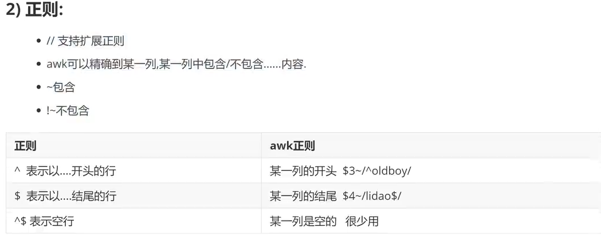
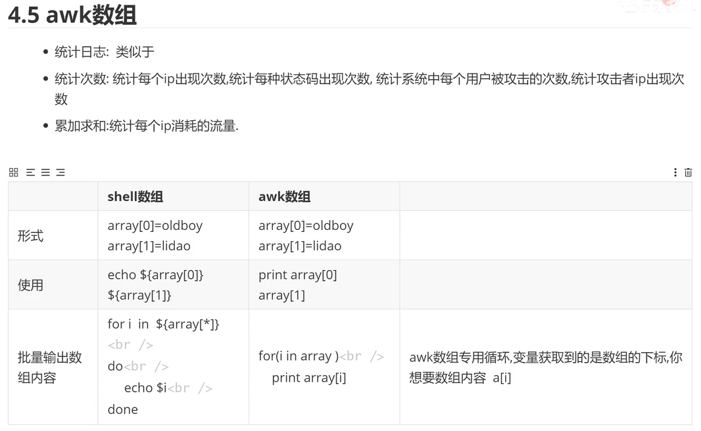
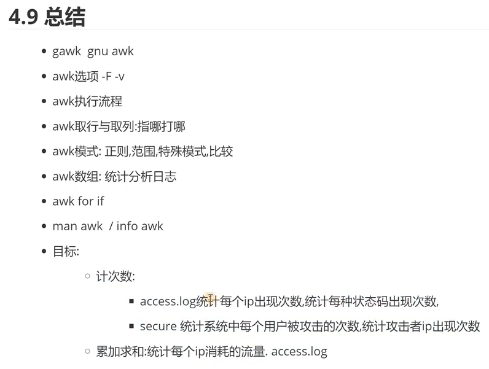

# [三剑客](https://blog.csdn.net/sj349781478/article/details/82930982?)

## awk

gawk aun awk:是gun项目里的
真正的awk是unix里的，但是功能极少

```powershell
刷题：

1、只显示/etc/passwd的账户

2、只显示/etc/passwd的账户和对应的shell，而账户与shell之间以制表符分割，并在第一行上添加列名lee制表符/bin/bash，最后一行添加chen制表符/sbin/nologin

3、搜索/etc/passwd有关键字root的所有行

4、统计/etc/passwd文件中，每行的行号，每列的列数，对应的完整行内容以制表符分隔

5、输出/etc/passwd文件中以nologin结尾的行

6、统计/etc/passwd文件中以/bin/bash 结尾的行数

7、输出/etc/passwd文件中uid字段小于100的行

8、/etc/passwd文件中gid字段大于200的，输出该行第一、第四字段

9、awk配合if判断/etc/passwd文件中uid字段大于等于100则输出该行

10、在 a b f g h 的b后面插入三个字段c d e

11、将1.txt文件中的内容格式化空白，并以制表符隔开进行输出

12、编写监控脚本sysmon.sh,存在异常时邮件告警
监控CPU使用率、内存使用率、根分区的占用率
百分比精确到个位,如7%、12%
出现以下情况时告警:磁盘占用率超过90%、CPU使用率超过80%、内存   使用率超过90%

1、将1.txt文件中内容以一行输出，反向排序并去重（要求没有重复数字）

cat 123.txt 
1 4 7 9 4
2 5 8 3 8
3 6 9 7 6

2、在/etc/passwd文件中，如果第一字段为root，则输出该行，否则输出第三字段

3、在/etc/shadow文件中，如果第二字段为！！则输出该行，如果为*则输出第一字段，都不是则输出第五字段

4、  -v   参数传递，定义和引用变量 ，可以把外部变量引入到内部   

1、获取本机ens33网卡IP，适用于一键部署自动化脚本


```

找谁{干啥}
条件{动作}

### 列和行

|                名词                | awk中的叫法    | 一些说明                     |
| :---------------------------------: | -------------- | ---------------------------- |
|                 行                 | 记录record     | 每一行默认通过回车进行分割的 |
|                 列                 | 字段、域 field | 每一列默认通过空格分割的     |
| awk中列和行的结束标记都是可以修改的 |                |                              |

#### 取行

| awk          |                          |
| ------------ | ------------------------ |
| NR==a        | 取出第a行                |
| NR>=1&&NR<=5 | 取出一到五行范围         |
| /oldboy/     | 过滤出oldboy             |
| /101/,/104/  | 含101数字的行到含104的行 |
| 符号         | > < >= <= == !=          |

#### 取列

- -F 指定分隔符，指定每一列结束标记（默认是空格）
- $数字 取出某一列。（$0表示整行的内容）
- {print +++ }

| 内置变量 | 英文                              | 意思                                                                       |
| -------- | --------------------------------- | -------------------------------------------------------------------------- |
| NR       | number of record                  | 记录号，行号                                                               |
| NF       | number of field                   | 每行有多少字段（列） $NF表示最后一列                                       |
| FS       | "-F:" =="-v FS=:" field separator | 字段分隔符，每个字段结束标记                                               |
| OFS      | output field separator            | 输出字段分隔符（awk显示每一列的时候，每一列之间通过什么分割，默认是空格 ） |




```powershell
统计次数：'{array[$1]++}END{for(i in array)print i array[i]} 表示统计$1中重复的内容及其次数。
```



自动对齐命令：column -t

## sed

#### 1

sed命令核心功能：增删改查

| 功能 | 解释               |
| ---- | ------------------ |
| s    | 替换substitute sub |
| p    | 显示print          |
| d    | 删除delete         |
| cai  | 增加c\a\i          |

#### sed核心应用

- 找哪一行进行增删改查

##### **sed-查找p**

|      查找格式      | spdcai格式都是通用的             |
| :----------------: | -------------------------------- |
|     '1p','2p'     | 指定行号进行查找                 |
|       '1,5p'       | 指定行号的范围进行查找           |
|    '/liming/p'    | 类似于grep，过滤"//"里面支持正则 |
| '/10:00/,/11:00/p' | 表示范围的一个过滤               |
|         -n         | 固定搭配输出某一行，一范围       |
|         $p         | 表示最后一行                     |
|         !p         | 不显示                           |

```powershell
## -n选项

[root@main 1]# sed -n '1p' txt 
101,lihua,CEO

如果不加-n的话，会打印出来那一行，并后面显示全部
[root@main 1]# sed  '1p' txt 
101,lihua,CEO
101,lihua,CEO
102,lixiang,CTO
103,zhangming,CRO
104,xiaoming,CEO
105,waixingren,CFO
106,daxiang,CUO
107,tiger,CRO101,lihua,CEO

[root@main 1]# sed -n '1,3p' txt 
101,lihua,CEO
102,lixiang,CTO
103,zhangming,CRO

[root@main 1]# sed -n '/101/,/103/p' txt 
101,lihua,CEO
102,lixiang,CTO
103,zhangming,CRO
107,tiger,CRO101,lihua,CEO

[root@main 1]# sed -n '/li/p' txt 
101,lihua,CEO
102,lixiang,CTO
107,tiger,CRO101,lihua,CEO

[root@main 1]# sed -n '/101/,/1006/p' txt 
101,lihua,CEO
102,lixiang,CTO
103,zhangming,CRO
104,xiaoming,CEO
105,waixingren,CFO
106,daxiang,CUO
107,tiger,CRO101,lihua,CEO

##搭配正则
[root@main 1]# sed -nr '/[0-3]{3}/p' txt 
101,lihua,CEO
102,lixiang,CTO
103,zhangming,CRO
107,tiger,CRO101,lihua,CEO

```

##### **sed-删除d**

删除行用删除，删除某个字节用替换，替换为空格

|      查找格式      |                                              |
| :----------------: | :-------------------------------------------: |
|     '1d','2d'     |               指定行号进行删除               |
|       '1,5d'       |            指定行号的范围进行删除            |
|    '/liming/d'    |       类似于grep，过滤"//"里面支持正则       |
| '/10:00/,/11:00/d' |            表示范围的一个过滤删除            |
|        -r,        | --regexp-extended，在脚本中使用扩展正则表达式 |

```powershell
# 删除文件中的空行或者包含'#'号的行

```

##### **sed-增加cai**

|   | col2                                              |
| - | ------------------------------------------------- |
| c | replace 替代这行的内容                            |
| a | append 追加，向指定的行或每一行追加内容（行后面） |
| i | insert 插入，向指定的行或者每一行插入内容(行前面) |

```powershell
#向文件中追加多行内容
way1：cat >>txt<<EOF
EOF

way2:sed '$a 第一行\n 第二行\n 第三行' 文件名

```

##### **sed-替换s**
s--->substitute
g--->global全局替换，如果后面不加g，只会对每一行的第一个字符进行替换。

| 替换格式                                                     | col2 |
| ------------------------------------------------------------ | ---- |
| s###g<br />（#不是一定的，三个什么都可以(没有什么特殊含义)） |      |
| s///g                                                        |      |

###### sed重难点
- 后向引用，反向引用
- 口诀：先保护再使用

.*在一起就表示任意字符出现零次或多次

（）代表\1,几个（）代表\ji

```powershell
[root@main 1]# cat txt 
101,lihua,CEO
102,lixiang,CTO
103,zhangming,CRO
104,xiaoming,CEO
105,waixingren,CFO
106,daxiang,CUO
107,tiger,CRO101,lihua,CEO


#1
#2
#3


[root@main 1]# sed 's#^$#123#g' txt 
101,lihua,CEO
102,lixiang,CTO
103,zhangming,CRO
104,xiaoming,CEO
105,waixingren,CFO
106,daxiang,CUO
107,tiger,CRO101,lihua,CEO
123
123
#1
#2
#3
123
123

#对比“去g”
[root@main 1]# sed 's#[1,0]#A#g' txt 
AAAAlihuaACEO
AA2AlixiangACTO
AA3AzhangmingACRO
AA4AxiaomingACEO
AA5AwaixingrenACFO
AA6AdaxiangACUO
AA7AtigerACROAAAAlihuaACEO


#A
#2
#3


[root@main 1]# sed 's#[1,0]#A#' txt 
A01,lihua,CEO
A02,lixiang,CTO
A03,zhangming,CRO
A04,xiaoming,CEO
A05,waixingren,CFO
A06,daxiang,CUO
A07,tiger,CRO101,lihua,CEO


#A
#2
#3

错误示范：
[root@main 1]# echo "li_wu_zheng" |sed -r 's#(.*)(.*)(.*)#\2_\1_\3#g'
_li_wu_zheng_
正确示范：
[root@main 1]# echo "li_wu_zheng" |sed -r 's#(.*)_(.*)_(.*)#\2_\1_\3#g'
wu_li_zheng


```