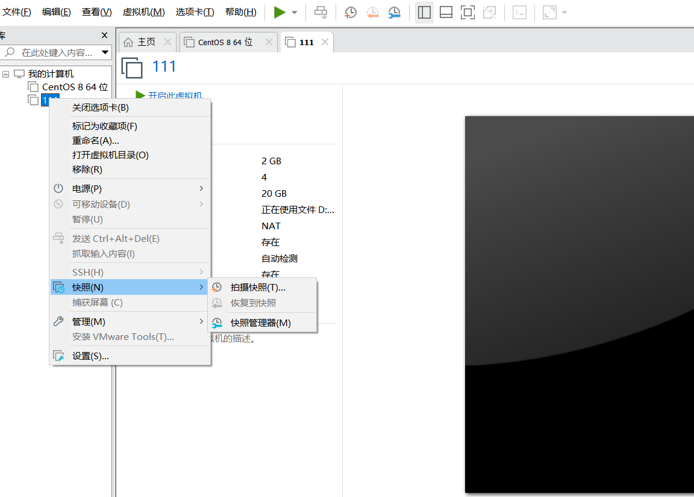
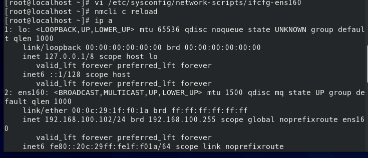
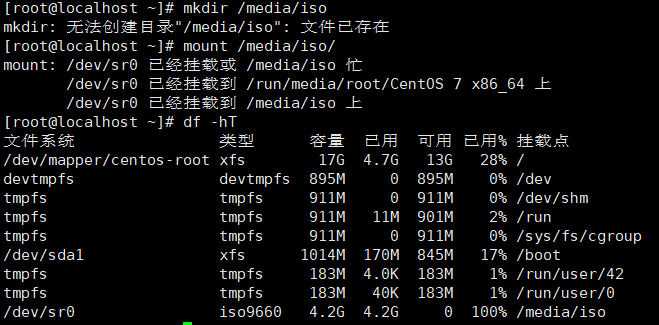
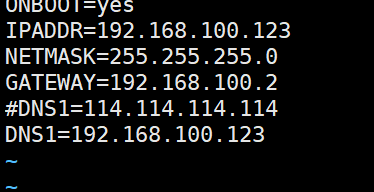

# 虚拟机centos8最小化与GUI安装

#### 选择位置

#### 选择自定义硬件

#### 把内存改为2048MB

#### 把处理器数量和内核数量改为2

#### 选择映像文件，然后关闭，点完成

#### 开启虚拟机

#### 选择中文

#### 点击安装目的地，然后点完成。中间不进行操作

#### 此时是最小安装与GUI安装区别,GUI安装无需操作此步骤
##### 点击软件选择，然后点击最小安装，然后点击完成

#### 调整时间为亚洲，上海，然后点击完成
、
#### 设置用户密码,设置完后，进行安装，安装后运行虚拟机，然后输入root用户名，密码不显示，输入密码点击回车，然后虚拟机安装完成。

### 对虚拟机进行快照，防止虚拟机崩溃或者误删文件，可以通过快照进行恢复。
#### 在进行快照前需要把虚拟机进行关机，然后右键，点击快照，然后进行拍摄快照。
- 
#### 初始化命名，然后快照完成。
- 
### 虚拟机卸载
#### 1 鼠标右键，点击移除
- 
#### 进入文件管理器，把存放虚拟机的文件夹删除
- 
#### 2直接右击卸载
--- 
# 给虚拟机配置net网络
#### 第一步，在虚拟机终端进行配置
- 打开虚拟机终端
- 输入指令
- vi（这里有个空格） /etc/sysconfig/network-scripts/ifcfg-ens160(centos6)或者ens33(centos7)

- i进入编辑模式
- 更改数据

- press esc 退出编辑模式，输入命令    ：wq
- 保存完毕
- 输入命令 ifconfig，查看网络配置，网卡信息

- 输入nmcli c reload
- ip a 显示配置正确

#### 第二步，在电脑主机配置
- 打开电脑，进入网络和共享中心，然后点击网络适配器设置

- 点击VMnet8,右键属性

- 点击IPV4

- 配置图片上的地址，然后点击确定
#### 第三步，配置VMware
- 进入VMware,点击编辑

- 点击虚拟网编辑器，然后点击VMnet8，然后点击更改设置

- 进入更改设置后，点击VMnet8，配置子网IP和勾选选项

- 点击NAT设置，进入后，配置网关IP，然后点击确定

- 配置完成
### 配置虚拟机NAT网络中遇到的问题之
#### 因为之前下载VMware Workstation Pro，没有删除干净，网络适配器中没有虚拟网卡，导致无法上网

#### 解决方法
#### 禁用VMware服务
- 进入电脑服务界面

- 把所有VMware开头的服务停止
- 把这两个服务改成自动

#### 下载cclearner软件 修复
- 进入软件后，点击注册表，进行扫描问题

- 点击查看选定问题，点击 是

- 然后保存备份 

- 点击 修复所有选定问题

- 重复上面操作，直到问题数量较少

#### 进入VMware Workstation Pro 
- 点击编辑，进入虚拟网络编辑器

- 点击VMware8

- 进入更改设置，然后点击VMnet8，然后点击还原默认设置

- 然后进入网络连接，就可以看见VMware8虚拟网卡

--- 
### Xshell 工具使用
- 进入Xshell,打开文件-新建

- 进入连接，配置主机和名称

- 填写用户名和密码

- 进入 隧道，把X11取消勾选

---
# centos7配置yum本地仓库
- 挂载iso的镜像文件在CD/DVD驱动器上，或者上传iso镜像文件至服务器上（需要进行额外的操作）
举例：如下，需要确保，已连接已打开，且CD/DVD上的介质符合当前操作系统的版本。
- 创建一个空目录作为挂载点
 
- 然后挂载空文件
- 然后输入 df -hT 查看你挂载情况
  
- 切换路径到/etc/yum.repos.d/
  

  

  [root@localhost yum.repos.d]# mkdir bak
  [root@localhost yum.repos.d]# mv ./* bak/ #把当前目录下的内容移动到bak目录下
  [root@localhost yum.repos.d]# vim local.repo
  (自定义创建一个文件xxx.repo)
- 然后编写配置文件
  [root@localhost yum.repos.d]# vim local.repo 

- 然后保存
- 然后输入命令清除yum仓库缓存
  
- 重建仓库
  
- 然后就可以进行yum安装
 

---
# [xftp](https://blog.csdn.net/weixin_44953395/article/details/112900516?)
---
# [Apache](https://blog.csdn.net/weixin_33252868/article/details/116950242?) 安装与配置

    首先使用xftp把httpd压缩包传输到虚拟机

    然后进行解压
    [root@localhost ~]# tar xf httpd-2.2.17.tar.gz  -C /usr/src/

    然后cd进入该文件目录
    [root@localhost ~]# cd /usr/src/httpd-2.2.17/
    [root@localhost httpd-2.2.17]#

    然后进行./configure配置
    [root@localhost httpd-2.2.17]# ./configure  --prefix=/usr/local/httpd
    
    再用make编译和install安装
    [root@localhost httpd-2.2.17]# make && make install

    然后vim进入配置文件
    找到 Server Name www.example .com:80将前面#删除 保存退出
    [root@localhost httpd-2.2.17]# vim /usr/local/httpd/conf/httpd.conf

    然后启动Apache
    [root@localhost httpd-2.2.17]# /usr/local/httpd/bin/apachectl start

    然后将他cp粘贴到bin目录下
    [root@localhost httpd-2.2.17]# cp /usr/local/httpd/bin/apachectl /usr/bin/httpd
    
    然后快捷启动httpd
    [root@localhost httpd-2.2.17]# httpd start

    再将cp到/etc/路径下
    [root@localhost httpd-2.2.17]# cp /usr/local/httpd/bin/apachectl /etc/rc.d/init.d/httpd

    再进行vi编写
    [root@localhost httpd-2.2.17]# vi /etc/rc.d/init.d/httpd
    进入vi再第二行开始加入
    #chkconfig: 35 61 61
    #description: Apache
    然后保存退出

    再添加chkconfig管理的httpd.Service服务
    [root@localhost httpd-2.2.17]# chkconfig --add httpd

    然后开启httpd服务
    [root@localhost httpd-2.2.17]# systemctl start httpd

    然后关闭防火墙
    [root@localhost httpd-2.2.17]# systemctl stop firewalld
    [root@localhost httpd-2.2.17]#setenforce  0
    查看Apache状态：
    [root@localhost httpd-2.2.17]# systemctl status apache
    
    测试：
    在浏览器里输入自己的ip是否能够通
# 使用
    上传，选择文件:
    [root@ceph135 ddd]# rz -y

    自主配置的目录
    ServerRoot "/usr/local/httpd"
    [root@localhost httpd]# ls
    bin    cgi-bin  error   icons    lib   man     modules
    build  conf     htdocs  include  logs  manual

    [root@localhost conf]# ls
    extra  httpd.conf  magic  mime.types  original

    修改后的Apache网站根目录：
    把文件放到这个目录下就可以通过IP很方便的访问：
    [root@localhost htdocs]# ls（默认为/var/www/html ）
    index.html
    在这个目录里面建立目录就可以通过浏览器访问到

    日志文件
    [root@localhost logs]# ls
    access_log  error_log  httpd.pid

## 防火墙
    cenos7里的防火墙分2个：iptables，firewalld
    我们主要讲firewalld简单，好理解，方便

    默认分为9个区域，默认的区域是public

    查看默认本机开放给外部主机的服务：
    [s@bogon ~]$ sudo firewall-cmd --list-services 
    cockpit dhcpv6-client  ssh

    默认没有开放http（即80端口），所以外部主机访问不了虚拟机上的web页面

      查看端口
      [root@ceph135 ~]# lsof -i:80
      COMMAND PID USER FD TYPE DEVICE SIZE/OFF NODE NAME
      httpd 1994 root 4u IPv6 33745 0t0 TCP *:http (LISTEN)
      httpd 1996 apache 4u IPv6 33745 0t0 TCP *:http (LISTEN)
      httpd 1997 apache 4u IPv6 33745 0t0 TCP *:http (LISTEN)
      httpd 1998 apache 4u IPv6 33745 0t0 TCP *:http (LISTEN)
      httpd 1999 apache 4u IPv6 33745 0t0 TCP *:http (LISTEN)
      httpd 2000 apache 4u IPv6 33745 0t0 TCP *:http (LISTEN)

      打开http服务或打开80端口
      [s@bogon ~]$ sudo firewall-cmd --add-service=http
      success
      或
      [s@bogon ~]$ sudo firewall-cmd --add-port=80/tcp
      success

      重置生效
      [root@ceph135 ~]# firewall-cmd --reload
      success

      再从物理主机或其它主机上就可以正常访问虚拟机上的web页面

### 实验
    1、先查找本地源中包含的httpd服务组件
    yum search httpd
    2、安装httpd
    yum install httpd -y
    3、验证：
    [s@bogon yum.repos.d]$ rpm -qa |grep httpd
    centos-logos-httpd-85.5-1.el8.noarch
    httpd-filesystem-2.4.37-39.module_el8.4.0+778+c970deab.noarch
    httpd-tools-2.4.37-39.module_el8.4.0+778+c970deab.x86_64
    httpd-2.4.37-39.module_el8.4.0+778+c970deab.x86_64
    4、进入配置文件目录
    [s@bogon ~]$ cd /etc/httpd/conf/
    [s@bogon conf]$ ll
    total 28
    -rw-r--r-- 1 root root 11899 May 20  2021 httpd.conf
    -rw-r--r-- 1 root root 13064 May 20  2021 magic
    [s@bogon conf]$ 
    5、启动httpd服务：
    systemctl start httpd
    确认服务状态是active
    systemctl status httpd
    打开浏览器验证一下：能打开apach http页面
    http://127.0.0.1/

    ============================================

    开始实验：

    第一个：做个文件下载页面
    1、先进入web页面“家”目录
    [s@bogon conf]$ cd /var/www/html
    [s@bogon html]$ ll
    total 0
    [s@bogon html]$ pwd
    /var/www/html
    2、将centos安装光盘的images目录软链接到当前目录（/var/www/html）
    [s@bogon html]$ pwd
    /var/www/html

    [s@bogon html]$ ll /mnt/CentOS-8-4-2105-x86_64-dvd/images/
    total 645084
    -r--r--r-- 1 smb smb  11204608 Sep 21 15:09 efiboot.img
    -r--r--r-- 1 smb smb 649355264 Sep 21 15:09 install.img
    dr-xr-xr-x 2 smb smb        56 Sep 21 15:09 pxeboot
    -r--r--r-- 1 smb smb       446 Sep 21 15:09 TRANS.TBL
    [s@bogon html]$ sudo ln -s /mnt/CentOS-8-4-2105-x86_64-dvd/images/ .
    [s@bogon html]$ ll
    total 0
    lrwxrwxrwx 1 root root 39 Oct 21 10:04 images -> /mnt/CentOS-8-4-2105-x86_64-dvd/images/
    [s@bogon html]$ ll images/
    total 645084
    -r--r--r-- 1 smb smb  11204608 Sep 21 15:09 efiboot.img
    -r--r--r-- 1 smb smb 649355264 Sep 21 15:09 install.img
    dr-xr-xr-x 2 smb smb        56 Sep 21 15:09 pxeboot
    -r--r--r-- 1 smb smb       446 Sep 21 15:09 TRANS.TBL
    3、重启下httd服务使期生效
    [s@bogon html]$ sudo systemctl restart httpd
    4、打开浏览器，访问建立的文件下载页面
    [s@bogon ~]$ firefox http://127.0.0.1/images
    5、使用wget或curl下载测试
    wget http://127.0.0.1/images/efiboot.img

    第二个实验：

    cenos8里的防火墙分2个：iptables，firewalld
    我们主要讲firewalld
    简单，好理解，方便
    默认分为9个区域，默认的区域是public
    查看默认本机开放给外部主机的服务：
    [s@bogon ~]$ sudo firewall-cmd --list-services 
    cockpit dhcpv6-client  ssh
    默认没有开放http（即80端口），所以外部主机访问不了虚拟机上的web页面
    打开http服务或打开80端口
    [s@bogon ~]$ sudo firewall-cmd --add-service=http
    success
    或
    [s@bogon ~]$ sudo firewall-cmd --add-port=80/tcp
    success
    再从物理主机或其它主机上就可以正常访问虚拟机上的web页面

    ++建虚拟主机的配置文件：
    在/etc/httpd/conf.d/下新建
    vhost.conf
    内容如下：
    <virtualhost 192.168.56.100>
      servername wo.com
      documentroot /var/www/html
    </virtualhost>
    注意，防火墙的策略——http服务要打开

    +++修改/etc/hosts文件，增加ip和域名的对应关系：
    [s@bogon conf.d]$ tail -3 /etc/hosts
    192.168.56.100	wo.com
    10.0.2.15	ni.com

    重启下httd服务使期生效
    [s@bogon html]$ sudo systemctl restart httpd

    测试：在浏览器中访问wo.com即可打开页面
    测试2：在物理机浏览器中访问wo.com，如果提示403错误，说明物理机缺少此ip和域名的对应关系，也要在
    C:\Windows\System32\drivers\etc下的hosts末尾添加
    192.168.56.100	wo.com

    第三个实验：域名+端口
    在/etc/httpd/conf.d/下修改
    vhost.conf
    内容如下：
    <virtualhost 192.168.56.100:8888>
      servername wo.com
      documentroot /var/www/html/8888
    </virtualhost>

    2、新建/var/www/html/8888/目录，把安装光盘的images软链接到8888目录
    sudo ln -s /mnt/CentOS-8-4-2105-x86_64-dvd/images/  /var/www/html/8888/

    3、重启httpd服务
    [s@bogon html]$ sudo systemctl restart httpd
    4、验证：在虚拟机里打开浏览器可以正常访问http://wo.com:8888/images/
    但在物理机上访问不了。需要打开防火墙的端口
    [s@bogon ~]$ sudo firewall-cmd --add-port=8888/tcp
    success

    显示缺省域public所有的配置，包含接口（网卡）、源ip（允许的外部主机）、服务（系统定义的，如ftp、http）
    端口（tcp或udp）、协议（icmp）、富规则（给自主定义的灵活的安全策略）
    [s@bogon conf]$ sudo firewall-cmd --list-all
    public (active)
      target: default
      icmp-block-inversion: no
      interfaces: bond0 enp0s10 enp0s3 enp0s9
      sources: 
      services: cockpit dhcpv6-client http ssh
      ports: 8888/tcp
      protocols: 
      masquerade: no
      forward-ports: 
      source-ports: 
      icmp-blocks: 
      rich rules: 

    +++++++++++++++富规则的例子+++++++++++++++

    比如我们不让物理主机192.168.56.1访问虚拟机的wo.com:8888/images的url
    新增防火墙策略：
    [s@bogon conf]$ sudo firewall-cmd     --add-rich-rule='rule        family='ipv4'        source address='192.168.56.1'            port protocol='tcp'             port='8888'              drop'          --permanent 
    success

    测试结果：物理主机打不开这个页面。

---
# nginx 安装与配置 
（nginx与Apache不能同时安装在一台主机上
[解决安装依赖](https://blog.csdn.net/qq_42700109/article/details/120464161?spm=1001.2014.3001.5506)

    问题1：
    make: *** No rule to make target `build', needed by `default'.  Stop.
    make: *** 没有规则可以创建“default”需要的目标“build”。 停止。 

>
    安装依赖：
    yum -y install make zlib-devel gcc-c++ libtool openssl openssl-devel

    # 或者

    yum -y install gcc openssl openssl-devel pcre-devel zlib zlib-devel

>
    安装后验证：

    ./configure --prefix=/usr/local/nginx(推荐这个)

    #或者

    ./configure --prefix=/usr/local/nginx --user=nginx --group=nginx --with-http_ssl_module 
    

>
    编译:
    
    make && make install

>   
    开启：
      #cd /usr/local/nginx/sbin/nginx
      #./nginx
      
nginx不支持chkconfig
>
    问题：
    如果这个方法还是不行，可以检查./configure后面的选项是否有误，或者选项中的路径是否正确，也可以看一下系统提示哪些是 —not found的，看缺少哪些依赖包
>   问题2：
    [root@localhost sbin]#./nginx
    nginx: [emerg] getpwnam("nginx") failed
    

---
比喻：

    磁盘好比是一栋高楼书店，主分区就是一层，但是这一层是一个大房间；
    而扩展分区也是一层楼，而逻辑分区就是这一层楼里面的房间；
    在主分区和逻辑分区里面存储数据，就需要对分区进行格式化，
    就好比往房间里面放书需要书架，而文件系统就是书架，
    但是如何选择什么类型的书架以利用好空间，就需要格式化。
# 创建磁盘分区 

    #格式化：把所有的存储位置划分起来

    打开虚拟机
    然后点击设置
    打开设置
    点击磁盘
    然后添加磁盘
    选择硬盘
    选择磁盘类型为SCSI 
    点击下一步，选择创建新虚拟磁盘
    点击下一步，然后选择最大磁盘大小为x(本次选择为20G)，勾选-将虚拟磁盘文件拆分为多个文件
    点击下一步，自定义存储位置
    点击完成，点击确定
    重启：reboot
    
    进入终端：
    lsblk #查看磁盘信息
    看见一个sdb,size是我们设置的20G
    fdisk -l #查看磁盘信息
    fdisk -l /dev/sdb  #查看磁盘sdb的分区信息
    fdisk  /dev/sdb (我们所要进行分区的硬盘)
      p #查看本磁盘的分区信息(由于 历史上的原因，各个操作系统为共存的需要而约定俗成。一个物理磁盘最多有4个主分区。)
      n #创建分区:(本次演示为创建四个4G的分区)
    发现我们的磁盘分区已经被分满了，然后我们进行删除磁盘分区
      d
      1 #删除区号1
      w #保存退出
    然后磁盘分区1就被删除了（如果命令输错了，就按ctrl+清除键，来进行清除）
      fdisk /dev/sdb
      p #查看分区信息
      n #创建分区
      ## 创建主分区（primary）
        p #(primary)
          命令(输入 m 获取帮助)：n

          Partition type:
            p   primary (0 primary, 0 extended, 4 free)
            e   extended

          Select (default p): p

          分区号 (1-4，默认 1)：1

          起始 扇区 (2048-41943039，默认为 2048)：
          将使用默认值 2048

          Last 扇区, +扇区 or +size{K,M,G} (2048-41943039，默认为 41943039)：+5G
          分区 1 已设置为 Linux 类型，大小设为 5 GiB

        w #保存退出
      ## 创建扩展分区（extended）一般认为扩展分区就是一个，不参与数据的存储
        e #(extended)

          命令(输入 m 获取帮助)：n

          Partition type:
            p   primary (1 primary, 0 extended, 3 free)
            e   extended

          Select (default p): e

          分区号 (2-4，默认 2)：2

          起始 扇区 (10487808-41943039，默认为 10487808)：
          将使用默认值 10487808

          Last 扇区, +扇区 or +size{K,M,G} (10487808-41943039，默认为 41943039)：+10G
          分区 2 已设置为 Extended 类型，大小设为 10 GiB

          w #保存退出

        ## 在扩展分区下创建逻辑分区（logical）
          l #(logical)

          命令(输入 m 获取帮助)：n

          Partition type:
            p   primary (1 primary, 1 extended, 2 free)
            l   logical (numbered from 5)

          Select (default p): l

          添加逻辑分区 5

          起始 扇区 (10489856-31459327，默认为 10489856)：
          将使用默认值 10489856

          Last 扇区, +扇区 or +size{K,M,G} (10489856-31459327，默认为 31459327)：+1G
          分区 5 已设置为 Linux 类型，大小设为 1 GiB

          w #保存退出

    命令(输入 m 获取帮助)：p

    磁盘 /dev/sdb：21.5 GB, 21474836480 字节，41943040 个扇区
    Units = 扇区 of 1 * 512 = 512 bytes
    扇区大小(逻辑/物理)：512 字节 / 512 字节
    I/O 大小(最小/最佳)：512 字节 / 512 字节
    磁盘标签类型：dos
    磁盘标识符：0xf42c5eb5

      设备 Boot      Start         End      Blocks   Id  System
    /dev/sdb1            2048    10487807     5242880   83  Linux
    （0-2048）##主引导记录，用于记录主分区的   
    /dev/sdb2        10487808    31459327    10485760    5  Extended
    （10487808--10489856）## 用于记录扩展分区下的逻辑分区的容量和位置
    /dev/sdb5        10489856    12587007     1048576   83  Linux
    /dev/sdb6        12589056    14686207     1048576   83  Linux
    ## 划主分区的时候容量是连续的，划逻辑分区的时候容量是不连续的
    主分区和扩展分区是1-4，逻辑分区为5-...
   
# 对分区进行格式化 （制作书架）

    # 格式化只能针对分区

    #注意 仅有扩展分区，不进一步划分逻辑分区，是不能拿来做文件系统的，扩展分区是容器

    文件系统类型：...ext3,ext4,xfs(最新)  #比喻：书架子的种类,使用什么书架才能合理利用空间

    
      设备 Boot      Start         End      Blocks   Id  System
    /dev/sdb1            2048    10487807     5242880   83  Linux
    /dev/sdb2        10487808    31459327    10485760    5  Extended
    /dev/sdb5        10489856    12587007     1048576   83  Linux
    /dev/sdb6        12589056    14686207     1048576   83  Linux
    /dev/sdb7        14688256    16785407     1048576   83  Linux

    # ext3：
    [root@localhost ~]# mkfs.ext3 /dev/sdb1
    mke2fs 1.42.9 (28-Dec-2013)
    文件系统标签=
    OS type: Linux
    块大小=4096 (log=2)
    分块大小=4096 (log=2)
    Stride=0 blocks, Stripe width=0 blocks
    327680 inodes, 1310720 blocks
    65536 blocks (5.00%) reserved for the super user
    第一个数据块=0
    Maximum filesystem blocks=1342177280
    40 block groups
    32768 blocks per group, 32768 fragments per group
    8192 inodes per group
    Superblock backups stored on blocks: 
      32768, 98304, 163840, 229376, 294912, 819200, 884736

    Allocating group tables: 完成                            
    正在写入inode表: 完成                            
    Creating journal (32768 blocks): 完成
    Writing superblocks and filesystem accounting information: 完成 

    # ext4:
    [root@localhost ~]# mkfs.ext4 /dev/sdb5
    mke2fs 1.42.9 (28-Dec-2013)
    文件系统标签=
    OS type: Linux
    块大小=4096 (log=2)
    分块大小=4096 (log=2)
    Stride=0 blocks, Stripe width=0 blocks
    65536 inodes, 262144 blocks
    13107 blocks (5.00%) reserved for the super user
    第一个数据块=0
    Maximum filesystem blocks=268435456
    8 block groups
    32768 blocks per group, 32768 fragments per group
    8192 inodes per group
    Superblock backups stored on blocks: 
      32768, 98304, 163840, 229376

    Allocating group tables: 完成                            
    正在写入inode表: 完成                            
    Creating journal (8192 blocks): 完成
    Writing superblocks and filesystem accounting information: 完成

    # xfs:
    [root@localhost ~]# mkfs.xfs /dev/sdb6
    meta-data=/dev/sdb6              isize=512    agcount=4, agsize=65536 blks
            =                       sectsz=512   attr=2, projid32bit=1
            =                       crc=1        finobt=0, sparse=0
    data     =                       bsize=4096   blocks=262144, imaxpct=25
            =                       sunit=0      swidth=0 blks
    naming   =version 2              bsize=4096   ascii-ci=0 ftype=1
    log      =internal log           bsize=4096   blocks=2560, version=2
            =                       sectsz=512   sunit=0 blks, lazy-count=1
    realtime =none                   extsz=4096   blocks=0, rtextents=0

    [root@localhost ~]# mkfs -t xfs /dev/sdb7
    meta-data=/dev/sdb7              isize=512    agcount=4, agsize=65536 blks
            =                       sectsz=512   attr=2, projid32bit=1
            =                       crc=1        finobt=0, sparse=0
    data     =                       bsize=4096   blocks=262144, imaxpct=25
            =                       sunit=0      swidth=0 blks
    naming   =version 2              bsize=4096   ascii-ci=0 ftype=1
    log      =internal log           bsize=4096   blocks=2560, version=2
            =                       sectsz=512   sunit=0 blks, lazy-count=1
    realtime =none                   extsz=4096   blocks=0, rtextents=0

# 分区挂载到目录和卸载

    * 以b为开头的文件是块（block）文件，是用来存储较大的数据的，是不能直接使用的

    * 就需要对分区进行挂载，使分区的入口和系统的某个文件夹对应起来，使我们访问文件夹就是访问分区
    
    * 挂载的目录如果有文件，挂载后原文件会被隐藏，挂载的目录里面只显示分区的文件

文件是ext4文件系统有这个碎片，基本就是分区，xfs文件系统是没有这个碎片的

    # 挂载
      [wsj@localhost dev]$ ll sd*
      brw-rw----. 1 root disk 8,  0 10月 18 15:17 sda
      brw-rw----. 1 root disk 8,  1 10月 18 15:17 sda1
      brw-rw----. 1 root disk 8,  2 10月 18 15:17 sda2
      brw-rw----. 1 root disk 8, 16 10月 19 01:31 sdb
      brw-rw----. 1 root disk 8, 17 10月 19 01:31 sdb1
      brw-rw----. 1 root disk 8, 18 10月 19 01:31 sdb2
      brw-rw----. 1 root disk 8, 21 10月 19 01:31 sdb5
      brw-rw----. 1 root disk 8, 22 10月 19 01:31 sdb6
      brw-rw----. 1 root disk 8, 23 10月 19 01:31 sdb7

      在mnt 目录下建立sdb1 对应的sdbb1 和sdb5 对应的sdbb5：
      [root@localhost mnt]# mount /dev/sdb1 /mnt/sdbb1

      显示挂载成功：
      [root@localhost mnt]# df -hT
      文件系统                类型      容量  已用  可用 已用% 挂载点
      /dev/mapper/centos-root xfs        17G  4.8G   13G   29% /
      devtmpfs                devtmpfs  895M     0  895M    0% /dev
      tmpfs                   tmpfs     911M     0  911M    0% /dev/shm
      tmpfs                   tmpfs     911M   11M  901M    2% /run
      tmpfs                   tmpfs     911M     0  911M    0% /sys/fs/cgroup
      /dev/sda1               xfs      1014M  170M  845M   17% /boot
      tmpfs                   tmpfs     183M  8.0K  183M    1% /run/user/42
      tmpfs                   tmpfs     183M   56K  183M    1% /run/user/1000
      /dev/sr0                iso9660   4.2G  4.2G     0  100% /run/media/wsj/CentOS 7 x86_64
      /dev/sdb1               ext3      4.8G   11M  4.6G    1% /mnt/sdbb1
      tmpfs                   tmpfs     183M     0  183M    0% /run/user/0

      同样的步骤进行设备sdb5的挂载：
      [root@localhost mnt]# mount /dev/sdb5 /mnt/sdbb5
      [root@localhost mnt]# df -hT
      文件系统                类型      容量  已用  可用 已用% 挂载点
      /dev/mapper/centos-root xfs        17G  4.8G   13G   29% /
      devtmpfs                devtmpfs  895M     0  895M    0% /dev
      tmpfs                   tmpfs     911M     0  911M    0% /dev/shm
      tmpfs                   tmpfs     911M   11M  901M    2% /run
      tmpfs                   tmpfs     911M     0  911M    0% /sys/fs/cgroup
      /dev/sda1               xfs      1014M  170M  845M   17% /boot
      tmpfs                   tmpfs     183M  8.0K  183M    1% /run/user/42
      tmpfs                   tmpfs     183M   56K  183M    1% /run/user/1000
      /dev/sr0                iso9660   4.2G  4.2G     0  100% /run/media/wsj/CentOS 7 x86_64
      /dev/sdb1               ext3      4.8G   11M  4.6G    1% /mnt/sdbb1
      tmpfs                   tmpfs     183M     0  183M    0% /run/user/0
      /dev/sdb5               ext4      976M  2.6M  907M    1% /mnt/sdbb5

    # 卸载
      [root@localhost mnt]# umount /dev/sdb1/
      [root@localhost mnt]# umount /dev/sdb5
      [root@localhost mnt]# mount |grep sdb1
      /dev/sdb1 on /media/sdb1 type ext3 (rw,relatime,seclabel,data=ordered)
      [root@localhost mnt]# umount /dev/sdb1
      [root@localhost mnt]# mount |grep sdb1
      [root@localhost mnt]# 

# 查看分区文件系统类型
    以分区sdb1举例：

    [root@localhost mnt]# sudo blkid /dev/sdb1
    /dev/sdb1: UUID="da5a5d9e-a076-4554-980a-ae67715d9dbd" SEC_TYPE="ext2" TYPE="ext3" 
    [root@localhost mnt]# blkid /dev/sdb5
    /dev/sdb5: UUID="eb1652f1-8201-42a1-8dbf-6ed789a49e2e" TYPE="ext4" 
    [root@localhost mnt]# blkid /dev/sdb6
    /dev/sdb6: UUID="76e95d77-4a1b-43d5-afb5-d6dbe7a8fd60" TYPE="xfs" 

    [root@localhost mnt]# mount |grep sdb1
    /dev/sdb1 on /media/sdb1 type ext3 (rw,relatime,seclabel,data=ordered)
    /dev/sdb1 on /mnt/sdbb1 type ext3 (rw,relatime,seclabel,data=ordered)

    [root@localhost mnt]# df -hT
    文件系统                类型      容量  已用  可用 已用% 挂载点
    /dev/mapper/centos-root xfs        17G  4.8G   13G   29% /
    devtmpfs                devtmpfs  895M     0  895M    0% /dev
    tmpfs                   tmpfs     911M     0  911M    0% /dev/shm
    tmpfs                   tmpfs     911M   11M  901M    2% /run
    tmpfs                   tmpfs     911M     0  911M    0% /sys/fs/cgroup
    /dev/sda1               xfs      1014M  170M  845M   17% /boot
    tmpfs                   tmpfs     183M  8.0K  183M    1% /run/user/42
    tmpfs                   tmpfs     183M   56K  183M    1% /run/user/1000
    /dev/sr0                iso9660   4.2G  4.2G     0  100% /run/media/wsj/CentOS 7 x86_64
    /dev/sdb1               ext3      4.8G   11M  4.6G    1% /mnt/sdbb1
    tmpfs                   tmpfs     183M     0  183M    0% /run/user/0
    /dev/sdb5               ext4      976M  2.6M  907M    1% /mnt/sdbb5

# LVM 逻辑卷与磁盘配额限制  （提升磁盘管理）
    注意：
     逻辑分区和逻辑卷不是一个概念。
    普通分区的缺点：
     问题一：服务的日志存放在/var/log 目录下，现在空间不够了怎么办？
     问题二：数据库软件安装在/usr/local/mysql 目录下，现在空间不够了怎么办？
     答案：是普通分区吗? 那没办法！

    # 把基础磁盘转换为物理卷：
    [wsj@localhost ~]$ lsblk
    NAME            MAJ:MIN RM  SIZE RO TYPE MOUNTPOINT
    sda               8:0    0   20G  0 disk 
    ├─sda1            8:1    0    1G  0 part /boot
    └─sda2            8:2    0   19G  0 part 
      ├─centos-root 253:0    0   17G  0 lvm  /
      └─centos-swap 253:1    0    2G  0 lvm  [SWAP]
    sdb               8:16   0   20G  0 disk 
    ├─sdb1            8:17   0    5G  0 part 
    ├─sdb2            8:18   0    1K  0 part 
    ├─sdb5            8:21   0    1G  0 part 
    ├─sdb6            8:22   0    1G  0 part 
    └─sdb7            8:23   0    1G  0 part 
    sdc               8:32   0   20G  0 disk 
    sr0              11:0    1  4.2G  0 rom  

    [wsj@localhost ~]$ sudo pvcreate /dev/sdb1
    WARNING: ext3 signature detected on /dev/sdb1 at offset 1080. Wipe it? [y/n]: y
      Wiping ext3 signature on /dev/sdb1.
      Physical volume "/dev/sdb1" successfully created.

    [wsj@localhost ~]$ sudo pvdisplay 
      --- Physical volume ---
      PV Name               /dev/sda2
      VG Name               centos
      PV Size               <19.00 GiB / not usable 3.00 MiB
      Allocatable           yes (but full)
      PE Size               4.00 MiB
      Total PE              4863
      Free PE               0
      Allocated PE          4863
      PV UUID               xGga1H-QKpJ-1bUa-KBd6-RYR4-YVsY-9TpIYA
      
      "/dev/sdb1" is a new physical volume of "5.00 GiB"
      --- NEW Physical volume ---
      PV Name               /dev/sdb1
      VG Name               
      PV Size               5.00 GiB
      Allocatable           NO
      PE Size               0   
      Total PE              0
      Free PE               0
      Allocated PE          0
      PV UUID               cSxUfT-F45Z-eoYo-wM3N-Ta25-cayB-VikDOl

      [wsj@localhost ~]$ sudo pvcreate /dev/sdb5
      WARNING: ext4 signature detected on /dev/sdb5 at offset 1080. Wipe it? [y/n]: y
        Wiping ext4 signature on /dev/sdb5.
        Physical volume "/dev/sdb5" successfully created.

      [wsj@localhost ~]$ sudo pvcreate /dev/sdb6
      WARNING: xfs signature detected on /dev/sdb6 at offset 0. Wipe it? [y/n]: y  
        Wiping xfs signature on /dev/sdb6.
        Physical volume "/dev/sdb6" successfully created.

      [wsj@localhost ~]$ sudo pvcreate /dev/sdc
        Physical volume "/dev/sdc" successfully created.

      ##把物理卷还原为普通分区
      [wsj@localhost ~]$ sudo pvremove /dev/sdb6
        Labels on physical volume "/dev/sdb6" successfully wiped.

      [wsj@localhost ~]$ sudo pvscan 
        PV /dev/sda2   VG centos          lvm2 [<19.00 GiB / 0    free]
        PV /dev/sdb5                      lvm2 [1.00 GiB]
        PV /dev/sdb1                      lvm2 [5.00 GiB]
        PV /dev/sdb6                      lvm2 [1.00 GiB]
        PV /dev/sdc                       lvm2 [20.00 GiB]
        Total: 5 [<46.00 GiB] / in use: 1 [<19.00 GiB] / in no VG: 4 [27.00 GiB]

      #创建卷组
      [wsj@localhost ~]$ sudo vgcreate vg1 /dev/sdb1 /dev/sdb5 /dev/sdb6 /dev/sdc
      [sudo] wsj 的密码：
        Volume group "vg1" successfully created

      [wsj@localhost ~]$ sudo vgscan 
        Reading volume groups from cache.
        Found volume group "vg1" using metadata type lvm2
        Found volume group "centos" using metadata type lvm2
      ##去除卷组中的物理卷
      [wsj@localhost ~]$ sudo vgreduce vg1 /dev/sdb1
      [sudo] wsj 的密码：
        Removed "/dev/sdb1" from volume group "vg1"
      
      ##向卷组里面加入物理卷
      [wsj@localhost ~]$ sudo vgextend vg1 /dev/sdb1
        Volume group "vg1" successfully extended

      #创建逻辑卷
      [wsj@localhost ~]$ sudo lvcreate -L 10G -n lv1 vg1
      [sudo] wsj 的密码：
        Logical volume "lv1" created.

      [wsj@localhost ~]$ sudo lvdisplay 
        --- Logical volume ---
        LV Path                /dev/vg1/lv1（不是真实的硬件，是逻辑上的硬件，是个链接，dev目录下基本都是硬件）
        LV Name                lv1
        VG Name                vg1
        LV UUID                5Xnr4a-Zw0Y-iuSm-MnAm-pOKH-si4j-1WmaG4
        LV Write Access        read/write
        LV Creation host, time localhost.localdomain, image/2022-10-20 00:14:47 +0800
        LV Status              available
        # open                 0
        LV Size                10.00 GiB
        Current LE             2560
        Segments               1
        Allocation             inherit
        Read ahead sectors     auto
        - currently set to     8192
        Block device           253:2
        ##lv的扩容
        [wsj@localhost ~]$ sudo lvextend -L +5G /dev/vg1/lv1
        [sudo] wsj 的密码：
          Size of logical volume vg1/lv1 changed from 10.00 GiB (2560 extents) to 15.00 GiB (3840 extents).
          Logical volume vg1/lv1 successfully resized.

        ##lv的缩容
        [wsj@localhost ~]$ sudo lvreduce -L -5G /dev/vg1/lv1
          WARNING: Reducing active logical volume to 10.00 GiB.
          THIS MAY DESTROY YOUR DATA (filesystem etc.)
        Do you really want to reduce vg1/lv1? [y/n]: y
          Size of logical volume vg1/lv1 changed from 15.00 GiB (3840 extents) to 10.00 GiB (2560 extents).
          Logical volume vg1/lv1 successfully resized.

# 逻辑卷的挂载和格式化跟基础分区和磁盘是一样的
    ## 格式化
    [wsj@localhost ~]$ sudo mkfs.xfs /dev/vg1/lv1 
    [sudo] wsj 的密码：
    meta-data=/dev/vg1/lv1           isize=512    agcount=4, agsize=655360 blks
            =                       sectsz=512   attr=2, projid32bit=1
            =                       crc=1        finobt=0, sparse=0
    data     =                       bsize=4096   blocks=2621440, imaxpct=25
            =                       sunit=0      swidth=0 blks
    naming   =version 2              bsize=4096   ascii-ci=0 ftype=1
    log      =internal log           bsize=4096   blocks=2560, version=2
            =                       sectsz=512   sunit=0 blks, lazy-count=1
    realtime =none                   extsz=4096   blocks=0, rtextents=0

    ##挂载
    [wsj@localhost mnt]$ sudo mkdir lvv1
    [wsj@localhost mnt]$ ls
    lvv1  sdbb1  sdbb5
    [wsj@localhost mnt]$ sudo mount /dev/vg1/lv1 /mnt/lvv1
    [wsj@localhost mnt]$ df -hT
    文件系统                类型      容量  已用  可用 已用% 挂载点
    /dev/mapper/centos-root xfs        17G  4.8G   13G   29% /
    devtmpfs                devtmpfs  895M     0  895M    0% /dev
    tmpfs                   tmpfs     911M     0  911M    0% /dev/shm
    tmpfs                   tmpfs     911M   11M  901M    2% /run
    tmpfs                   tmpfs     911M     0  911M    0% /sys/fs/cgroup
    /dev/sda1               xfs      1014M  170M  845M   17% /boot
    tmpfs                   tmpfs     183M     0  183M    0% /run/user/0
    tmpfs                   tmpfs     183M   12K  183M    1% /run/user/42
    tmpfs                   tmpfs     183M     0  183M    0% /run/user/1000
    /dev/mapper/vg1-lv1（实际的路径）     xfs        10G   33M   10G    1% /mnt/lvv1

注意如果要删除逻辑卷，如果挂载，需要先卸载，以此类推

# 创建、维护、删除软RAID
    ##创建磁盘分区：
        此处省略
        [root@localhost dev]# lsblk
        NAME            MAJ:MIN RM  SIZE RO TYPE MOUNTPOINT
        sda               8:0    0   20G  0 disk 
        ├─sda1            8:1    0    1G  0 part /boot
        └─sda2            8:2    0   19G  0 part 
          ├─centos-root 253:0    0   17G  0 lvm  /
          └─centos-swap 253:1    0    2G  0 lvm  [SWAP]
        sdb               8:16   0   20G  0 disk 
        ├─sdb1            8:17   0    5G  0 part 
        ├─sdb2            8:18   0    5G  0 part 
        ├─sdb3            8:19   0    5G  0 part 
        └─sdb4            8:20   0    5G  0 part 
        sr0              11:0    1  4.2G  0 rom  

    ##创建RAID5
        [root@localhost dev]# mdadm -C /dev/md5 -l 5 -n 3 -x 1 /dev/sdb[1-4]
        mdadm: Defaulting to version 1.2 metadata
        mdadm: array /dev/md5 started.
        [root@localhost dev]# mdadm -D /dev/md5 
        /dev/md5:
                  Version : 1.2
            Creation Time : Sat Oct 22 22:35:06 image/2022
                Raid Level : raid5
                Array Size : 10473472 (9.99 GiB 10.72 GB)
            Used Dev Size : 5236736 (4.99 GiB 5.36 GB)
              Raid Devices : 3
            Total Devices : 4
              Persistence : Superblock is persistent

              Update Time : Sat Oct 22 22:35:26 image/2022
                    State : clean, degraded, recovering 
            Active Devices : 2
          Working Devices : 4
            Failed Devices : 0
            Spare Devices : 2

                    Layout : left-symmetric
                Chunk Size : 512K

        Consistency Policy : resync

            Rebuild Status : 76% complete

                      Name : localhost.localdomain:5  (local to host localhost.localdomain)
                      UUID : f9ade736:9e8bebaf:02b07526:16cc19f5
                    Events : 13

            Number   Major   Minor   RaidDevice State
              0       8       17        0      active sync   /dev/sdb1
              1       8       18        1      active sync   /dev/sdb2
              4       8       19        2      spare rebuilding   /dev/sdb3

              3       8       20        -      spare   /dev/sdb4
        [root@localhost dev]# lsblk
        NAME            MAJ:MIN RM  SIZE RO TYPE  MOUNTPOINT
        sda               8:0    0   20G  0 disk  
        ├─sda1            8:1    0    1G  0 part  /boot
        └─sda2            8:2    0   19G  0 part  
          ├─centos-root 253:0    0   17G  0 lvm   /
          └─centos-swap 253:1    0    2G  0 lvm   [SWAP]
        sdb               8:16   0   20G  0 disk  
        ├─sdb1            8:17   0    5G  0 part  
        │ └─md5           9:5    0   10G  0 raid5 
        ├─sdb2            8:18   0    5G  0 part  
        │ └─md5           9:5    0   10G  0 raid5 
        ├─sdb3            8:19   0    5G  0 part  
        │ └─md5           9:5    0   10G  0 raid5 
        └─sdb4            8:20   0    5G  0 part  
          └─md5           9:5    0   10G  0 raid5 
        sr0              11:0    1  4.2G  0 rom   

    ##创建RAID 的配置文件

        [root@localhost dev]# mdadm -D -s > /etc/mdadm.conf

        [root@localhost dev]# vim /etc/mdadm.conf 
        DEVICE /dev/sdb1 /dev/sdb2 /dev/sdb3 /dev/sdb4
        ARRAY /dev/md5 metadata=1.2 spares=1 name=localhost.localdomain:5
        UUID=f9ade736:9e8bebaf:02b07526:16cc19f5 auto=yes

        或者在/etc/fatab里面配置

    ##创建文件系统

        [root@localhost dev]# mkfs.xfs -f /dev/md5
        meta-data=/dev/md5               isize=512    agcount=16, agsize=163712 blks
                =                       sectsz=512   attr=2, projid32bit=1
                =                       crc=1        finobt=0, sparse=0
        data     =                       bsize=4096   blocks=2618368, imaxpct=25
                =                       sunit=128    swidth=256 blks
        naming   =version 2              bsize=4096   ascii-ci=0 ftype=1
        log      =internal log           bsize=4096   blocks=2560, version=2
                =                       sectsz=512   sunit=8 blks, lazy-count=1
        realtime =none                   extsz=4096   blocks=0, rtextents=0

        [root@localhost dev]# blkid /dev/md5
        /dev/md5: UUID="f4d2311a-9d42-4d86-a1cc-b5ec46d65b73" TYPE="xfs"

    ##挂载

        [root@localhost dev]# mount /dev/md5 /mnt/mdd5

        [root@localhost dev]# df -hT /dev/md5
        文件系统       类型  容量  已用  可用 已用% 挂载点
        /dev/md5       xfs    10G   33M   10G    1% /mnt/mdd5

    ##维护RAID

        [root@localhost ~]# mdadm /dev/md5 --fail /dev/sdb1
        mdadm: Unknown keyword UUID=f9ade736:9e8bebaf:02b07526:16cc19f5
        mdadm: set /dev/sdb1 faulty in /dev/md5
        [root@localhost ~]# cat /proc/mdstat
        Personalities : [raid6] [raid5] [raid4] 
        md5 : active raid5 sdb3[4] sdb4[3] sdb2[1] sdb1[0](F)
              10473472 blocks super 1.2 level 5, 512k chunk, algorithm 2 [3/3] [UUU]
              
        unused devices: <none>
        [root@localhost ~]# mdadm /dev/md5 --remove /dev/sdb1
        mdadm: Unknown keyword UUID=f9ade736:9e8bebaf:02b07526:16cc19f5
        mdadm: hot removed /dev/sdb1 from /dev/md5
        [root@localhost ~]# mdadm /dev/md5 --add /dev/sdb1
        mdadm: Unknown keyword UUID=f9ade736:9e8bebaf:02b07526:16cc19f5
        mdadm: added /dev/sdb1
        [root@localhost ~]# mdadm -D /dev/md5
        mdadm: Unknown keyword UUID=f9ade736:9e8bebaf:02b07526:16cc19f5
        /dev/md5:
                  Version : 1.2
            Creation Time : Sat Oct 22 22:35:06 image/2022
                Raid Level : raid5
                Array Size : 10473472 (9.99 GiB 10.72 GB)
            Used Dev Size : 5236736 (4.99 GiB 5.36 GB)
              Raid Devices : 3
            Total Devices : 4
              Persistence : Superblock is persistent

              Update Time : Sat Oct 22 22:59:58 image/2022
                    State : clean 
            Active Devices : 3
          Working Devices : 4
            Failed Devices : 0
            Spare Devices : 1

                    Layout : left-symmetric
                Chunk Size : 512K

        Consistency Policy : resync

                      Name : localhost.localdomain:5  (local to host localhost.localdomain)
                      UUID : f9ade736:9e8bebaf:02b07526:16cc19f5
                    Events : 39

            Number   Major   Minor   RaidDevice State
              3       8       20        0      active sync   /dev/sdb4
              1       8       18        1      active sync   /dev/sdb2
              4       8       19        2      active sync   /dev/sdb3

              5       8       17        -      spare   /dev/sdb1

    ##卸载RAID5
        [root@localhost ~]# umount /dev/md5
        [root@localhost ~]# df -hT /dev/md5
        文件系统       类型      容量  已用  可用 已用% 挂载点
        devtmpfs       devtmpfs  895M     0  895M    0% /dev
        [root@localhost ~]# mdadm -S /dev/md5
        mdadm: Unknown keyword UUID=f9ade736:9e8bebaf:02b07526:16cc19f5
        mdadm: stopped /dev/md5
        [root@localhost ~]# mdadm --misc --zero-superblock /dev/sdb[1-4]
        mdadm: Unknown keyword UUID=f9ade736:9e8bebaf:02b07526:16cc19f5
        [root@localhost ~]# lsblk
        NAME            MAJ:MIN RM  SIZE RO TYPE MOUNTPOINT
        sda               8:0    0   20G  0 disk 
        ├─sda1            8:1    0    1G  0 part /boot
        └─sda2            8:2    0   19G  0 part 
          ├─centos-root 253:0    0   17G  0 lvm  /
          └─centos-swap 253:1    0    2G  0 lvm  [SWAP]
        sdb               8:16   0   20G  0 disk 
        ├─sdb1            8:17   0    5G  0 part 
        ├─sdb2            8:18   0    5G  0 part 
        ├─sdb3            8:19   0    5G  0 part 
        └─sdb4            8:20   0    5G  0 part 
        sr0              11:0    1  4.2G  0 rom  
        [root@localhost ~]# rm -rf /etc/mdadm.conf

        如果之前将raid相关信息写入了/etc/fstab配置文件中，还需vim /etc/fstab，将raid相关的内容删除即可。

---
# 搭建缓存DNS服务器，一个访问
1、[root@localhost ~]yum install -y bind bind-utils bind-libs
2、[root@localhost ~]# systemctl status named

    ● named.service - Berkeley Internet Name Domain (DNS)
    Loaded: loaded (/usr/lib/systemd/system/named.service; disabled; vendor preset: disabled)
    Active: inactive (dead)
3、[root@localhost ~]# vim /etc/named.conf 
全局配置部分

部分配置部分

[root@localhost ~]# named-checkconf -z /etc/named.conf 

    zone linuxwsj.com/IN: loaded serial 0
    zone 100.168.192.in-addr.arpa/IN: loaded serial 0
    zone localhost.localdomain/IN: loaded serial 0
    zone localhost/IN: loaded serial 0
    zone 1.0.0.0.0.0.0.0.0.0.0.0.0.0.0.0.0.0.0.0.0.0.0.0.0.0.0.0.0.0.0.0.ip6.arpa/IN: loaded serial 0
    zone 1.0.0.127.in-addr.arpa/IN: loaded serial 0
    zone 0.in-addr.arpa/IN: loaded serial 0

4、进行文件设置
[root@localhost ~]# cd /var/named/
[root@localhost named]# ls

    data     named.ca     named.localhost  slaves
    dynamic  named.empty  named.loopback
[root@localhost named]# ll

    总用量 16
    drwxrwx---. 2 named named    6 4月  13 2018 data
    drwxrwx---. 2 named named    6 4月  13 2018 dynamic
    -rw-r-----. 1 root  named 2281 5月  22 2017 named.ca
    -rw-r-----. 1 root  named  152 12月 15 2009 named.empty
    -rw-r-----. 1 root  named  152 6月  21 2007 named.localhost
    -rw-r-----. 1 root  named  168 12月 15 2009 named.loopback
    drwxrwx---. 2 named named    6 4月  13 2018 slaves
[root@localhost named]# cp -p named.localhost linuxwsj.wu
[root@localhost named]# cp -p named.loopback linuxwsj.fan
[root@localhost named]# ll

    总用量 24
    drwxrwx---. 2 named named    6 4月  13 2018 data
    drwxrwx---. 2 named named    6 4月  13 2018 dynamic
    -rw-r-----. 1 root  named  168 12月 15 2009 linuxwsj.fan
    -rw-r-----. 1 root  named  152 6月  21 2007 linuxwsj.wu
    -rw-r-----. 1 root  named 2281 5月  22 2017 named.ca
    -rw-r-----. 1 root  named  152 12月 15 2009 named.empty
    -rw-r-----. 1 root  named  152 6月  21 2007 named.localhost
    -rw-r-----. 1 root  named  168 12月 15 2009 named.loopback
    drwxrwx---. 2 named named    6 4月  13 2018 slaves
5、配置正向解析文件，并检测：
[root@localhost named]# vim linuxwsj.wu

[root@localhost named]# named-checkzone linuxwsj.com linuxwsj.wu

    zone linuxwsj.com/IN: linuxwsj.com/MX 'mail.linuxwsj.com' has no address records (A or AAAA)
    zone linuxwsj.com/IN: loaded serial 20100513
    OK

6、配置反向解析文件，并检测：
[root@localhost named]# vim linuxwsj.fan

[root@localhost named]# named-checkzone 100.168.192.in-addr.arpa linuxwsj.fan

    zone 100.168.192.in-addr.arpa/IN: 100.168.192.in-addr.arpa/MX 'mail.linuxwsj.com' (out of zone) has no addresses records (A or AAAA)
    zone 100.168.192.in-addr.arpa/IN: loaded serial 20100513
    OK

7、配置网卡文件
[root@localhost named]# vi /etc/sysconfig/network-scripts/ifcfg-ens33 

[root@localhost named]# systemctl restart network
8、关闭防火墙
[root@localhost named]# systemctl stop firewalld
[root@localhost named]# setenforce 0
9、测试
[root@localhost named]# ping www.linuxwsj.com

    PING www.linuxwsj.com (192.168.100.123) 56(84) bytes of data.
    64 bytes from localhost.localdomain (192.168.100.123): icmp_seq=1 ttl=64 time=0.033 ms
    64 bytes from localhost.localdomain (192.168.100.123): icmp_seq=2 ttl=64 time=0.075 ms
    64 bytes from localhost.localdomain (192.168.100.123): icmp_seq=3 ttl=64 time=0.085 ms
    64 bytes from localhost.localdomain (192.168.100.123): icmp_seq=4 ttl=64 time=0.061 ms
    64 bytes from localhost.localdomain (192.168.100.123): icmp_seq=5 ttl=64 time=0.060 ms
    64 bytes from localhost.localdomain (192.168.100.123): icmp_seq=6 ttl=64 time=0.048 ms
    ^C
    --- www.linuxwsj.com ping statistics ---
    6 packets transmitted, 6 received, 0% packet loss, time 5004ms
    rtt min/avg/max/mdev = 0.033/0.060/0.085/0.018 ms

## 验证
### 另一台主机：
配置文件：vim /etc/sysconfig/network-scripts/ifcfg-ens33

[root@localhost ~]# systemctl restart network

验证：[root@localhost ~]# ping www.linuxwsj.com

    PING www.linuxwsj.com (192.168.100.123) 56(84) bytes of data.
    64 bytes from 192.168.100.123 (192.168.100.123): icmp_seq=1 ttl=64 time=0.260 ms
    64 bytes from 192.168.100.123 (192.168.100.123): icmp_seq=2 ttl=64 time=0.338 ms
    64 bytes from 192.168.100.123 (192.168.100.123): icmp_seq=3 ttl=64 time=0.746 ms
    64 bytes from 192.168.100.123 (192.168.100.123): icmp_seq=4 ttl=64 time=0.591 ms
    ^C
    --- www.linuxwsj.com ping statistics ---
    4 packets transmitted, 4 received, 0% packet loss, time 3004ms
    rtt min/avg/max/mdev = 0.260/0.483/0.746/0.196 ms

---
