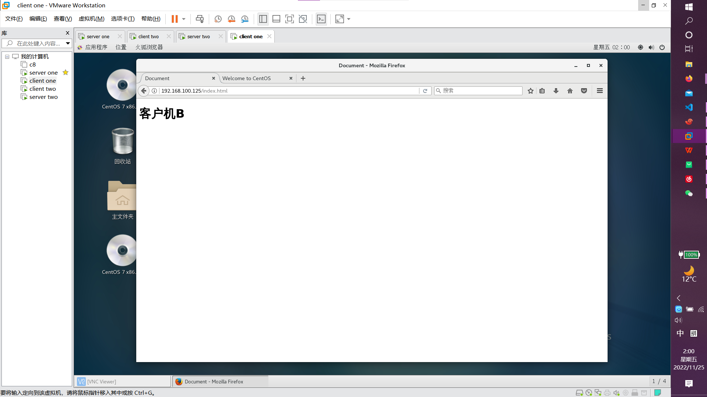

# 实验1
#### apache目录索引，模拟ftp文件传输，实现用http协议下载文件
下载光盘文件
首先:关闭防火墙,selinux

    sudo systemctl firewalld
    sudo setenforce  0
第一步：安装Apache

    sudo yum install -y httpd
第二步：进入httpd根目录下

    sudo cd /var/www/html
第二步: 创建放下载文件的目录

    sudo mkdir centos
第三步：确保光盘挂载

    df -hT
    sudo mount /dev/sr0 /media/iso
第四步：复制/media/iso下的文件到/var/www/html/centos和放一个http压缩包在centos目录下

    [root@localhost iso]# sudo cp ./* /var/www/html/centos/
    cp: 略过目录"./EFI"
    cp: 略过目录"./images"
    cp: 略过目录"./isolinux"
    cp: 略过目录"./LiveOS"
    cp: 略过目录"./Packages"
    cp: 略过目录"./repodata"
第五步：进入centos文件下

    [root@localhost iso]# sudo cd /var/www/html/centos/
    [root@localhost centos]# ls
    CentOS_BuildTag  EULA  GPL  RPM-GPG-KEY-CentOS-7  RPM-GPG-KEY-CentOS-Testing-7  TRANS.TBL

第六步:开启httpd

    sudo systemctl start httpd
第七步:测试服务器

第八步:同网段客户机测试,下载http压缩包

# 实验2
#### nginx目录索引，模拟ftp文件传输，实现用http协议下载文件
搭建基于nginx的yum仓库
准备两台服务器，一个server，一个client。
第一步：server和client都安装nginx，准备个源码包放在/usr/src目录下，脚本文件放在/root下，直接脚本安装（使用自己编写的脚本，个人习惯编写），. nginxinstall.sh

server：
1、挂载

    sudo mount  /dev/sr0 /media/iso
2、配置nginx

    #vim /usr/local/nginx/conf/nginx.conf

        location / {
            autoindex on;
            root   /media/iso;
            index  index.html index.htm;
        }
3、检查并启动

    #nginx -t
    nginx: the configuration file /usr/local/nginx/conf/nginx.conf syntax is ok
    nginx: configuration file /usr/local/nginx/conf/nginx.conf test is successful
    #nginx
4、测试

client：

    [root@localhost ~]# cd /etc/yum.repos.d/
    [root@localhost yum.repos.d]# ls
    bak  local.repo
    [root@localhost yum.repos.d]# mv local.repo nginx.repo
    [root@localhost yum.repos.d]# ls
    bak  nginx.repo
    [root@localhost yum.repos.d]# vim nginx.repo 
    [nginx]
    name=nginx
    enabled=1
    gpgcheck=0
    baseurl=http://192.168.100.123

    [root@localhost yum.repos.d]# yum clean all
    已加载插件：fastestmirror, langpacks
    正在清理软件源： nginx
    Cleaning up everything
    Maybe you want: rm -rf /var/cache/yum, to also free up space taken by orphaned data from disabled or removed repos
    Cleaning up list of fastest mirrors
    [root@localhost yum.repos.d]# yum makecache
    已加载插件：fastestmirror, langpacks
    Determining fastest mirrors
    nginx                                                                                                                         | 3.6 kB  00:00:00     
    (1/4): nginx/group_gz                                                                                                         | 166 kB  00:00:00     
    (2/4): nginx/filelists_db                                                                                                     | 3.1 MB  00:00:00     
    (3/4): nginx/primary_db                                                                                                       | 3.1 MB  00:00:00     
    (4/4): nginx/other_db                                                                                                         | 1.3 MB  00:00:00     
    元数据缓存已建立
    [root@localhost yum.repos.d]# 

# 实验3
#### apache静态html主页
首先:关闭防火墙,selinux

    sudo systemctl firewalld
    sudo setenforce  0
第一步：安装Apache

    sudo yum install -y httpd
第二步:进入根目录

    sudo cd /var/www/html
第四步:sudo vim index.html

    <!DOCTYPE html>
    <html lang="en">

    <head>
        
        <meta charset="UTF-8">
        <meta http-equiv="X-UA-Compatible" content="IE=edge">
        <meta name="viewport" content="width=device-width, initial-scale=1.0">
        <title>实验3</title>
    </head>

    <body>
        <h1>实验3</h1>
        <h2>Apache 静态html主页<h2>
                
首先：关闭防火墙 
                    第一步：安装apache  
                    第二步：进入httpd根目录 
                    第三步:vim index.html 
                    第四步:编写网页
                

    </body>

    </html>

第五步:测试

# 实验4
#### nginx静态html主页
首先：关闭防火墙，selinux

    systemctl firewalld
    setenforce  0
第一步：安装nginx，准备个源码包放在/usr/src目录下，脚本文件放在/root下，直接脚本安装，. nginxinstall.sh

第二步：进入nginx下的html目录
    
    cd /usr/local/nginx/html/
第三步：vim index.html

    <!DOCTYPE html>
    <html lang="en">

    <head>
        
        <meta charset="UTF-8">
        <meta http-equiv="X-UA-Compatible" content="IE=edge">
        <meta name="viewport" content="width=device-width, initial-scale=1.0">
        <title>实验4</title>
    </head>

    <body>
        <h1>实验4</h1>
        <h2>nginx 静态html主页<h2>
                
首先：关闭防火墙 
                    第一步：安装nginx  
                    第二步：进入nginx下的html目录 
                    第三步:vim index.html 
                    第四步:编写网页
                

    </body>

    </html>
第五步:测试

# 实验5
5，LAMP,LNMP实验，部署wordpress为准。
#### 搭建LNMP架构:
第一步：使用脚本依次安装nginx、mysql、php

第二步：配置 Nginx 支持 PHP 环境
通过使用 PHP 的 FPM模块来调用本机的 PHP 环境

    [root@nginx ~]# cd /usr/local/php5/etc/
    [root@nginx etc]# cp php-fpm.conf.default php-fpm.conf
    [root@nginx etc]# useradd -M -s /sbin/nologin php
    [root@nginx etc]# vim php-fpm.conf
    25 pid = run/php-fpm.pid 
    149 user = php 
    150 group = php 
    241 pm.max_children = 50 
    246 pm.start_servers = 20 
    251 pm.min_spare_servers = 5 
    256 pm.max_spare_servers = 35 
    [root@nginx etc]# /usr/local/sbin/php-fpm
    [root@nginx etc]# netstat -anpt |grep php-fpm
    tcp 0 0 127.0.0.1:9000 0.0.0.0:* LISTEN 23027/php-fpm.conf)
第三步：配置 Nginx 支持 PHP 解析

    [root@nginx etc]# vim /usr/local/nginx/conf/nginx.conf

    server { 
        location / {
                root html;
                index index.php index.html index.htm;
    }
        location ~ \.php$ { //访问 php 页面的配置段
                root html; //PHP 网页文档根目录
                fastcgi_pass 127.0.0.1:9000; //
                fastcgi_index index.php; 
                include fastcgi.conf; 
    }
    }

    [root@nginx etc]# killall -HUP nginx
第四步：测试 

    [root@nginx ~]# cat /usr/local/nginx/html/php.php
        <?php
        phpinfo();
        ?>

    [root@nginx etc]# vim /usr/local/nginx/html/mysql.php
        <?php
        $link=mysqli_connect('localhost','root','mysql密码'); 
        if($link) echo "<h1>恭喜你，大功告成！！</h1>"; 
        mysqli_close(); 
        ?>

#### 配置Wordpress数据库

    [root@localhost ~]# mysql -u root -p
    mysql> create database wordpressdb;
    Query OK, 1 row affected (0.02 sec)
    
    mysql> show  databases;
    +--------------------+
    | Database           |
    +--------------------+
    | information_schema |
    | mysql              |
    | performance_schema |
    | sys                |
    | wordpressdb        |
    +--------------------+
    5 rows in set (0.00 sec)
    
    mysql> create user wordpressuser@localhost identified by '313191';
    Query OK, 0 rows affected (0.01 sec)
    
    mysql> grant all  privileges on wordpressdb.* to wordpressuser@localhost;
    Query OK, 0 rows affected (0.00 sec)
    
    mysql> flush privileges;
    Query OK, 0 rows affected (0.00 sec)
    
    mysql> exit
    Bye
#### 安装wordpress
1、创建个文档用来放WordPress的包

    #cd
    #mkdir bag
    #cd bag
    #yum install -y wget unzip net-tools
    #wget http://wordpress.org/latest.zip
    #unzip latest.zip
2、把解压后的包复制到nginx的网站根目录下

    #mkdir /usr/local/nginx/html/wordpress 
    #cp -rf /root/bag/wordpress/* /usr/local/nginx/html/wordpress
3、创建WordPress的wp-config.php

    #cd /usr/local/nginx/html/wordpress/
    #cp wp-config-sample.php wp-config.php
4、配置wp-config.php文件

    // * MySQL settings - You can get this info from your web host * // 
    /* The name of the database for WordPress / 
    define(‘DB_NAME’, ‘wordpressdb’);
    
    /* mysql database username / 
    define(‘DB_USER’, ‘wordpressuser’);
    
    /* MySQL database password / 
    define(‘DB_PASSWORD’, ‘WordPressdb的密码’); 
5、赋权

    chown -R nginx:nginx /var/www/wordpress/
    chmod -R 755 /var/www/wordpress/
    mkdir -p /var/www/wordpress/wp-content/uploads
    chown -R :nginx /var/www/wordpress/wp-content/uploads
6、重启nginx、php-fpm、mysql
#### 测试
1、在浏览器上输入ip/wordpress,然后进行安装配置

#### 参考文档
[ WillLin](https://www.cnblogs.com/willLin/p/11907078.html)

# 实验6
LAMT,LNMT实验，部署jpress为准。
### 搭建LAMT架构
在centos7上依次安装apache——>mysql——>jdk——>tomcat
#### 确保yum源挂载，关闭防火墙和selinux

    # mount /dev/sr0 /media/iso
    # systemctl stop firewalld 
    # setenforce 0
#### 安装Apache
1、创建一个系统用户apache

    # useradd -M -s /sbin/nologin apache
2、下载依赖包

    # yum  -y install openssl-devel pcre-devel expat-devel libtool make gcc gcc-c++ wget
3、在/etc/src下软件包

    # cd /usr/src/
    # wget https://downloads.apache.org/apr/apr-1.7.0.tar.gz
    # wget https://downloads.apache.org/apr/apr-util-1.6.1.tar.gz
    # wget https://downloads.apache.org/httpd/httpd-2.4.54.tar.gz
4、解压/etc/src下的压缩包

    # tar xf apr-1.7.0.tar.gz
    # tar xf apr-util-1.6.1.tar.gz
    # tar xf httpd-2.4.54.tar.gz
5、进行源码编译三部曲
安装Apr:

    # cd /usr/src/apr-1.7.0
    # sed -n '/$RM "$cfgfile"/p' configure
        $RM "$cfgfile"    ## 删除这个
    # sed -i '/$RM "$cfgfile"/d' configure
    # ./configure --prefix=/usr/local/apr && make -j 2 && make install
安装Apr-util:

    # cd /usr/src/apr-util-1.6.1
    # ./configure --prefix=/usr/local/apr-util --with-apr=/usr/local/apr && make -j 2 && make install
安装httpd:

    # cd /usr/src/httpd-2.4.54
    # ./configure --prefix=/usr/local/apache \
     --enable-so \
     --enable-ssl \
     --enable-cgi \
     --enable-rewrite \
     --with-zlib \
     --with-pcre \
     --with-apr=/usr/local/apr \
     --with-apr-util=/usr/local/apr-util/ \
     --enable-modules=most \
     --enable-mpms-shared=all \
     --with-mpm=prefork && make -j 2 && make install

    ## 设置环境变量
    # echo 'export PATH=/usr/local/apache/bin:$PATH' > /etc/profile.d/apache.sh
    # source /etc/profile.d/apache.sh
    # which httpd
    /usr/local/apache/bin/httpd

    ##软连接
    # ln -s /usr/local/apache/include /usr/include/apache
    
    ##配置man文档
    [root@node1 ~]# vim /etc/man_db.conf
    ....省略N
    MANDATORY_MANPATH                       /usr/local/share/man
    MANDATORY_MANPATH                       /usr/local/apache/man  ## 添加

    ##设置环境变量，并开机自启
    [root@node1 ~]# cd /usr/lib/systemd/system
    [root@node1 system]# cp sshd.service httpd.service
    [root@node1 system]# vim httpd.service
    
    [Unit]
    Description=httpd server daemon
    After=network.target sshd-keygen.target
    
    [Service]
    Type=forking
    ExecStart=/usr/local/apache/bin/apachectl start
    ExecStop=/usr/local/apache/bin/apachectl stop
    ExecReload=/bin/kill -HUP $MAINPID
    
    [Install]
    WantedBy=multi-user.target
    
    ## 刷新守护进程
    [root@node1 ~]# systemctl daemon-reload
    [root@node1 ~]# systemctl status httpd
    ● httpd.service - httpd server daemon
       Loaded: loaded (/usr/lib/systemd/system/httpd.service; disabled; vendor preset: disabled)
       Active: inactive (dead)

    ## 启动，并开机自动。
    [root@node1 ~]# systemctl enable --now httpd
    [root@node1 ~]# systemctl status httpd
    ● httpd.service - httpd server daemon
       Loaded: loaded (/usr/lib/systemd/system/httpd.service; enabled; vendor preset: disabled)
       Active: active (running) since Mon image/2022-08-15 14:50:16 CST; 21s ago

    ## 其实后来我直接的yum install -y httpd,因为之前虚拟机崩了

#### 安装mysql
这里使用个人编写的脚本进行安装。
mysql脚本最后一步修改临时密码：

    mysqladmin -u root -p's%/wOdbVw6&p' password '我的密码'
    mysqladmin: [Warning] Using a password on the command line interface can be insecure.
    Warning: Since password will be sent to server in plain text, use ssl connection to ensure password 
    safety.
Tomcat脚本崩了，就直接源码安装
#### jdk+Tomcat安装过程
##### 安装Jdk
**检测虚拟机中是否有jdk相关安装：**

    #rpm -qa|grep java*
    #java -version
    #rpm -qa|grep openjdk(centosGUI安装，会自带openjdk，不太好用)
**准备jdk的源码包并进行解压缩：**

    #tar xf jdk-8u60-linux-x64.tar.gz #直接解压缩到当前目录
    #ls
    jdk-8u60-linux-x64
**进行安装：**

    #mkdir /usr/local/java
    #mv jdk-8u60-linux-x64/* /usr/local/java/
**配置环境：**

    #vim /etc/profile    #配置错误会打不开jdk
        export JAVA_HOME=/usr/local/java
        export PATH=$PATH:$JAVA_HOME/bin
    :wq
    #source /etc/profile
**检验是否安装成功**

    #java -version  #出现版本号为成功
##### 安装Tomcat
**准备Tomcat源码包并进行解压缩**

    tar xf apache-tomcat-8.5.16.tar.gz #解压到当前目录
**安装**

    #mkdir /usr/local/tomcat8
    #mv apache-tomcat-8.5.16/* /usr/local/tomcat8/
    #ls /usr/local/tomcat8/
        bin   lib      logs    RELEASE-NOTES  temp     work
        conf  LICENSE  NOTICE  RUNNING.txt    webapps
**安装快捷启动关闭命令**

    #ls /usr/local/tomcat8/bin
        bootstrap.jar                 setclasspath.sh
        catalina.bat                  shutdown.bat
        catalina.sh                   shutdown.sh
        catalina-tasks.xml            startup.bat
        commons-daemon.jar            startup.sh
        commons-daemon-native.tar.gz  tomcat-juli.jar
        configtest.bat                tomcat-native.tar.gz
        configtest.sh                 tool-wrapper.bat
        daemon.sh                     tool-wrapper.sh
        digest.bat                    version.bat
        digest.sh                     version.sh
        setclasspath.bat
    #ln -s /usr/local/tomcat8/bin/startup.sh  /usr/local/bin/tomcat
    #ln -s /usr/local/tomcat8/bin/shutdown.sh  /usr/local/bin/tomcatstop
    #tomcat
        Using CATALINA_BASE:   /usr/local/tomcat8
        Using CATALINA_HOME:   /usr/local/tomcat8
        Using CATALINA_TMPDIR: /usr/local/tomcat8/temp
        Using JRE_HOME:        /usr/local/java
        Using CLASSPATH:       /usr/local/tomcat8/bin/bootstrap.jar:/usr/local/tomcat8/bin/tomcat-juli.jar
        Tomcat started.
**查看Tomcat是否启动成功**

    #Tomcat默认端口号是8080
    [root@localhost ~]# netstat -anpt | grep 8080
    tcp6  0  0 :::8080  :::*  LISTEN 11346/java   
**测试**

#### 配置apache
    ## 启用httpd的相关模块
    ### 把前面的注释取消掉
    [root@node1 ~]# sed -i '/mod_proxy.so/s/#//g' /usr/local/apache/conf/httpd.conf
    [root@node1 ~]# grep 'mod_proxy.so' /usr/local/apache/conf/httpd.conf
    LoadModule proxy_module modules/mod_proxy.so
    
    [root@node1 ~]# sed -i '/proxy_http_module/s/#//g' /usr/local/apache/conf/httpd.conf
    
    ## 开启虚拟主机功能
    [root@node1 ~]# sed -i '/httpd-vhosts.conf/s/#//g' /usr/local/apache/conf/httpd.conf
    
    ## 配置虚拟主机
    [root@node1 ~]# cat /usr/local/apache/conf/extra/httpd-vhosts.conf
    <VirtualHost *:80>
        DocumentRoot "/usr/local/apache/htdocs"
        ServerName tomcat.example.com
        ErrorLog "logs/tomcat.example.com-error_log"
        CustomLog "logs/tomcat.example.com-access_log" common
        ProxyPass / http://192.168.229.143:8080/
        ProxyPassReverse / http://192.168.229.143:8080/
        <Directory "/usr/local/apache/htdocs">
            Options none
            AllowOverride none
            Require all granted
        </Directory>
    </VirtualHost>
    
    ## 重启apache
    [root@node1 ~]# systemctl restart httpd
    
    [root@node1 ~]# ss -antl
    State  Recv-Q Send-Q        Local Address:Port   Peer Address:Port Process
    LISTEN 0      128                 0.0.0.0:22          0.0.0.0:*
    LISTEN 0      1        [::ffff:127.0.0.1]:8005              *:*
    LISTEN 0      80                        *:3306              *:*
    LISTEN 0      128                       *:80                *:*
    LISTEN 0      100                       *:8080              *:*
    LISTEN 0      128                    [::]:22             [::]:*
    [root@node1 ~]#

### 安装jpress
1、jpress v5下载地址：链接: https://pan.baidu.com/s/1DHKY5xBbcNPltJ3VZiBz8g 提取码: im4m 
2、把压缩包放在/root/data下，并解压缩
3、把jpress war包放在Tomcat的webapp目录下

    mv /data/jpress-v5.0.2.war /data/tomcat9/webapps/
4、打开网址配置jpress 填写网站名称、标题等，数据库相关信息（与安装Wordpress 大差不差。）

## 参考文档
[阿干tkl](https://blog.csdn.net/m0_58805648/article/details/126398340)
[何方妖孽](https://www.cnblogs.com/hfyn/p/16701779.html)
# 实验7
==使用的root账户，其他用户使用sudo，将当用户添加wheel组==
## 实验前准备
要求：3台服务器关闭防火墙，关闭selinux，保证SSH正常远程登陆，所有服务器建raid5，可选：能做LVM更好。

四台虚拟机：三个服务器，一个客户机

首先三台服务器全部关闭防火墙，挂载yum源，使用LVM，建立一个lv1大小为9个G.

    systemctl stop firewalld
    setenforce 0
    mount /dev/sr0 /media/iso/

    ##lvm
    ##首先增加一个10G的硬盘，然后进行分四个主分区，前三个为2G，最后一个为4G。
    ##在虚拟机设置里面增加磁盘
    #reboot
    #lsblk    #查看是添加成功
    #fdisk /dev/sdb
    #[root@localhost ~]# fdisk -l /dev/sdb

    磁盘 /dev/sdb：10.7 GB, 10737418240 字节，20971520 个扇区
    Units = 扇区 of 1 * 512 = 512 bytes
    扇区大小(逻辑/物理)：512 字节 / 512 字节
    I/O 大小(最小/最佳)：512 字节 / 512 字节
    磁盘标签类型：dos
    磁盘标识符：0xaf9d298f
    
       设备 Boot      Start         End      Blocks   Id  System
    /dev/sdb1            2048     4196351     2097152   83  Linux
    /dev/sdb2         4196352     8390655     2097152   83  Linux
    /dev/sdb3         8390656    12584959     2097152   83  Linux
    /dev/sdb4        12584960    20971519     4193280   83  Linux
    ##创建物理卷
    [root@localhost ~]# pvcreate /dev/sdb1
      Physical volume "/dev/sdb1" successfully created.
    [root@localhost ~]# pvcreate /dev/sdb2
      Physical volume "/dev/sdb2" successfully created.
    [root@localhost ~]# pvcreate /dev/sdb3
      Physical volume "/dev/sdb3" successfully created.
    [root@localhost ~]# pvcreate /dev/sdb4
      Physical volume "/dev/sdb4" successfully created.

    ##创建卷组vgone
    [root@localhost ~]# vgcreate vgone /dev/sdb1 /dev/sdb2 /dev/sdb4
      Volume group "vgone" successfully created
    [root@localhost ~]# vgscan 
      Reading volume groups from cache.
      Found volume group "vgone" using metadata type lvm2
      Found volume group "centos" using metadata type lvm2

    ##创建逻辑卷
    [root@localhost ~]# lvcreate -L 7G -n lvone vgone
      Logical volume "lvone" created.
    [root@localhost ~]# lvscan 
      ACTIVE            '/dev/vgone/lvone' [7.00 GiB] inherit
      ACTIVE            '/dev/centos/swap' [2.00 GiB] inherit
      ACTIVE            '/dev/centos/root' [<17.00 GiB] inherit

    ##逻辑卷的格式化与挂载
    [root@localhost ~]# mkfs.xfs /dev/vgone/lvone
    meta-data=/dev/vgone/lvone       isize=512    agcount=4, agsize=458752 blks
             =                       sectsz=512   attr=2, projid32bit=1
             =                       crc=1        finobt=0, sparse=0
    data     =                       bsize=4096   blocks=1835008, imaxpct=25
             =                       sunit=0      swidth=0 blks
    naming   =version 2              bsize=4096   ascii-ci=0 ftype=1
    log      =internal log           bsize=4096   blocks=2560, version=2
             =                       sectsz=512   sunit=0 blks, lazy-count=1
    realtime =none                   extsz=4096   blocks=0, rtextents=0
    [root@localhost ~]# mkdir /mnt/install
    [root@localhost ~]# mount /dev/vgone/lvone /mnt/install/
    [root@localhost ~]# df -hT
    文件系统                类型      容量  已用  可用 已用% 挂载点
    /dev/mapper/centos-root xfs        17G  1.3G   16G    8% /
    devtmpfs                devtmpfs  899M     0  899M    0% /dev
    tmpfs                   tmpfs     911M     0  911M    0% /dev/shm
    tmpfs                   tmpfs     911M  9.6M  902M    2% /run
    tmpfs                   tmpfs     911M     0  911M    0% /sys/fs/cgroup
    /dev/sda1               xfs      1014M  142M  873M   14% /boot
    tmpfs                   tmpfs     183M     0  183M    0% /run/user/0
    /dev/mapper/vgone-lvone xfs       7.0G   33M  7.0G    1% /mnt/install
    ##在另外两台服务器上重复上面操作
#### server one
服务器A：运行DHCP,VNC,DNS  ，实验中所有用到的域名都是自己名字全拼，例如张三：www.zhangsan.com
1、部署DNS

    ##安装软件
    #yum install -y bind bind-utils bind-libs

    ##全局配置部分
    #vim /etc/namd.conf
    #named-checkconf -z /etc/named.conf
    ##部分配置部分
    #cd /var/named
    #cp -p named.localhost linuxwsj.zheng
    #cp -p named.loopback linuxwsj.fan
    #vim linuxwsj.zheng
    (自行配置)
    #name-checkname linuxwsj.com linuxwsj.zheng
    #vim linuxwsj.fan
    (自行配置)
    #named-checkzone xxx.168.192.in-addr.arpa linuxwsj.fan

    ##配置网卡
    #vim /etc/sysconfig/network-scripts/ifcfg-ens33
    #修改DNS为主机IP
    #systemctl restart network

    ##关闭防火墙和selinux
    [root@localhost named]# systemctl stop firewalld
    [root@localhost named]# setenforce 0

    ##开启
    [root@localhost named]# systemctl status named
    ● named.service - Berkeley Internet Name Domain (DNS)
       Loaded: loaded (/usr/lib/systemd/system/named.service; disabled; vendor preset: disabled)
       Active: inactive (dead)
    [root@localhost named]# systemctl start named
    [root@localhost named]# ping www.linuxwsj.com
    PING www.linuxwsj.com (192.168.100.123) 56(84) bytes of data.
    64 bytes from localhost.localdomain (192.168.100.123): icmp_seq=1 ttl=64 time=0.012 ms
    64 bytes from localhost.localdomain (192.168.100.123): icmp_seq=2 ttl=64 time=0.027 ms
    64 bytes from localhost.localdomain (192.168.100.123): icmp_seq=3 ttl=64 time=0.029 ms
    64 bytes from localhost.localdomain (192.168.100.123): icmp_seq=4 ttl=64 time=0.028 ms
    ^C
    --- www.linuxwsj.com ping statistics ---
    4 packets transmitted, 4 received, 0% packet loss, time 3001ms
    rtt min/avg/max/mdev = 0.012/0.024/0.029/0.007 ms

2、部署dhcp

    #yum install -y dhcp*
    #cat /etc/dhcpd.conf
    #cp /usr/share/doc/dhcp-4.2.5/dhcpd.conf.example /etc/dhcp/dhcpd.conf
    #vim /etc/dhcpd.conf
    option domain-name "linuxwsj.com";
    option domain-name-servers 192.168.100.123,114.114.114.114;

    subnet 192.168.100.0 netmask 255.255.255.0 {
    range 192.168.100.150 192.168.100.200;
    option routers 192.169.100.2;
    }
    #systemctl start dhcpd
    
3、部署vnc
前提:如果你的服务器是最小化安装,需要进行桌面话安装:

    ##下载
    #yum -y groupinstall "GNOME Desktop" "Graphical Administration Tools"
        
    ##设置系统默认以图形化方式启动。
    #systemctl set-default graphical.target

    ##重启系统
    #reboot

安装:vnc

    ##查看是否有vnc服务
    #which vncserver
    
    ##查看本地yum源提供的vnc版本
    yum search tigervnc --showduplicates
    
    ##直接yum安装
    yum -y install tigervnc*

    ##启动vnc
    [root@localhost ~]# vncserver

    You will require a password to access your desktops.
    
    Password:
    Verify:
    Passwords don't match - try again
    Password:
    Verify:
    Passwords don't match - try again
    Password:
    Verify:
    Would you like to enter a view-only password (y/n)? n
    A view-only password is not used
    xauth:  file /root/.Xauthority does not exist
    
    New 'localhost.localdomain:1 (root)' desktop is localhost.localdomain:1
    
    Creating default startup script /root/.vnc/xstartup
    Creating default config /root/.vnc/config
    Starting applications specified in /root/.vnc/xstartup
    Log file is /root/.vnc/localhost.localdomain:1.log

#### server two
服务器B：运行apache+php+数据库，开启FTP本地用户登录（默认配置）
1、构建LAMP架构（这里使用yum安装）

    ##直接yum安装
    yum install -y httpd mariadb-server mariadb-devel php
    ##开启httpd
    systemctl start httpd
    ##开启数据库
    systemctl start mariadb
    ##编写PHP页面
    #vim /var/www/html/index.php
    <?php
    phpinfo();
    ?>

2、FTP服务器配置
    
    #yum install -y vsftpd ftp
    #cp /etc/vsftpd/vsftpd.conf /etc/vsftpd/vsftpd.conf.bak
    #vim /etc/vsftpd.conf
        #修改或者新增
        #是否允许匿名，默认no
        anonymous_enable=NO
        
        #设置本地用户登录后所在目录
        local_root=/data/ftp/
        
        listen=YES
        
        #这里因为不支持IPV6，注释掉
        #listen_ipv6=YES
        
        #这个是pam模块的名称，我们放置在/etc/pam.d/vsftpd
        pam_service_name=vsftpd
        
        #注释掉该项
        #userlist_enable=YES
        
        #允许下载     
        download_enable=YES

    ##创建用户
    #mkdir -p /data/ftp
    #useradd -d /data/ftp/ -s /sbin/nologin ftpusername

    ##设置密码
    #passwd ftpusername

    ##设置权限
    #chown -R ftpusername /data/ftp
    #chmod -R 755 /data/ftp

    ##关闭防火墙和selinux
    #systemctl stop firewalld
    #setenforce 0
    
    ##启动并查看状态
    #systemctl start vsftpd.service
    #systemctl status vsftpd.service

    ##登录
    [root@localhost ftp]# ftp 192.168.100.125
    Connected to 192.168.100.125 (192.168.100.125).
    220 (vsFTPd 3.0.2)
    Name (192.168.100.125:root): ftpusername
    331 Please specify the password.
    Password:
    230 Login successful.
    Remote system type is UNIX.
    Using binary mode to transfer files.
    ftp> exit
    221 Goodbye.

#### server three
服务器C：nginx+tomcat+数据库，邮件服务，同时要求B,C之间NFS文件共享，开启FTP本地用户登录（默认配置）。
1、配置nginx+Tomcat+mysql
nginx脚本安装
Tomcat安装前面有，这里就不写了

mysql脚本安装：

    ##最后一步修改密码
    [root@localhost ~]# mysqladmin -u root -p'*N)R2rs(9tq5' password 313191
    mysqladmin: [Warning] Using a password on the command line interface can be insecure.
    Warning: Since password will be sent to server in plain text, use ssl connection to ensure password safety.
安装jdk+tomcat

    ##安装Jdk
    ##检测虚拟机中是否有jdk相关安装：
    #rpm -qa|grep java*
    #java -version
    #rpm -qa|grep openjdk(centosGUI安装，会自带openjdk，不太好用)
    ##准备jdk的源码包并进行解压缩：
    #tar xf jdk-8u60-linux-x64.tar.gz #直接解压缩到当前目录
    #ls
    jdk-8u60-linux-x64

    ##进行安装：
    #mkdir /usr/local/java
    #mv jdk-8u60-linux-x64/* /usr/local/java/

    ##配置环境：
    #vim /etc/profile    #配置错误会打不开jdk
        export JAVA_HOME=/usr/local/java
        export PATH=$PATH:$JAVA_HOME/bin
    :wq
    #source /etc/profile

    ##检验是否安装成功
    #java -version  #出现版本号为成功

    ##准备Tomcat源码包并进行解压缩
    tar xf apache-tomcat-8.5.16.tar.gz #解压到当前目录

    ##安装
    #mkdir /usr/local/tomcat8
    #mv apache-tomcat-8.5.16/* /usr/local/tomcat8/
    #ls /usr/local/tomcat8/
        bin   lib      logs    RELEASE-NOTES  temp     work
        conf  LICENSE  NOTICE  RUNNING.txt    webapps

    ##安装快捷启动关闭命令
    #ls /usr/local/tomcat8/bin
        bootstrap.jar                 setclasspath.sh
        catalina.bat                  shutdown.bat
        catalina.sh                   shutdown.sh
        catalina-tasks.xml            startup.bat
        commons-daemon.jar            startup.sh
        commons-daemon-native.tar.gz  tomcat-juli.jar
        configtest.bat                tomcat-native.tar.gz
        configtest.sh                 tool-wrapper.bat
        daemon.sh                     tool-wrapper.sh
        digest.bat                    version.bat
        digest.sh                     version.sh
        setclasspath.bat
    #ln -s /usr/local/tomcat8/bin/startup.sh  /usr/local/bin/tomcat
    #ln -s /usr/local/tomcat8/bin/shutdown.sh  /usr/local/bin/tomcatstop
    #tomcat
        Using CATALINA_BASE:   /usr/local/tomcat8
        Using CATALINA_HOME:   /usr/local/tomcat8
        Using CATALINA_TMPDIR: /usr/local/tomcat8/temp
        Using JRE_HOME:        /usr/local/java
        Using CLASSPATH:       /usr/local/tomcat8/bin/bootstrap.jar:/usr/local/tomcat8/bin/tomcat-juli.jar
        Tomcat started.

    ##查看Tomcat是否启动成功
    #Tomcat默认端口号是8080
    [root@localhost ~]# netstat -anpt | grep 8080
    tcp6  0  0 :::8080  :::*  LISTEN 11346/java   

测试

2、邮件服务
配置dns服务：

    ##首先修改主机名
    #vim /etc/hostname
        mail.linuxwushijie.com
    #hostname mail.linuxwushijie.com
    #bash

    ##关闭防火墙
    #systemctl stop firewalld
    #setenforce 0

    ##为电子邮件系统提供域名解析
    #yum install -y bind-chroot
    #vim /etc/named.conf
    options {
            listen-on port 53 { any; };
            listen-on-v6 port 53 { ::1; };
            directory       "/var/named";
            dump-file       "/var/named/data/cache_dump.db";
            statistics-file "/var/named/data/named_stats.txt";
            memstatistics-file "/var/named/data/named_mem_stats.txt";
            allow-query     { any; };
    
    #vim /etc/named.rfc1912.zones 
    zone "linuxwushijie.com" IN {
            type master;
            file "linuxwushijie.com.zone";
            allow-update { none; };
    };

    #cd /var/named
    #cp -a named.localhost linuxwushijie.com.zone
    #vim linuxwushijie.com.zone 
        $TTL 1D
    @       IN SOA  linuxwushijie.com.      root.linuxwushijie.com. (
                                            0       ; serial
                                            1D      ; refresh
                                            1H      ; retry
                                            1W      ; expire
                                            3H )    ; minimum
            NS      ns.linuxwushijie.com.
    ns      IN A    192.168.100.126
    @       MX 10   mail.linuxwushijie.com.
    mail    IN A    192.168.100.126
    
    # named-checkzone linuxwushijie.com linuxwushijie.com.zone 
    zone linuxwushijie.com/IN: loaded serial 0
    OK
    
    #systemctl restart named
    #vim /etc/sysconfig/network-scripts/ifcfg-ens33
    DNS1=192.168.100.126
    #nmcli connection reload ens33
    #nmcli connection up ens33
    
    ##测试
    #ping -c 4 mail.linuxwushijie.com
    PING mail.linuxwushijie.com (192.168.100.126) 56(84) bytes of data.
    64 bytes from mail.linuxwushijie.com (192.168.100.126): icmp_seq=1 ttl=64 time=0.017 ms
    64 bytes from mail.linuxwushijie.com (192.168.100.126): icmp_seq=2 ttl=64 time=0.035 ms
    64 bytes from mail.linuxwushijie.com (192.168.100.126): icmp_seq=3 ttl=64 time=0.044 ms
    ^C
    --- mail.linuxwushijie.com ping statistics ---
    3 packets transmitted, 3 received, 0% packet loss, time 2002ms
    rtt min/avg/max/mdev = 0.017/0.032/0.044/0.011 ms
    
安装postfix：

    #yum install -y postfix
    #vim /etc/postfix/main.cf
    行数
    76 myhostname = mail.linuxwushijie.com
    83 mydomain = linuxwushijie.com
    99 myorigin = $mydomain
    116 inet_interfaces = all
    164 mydestination = $myhostname, $mydomain

    [root@mail ~]# useradd wushijie
    [root@mail ~]# passwd wushijie
    更改用户 wushijie 的密码 。
    新的 密码：
    无效的密码： 密码少于 8 个字符
    重新输入新的 密码：
    passwd：所有的身份验证令牌已经成功更新。
    [root@mail ~]# systemctl restart postfix
    [root@mail ~]# systemctl enable postfix

安装Dovecot：

    [root@mail ~]# yum install -y dovecot

    [root@mail ~]# vim /etc/dovecot/dovecot.conf 
    行数
    24 protocols = imap pop3 lmtp
    25 disable_plaintext_auth = no
    49 login_trusted_networks = 192.168.100.0/24

    [root@mail ~]# vim /etc/dovecot/conf.d/10-mail.conf 
    25  mail_location = mbox:~/mail:INBOX=/var/mail/%u

    [root@mail ~]# su wushijie
    
    [wushijie@mail root]$ cd
    
    [wushijie@mail ~]$ mkdir -p mail/.imap/INBOX
    
    [wushijie@mail ~]$ exit
    exit
    
    [root@mail ~]# systemctl restart dovecot
    
    [root@mail ~]# systemctl enable  dovecot
    Created symlink from /etc/systemd/system/multi-user.target.wants/dovecot.service to /usr/lib/systemd/system/dovecot.service.

    ##当然，我是直接关闭防火墙
    [root@mail ~]# firewall-cmd --permanent --zone=public --add-service=imap
    success
    [root@mail ~]# firewall-cmd --permanent --zone=public --add-service=pop3
    success
    [root@mail ~]# firewall-cmd --permanent --zone=public --add-service=smtp
    success
    [root@mail ~]# firewall-cmd --reload
    success

测试：

安装mailx：

    [root@mail ~]# yum install -y mailx
    已加载插件：fastestmirror, langpacks
    Loading mirror speeds from cached hostfile
    软件包 mailx-12.5-19.el7.x86_64 已安装并且是最新版本
    无须任何处理
    [root@mail ~]# mailx
    No mail for root

3、配置nfs

    ##在主机C(server three)配置nfs
    #rpm -q rpcbind nfs-utils
    ##未安装
    #yum install -y rpcbind nfs-utils
    #vim /etc/exports
        挂载目录    允许网段(权限)
    #systemctl start rpcbind(先开启)
    #systemctl start nfs
    #showmount -e(其他无误,这里显示不出来,需要修改主机映射名)

    ##在主机B(server two)配置nfs
    ##未安装
    #yum install -y rpcbind nfs-utils
    #systemctl start rpcbind(先开启)
    #systemctl start nfs
    #mkdir 挂载目录
    #mount -t nfs 192.168.100.126:目录  挂载目录
    
    ##server three:
    [root@base ~]# exportfs -v
    /root/data    	192.168.100.0/24(rw,sync,wdelay,hide,no_subtree_check,sec=sys,secure,no_root_squash,no_all_squash)

    ##server two
    df -hT /root/data
    192.168.100.126:/root/data nfs4       17G   12G  5.4G   69% /root/data

4、配置ftp

    #yum install -y vsftpd ftp
    #cp /etc/vsftpd/vsftpd.conf /etc/vsftpd/vsftpd.conf.bak
    #vim /etc/vsftpd.conf
        #修改或者新增
        #是否允许匿名，默认no
        anonymous_enable=NO
        
        #设置本地用户登录后所在目录
        local_root=/data/ftp/
        
        listen=YES
        
        #这里因为不支持IPV6，注释掉
        #listen_ipv6=YES
        
        #这个是pam模块的名称，我们放置在/etc/pam.d/vsftpd
        pam_service_name=vsftpd
        
        #注释掉该项
        #userlist_enable=YES
        
        #允许下载     
        download_enable=YES

    ##创建用户
    #mkdir -p /data/ftp
    #useradd -d /data/ftp/ -s /sbin/nologin ftpusername

    ##设置密码
    #passwd ftpusername

    ##设置权限
    #chown -R ftpusername /data/ftp
    #chmod -R 755 /data/ftp

    ##关闭防火墙和selinux
    #systemctl stop firewalld
    #setenforce 0
    
    ##启动并查看状态
    #systemctl start vsftpd.service
    #systemctl status vsftpd.service
    
    ##登录
    [root@base ~]# ftp 192.168.100.126
    Connected to 192.168.100.126 (192.168.100.126).
    220 (vsFTPd 3.0.2)
    Name (192.168.100.126:root): ftpusername      
    331 Please specify the password.
    Password:
    230 Login successful.
    Remote system type is UNIX.
    Using binary mode to transfer files.
    ftp> exit
    221 Goodbye.

#### 实验验证1：
##### 客户机D，能获取到DHCP分配IP:
    
    ##配置客户机D
    [root@localhost ~]# vim /etc/sysconfig/network-scripts/ifcfg-ens33 

    TYPE=Ethernet
    PROXY_METHOD=none
    BROWSER_ONLY=no
    BOOTPROTO=dhcp
    DEFROUTE=yes
    IPV4_FAILURE_FATAL=no
    IPV6INIT=no
    IPV6_AUTOCONF=no
    IPV6_DEFROUTE=no
    IPV6_FAILURE_FATAL=no
    IPV6_ADDR_GEN_MODE=stable-privacy
    NAME=ens33
    UUID=c40bc90a-7f2d-4c4b-83b5-6ad6891b639e
    DEVICE=ens33
    ONBOOT=yes
    [root@localhost ~]#nmcli connection reload ens33
    [root@localhost ~]#nmcli connection up ens33
    ##xshell断联
>查看是否获得dhcp服务：

分配ip为192.168.100.130

##### 能用vnc远程登陆服务器A:

    首先使用脚本进行yum仓库配置
    ##首先准备一个vnc viewer的rpm包
    #[root@localhost ~]# rpm -ivh VNC-Viewer-6.22.826-Linux-x64.rpm 
    准备中...                          ################################# [100%]
    正在升级/安装...
       1:realvnc-vnc-viewer-6.22.826.47988################################# [100%]
进入使用GUI系统

打开：

查看服务器A:

客户机D进行使用：
点击file
然后newconnection
然后进行配置:

输入密码:

##### 能用nslookup解析自己名字的域名到服务器B,服务器C,:

#### 实验验证2：
##### 客户机D，能用域名访问服务器B：

    [root@localhost ~]# ping www.linuxwushijie.com
    PING www.linuxwushijie.com (192.168.100.125) 56(84) bytes of data.
    64 bytes from www.linuxwushijie.com (192.168.100.125): icmp_seq=1 ttl=64 time=0.375 ms
    64 bytes from www.linuxwushijie.com (192.168.100.125): icmp_seq=2 ttl=64 time=0.480 ms
    ^C
    --- www.linuxwushijie.com ping statistics ---
    2 packets transmitted, 2 received, 0% packet loss, time 1000ms
    rtt min/avg/max/mdev = 0.375/0.427/0.480/0.056 ms

##### 实现网络目录索引功能，静态HTML主页

##### wordpress网站部署
##### FTP上传下载

#### 实验验证3：
##### 客户机D，能用域名访问服务器C：

    [root@localhost ~]# ping www.wushijie.com
    PING www.wushijie.com (192.168.100.126) 56(84) bytes of data.
    64 bytes from www.wushijie.com (192.168.100.126): icmp_seq=1 ttl=64 time=0.434 ms
    64 bytes from www.wushijie.com (192.168.100.126): icmp_seq=2 ttl=64 time=0.531 ms
    64 bytes from www.wushijie.com (192.168.100.126): icmp_seq=3 ttl=64 time=0.602 ms
    ^C
    --- www.wushijie.com ping statistics ---
    3 packets transmitted, 3 received, 0% packet loss, time 2001ms
    rtt min/avg/max/mdev = 0.434/0.522/0.602/0.071 ms

##### 实现网络目录索引功能，静态HTML主页:

##### jpress网站部署

##### FTP上传下载。

#### 实验验证4：
客户机D，能用foxmail或者网易邮箱大师软件，正常收发电子邮件。

#### 实验验证5：
服务器B,C之间nfs文件服务正常共享。

    

#### 参考文档
[方先森有点懒(vnc)](https://blog.csdn.net/hffwj/article/details/124450231?)
[Michael.Scofield(ftp)](https://blog.csdn.net/dddgggd/article/details/124431323?)

# 实验8
附加增强实验（强烈建议动手做）：HCL网络模拟
##安装HCL
安装链接：https://www.h3c.com/cn/d_202108/1434872_30005_0.htm
然后自定义安装就行

