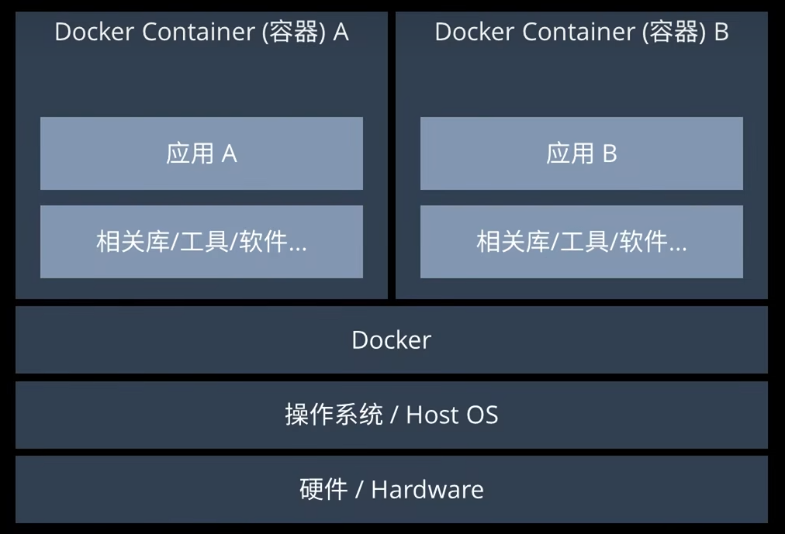
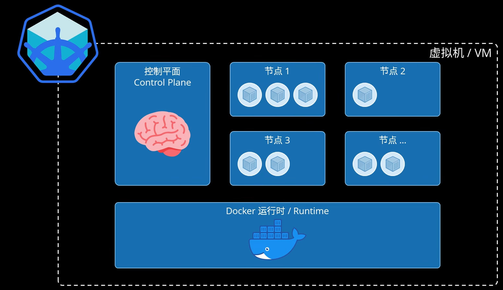
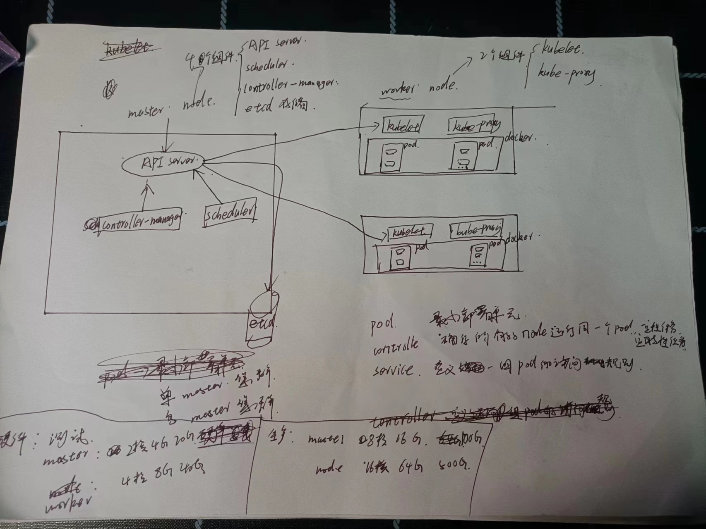
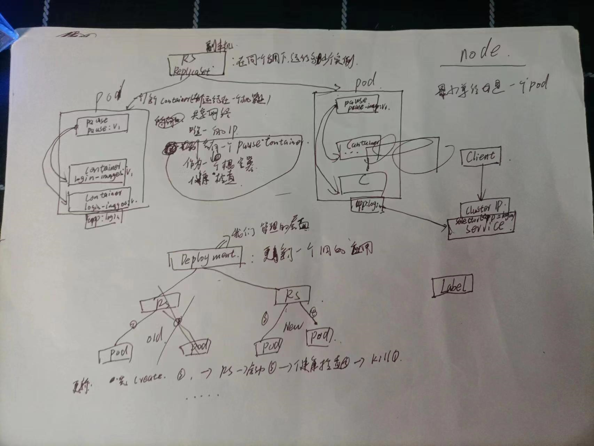
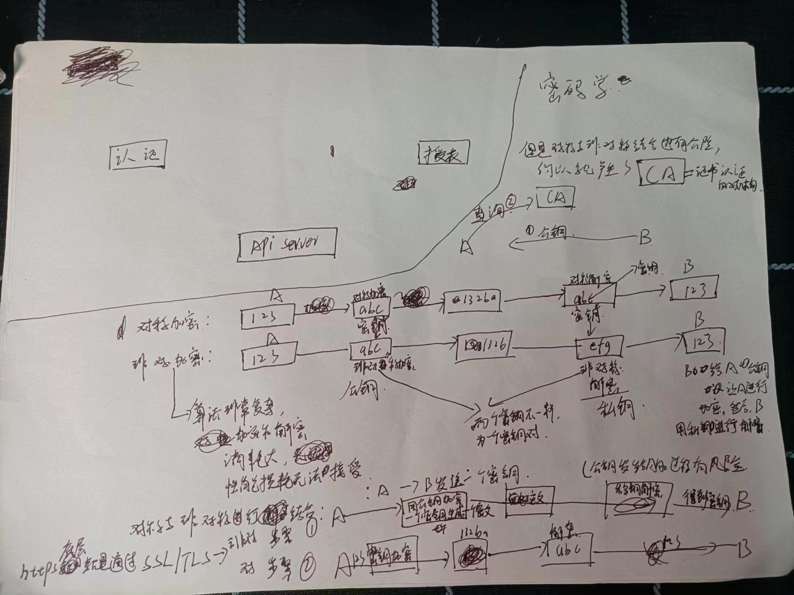
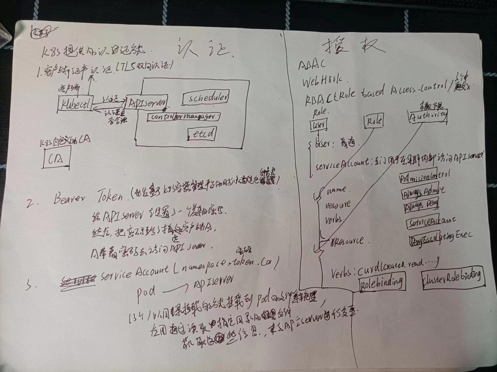

# kubernetes
[总文档](https://k8s.easydoc.net/docs/dRiQjyTY/28366845/6GiNOzyZ/9EX8Cp45)
[k8s单master搭建  gitee](https://gitee.com/moxi159753/LearningNotes/tree/master/K8S/3_%E4%BD%BF%E7%94%A8kubeadm%E6%96%B9%E5%BC%8F%E6%90%AD%E5%BB%BAK8S%E9%9B%86%E7%BE%A4#%E4%BD%BF%E7%94%A8kubeadm%E6%96%B9%E5%BC%8F%E6%90%AD%E5%BB%BAk8s%E9%9B%86%E7%BE%A4)

## 容器技术


## docker与kubernetes的关系
```
Docker和Kubernetes都是容器技术的代表，但它们的关系是不同的。Docker是一种容器化技术，它提供了一种简单的方式来打包、分发和运行应用程序，使得应用程序能够在不同的环境中运行。而Kubernetes则是一个容器编排平台，它可以管理多个容器，自动化应用程序的部署、扩展和管理。具体来说，Docker提供了一种容器化技术，使得应用程序能够更加轻松地打包、分发和运行。而Kubernetes则提供了一种容器编排平台，它可以管理多个容器，自动化应用程序的部署、扩展和管理。Kubernetes可以自动化地管理容器的生命周期，包括创建、启动、停止和销毁容器，同时还可以提供负载均衡、服务发现、自动扩展等功能，使得应用程序更加可靠、高效和可扩展。因此，可以说Docker和Kubernetes是相互依存的关系。Docker提供了容器化技术，使得应用程序能够更加轻松地打包、分发和运行，而Kubernetes则提供了容器编排平台，使得应用程序能够更加可靠、高效和可扩展。在实际应用中，Docker和Kubernetes常常配合使用，使得应用程序能够更加灵活和高效地运行。
```
## k8s
### 架构设计

### 核心概念

### 认证的密码学原理

### 认证与授权


## k8s的网络通信
