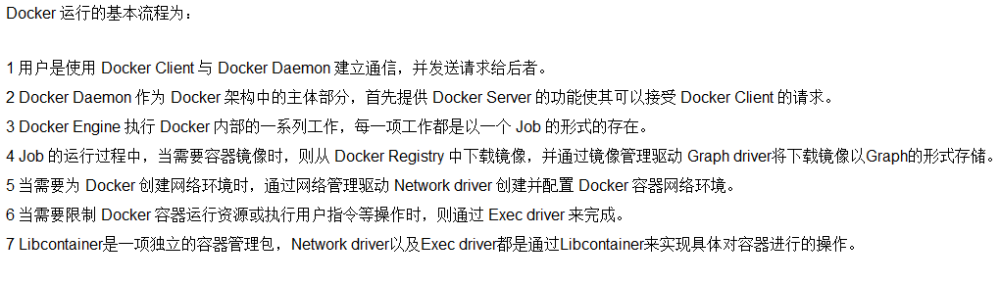

# 🐳docker 安装

## 前提说明


#### 前提条件

目前，CentOS仅发行版本中的内核支持Docker。Docker运行在centos7(64-bit)上，要求系统为64位、linux内核版本为8.4以上。

```sql
[root@localhost ~]# cat /etc/redhat-release #查看当前内核的版本
CentOS Linux release 7.5.1804 (Core) 
[root@localhost ~]# uname -r #查看操作系统的发行版号
3.10.0-862.el7.x86_64
```

## ⭐️Docker的基本组成

#### image

Docker 镜像（Image）就是一个只读的模板。镜像可以用来创建 Docker 容器，一个镜像可以创建很多容器。

它也相当于是一个root文件系统。比如官方镜像 centos:7 就包含了完整的一套 centos:7 最小系统的 root 文件系统。

#### container

**从面向对象角度:**
Docker 利用容器（Container）独立运行的一个或一组应用，应用程序或服务运行在容器里面，容器就类似于一个虚拟化的运行环境，容器是用镜像创建的运行实例。就像是Java中的类和实例对象一样，镜像是静态的定义，容器是镜像运行时的实体。容器为镜像提供了一个标准的和隔离的运行环境，它可以被启动、开始、停止、删除。每个容器都是相互隔离的、保证安全的平台

**从镜像容器角度:**
可以把容器看做是一个简易版的 Linux 环境（包括root用户权限、进程空间、用户空间和网络空间等）和运行在其中的应用程序。

#### repository

仓库（Repository）是集中存放镜像文件的场所。

类似于

Maven仓库，存放各种jar包的地方；

github仓库，存放各种git项目的地方；

Docker公司提供的官方registry被称为Docker Hub，存放各种镜像模板的地方。

仓库分为公开仓库（Public）和私有仓库（Private）两种形式。

最大的公开仓库是 Docker Hub(https://hub.docker.com/)，存放了数量庞大的镜像供用户下载。国内的公开仓库包括阿里云 、网易云等

#### 小总结

需要正确的理解仓库/镜像/容器这几个概念:

Docker 本身是一个容器运行载体或称之为管理引擎。我们把应用程序和配置依赖打包好形成一个可交付的运行环境，这个打包好的运行环境就是image镜像文件。只有通过这个镜像文件才能生成Docker容器实例(类似Java中new出来一个对象)。

image文件可以看作是容器的模板。Docker 根据 image 文件生成容器的实例。同一个 image 文件，可以生成多个同时运行的容器实例。

镜像文件

- image 文件生成的容器实例，本身也是一个文件，称为镜像文件。

容器实例

- 一个容器运行一种服务，当我们需要的时候，就可以通过docker客户端创建一个对应的运行实例，也就是我们的容器

仓库

- 就是放一堆镜像的地方，我们可以把镜像发布到仓库中，需要的时候再从仓库中拉下来就可以了。

### Docker架构图解（入门版）

#### Docker命令行与守护进程如何交互?


从左至右理解上图:

**最左侧是Docker客户端，即Docker命令行(CLI)。**
我们可以运行各种Docker命令，比如构建镜像(docker build)，下载镜像(docker pull)，运行容器(docker run)，Docker命令行可以安装在各种操作系统上，例如Windows，MacOS或者Linux服务器。

**中间是Docker主机，Docker守护进程(daemon)运行在上面。**
Docker命令行可以轻松地连接远程的Docker主机(给定IP和端口即可)。而在MacOS与Windows上"运行"Docker时，Docker守护进程事实上运行在Linux虚拟机中。这里关键点在于，Docker守护进程和命令行可以运行在不同的主机上。

**最右侧是Docker仓库，它也是Docker生态系统中的一份子。**
它是我们下载、上传、存储以及分享Docker镜像的地方。Docker仓库的细节与本文无关，因此不再赘述。

#### 🐳Docker工作原理

Docker是一个Client-Server结构的系统，Docker守护进程运行在主机上， 然后通过Socket连接从客户端访问，守护进程从客户端接受命令并管理运行在主机上的容器。 容器，是一个运行时环境，就是我们前面说到的集装箱。可以对比mysql演示对比讲解


### Docker架构图解（架构版）（先混个眼熟）

#### 整体架构及底层通信原理简述

Docker 是一个 C/S 模式的架构，后端是一个松耦合架构，众多模块各司其职。 



## [安装步骤](https://docs.docker.com/engine/install/centos/#os-requirements)

#### wayone：

- 1.确实你是centos7及以上版本(OS requirements)

```sql
[root@localhost ~]# cat /etc/redhat-release #查看当前内核的版本
CentOS Linux release 7.5.1804 (Core) 
[root@localhost ~]# uname -r #查看操作系统的发行版号
3.10.0-862.el7.x86_64
```

- 2.卸载旧的版本(Uninstall old versions)

Older versions of Docker were called docker or docker-engine. If these are installed, uninstall them, along with associated dependencies.

```sql
sudo yum remove docker \
                  docker-client \
                  docker-client-latest \
                  docker-common \
                  docker-latest \
                  docker-latest-logrotate \
                  docker-logrotate \
                  docker-engine
```

- 3.yum安装gcc相关的

```python
yum install -y gcc gcc-c++ 
```

- 4.安装需要的软件包

```python
yum install -y yum-utils
```

- 5.设置stable镜像仓库（在yum.repo.d文件夹下添加了个docker-ce.repo文件）

注意不要设置官网教程里的路径，因为docker.com是国外的服务器，我们中国的请求连接国外的服务器非常慢，非常容易连接超时。
```md
CentOS-Base.repo  CentOS-Media.repo  docker-ce.repo

```

```python
yum-config-manager \
    --add-repo \
    http://mirrors.aliyun.com/docker-ce/linux/centos/docker-ce.repo
    # 不建议设置，原因如上https://download.docker.com/linux/centos/docker-ce.repo
```

- 6.更新yum软件包索引

```python
yum makecache fast #以后安装会快捷一些
```

- 7.安装docker-ce (Install Docker Engine)

```python
sudo yum install -y docker-ce docker-ce-cli containerd.io docker-compose-plugin
```

- 8.启动docker

```python
sudo systemctl start docker
```

- 9.测试

```python
docker version
docker run hello-world
```

- 10.卸载

```python
systemctl stop docker
sudo yum remove docker-ce docker-ce-cli containerd.io docker-compose-plugin
sudo rm -rf /var/lib/docker
sudo rm -rf /var/lib/containerd
```
#### [docker桌面化安装](https://blog.csdn.net/u012511080/article/details/125397630)
### 出现错误
1、安装docker-ce失败


原因：少了CentOS-Base.repo，epel.repo

解决方法：
cd 进入 /etc/yum.repo.d/目录下
把 bak目录下的repo文件都移到/etc/yum.repo.d/下

#### waytwo：rpm包安装

首先准备rpm包
```python
rpm -ivh *.rpm --force --nodeps
systemctl start docker
systemctl enable docker
```

## :star:阿里云镜像加速器
为了后续pull镜像、运行容器更加容易，更加方便快速。


直接粘：(可以添加多个镜像加速器)
```python
cat << END > /etc/docker/daemon.json
{
        "registry-mirrors":[ "https://nyakyfun.mirror.aliyuncs.com" ]
}
END
```
## 底层原理
#### 为什么Docker会比VM虚拟机快
(1)**docker有着比虚拟机更少的抽象层**

   由于docker不需要Hypervisor(虚拟机)实现硬件资源虚拟化,运行在docker容器上的程序直接使用的都是实际物理机的硬件资源。因此在CPU、内存利用率上docker将会在效率上有明显优势。

(2)**docker利用的是宿主机的内核,而不需要加载操作系统OS内核**

   当新建一个容器时,docker不需要和虚拟机一样重新加载一个操作系统内核。进而避免引寻、加载操作系统内核返回等比较费时费资源的过程,当新建一个虚拟机时,虚拟机软件需要加载OS,返回新建过程是分钟级别的。而docker由于直接利用宿主机的操作系统,则省略了返回过程,因此新建一个docker容器只需要几秒钟。

