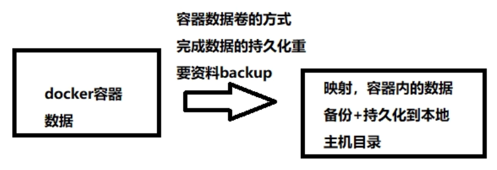
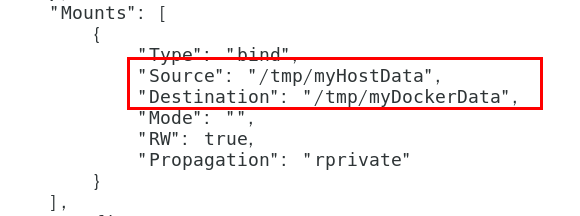

# 🐳docker 容器数据卷


## ❌坑：容器卷记得加入

    --privileged=true

Docker挂载主机目录访问如果出现:
cannot open directory .: Permission denied

解决办法：在挂载目录后多加一个--privileged=true参数即可
 

```md
如果是CentOS7安全模块会比之前系统版本加强，不安全的会先禁止，所以目录挂载的情况被默认为不安全的行为，

在SELinux里面挂载目录被禁止掉了额，如果要开启，我们一般使用--privileged=true命令，扩大容器的权限解决挂载目录没有权限的问题，也即

使用该参数，container内的root拥有真正的root权限，否则，container内的root只是外部的一个普通用户权限。
```

## what is

把docker容器中的数据保存进宿主机的磁盘里

案例：

```md
docker run -it --privileged=true -v /宿主机绝对路径目录:/容器内目录  镜像名
会自动创建目录
```

## what to do

* 将运用与运行的环境打包镜像，run后形成容器实例运行 ，但是我们对数据的要求希望是持久化的

Docker容器产生的数据，如果不备份，那么当容器实例删除后，容器内的数据自然也就没有了。

为了能保存数据在docker中我们使用卷。

特点：

1：数据卷可在容器之间共享或重用数据

2：卷中的更改可以直接实时生效，爽

3：数据卷中的更改不会包含在镜像的更新中

4：数据卷的生命周期一直持续到没有容器使用它为止

## case

#### 宿主与容器之间映射添加容器卷
**命令**：

```md
docker run -it --privileged=true -v /宿主机绝对路径目录:/容器内目录(可以挂多个)  镜像名
```

**查看数据卷是否挂载成功**：

```md
docker inspect 容器ID
```


**容器和宿主机之间数据共享**：

1：docker修改，主机同步获得 

2：主机修改，docker同步获得

3：docker容器stop，主机修改，docker容器重启看数据是否同步。

#### 读写规则映射添加说明

**读写**（默认:read write）

```md
docker run -it --privileged=true -v /宿主机绝对路径目录:/容器内目录:rw  镜像名

不写就是默认rw
```
     
**只读**(read only)

容器实例内部被限制，只能读取不能写
```md
docker run -it --privileged=true -v /宿主机绝对路径目录:/容器内目录:ro  镜像名
```

#### 卷的继承和共享

**容器1完成和宿主机的映射**

```md
docker run -it  --privileged=true -v /mydocker/u:/tmp --name u1 ubuntu
```

**容器2继承容器1的卷规则**（容器之间实现数据共享）

```md
docker run -it  --privileged=true --volumes-from 父类 --name=u2  镜像repository
```

