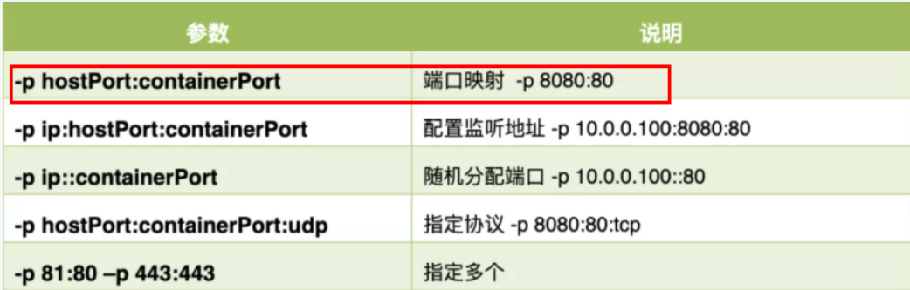
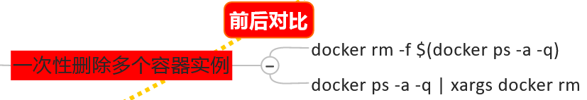
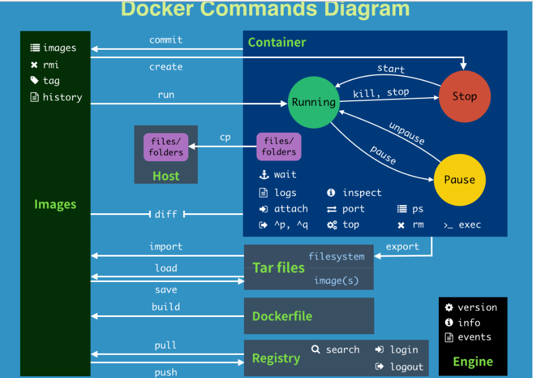

# 🐳Docker 的常用命令
[-itd](https://blog.csdn.net/qq_19381989/article/details/102781663?)
## 帮助启动类命令
```python
启动docker：systemctl start docker

停止docker：systemctl stop docker

重启docker：systemctl restart docker

查看docker状态：systemctl status docker

开启启动：systemctl enable docker

查看docker概要信息：docker info

查看docker总体帮助文档：docker --help

查看docker命令帮助文档：docker 具体命令--help
```
## 镜像命令
**列出主机本地的镜像:**
```
docker images 

option:
-a:列出本地所有镜像(含历史映像层)
-q:只显示镜像ID

    REPOSITORY    TAG       IMAGE ID       CREATED            SIZE
    hello-world   latest    feb5d9fea6a5   14 months ago   13.3kB

REPOSITORY：表示镜像的仓库源
TAG：镜像的标签版本号
IMAGE ID：镜像ID
CREATED：镜像创建时间
SIZE：镜像大小

同一仓库源可以有多个 TAG版本，代表这个仓库源的不同个版本，我们使用 REPOSITORY:TAG 来定义不同的镜像。
如果你不指定一个镜像的版本标签，例如你只使用 ubuntu，docker 将默认使用 ubuntu:latest 镜像
```
**查找镜像：**
```
docker search 某个XXX镜像名字

网站：http://hub.docker.com
命令：docker search [option] 镜像名字
option：
--limit：只列出N个镜像，默认25个
docker search --limit 5 redis

[root@localhost ~]# docker search redis
NAME                               DESCRIPTION                                     STARS     OFFICIAL   AUTOMATED
redis                              Redis is an open source key-value store that…   11611     [OK]       
bitnami/redis                      Bitnami Redis Docker Image                      237                  [OK]

name:镜像名称
description:镜像说明
stars:点赞数量
official:是否是官方的
automated:是否是自动构建的
```
**下载镜像：**
```
docker pull 某个xxx镜像名字

docker pull 镜像名字[:TAG]

说明：
docker pull 镜像名字
(没有TAG就是默认为最新版，即TAG为latest)
(等价于docker pull 镜像名字：latest)
```
**查看镜像/容器/数据卷所占用的空间：**
```
docker system df 

TYPE            TOTAL     ACTIVE    SIZE      RECLAIMABLE
Images          1         1         13.26kB   0B (0%)
Containers      1         0         0B        0B
Local Volumes   0         0         0B        0B
Build Cache     0         0         0B        0B
```
**删除镜像：**
```
docker rmi 某个XXX镜像名字ID

删除单个：docker rmi -f 镜像ID
删除多个：docker rmi -f 镜像名1：TAG 镜像名2：TAG
删除全部：docker rmi -f $(docker images -qa)
```
```
面试题：谈谈虚悬镜像是什么？
repository 和 tag 都是<none>的镜像
```
## 容器命令
有镜像才能创建容器，这是根本前提(下载一个Ubuntu镜像演示)

**新建+启动容器:**
```
docker run [optinons] image [command][ARG...]

OPTIONS说明（常用）：有些是一个减号，有些是两个减号

--name="容器新名字"       为容器指定一个名称；

-d: 后台运行容器并返回容器ID，也即启动守护式容器(后台运行)；
(适合那种在后台运行的，好比http、nginx、等等，需要它一直工作)

-i：以交互模式运行容器，通常与 -t 同时使用；

-t：为容器重新分配一个伪输入终端，通常与 -i 同时使用；

-it:也即启动交互式容器(前台有伪终端，等待交互)；

-P: 随机端口映射，大写P

-p: 指定端口映射，小写p
例如docker端口是8080，而docker里面的nginx是80端口，
那么要访问docker里面的nginx，就要-p 8080:80
```

```
启动交互式容器:
#使用镜像centos:latest以交互模式启动一个容器,在容器内执行/bin/bash命令。

docker run -it centos /bin/bash 

参数说明：
-i: 交互式操作。
-t: 终端。
centos : centos 镜像。
/bin/bash：放在镜像名后的是命令，这里我们希望有个交互式 Shell，因此用的是 /bin/bash。
要退出终端，直接输入 exit:
```

**列出当前所有正在运行的容器**
```python
docker ps [options]

options:(frequently)

-a :列出当前所有正在运行的容器+历史上运行过的

-l :显示最近创建的容器。

-n 数字：显示最近n个创建的容器。

-q :静默模式，只显示容器编号。
```

**退出容器**


**启动已停止运行的容器**
```sql
docker start 容器ID或容器名
```
**进入正在运行的容器并以命令行交互**
```sql
docker  exec -it 容器名或ID /bin/bash
重新进入docker attach 容器ID
```
**重启容器**
```sql
docker restart 容器ID或容器名
```
**停止容器**
```sql
docker stop 容器ID或容器名
```
**强制停止容器**
```sql
docker kill 容器ID或容器名
```
**删除已停止的容器**
```sql
docker rm 容器ID或容器名
```


#### :star:重要
**下载一个Redis6.0.8镜像演示**

**启动守护式容器（后台服务器）：**

在大部分情况下，我们希望docker的服务是在后台运行的，我们可以通过 -d 指定容器的后台运行模式。

    docker run -d 容器名

Redis 前台后台启动演示case：

    前台交互式启动：docker run -it redis：6.0.8
    后台守护式启动：docker run -d redis：6.0.8

**查看容器日志：**

    docker logs 容器ID

**查看容器内运行的进程：**

    docker top 容器ID

**查看容器内部细节：**

    docker inspect 容器ID

**进入正在运行的容器并以命令行交互：**
```sql
docker  exec -it 容器名或ID /bin/bash

重新进入docker attach 容器ID
```
以上两种方式的区别：

attach 直接进入容器启动命令的终端，不会启动新的进程。
如果用exit会导致容器的停止。（说白了，就是重新进入了使用docker run 命令打开的那个终端。）

（==推荐使用==）exec 是在容器中打开新的终端，并且可以启动新的进程。
用exit退出命令行交互，并不会导致容器的停止。
==一般来说是用 -d 后台启动的程序，再用exec进入对应容器实例。==

**从容器上copy文件到主机上（备份）**
```sql 
容器——>主机
docker cp 容器ID:容器内路径 目的主机路径
```

**==导入和导出容器==（备份）**

export 导出容器的内容留作为一个tar归档文件[对应import命令]

    docker export 容器ID > x.tar

import 从tar包中的内容创建一个新的文件系统再导入为镜像[对应export]

    cat x.tar | docker import - （自定义）镜像用户/镜像名：镜像版本号

## 小总结

```python
attach    Attach to a running container                 # 当前 shell 下 attach 连接指定运行镜像

build     Build an image from a Dockerfile              # 通过 Dockerfile 定制镜像

commit    Create a new image from a container changes   # 提交当前容器为新的镜像

cp        Copy files/folders from the containers filesystem to the host path   #从容器中拷贝指定文件或者目录到宿主机中

create    Create a new container                        # 创建一个新的容器，同 run，但不启动容器

diff      Inspect changes on a container's filesystem   # 查看 docker 容器变化

events    Get real time events from the server          # 从 docker 服务获取容器实时事件

exec      Run a command in an existing container        # 在已存在的容器上运行命令

export    Stream the contents of a container as a tar archive   # 导出容器的内容流作为一个 tar 归档文件[对应 import ]

history   Show the history of an image                  # 展示一个镜像形成历史

images    List images                                   # 列出系统当前镜像

import    Create a new filesystem image from the contents of a tarball # 从tar包中的内容创建一个新的文件系统映像[对应export]

info      Display system-wide information               # 显示系统相关信息

inspect   Return low-level information on a container   # 查看容器详细信息

kill      Kill a running container                      # kill 指定 docker 容器

load      Load an image from a tar archive              # 从一个 tar 包中加载一个镜像[对应 save]

login     Register or Login to the docker registry server    # 注册或者登陆一个 docker 源服务器

logout    Log out from a Docker registry server          # 从当前 Docker registry 退出

logs      Fetch the logs of a container                 # 输出当前容器日志信息

port      Lookup the public-facing port which is NAT-ed to PRIVATE_PORT    # 查看映射端口对应的容器内部源端口

pause     Pause all processes within a container        # 暂停容器

ps        List containers                               # 列出容器列表

pull      Pull an image or a repository from the docker registry server   # 从docker镜像源服务器拉取指定镜像或者库镜像

push      Push an image or a repository to the docker registry server    # 推送指定镜像或者库镜像至docker源服务器

restart   Restart a running container                   # 重启运行的容器

rm        Remove one or more containers                 # 移除一个或者多个容器

rmi       Remove one or more images       # 移除一个或多个镜像[无容器使用该镜像才可删除，否则需删除相关容器才可继续或 -f 强制删除]

run       Run a command in a new container              # 创建一个新的容器并运行一个命令

save      Save an image to a tar archive                # 保存一个镜像为一个 tar 包[对应 load]

search    Search for an image on the Docker Hub         # 在 docker hub 中搜索镜像

start     Start a stopped containers                    # 启动容器

stop      Stop a running containers                     # 停止容器

tag       Tag an image into a repository                # 给源中镜像打标签

top       Lookup the running processes of a container   # 查看容器中运行的进程信息

unpause   Unpause a paused container                    # 取消暂停容器

version   Show the docker version information           # 查看 docker 版本号

wait      Block until a container stops, then print its exit code   # 截取容器停止时的退出状态值
```