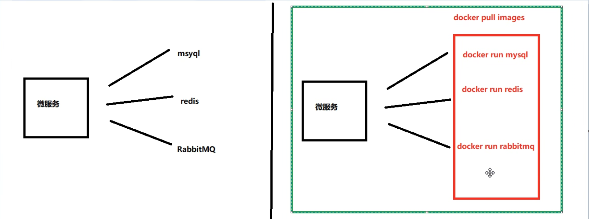
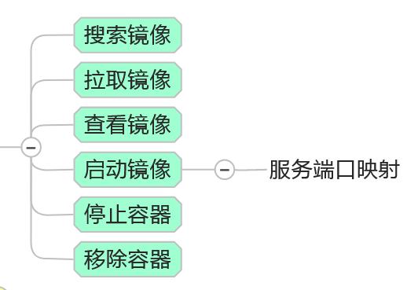
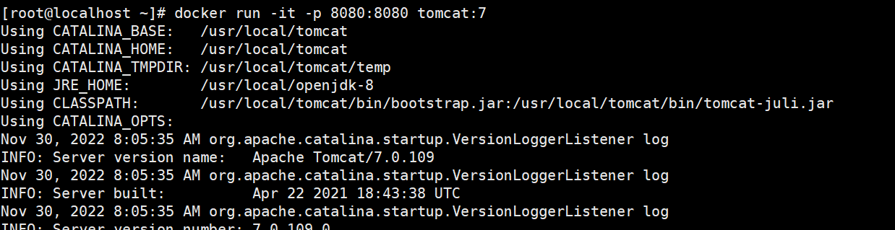
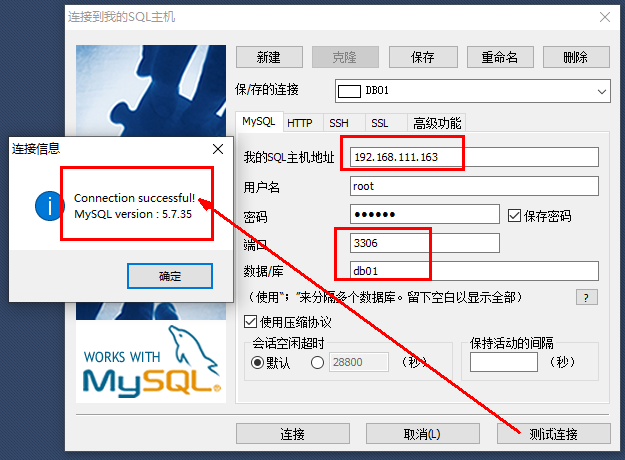

# 🐳docker常规安装简介

## 总体步骤



## 安装🐱Tomcat

#### 查找镜像:

```md
docker search tomcat
```

#### 拉取镜像到本地:

```md
docker pull tomcat
```

#### 查看是否拉取成功:

```md
[root@localhost ~]# docker images
REPOSITORY                        TAG        IMAGE ID       CREATED         SIZE
tomcat                            latest     fb5657adc892   11 months ago   680MB
registry                          latest     b8604a3fe854   12 months ago   26.2MB
ubuntu                            latest     ba6acccedd29   13 months ago   72.8MB
hello-world                       latest     feb5d9fea6a5   14 months ago   13.3kB
```

#### 使用镜像创建容器实例:
```md
docker run -it -p 8080:8080 tomcat:7 (不加bash)
```

###### 问题
问题1 [参考文档](https://blog.csdn.net/qq_45834685/article/details/125527691?)
```md
[root@localhost ~]# docker run -it -p 8080:8080 tomcat
docker: Error response from daemon: driver failed programming external connectivity on endpoint zealous_maxwell (14f10a28c5089cc741c61f6c53225a2640b147742139d5417084369846441dc4):  (iptables failed: iptables --wait -t nat -A DOCKER -p tcp -d 0/0 --dport 8080 -j DNAT --to-destination 172.17.0.2:8080 ! -i docker0: iptables: No chain/target/match by that name.
 (exit status 1)).
ERRO[0000] error waiting for container: context canceled 
解决方案：
在确保8080端口防火墙放行，端口未被占用条件下：
重启docker：systemctl restart docker
然后再次创建Tomcat容器：docker run -it -p 8080:8080 tomcat /bin/bash
```
问题2

图片的状态为开启Tomcat，可以在浏览器中进行访问。进入交互模式无法访问页面。
没有进入交互模式原因：
创建Tomcat容器实例的时候最后没有加/bin/bash
#### 访问🐱首页
###### 问题
问题一：

网页打不开

原因：进入容器内部，发现webapps为空，且有个webapps.list。

解决：把webapps.list下的文件都移动到Webapps目录下面，并删除webapps.list目录

###### 免修改webapps方法
```md
docker pull billygoo/tomcat8-jdk8

docker run -d -p 8080:8080 --name=mytomcat8 billygoo/tomcat8-jdk8
```

## 安装mysql

#### 准备：
pull一个mysql镜像，本次使用5.7

#### 简单版：

准备：
```md
docker run -d -p 3306:3306 -e MYSQL_ROOT_PASSWORD=313191(设置密码)  mysql:5.7

docker ps

docker exec -it 容器ID /bin/bash

mysql -uroot -p 3131919(登录)
```
测试：建库建表插入数据

连接Windows外部软件运行：


问题：解决中文乱码情况。
```md
SHOW VARIABLES LIKE 'character%' #查看配置情况

```
解决：

在/etc/mysql/conf.d目录下创建my.cnf文件
```md
#vim my.cnf

[client]
default_character_set=utf8
[mysqld]
collation_server = utf8_general_ci
character_set_server = utf8
```

#### 实战版:

准备：
```md
docker run -d \
-p 3306:3306 \
--privileged=true \
-v /wsj/mysql/log:/var/log/mysql\
-v /wsj/mysql/data:/var/lib/mysql\
-v /wsj/mysql/conf:/etc/mysql/conf.d\
-e MYSQL_ROOT_PASSWORD=313191 \
--name=mysql\
mysql:5.7

docker ps
```
处理中文乱码问题：
```md
ca /wsj/mysql/conf
vim my.cnf
[client]
default_character_set=utf8
[mysqld]
collation_server = utf8_general_ci
character_set_server = utf8
```
测试:
```md
docker restart mysql

docker exec -it mysql /bin/bash

mysql -u root -p 313191    
```
结论：
```md
之前的DB  无效

修改字符集操作+重启mysql容器实例

之后的DB  有效，需要新建

结论：docker安装完MySQL并run出容器后，建议请先修改完字符集编码后再新建mysql库-表-插数据
```
## 安装redis
暂缓
## 安装nginx
暂缓