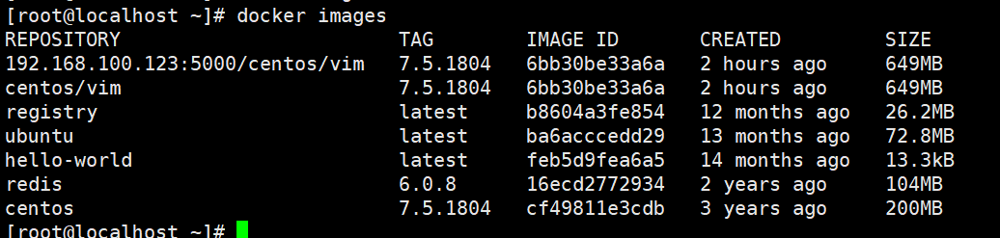
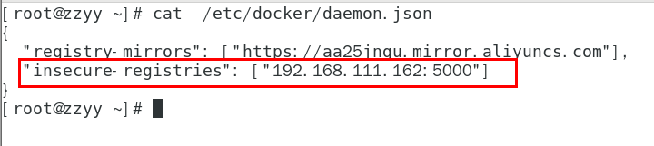

# 本地镜像发布到私有库

## 本地镜像发布到私有库流程


## 是什么

1、官方Docker Hub地址：https://hub.docker.com/，中国大陆访问太慢了且准备被阿里云取代的趋势，不太主流。

2、Dockerhub、阿里云这样的公共镜像仓库可能不太方便，涉及机密的公司不可能提供镜像给公网，所以需要创建一个本地私人仓库供给团队使用，基于公司内部项目构建镜像。

⭐️Docker Registry是官方提供的工具，可以用于构建私有镜像仓库

## 🐳创建私有库&&将本地镜像推送到私有库

1、下载镜像Docker Registry

```python
    docker pull registry
```

2、运行私有库Registry，相当于本地有个私有的Docker Hub

```python
docker run -d -p 5000:5000  -v /zzyyuse/myregistry/:/tmp/registry --privileged=true registry

默认情况，仓库被创建在容器的/var/lib/registry目录下，建议自行用容器卷映射，方便于宿主机联调

使用官方的 registry 镜像来启动私有仓库。阳哥启动容器的命令里绑定数据卷那里写的`/tmp/registry`。实测本地镜像push到私服库之后，这个路径下没有镜像。查了下，默认情况下，仓库会被创建在容器的 `/var/lib/registry` 目录下。
```

3、准备一个镜像文件，我准备为centos/vim
``之前弄过，这里就不弄了``

4、curl验证私服库上有什么镜像（当然也可以在网页上进行查看，不过需要下载httpd）

```python
[root@localhost ~]# curl -XGET http://192.168.100.123:5000/v2/_catalog
{"repositories":[]}

v2/_catalog是一个默认路径
可以看到，目前私服库没有任何镜像上传过。。。。。。
```

5、将镜像centos/vim修改符合私服规范的Tag

```python
按照公式： docker   tag   镜像:Tag   Host:Port/Repository:Tag

自己host主机IP地址，填写同学你们自己的，不要粘贴错误，O(∩_∩)O

使用命令 docker tag 将zzyyubuntu:1.2 这个镜像修改为192.168.111.162:5000/zzyyubuntu:1.2

docker tag  centos/vim:7.5.1804  192.168.100.123:5000/centos/vim:7.5.1804
```



6、修改docker配置文件


```
注意：

配置registry仓库的ip地址，可以是远程云服务器的ip地址。

别无脑照着复制，registry-mirrors 配置的是国内阿里提供的镜像加速地址，不用加速的话访问官网的会很慢。

2个配置中间有个逗号 ','别漏了，这个配置是json格式的。
2个配置中间有个逗号 ','别漏了，这个配置是json格式的。
2个配置中间有个逗号 ','别漏了，这个配置是json格式的。
```

```python
vim命令新增如下红色内容：vim /etc/docker/daemon.json
{
  "registry-mirrors": ["https://aa25jngu.mirror.aliyuncs.com"], 
  "insecure-registries": ["192.168.100.123:5000"]
}
```

上述理由：docker默认不允许http方式推送镜像，通过配置选项来取消这个限制。====> 修改完后如果不生效，建议重启docker

7、push推送到私服库

```python
docker push 192.168.100.123:5000/centos/vim:7.5.1804

[root@localhost ~]# docker push 192.168.100.123:5000/centos/vim:7.5.1804
The push refers to repository [192.168.100.123:5000/centos/vim]
b823c389a505: Pushed 
4826cdadf1ef: Pushed 
7.5.1804: digest: sha256:026affc2789a17751bbb87d4e396e8511832625d9a09742417b28cf68ef13dfc size: 742
```

8、curl验证私服库上有什么镜像（当然也可以在网页上进行查看，不过需要下载httpd）

```python
curl -XGET http://192.168.100.123:5000/v2/_catalog

[root@localhost ~]# curl -XGET http://192.168.100.123:5000/v2/_catalog
{"repositories":["centos/vim"]}
```

9、pull到本地并运行

```python
docker pull 192.168.100.123:5000/centos/vim:7.5.1804
```
## 总结
registry仅提供一个存储镜像的地方，它只简单的展示了私有仓库的镜像名称和tag，无法查看私有仓库更详细信息。实际生产环境很少用到registry私有仓库。

## 参考文档

[血煞长虹](https://blog.csdn.net/succing/article/details/122757052?)