# 🐳[Dockerfile](https://www.cnblogs.com/edisonchou/p/dockerfile_inside_introduction.html)(用来自定义镜像)
[大佬文档](https://blog.csdn.net/m0_46090675/article/details/121846718?)
dockerfile就是用来组成我们pull下来的那些镜像，那些镜像就是用dockerfile组成的，可以比作shell脚本，然后我们只需要运行脚本就可以把我们想要的软件安装好。而docker的容器实例可以看做，docker分割出一个个空间，每个实例就是运行在不同的空间(可以看成在不同的电脑上使用脚本安装软件，但是用的脚本都是一样的，我们把脚本放在云上，然后用的时候就可以（pull）下载下来)。

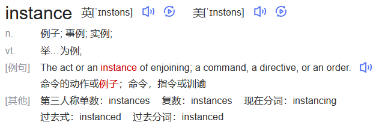

## what(类似于shell脚本)

$dockerfile是用来构建自定义docker镜像，\\是由一条条构建镜像所需的指令和参数构成的脚本$

#### 概述

#### [官网](https://docs.docker.com/engine/reference/builder)

#### 构建三步骤(类似)

1、编写dockfile文件(编写shell脚本)

2、docker build命令构建镜像(运行shell脚本)

    docker build -t 创建镜像name:tag  .(dockerfile文件所在路径)

3、docker run以镜像运行容器实例(启动脚本安装的软件)

## Dockerfile构建过程解析

#### Dockerfile内容基础知识

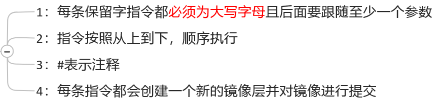

#### docker执行Dockerfile的大致流程

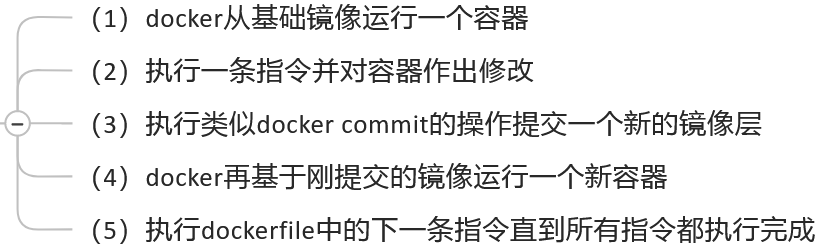

#### 小总结

从应用软件的角度来看，Dockerfile、Docker镜像与Docker容器分别代表软件的三个不同阶段，

* Dockerfile是软件的原材料
* Docker镜像是软件的交付品
* Docker容器则可以认为是软件镜像的运行态，也即依照镜像运行的容器实例

Dockerfile面向开发，Docker镜像成为交付标准，Docker容器则涉及部署与运维，三者缺一不可，合力充当Docker体系的基石。

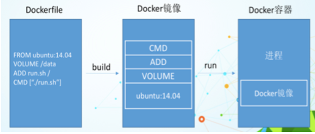

1、Dockerfile，需要定义一个Dockerfile，Dockerfile定义了进程需要的一切东西。Dockerfile涉及的内容包括执行代码或者是文件、环境变量、依赖包、运行时环境、动态链接库、操作系统的发行版、服务进程和内核进程(当应用进程需要和系统服务和内核进程打交道，这时需要考虑如何设计namespace的权限控制)等等;

2、Docker镜像，在用Dockerfile定义一个文件之后，docker build时会产生一个Docker镜像，当运行 Docker镜像时会真正开始提供服务;

3、Docker容器，容器是直接提供服务的。

## docker常用保留字指令

#### [参考Tomcat8的dockerfile入门](https://github.com/docker-library/tomcat)

#### [例子](https://github.com/docker-library/tomcat/blob/master/10.0/jdk11/corretto-al2/Dockerfile)

#### FROM（from）

·基础镜像，当前新镜像是基于哪个镜像的，指定一个已经存在的镜像作为模板，第一条必须是from

#### MAINTAINER(maintainer)

·镜像维护者的姓名和邮箱地址

#### RUN(run)

·容器构建时需要运行的命令
·两种格式
·shell格式：
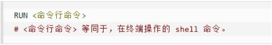
RUN yum -y install vim
·exec格式:
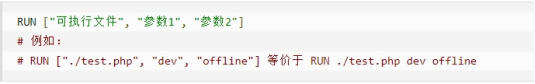
·RUN是在 docker build时运行

#### EXPOSE(expose)

·当前容器对外暴露出的端口

#### WORKDIR(workdir)

·指定在创建容器后，终端默认登陆的进来工作目录，一个落脚点

#### USER(user)

·指定该镜像以什么样的用户去执行，如果都不指定，默认是root

#### ENV(env)

·用来在构建镜像过程中设置环境变量
ENV MY_PATH /usr/mytest
这个环境变量可以在后续的任何RUN指令中使用，这就如同在命令前面指定了环境变量前缀一样；
也可以在其它指令中直接使用这些环境变量，
比如：WORKDIR $MY_PATH

#### ADD(add)

·将宿主机目录下的文件拷贝进镜像且会自动处理URL和解压tar压缩包

#### COPY(copy)

·类似ADD，拷贝文件和目录到镜像中。 将从构建上下文目录中 <源路径> 的文件/目录复制到新的一层的镜像内的 <目标路径> 位置
·COPY src dest
·COPY ["src", "dest"]
·<src源路径>：源文件或者源目录
·<dest目标路径>：容器内的指定路径，该路径不用事先建好，路径不存在的话，会自动创建。

#### VOLUME(volume)

·容器数据卷，用于数据保存和持久化工作

#### CMD(cmd)

·指定容器启动后的要干的事情（注意不是只执行最后一个，是层层覆盖到最后一个，a=1,a=2,a=3..a=100、最后a=100）
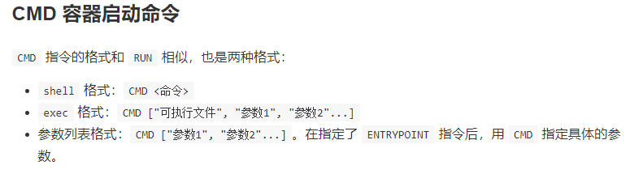
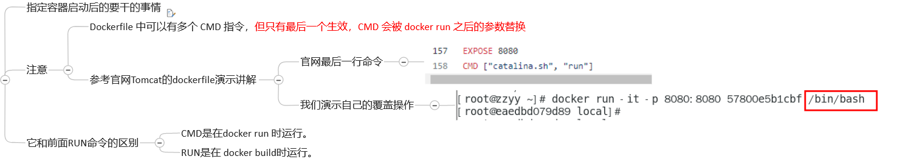

#### ENTRYPOINT(entrypoint)

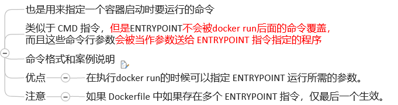
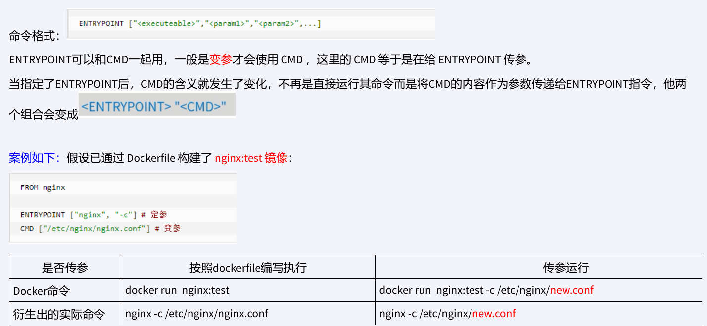

#### 小总结

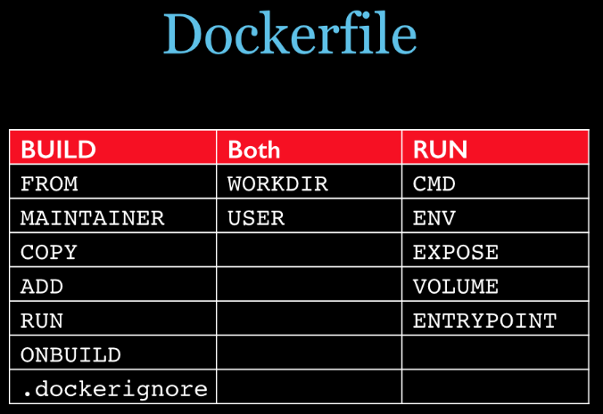

## 案例

#### 自定义镜像mycentosjava8

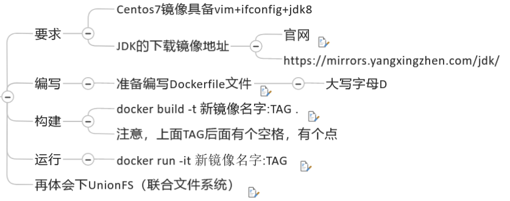

#### 虚悬镜像

1、是什么
构建或者删除镜像的时候，出现的一些错误，导致仓库和标签都是`<none>`
仓库名、标签名都是`<none>`的镜像，dangling images
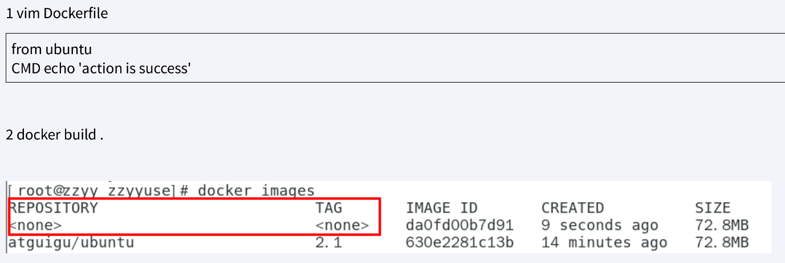
2、查看
docker images ls -f dangling=true
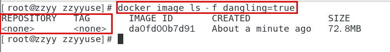
3、删除
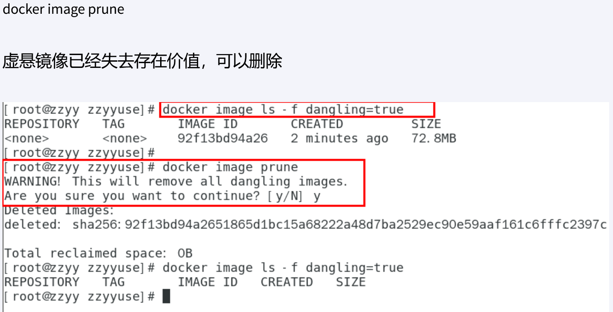

#### 家庭作业-自定义镜像myubuntu

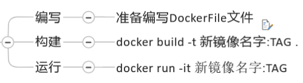

## 小总结

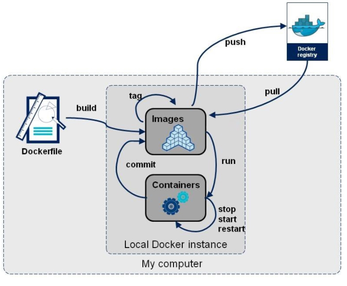
