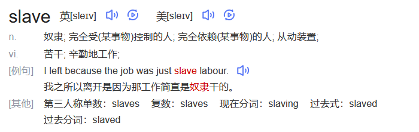
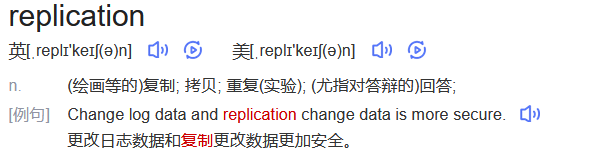

# 🐳docker复杂安装详说




## 安装mysql主从复制⚡️

#### 主从复制原理

主从复制是用来建立一个和 主数据库完全一样的数据库环境称为从数据库；主数据库一般是准实时的业务数据库。

#### 主从搭建步骤

##### 新建主服务器容器3307

```md
docker run  \
-p 3307:3306 \
--name mysql-master \
-v /wsj/mysql-master/log:/var/log/mysql \
-v /wsj/mysql-master/data:/var/lib/mysql \
-v /wsj/mysql-master/conf:/etc/mysql/conf.d \
-e MYSQL_ROOT_PASSWORD=313191 \
-d mysql:8.0.26
```

2、在/wsj/msyql-master/conf目录下新建my.cnf

```md

[mysqld]

## 设置server_id，同一局域网中需要唯一

server_id=101 

## 指定不需要同步的数据库名称

binlog-ignore-db=mysql  

## 开启二进制日志功能

log-bin=mall-mysql-bin  

## 设置二进制日志使用内存大小（事务）

binlog_cache_size=1M  

## 设置使用的二进制日志格式（mixed,statement,row）

binlog_format=mixed  

## 二进制日志过期清理时间。默认值为0，表示不自动清理。

expire_logs_days=7  

## 跳过主从复制中遇到的所有错误或指定类型的错误，避免slave端复制中断。

## 如：1062错误是指一些主键重复，1032错误是因为主从数据库数据不一致

slave_skip_errors=1062
```

3、重启容器实例

```md
docker restart mysql-master

### 注意这里有个坑
[root@localhost conf]# docker ps -a
CONTAINER ID   IMAGE          COMMAND                  CREATED         STATUS                      PORTS     NAMES
bfce3fa5eed1   mysql:8.0.26   "docker-entrypoint.s…"   9 minutes ago   Exited (1) 15 seconds ago             mysql-master
这里的因为权限不足，刚启动mysql就闪退了，造成exited(1)
只需要：
# [root@localhost ~]# chmod -R 644 my.cnf
# 实在不行777
```

4、进入mysql-master

```md
[root@localhost ~]# docker exec -it mysql-master /bin/bash
root@73f828a4c660:/# mysql -u root -p
Enter password: 
```

5、master容器实例内创建数据同步用户

```md
mysql> create user 'slave'@'%' identified by '313191';
Query OK, 0 rows affected (0.01 sec)

mysql> grant replication slave,replication client on *.* to 'slave'@'%';
Query OK, 0 rows affected (0.00 sec)
```

##### 新建从服务器容器3308

```md
docker run \
-p 3308:3306 \
--name=mysql-slave \
-v /wsj/mysql-slave/log:/var/log/mysql \
-v /wsj/mysql-slave/data:/var/lib/mysql \
-v /wsj/mysql-slave/conf:/etc/mysql/conf.d \
-e MYSQL_ROOT_PASSWORD=313191 \
-d mysql:8.0.26
```

2、进入/wsj/mysql-slave/conf

```md
#vim my.cnf
[mysqld]

## 设置server_id，同一局域网中需要唯一

server_id=102

## 指定不需要同步的数据库名称

binlog-ignore-db=mysql  

## 开启二进制日志功能，以备Slave作为其它数据库实例的Master时使用

log-bin=mall-mysql-slave1-bin  

## 设置二进制日志使用内存大小（事务）

binlog_cache_size=1M  

## 设置使用的二进制日志格式（mixed,statement,row）

binlog_format=mixed  

## 二进制日志过期清理时间。默认值为0，表示不自动清理。

expire_logs_days=7  

## 跳过主从复制中遇到的所有错误或指定类型的错误，避免slave端复制中断。

## 如：1062错误是指一些主键重复，1032错误是因为主从数据库数据不一致

slave_skip_errors=1062  

## relay_log配置中继日志

relay_log=mall-mysql-relay-bin  

## log_slave_updates表示slave将复制事件写进自己的二进制日志

log_slave_updates=1  

## slave设置为只读（具有super权限的用户除外）

read_only=1
```

3、重启数据库容器实例

```md
docker restart mysql-slave
```

4、进入mysql-master 查看主从同步状态

```md
show master status;
```

5、进入并运行从数据库

```md
[root@localhost conf]# docker exec -it mysql-slave /bin/bash
root@a30138880772:/# mysql -u root -p
Enter password: 
```

6、在从数据库中设置主从复制

```md
## 注意查看master的show master status 的信息
change master to master_host='主数据库ip', master_user='slave', master_password='313191', master_port=3307, master_log_file='mall-mysql-bin.000001', master_log_pos=617, master_connect_retry=30;

master_host：主数据库的IP地址；

master_port：主数据库的运行端口；

master_user：在主数据库创建的用于同步数据的用户账号；

master_password：在主数据库创建的用于同步数据的用户密码；

master_log_file：指定从数据库要复制数据的日志文件，通过查看主数据的状态，获取File参数；

master_log_pos：指定从数据库从哪个位置开始复制数据，通过查看主数据的状态，获取Position参数；

master_connect_retry：连接失败重试的时间间隔，单位为秒。
```

7、在从数据库中查看主从同步状态

```md
show slave status \G(加个\G能见更加详细的信息)

#说明还没开始
    Slave_IO_Running: No 
    Slave_SQL_Running: No

```

8、在从数据库中开启主从同步

```sql
mysql> start slave;
Query OK, 0 rows affected, 1 warning (0.01 sec)
```

9、在从数据库中查看主从同步状态

```md
    Slave_IO_Running: Yes
    Slave_SQL_Running: Yes
```
10、自行测试

##### 参考文档
[克卜勒Kepler](https://blog.csdn.net/qq_42341158/article/details/103833534?)
