# 🐳Docker网络


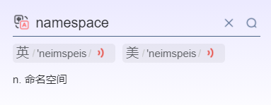


## 🐰what is it

#### when docker is dead,默认网络情况

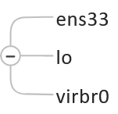

在CentOS7的安装过程中如果有选择相关虚拟化的的服务安装系统后，启动网卡时会发现有一个以网桥连接的私网地址的virbr0网卡(virbr0网卡：它还有一个固定的默认IP地址192.168.122.1)，是做虚拟机网桥的使用的，其作用是为连接其上的虚机网卡提供 NAT访问外网的功能。

我们之前学习Linux安装，勾选安装系统的时候附带了libvirt服务才会生成的一个东西，如果不需要可以直接将libvirtd服务卸载，

yum remove libvirt-libs.x86_64

#### when docker is active，网络情况。

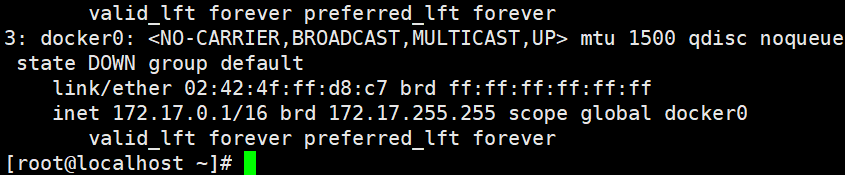

##### 查看docker网络模式命令

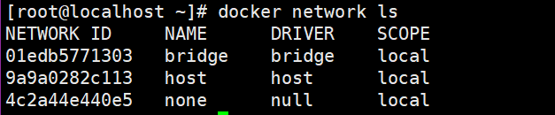

## 🐶常用基本命令

```md
docker network --help:

Commands:
  connect     Connect a container to a network
  create  networkname  | Create a network
  disconnect  Disconnect a container from a network
  inspect   networkname |  Display detailed information on one or more networks
  ls          List networks
  prune       Remove all unused networks
  rm    networkname  |   Remove one or more networks
```

## 🐷what can it do：

容器之间的互联和通信以及端口映射

容器IP变动的时候可以通过服务名直接网络通信而不受影响

## 🦋网络模式(network model)

#### 总体介绍

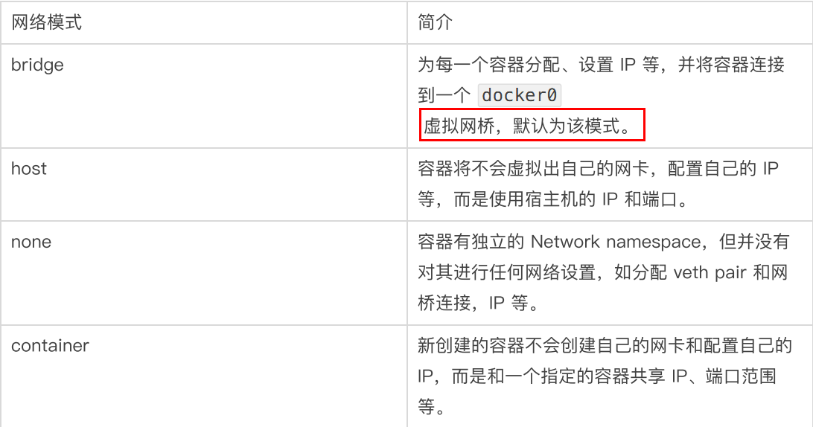

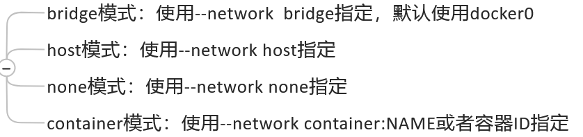

#### 容器实例内默认网络IP生产规则

###### 说明：

1、开启两个Ubuntu实例

```md
[root@localhost ~]# docker run -it --name=u3 ubuntu bash
root@e3fa63207b69:/# [root@localhost ~]#
[root@localhost ~]# docker run -it --name=u4 ubuntu bash
root@e3fa63207b69:/# [root@localhost ~]#
```

2、查看ip

```md
[root@localhost ~]# docker inspect u3 |tail -20
            "Networks": {
                "bridge": {
                    "IPAMConfig": null,
                    "Links": null,
                    "Aliases": null,
                    "NetworkID": "654e6701165eb87d791eb2d2cac895fbf0f3891625915ced39ddac743ae0f1ca",
                    "EndpointID": "90308dbf44e58ee7f5a4c3dd3fc29b2111c3ec3bf5904210a20fbe6b7dba094c",
                    "Gateway": "172.17.0.1",
                    "IPAddress": "172.17.0.2",
                    "IPPrefixLen": 16,
                    "IPv6Gateway": "",
                    "GlobalIPv6Address": "",
                    "GlobalIPv6PrefixLen": 0,
                    "MacAddress": "02:42:ac:11:00:02",
                    "DriverOpts": null
                }
            }
        }
    }
]

[root@localhost ~]# docker inspect u4 |tail -20
            "Networks": {
                "bridge": {
                    "IPAMConfig": null,
                    "Links": null,
                    "Aliases": null,
                    "NetworkID": "654e6701165eb87d791eb2d2cac895fbf0f3891625915ced39ddac743ae0f1ca",
                    "EndpointID": "915404f1f150f0bb6cbac9cceedcc747ad4c443d8b10a51a1e196978adc37805",
                    "Gateway": "172.17.0.1",
                    "IPAddress": "172.17.0.3",
                    "IPPrefixLen": 16,
                    "IPv6Gateway": "",
                    "GlobalIPv6Address": "",
                    "GlobalIPv6PrefixLen": 0,
                    "MacAddress": "02:42:ac:11:00:03",
                    "DriverOpts": null
                }
            }
        }
    }
]
```

3、当把u4关闭，新建u5实例,u4的ip会给到u5

```md
[root@localhost ~]# docker ps
CONTAINER ID   IMAGE     COMMAND   CREATED          STATUS          PORTS     NAMES
e024f232a15c   ubuntu    "bash"    30 minutes ago   Up 30 minutes             u3
[root@localhost ~]# docker run   --name=u5 -it ubuntu bash
root@6069e33bdedf:/# [root@localhost ~]# docker inspect u5 |tail -20
            "Networks": {
                "bridge": {
                    "IPAMConfig": null,
                    "Links": null,
                    "Aliases": null,
                    "NetworkID": "654e6701165eb87d791eb2d2cac895fbf0f3891625915ced39ddac743ae0f1ca",
                    "EndpointID": "dd382258e5b564f727eb7db6c224bc652771d2941ad03ff0ad99f120bf4df386",
                    "Gateway": "172.17.0.1",
                    "IPAddress": "172.17.0.3",
                    "IPPrefixLen": 16,
                    "IPv6Gateway": "",
                    "GlobalIPv6Address": "",
                    "GlobalIPv6PrefixLen": 0,
                    "MacAddress": "02:42:ac:11:00:03",
                    "DriverOpts": null
                }
            }
        }
    }
]

```

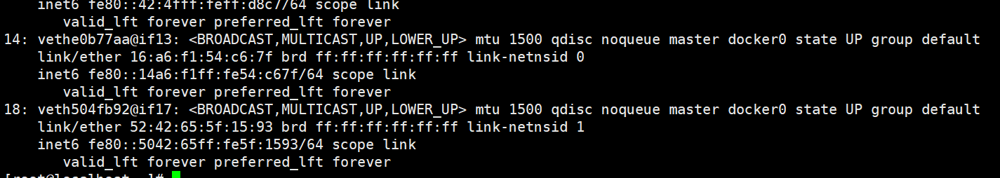

###### 结论：

docker容器内部的IP是有可能会发生改变的

#### 实操：

好比要喝奶茶，这里有个杯(lo)，里面装的奶茶(ens33)，还有个奶茶盖子，盖子上有插吸管的口子(端口 -p)，还有个吸管。

###### 1、bridge:

```md
通俗解释：u1要喝奶茶，而奶茶杯的盖子(bridge),是自带的，上面有插吸管的口子，你可以插个吸管在盖子上的吸管口，所以u1呢就是用吸管插进盖子的口子里，进行喝奶茶。
```

```md
docker run -it --name=c1 centos/vim:7.5.1804 /bin/bash

如图，在容器里，进行ip a，容器外的veth对应容器内的eth0
[root@19615c455cd1 /]# ip a
1: lo: <LOOPBACK,UP,LOWER_UP> mtu 65536 qdisc noqueue state UNKNOWN group default qlen 1000
    link/loopback 00:00:00:00:00:00 brd 00:00:00:00:00:00
    inet 127.0.0.1/8 scope host lo
       valid_lft forever preferred_lft forever
19: eth0@if20: <BROADCAST,MULTICAST,UP,LOWER_UP> mtu 1500 qdisc noqueue state UP group default 
    link/ether 02:42:ac:11:00:04 brd ff:ff:ff:ff:ff:ff link-netnsid 0
    inet 172.17.0.4/16 brd 172.17.255.255 scope global eth0
       valid_lft forever preferred_lft forever

退出后
[root@localhost ~]# ip a
20: vethc73d44c@if19: <BROADCAST,MULTICAST,UP,LOWER_UP> mtu 1500 qdisc noqueue master docker0 state UP group default 
    link/ether 66:c7:08:e0:95:5c brd ff:ff:ff:ff:ff:ff link-netnsid 2
    inet6 fe80::64c7:8ff:fee0:955c/64 scope link 
       valid_lft forever preferred_lft forever
```

```md
bridge介绍：
Docker 服务默认会创建一个 docker0 网桥（其上有一个 docker0 内部接口），
该桥接网络的名称为docker0，它在内核层连通了其他的物理或虚拟网卡，
这就将所有容器和本地主机都放到同一个物理网络。
Docker 默认指定了 docker0 接口 的 IP 地址和子网掩码，
让主机和容器之间可以通过网桥相互通信。
```

```md
1 Docker使用Linux桥接，在宿主机虚拟一个Docker容器网桥(docker0)，Docker启动一个容器时会根据Docker网桥的网段分配给容器一个IP地址，称为Container-IP，同时Docker网桥是每个容器的默认网关。因为在同一宿主机内的容器都接入同一个网桥，这样容器之间就能够通过容器的Container-IP直接通信。

2 docker run 的时候，没有指定network的话默认使用的网桥模式就是bridge，使用的就是docker0。在宿主机ifconfig,就可以看到docker0和自己create的network(后面讲)eth0，eth1，eth2……代表网卡一，网卡二，网卡三……，lo代表127.0.0.1，即localhost，inet addr用来表示网卡的IP地址

3 网桥docker0创建一对对等虚拟设备接口一个叫veth，另一个叫eth0，成对匹配。

   3.1 整个宿主机的网桥模式都是docker0，类似一个交换机有一堆接口，每个接口叫veth，在本地主机和容器内分别创建一个虚拟接口，并让他们彼此联通（这样一对接口叫veth pair）；

   3.2 每个容器实例内部也有一块网卡，每个接口叫eth0；

   3.3 docker0上面的每个veth匹配某个容器实例内部的eth0，两两配对，一一匹配。

 通过上述，将宿主机上的所有容器都连接到这个内部网络上，两个容器在同一个网络下,会从这个网关下各自拿到分配的ip，此时两个容器的网络是互通的。
```

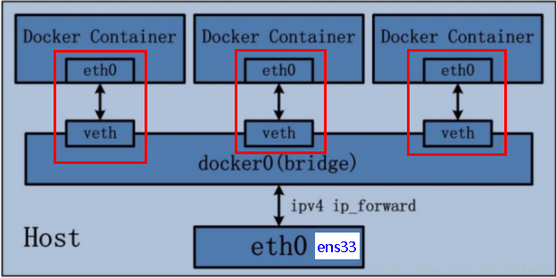

###### 2、host:

```md
通俗解释：
网络模式就是直接把奶茶盖子掀开，直接喝
这不就是与不在docker内，在centos里部署Tomcat的网络一样嘛，直接用主机的
在Tomcat里进行ip a与在centos主机里ip a 一模一样
```

```md
会有警告：
docker run -d -p 8081:8080  --network=host --name=t1 tomcat 
WARNING：Publishd ports are discarded when using host network mode

问题：

     docke启动时总是遇见标题中的警告

原因：

    docker启动时指定--network=host或-net=host，如果还指定了-p映射端口，那这个时候就会有此警告，

并且通过-p设置的参数将不会起到任何作用，端口号会以主机端口号为主，重复时则递增。

解决:

    解决的办法就是使用docker的其他网络模式，例如--network=bridge，这样就可以解决问题，或者直接无视。。。。O(∩_∩)O哈哈~
```

```md
无警报:
docker run -d        --network=host --name=t1 tomcat

访问Tomcat
http://宿主机IP:8080/

在CentOS里面用默认的火狐浏览器访问容器内的tomcat83看到访问成功，因为此时容器的IP借用主机的，

所以容器共享宿主机网络IP，这样的好处是外部主机与容器可以直接通信。
```

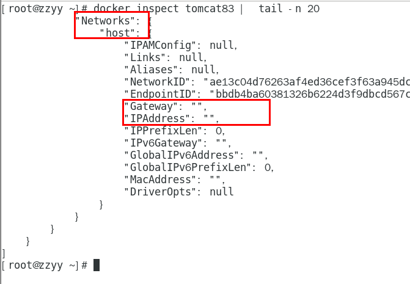

```md
介绍：
直接使用宿主机的 IP 地址与外界进行通信，不再需要额外进行NAT 转换。
```

```md
容器将不会获得一个独立的Network Namespace， 而是和宿主机共用一个Network Namespace。容器将不会虚拟出自己的网卡而是使用宿主机的IP和端口。
```

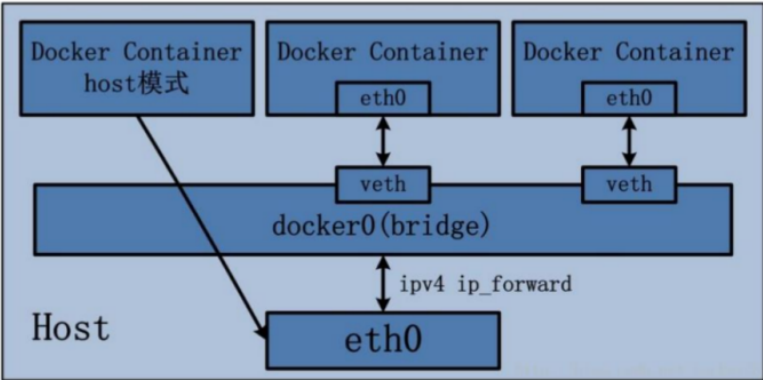

###### 3、none:

```md
通俗解释：这就是就一个奶茶杯子，里面也没有奶茶，就一个杯子(lo)
```

```md
docker run -d -p 8084:8080 --network none --name t1 tomcat
```

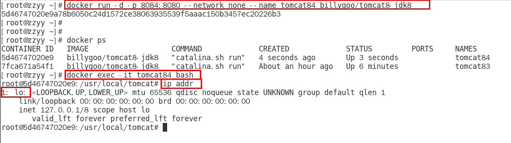
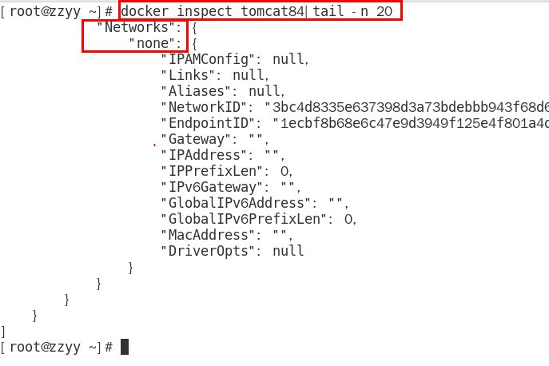

```md
介绍：

在none模式下，并不为Docker容器进行任何网络配置。 

也就是说，这个Docker容器没有网卡、IP、路由等信息，只有一个lo

需要我们自己为Docker容器添加网卡、配置IP等。
```

###### 4、container:

```md
通俗解释：
就是t1在喝奶茶，而t2也想喝，直接用t1的吸管喝奶茶，但是就是，吸管只能一个人用，算是争用一个端口，部分情况可以一起用，但是，吸管毕竟是t1的，当t1不想喝奶茶（即t1关闭）的时候，t2就再也喝不了奶茶。容器实例内的ip a,t1与t2是一模一样的，如果t1关闭，t2的ip a 就只有一个lo,相当于none网络模式
```

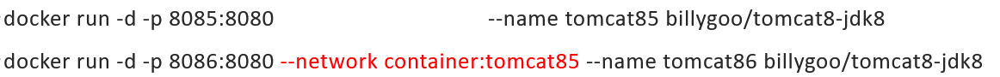
这种情况会出现端口争用，Tomcat不适合演示

```md
介绍：container⽹络模式 

新建的容器和已经存在的一个容器共享一个网络ip配置而不是和宿主机共享。新创建的容器不会创建自己的网卡，配置自己的IP，而是和一个指定的容器共享IP、端口范围等。同样，两个容器除了网络方面，其他的如文件系统、进程列表等还是隔离的。
```

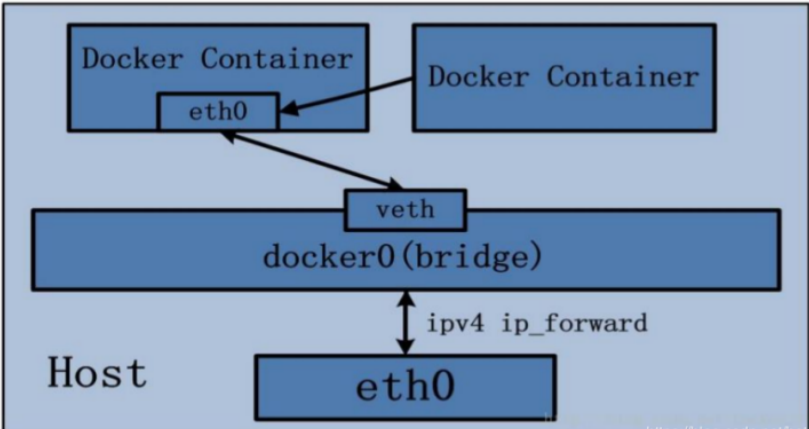

Alpine Linux 是一款独立的、非商业的通用 Linux 发行版，专为追求安全性、简单性和资源效率的用户而设计。 可能很多人没听说过这个 Linux 发行版本，但是经常用 Docker 的朋友可能都用过，因为他小，简单，安全而著称，所以作为基础镜像是非常好的一个选择，可谓是麻雀虽小但五脏俱全，镜像非常小巧，不到 6M的大小，所以特别适合容器打包。
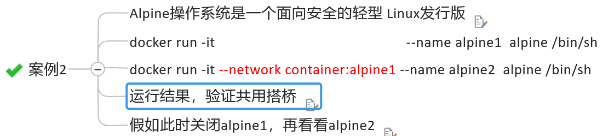

###### 5、自定义网络：

```md
其实就是在bridge的基础上变动了一点。

容器与容器之间进行网络通信

因为docker容器内的ip是可能发生变化的，除非是那些
当容器ip变动的时候可以通过网络名直接进行网络通信而不受影响。ping 192... 变成 ping 容器name，自定义网络是可以进行ping name的，其他网路模式不行，只能ping ip。
```

```md
其实就是在bridge的基础上变动了一点。

首先：docker network create zidingyi-network

[root@localhost ~]# docker network ls
NETWORK ID     NAME               DRIVER    SCOPE
654e6701165e   bridge             bridge    local
9a9a0282c113   host               host      local
4c2a44e440e5   none               null      local
70a276919551   zidingyi-network   bridge    local

然后：
```

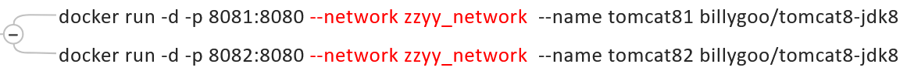
ping name 进行测试


## 🐳docker平台架构图解
```md
从其架构和运行流程来看，Docker 是一个 C/S 模式的架构，后端是一个松耦合架构，众多模块各司其职。 

Docker 运行的基本流程为：

1 用户是使用 Docker Client 与 Docker Daemon 建立通信，并发送请求给后者。

2 Docker Daemon 作为 Docker 架构中的主体部分，首先提供 Docker Server 的功能使其可以接受 Docker Client 的请求。

3 Docker Engine 执行 Docker 内部的一系列工作，每一项工作都是以一个 Job 的形式的存在。

4 Job 的运行过程中，当需要容器镜像时，则从 Docker Registry 中下载镜像，并通过镜像管理驱动 Graph driver将下载镜像以Graph的形式存储。

5 当需要为 Docker 创建网络环境时，通过网络管理驱动 Network driver 创建并配置 Docker 容器网络环境。

6 当需要限制 Docker 容器运行资源或执行用户指令等操作时，则通过 Execdriver 来完成。

7 Libcontainer是一项独立的容器管理包，Network driver以及Exec driver都是通过Libcontainer来实现具体对容器进行的操作。
```
