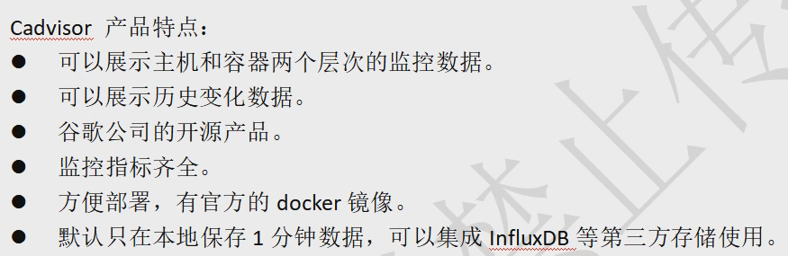
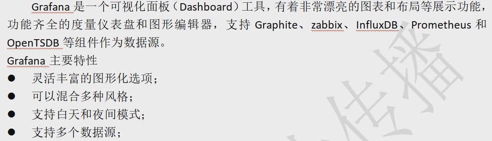
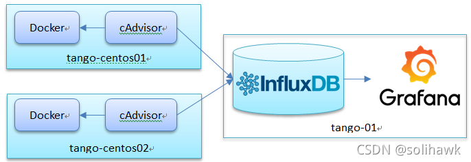

# 搭建容器监控系统:bat:
|Docker Stats命令|
|:---|
|单机Docker容器的监控可以使用Docker stats命令，运行docker stats [CONTAINER_NAME]可以查看容器统计信息，包括每个容器的CPU利用率、内存的使用量以及可用内存总量，也可以看到容器通过网络发送和接收的数据总量。如果没有限制容器内存，那么该命令将显示主机的内存总量，但并不意味着你的每个容器都能访问那么多的内存。|

## Cadvisor+InfluxDB+Grafana实现跨主机容器监控
### Cadvisor（数据采集）
|知识点|
|---|
|Go语言开发|
|是Google用来监测单节点资源信息的监控工具。|
|Cadvisor可以对docker主机上的资源以及容器进行实时监控和性能数据采集，包括CPU使用情况、内存使用情况、网络吞吐量及文件系统使用情况等。|
|一个Cadvisor只能监控一台机器，其提供的系统界面很简陋|
|定位为一个监控数据收集器，收集和导出数据是它的强项，而非展示数据。|

### InfluDB（数据存储）
|知识点|
|---|
|GO语言开发|
|InfluDB是infludata开发的开源非关系型时序型数据库。|
|着力于高性能地查询与存储时序性数据|

|应用场景|
|---|
|性能监控，应用进程指标，物联网传感器数据和实时分析等的后端存储。|

### Grafana（数据展示）

### 监控组件架构

监控组件架构部署方案:
1. 创建自定义网络 monitor(自定义网络名称)，用于后期容器加入此网络中;
2. 创建 lnfluxdb 容器，创建数据用户、数据库;
3. 创建 Cadvisor 容器;
4. 创建 Grafana 容器，配置 grafana;

## Cadvisor+Prometheus+Grafana实现跨主机容器监控

### Prometheus(数据存储)
[知识](https://blog.csdn.net/Dark_Tk/article/details/117667033?)
## 参考文档
[「solihawk」](https://blog.csdn.net/solihawk/article/details/121624212)