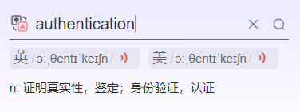

# SQL语言

[SQL学习](https://blog.csdn.net/m0_50546016/article/details/120070003?)

## English




## SQL 语言

| lang                | explain                                                   |
| ------------------- | --------------------------------------------------------- |
| DQL（数据查询语言） | 查询语句，凡是select语句都是DQL。                         |
| DML（数据操作语言） | insert delete update，对表当中的数据进行增删改。          |
| DDL（数据定义语言） | create drop alter，对表结构的增删改。                     |
| DCL（数据控制语言） | grant授权、revoke撤销权限等。                             |
| TCL（事务控制语言） | commit提交事务，rollback回滚事务。(TCL中的T是Transaction) |

## 常用

```sql
连接并登录到 MySQL 操作环境
mysql
    -u 指定用户名
    -p 指定密码（选项和密码之间不能有空格）
    -h 指定主机
    -P 指定端口
    -S 指定 Socket 文件
    -e 指定 SQL 命令语句（非交互模式）

status #查看数据库状态

select user()；#查看当前用户

select now(); #查看当前时间

password() #给密码加密

show processlist; #显示当前任务列表（性能）
```

## mysql破解root管理员密码

```sql
[root@localhost ~]# systemctl stop mysqld //业务低峰期
[root@localhost ~]# netstat -lnpt | grep 3306
跳过加载授权表过程：
[root@localhost ~]# mysqld_safe --skip-grant-tables &

update mysql.user set authentication_string=password('123abc') where user='root';
Query OK, 1 row affected, 1 warning (0.00 sec)
```
