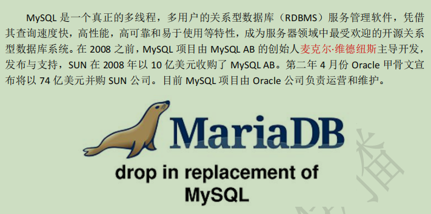
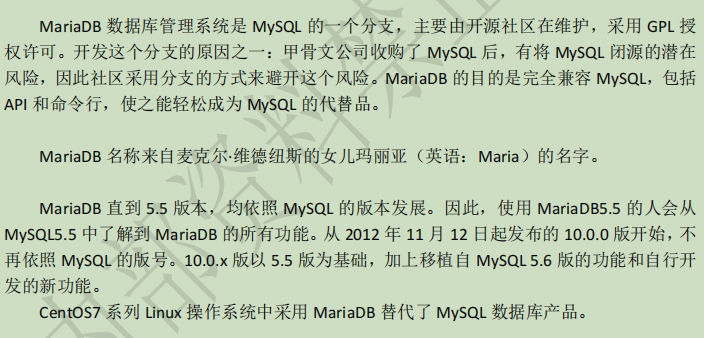

# MySQL 产品简介


# MySQL 与 MariaDB 关联


---
# mysql外部指令
```md
MySQL 数据库系统也是典型的 C/S（客户端/服务器）架构的应用，
连接时需要专用的客户端工具，
Linux 下通过 mysql 命令工具（如果是通过 rpm 格式安装软件需要安装 mysql 软件包）。

连接并登录到 MySQL 操作环境
mysql
    -u 指定用户名
    -p 指定密码（选项和密码之间不能有空格）
    -h 指定主机
    -P 指定端口
    -S 指定 Socket 文件
    -e 指定 SQL 命令语句（非交互模式）
```