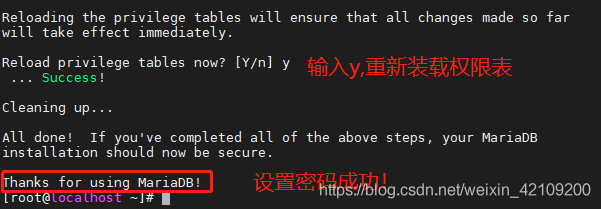

# YUM 安装mariadb数据库
## 安装 mariadb-server mariadb :
    #yum install -y mariadb mariadb-server

## 启动mariadb
    #systemctl start mariadb

## 设置开机自动启动
    #systemctl enable mariadb

## 密码、连接、等设置
    #mysql_secure_installation

## 测试

---
---
# 部署数据库
## 安装
### 准备数据库源码包
$安装前可以开启交换分区，防止内存不足$
### 排查是否有yum安装的MySQL  （避免出错）
    [root@localhost ~]# rpm -q mysql mysql-server mariadb mariadb-server
    未安装软件包 mysql
    未安装软件包 mysql-server
    未安装软件包 mariadb
    未安装软件包 mariadb-server

### 安装 ncurses-devel 依赖包
    [root@localhost ~]# yum -y install ncurses-devel
    [root@localhost ~]# rpm -q ncurses-devel
    ncurses-devel-5.9-14.20130511.el7_4.x86_64

### 安装配置工具 cmake
#### 源码包安装
    [root@localhost ~]# tar xf cmake-3.13.1.tar.gz -C /usr/src/
    [root@localhost ~]# cd /usr/src/cmake-3.13.1/
    [root@localhost cmake-3.13.1]# ./configure && gmake && gmake install

#### yum 安装（推荐）
    [root@localhost ~]# yum -y install cmake
    [root@localhost ~]# rpm -q cmake
    cmake-2.8.12.2-2.el7.x86_64

### 创建运行用户
    [root@localhost ~]# useradd -M -s /sbin/nologin mysql
    [root@localhost ~]# tail -1 /etc/passwd

### 解包，配置，编译，安装
    [root@localhost ~]# tar xf mysql-5.7.24.tar.gz -C /usr/src/
    [root@localhost ~]# cd /usr/src/mysql-5.7.24/
    [root@nginx mysql-5.7.24]# cmake
     -DCMAKE_INSTALL_PREFIX=/usr/local/mysql 
     -DDEFAULT_CHARSET=utf8 
     -DDEFAULT_COLLATION=utf8_general_ci 
     -DWITH_EXTRA_CHARSETS=all 
     -DSYSCONFDIR=/etc 
     && make -j 3 && make install

    参数说明：
        -DCMAKE_INSTALL_PREFIX=/usr/local/mysql //数据库程序安装目录
        -DDEFAULT_CHARSET=utf8 //指定字符集编码
        -DDEFAULT_COLLATION=utf8_general_ci //默认的字符集校对规则， utf8_general_ci 适用于 utf-8 字符集的通用规则
        -DWITH_EXTRA_CHARSETS=all //指定额外支持的字符集编码
        -DSYSCONFDIR=/etc //指定配置文件存放目录
---
## boost 报错处理
    CMake Error at cmake/boost.cmake:81 (MESSAGE):
    You can download it with -DDOWNLOAD_BOOST=1 -DWITH_BOOST=<directory>
    This CMake script will look for boost in <directory>. If it is not there,
    it will download and unpack it (in that directory) for you.
    If you are inside a firewall, you may need to use an http proxy:
    export http_proxy=http://example.com:80
    Call Stack (most recent call first):
    cmake/boost.cmake:238 (COULD_NOT_FIND_BOOST)
    CMakeLists.txt:507 (INCLUDE)
    -- Configuring incomplete, errors occurred!
    See also "/usr/src/mysql-5.7.24/CMakeFiles/CMakeOutput.log". See also "/usr/src/mysql-5.7.24/CMakeFiles/CMakeError.log". 

## 处理方法
### 在/usr/local 下创建一个名为 boost 的文件夹
    [root@localhost ~]# mkdir /usr/local/boost

### 进入目录并下载 boost
    [root@localhost ~]# cd /usr/local/boost
    [root@localhost boost]# wget
    https://sourceforge.net/projects/boost/files/boost/1.59.0/boost_1_59_0.tar.gz

### 解压 boost
    [root@localhost boost]# tar xf boost_1_59_0.tar.gz

### 继续 cmake，添加上红色部分
    [root@nginx ~]# cd /usr/src/mysql-5.7.24/
    [root@nginx mysql-5.7.24]# cmake
     -DCMAKE_INSTALL_PREFIX=/usr/local/mysql
     -DDEFAULT_CHARSET=utf8 
     -DDEFAULT_COLLATION=utf8_general_ci 
     -DWITH_EXTRA_CHARSETS=all 
     -DSYSCONFDIR=/etc 
     -DWITH_BOOST=/usr/local/boost 
     && make -j 3 && make install
---
## 安装后的调整
### 对数据库目录进行权限设置
    [root@localhost ~]# chown -R mysql:mysql /usr/local/mysql/

### 建立配置文件
    (创建配置文件，CentOS7 系统默认支持 MariaDB 数据库，系统默认的/etc/my.cnf 配置文件是MariaDB 的配置文件 )

    [root@localhost mysql]# vim /etc/my.cnf
    [mysqld]
    datadir=/usr/local/mysql/data
    socket=/tmp/mysql.sock
    [mysqld_safe]
    log-error=/usr/local/mysql/data/mysql.log
    pid-file=/usr/local/mysql/data/mysql.pid

### 初始化数据库
    [root@localhost mysql]# ./bin/mysqld 
        --user=mysql 
        --basedir=/usr/local/mysql 
        --datadir=/usr/local/mysql/data 
        --initialize

    2018-12-08T01:51:39.798903Z 1 [Note] A temporary password is generated for root@localhost:
    TvC:Rm1ZlxtG

        --basedir=/usr/local/mysql/ //指定安装目录（产品目录）
        --datadir=/usr/local/mysql/data //指定数据目录
        --user=mysql //指定用户身份

### 设置环境变量
    [root@localhost mysql-5.7.24]# echo "PATH=$PATH:/usr/local/mysql/bin" >> /etc/profile
    [root@localhost mysql-5.7.24]# ./etc/profile 或者 source /etc/profile

## 添加系统服务
    添加 MySQL 为系统服务，以便通过 systemctl 命令进行管理
### 方法一
    [root@localhost mysql-5.7.24]# cp support-files/mysql.server /usr/local/mysql/bin/mysqld.sh
    [root@localhost mysql-5.7.24]# chmod +x /usr/local/mysql/bin/mysqld.sh
    [root@localhost ~]# vim /usr/lib/systemd/system/mysqld.service
    [Unit]
    Description=MySQL Server
    After=network.target
    [Service]
    User=mysql #指定程序运行的用户账户
    Group=mysql #指定程序运行的组账户
    Type=forking
    PIDFile=/usr/local/mysql/data/mysql.pid #指定 PID 文件的位置，默认为“主机名.pid” 
    ExecStart=/usr/local/mysql/bin/mysqld.sh start
    ExecStop=/usr/local/mysql/bin/mysqld.sh stop
    [Install]
    WantedBy=mutil-user.target

    [root@nginx ~]# systemctl start mysqld
    [root@nginx ~]# systemctl enable mysqld
    [root@nginx ~]# netstat -lnpt | grep mysql

### 方法二
    [root@localhost mysql-5.7.24]# cp support-files/mysql.server /etc/init.d/mysqld
    [root@localhost mysql-5.7.24]# chmod +x /etc/init.d/mysqld
    [root@localhost mysql-5.7.24]# /etc/init.d/mysqld start
        Starting MySQL.Logging to '/usr/local/mysql/data/mysql.log'.
        SUCCESS!

    后期修改数据库用户的密码：
    [root@nginx ~]# mysqladmin -u root -p'TvC:Rm1ZlxtG' password '123456' 
    [root@nginx ~]# mysql -uroot -p123456

---
---
# MySQL 客户端使用
    MySQL 数据库系统也是典型的 C/S（客户端/服务器）架构的应用，连接时需要专用的
    客户端工具，Linux 下通过 mysql 命令工具（如果是通过 rpm 格式安装软件需要安装 mysql 软
    件包）。

连接并登录到 MySQL 操作环境:

    mysql
        -u 指定用户名
        -p 指定密码（选项和密码之间不能有空格）
        -h 指定主机
        -P 指定端口
        -S 指定 Socket 文件
        -e 指定 SQL 命令语句（非交互模式）

显示当前连接用户：

    mysql> select user();

查看数据库服务的基本信息：

    mysql> status

退出 mysql 操作环境：

    mysql> exit 或者 mysql> \q

取消命令执行：

    ctrl+c

---
---