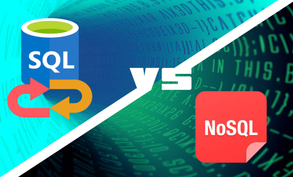

# 数据库⚡️

**关系型数据库管理系统RDBMS**：

- 商业：Oracle（Oracle->Oracle Enterprise Linux），DB2（IBM->AIX）、SQL Server（微软）、
  Sybase，Infomix
- 开源：MySQL（MariaDB），PostgreSQL（Apple），EnterpriseDB

**非关系型数据库 NoSQL（Not Only SQL）**：

- MongoDB，Redis，Memcached、HBase、InfluxDB、TiDB
  MySQL 版本:
- Community Edtion 社区版（CE），免费，由社区人员维护，测试及更新
- Enterprise Edtion 企业版（EE），收费，MySQL 官方维护团队人员维护，测试及更新

## 一、关系型数据库


我们只需要 记住常用的几个：mysql /oracle/sql server/sqlite

```md
关系型数据库：指用关系模型来组织数据信息的数据库。

关系模型指的是二维表格模型，而一个关系型数据库便是由二维表以及表之间的关系所构成的一个数据集合。
```

#### 优点：

```md
- 便于理解：二维表构造非常贴近逻辑；
- 应用方便：支持通用的SQL（结构化查询语言）语句；
- 易于维护：全部由表结构组成，文件格式一致；
- 复杂操作：可以用SQL句子多个表之间做非常繁杂的查询；
- 事务管理：促使针对安全性性能很高的数据信息浏览规定得到完成。
```

#### 缺点：
```md
- 读写性能差，尤其是海量信息的效率高读写能力；
- 固定不动的表构造，灵便度稍欠；
- 高并发读写时，硬盘I/O存在瓶颈；
- 可扩展性不足，不像web server和app server那样简单的添加硬件和服务节点来拓展性能和负荷工作能力。
```

## 二、非关系型数据库


我们只需要 记住常用的：redis / hbase /mongoDB /CouchDB /Neo4J
【注意：hive 不是数据库，是数据仓库 不是一个概念】

```md
非关系型数据库严格上不是一加粗样式种数据库，应该是一种数据结构化存储方法的集合，可以是文档或者键值对等

非关系型数据库算是一种数据结构化储存的集合，可以是文档或键值对等。

非关系型数据库的本质是传统关系型数据库的功能阉割版本，通过去掉不需要的功能来提高性能。
```

#### 非关系型数据库的类型：

- 键值数据库：Redis、Memcached、Riak
- 列族数据库：Bigtable、HBase、Cassandra
- 文档数据库：MongoDB、CouchDB、MarkLogic
- 图形数据库：Neo4j、InfoGrid

#### 优点：

```md
- 格式灵活：数据存储格式非常多样，应用领域广泛，而关系型数据库则只适用基础的关系模型。
- 性能优越：NOSQL是根据键值对的，不用历经SQL层的分析，因此 性能非常高。
- 可扩展性：基于键值对，数据之间耦合度极低，因此容易水平扩展。
- 低成本：非关系型数据库部署简易，且大部分可以开源使用。
```

#### 缺点：

```md
1、不提供sql支持，学习和使用成本较高；（传统）
2、无事务处理；（传统）
3、数据结构导致复杂查询不容易实现。
```

## 三、关系型与非关系型数据库的区别


```md
1. 成本：Nosql数据库易部署，不用像Oracle那般花费较高成本选购。

2. 查询速率：Nosql数据库将数据储存于缓存当中，不用历经SQL层的分析；关系型数据库将数据储存在电脑硬盘中，查询速率远不如Nosql数据库。

3. 储存格式：Nosql的储存文件格式是key,value方式、文本文档方式、照片方式这些，能储存的对象种类灵活；关系数据库则只适用基础类型。

4. 可扩展性：关系型数据库有join那样的多表查询机制限定造成拓展性较差。Nosql依据键值对，数据中间沒有耦合度，因此容易水平拓展。

5. 数据一致性：非关系型数据库注重最终一致性；关系型数据库注重数据整个生命周期的强一致性。

6. 事务处理：SQL数据库支持事务原子性粒度控制，且方便进行事务回滚；NoSQL也支持事务处理，但可靠性不足，其价值在于可扩展性和大数据量处理。
```

## 参考文档

[参考文档1](https://blog.csdn.net/zengxianglei/article/details/94357189)
[参考文档2](https://www.shulanxt.com/doc/dbdoc/sql-nosql)

## 四、事务的定义和特性🌻

#### 事务的定义

```md
1、事务是用户定义的一个数据库操作序列，这些操作要么全做，要么全不做，是一个不可分割的工作单位。

2.事务和程序是两个概念：在关系数据库中，一个事务可以是一条SQL语句，一组SQL语句或整个程序；一个应用程序通常包含多个事务。

3.事务是恢复和并发控制的基本单位。
```

#### 事务特性
```md
- 原子性 （atomicity）：强调事务的不可分割，组成事务操作的各个最小逻辑单元缺一不可，强调了操作的完整性。
- 一致性 （consistency）：事务的执行前后，数据的完整性保持一致，强调数据的完整性。
- 隔离性 （isolation）：一个事务执行的过程中，不应该受到其他事务的干扰，强调事务的独立性。
- 持久性（durability） ：事务一旦结束，数据应持久到数据库中，强调了事务的可持久性。
```
