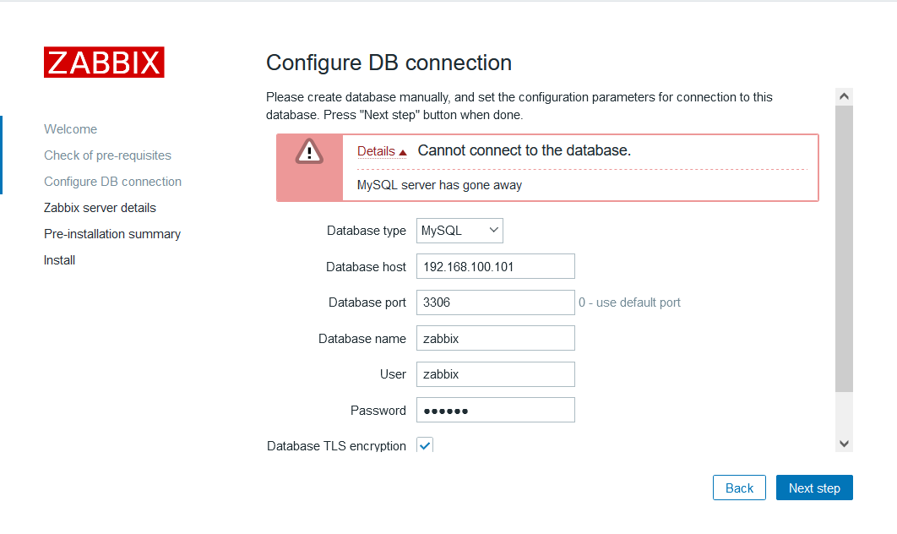
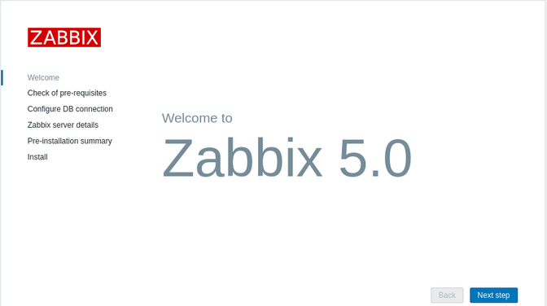
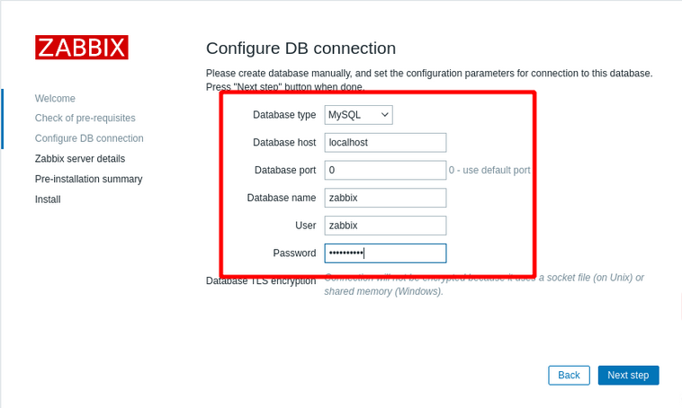
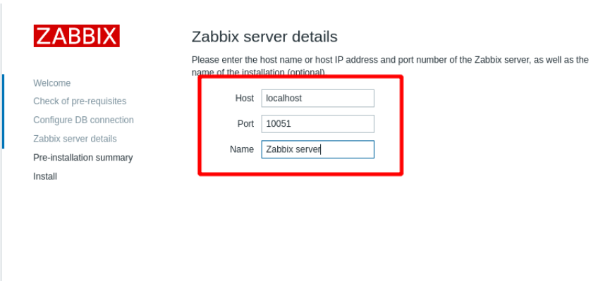
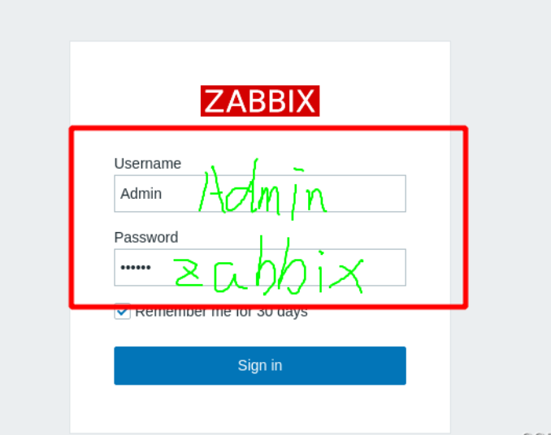
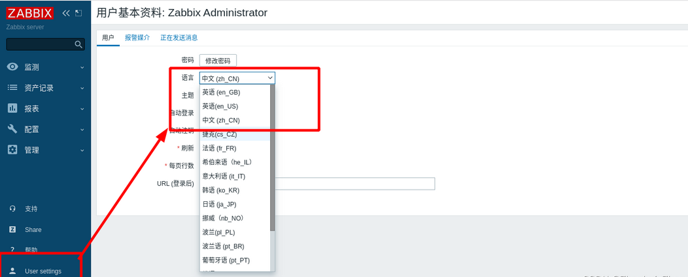
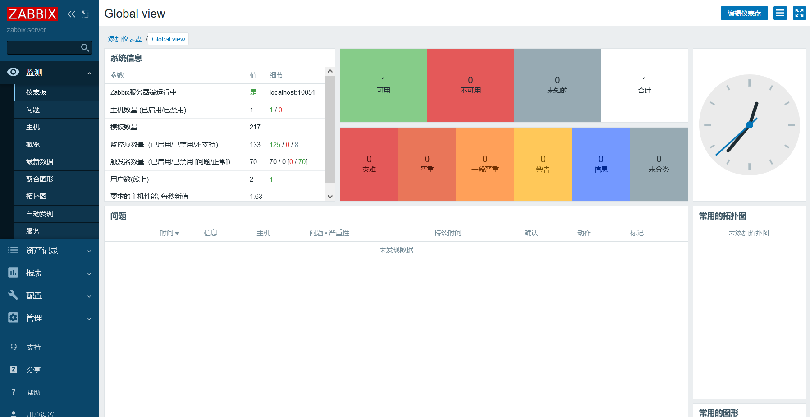

# zabbix安装部署（yum安装版）⚡️

## 安装环境准备

```md
Centos7.5:192.168.100.101   	server.zabbix.com
Centos7.5:192.168.100.102	 	agent.zabbix.com
Windows10:192.168.100.2		windows10client
```

```md
关闭防火墙
systemctl stop firewalld
setenforce 0
```

```md
确保主机能上网
ping www.baidu.com
```

```md
更改主机名
#server端
cat > /etc/hostname <<GG
server.zabbix.com
GG

hostname server.zabbix.com
bash					

cat >> /etc/hosts <<GG
192.168.100.101 server.zabbix.com
192.168.100.102 agent.zabbix.com
192.168.200.2   windows10 
GG
#agent端与server端一样
```

## server端

```md
（1.1）配置yum仓库
cd /cd /etc/yum.repos.d/

wget http://mirrors.aliyun.com/repo/Centos-7.repo 

rpm -Uvh https://repo.zabbix.com/zabbix/5.0/rhel/7/x86_64/zabbix-release-5.0-1.el7.noarch.rpm
sed -i 's#http://repo.zabbix.com#https://mirrors.aliyun.com/zabbix#' /etc/yum.repos.d/zabbix.repo

[root@server yum.repos.d]# ls
bak  Centos-7.repo  CentOS-Media.repo  local.repo  zabbix.repo

# 同步时间
ntpdate time.windows.com
```

```md
(1.2)下载并开启软件
yum install -y httpd mariadb-server mariadb mariadb-devel php php-mbstring php-mysql php-bcmath php-gd php-xmlrpc php-ldap php-xml libevent libevent-devel net-snmp net-snmp-devel libxml2 libxml2-devel ntpdate curl-devel gcc gcc-c++

systemctl start mariadb
systemctl start httpd
mysqladmin -u root password 123456
```

```md
（1.3）准备java环境
# 卸载GUI模式自带的的openjava
java -version
rpm -qa|grep jdk
yum -y remove java-软件包版本

# 安装jdk
tar xf jdk-8u91-linux-x64.tar.gz 

mv jdk1.8.0_91/* /usr/local/java

vim /etc/profile

tail -2 /etc/profile
export JAVA_HOME=/usr/local/java
export PATH=$PATH:$JAVA_HOME/bin

source /etc/profile

java -version
java version "1.8.0_91"
Java(TM) SE Runtime Environment (build 1.8.0_91-b14)
Java HotSpot(TM) 64-Bit Server VM (build 25.91-b14, mixed mode)

javac -version
javac 1.8.0_91
```

```md
（2）安装zabbix服务
yum install -y zabbix-server-mysql zabbix-agent 
```

```md
（3）安装zabbix前端 细节观看参考文档Zhaohui_Zhang
yum install -y centos-release-scl

#激活zabbix前端的仓库
修改：
vim zabbix.repo 
[zabbix-frontend]
enable=1

# 安装zabbix需要的其他包
yum install -y zabbix-web-mysql-scl zabbix-apache-conf-scl 
```

```md
（4）创建初始数据库（安装版本）
mysql -p123456

#创建一个zabbix数据库：
create database zabbix character set utf8 collate utf8_bin;

#创建一个zabbix用户
create user zabbix@localhost identified by 'zabbix';

#修改权限
grant all privileges on zabbix.* to zabbix@localhost;

#刷新权限
flush privileges;
```

```md
（5）修改文件
#向数据库中导入数据
zcat /usr/share/doc/zabbix-server-mysql*/create.sql.gz | mysql -u zabbix -p zabbix

#为Zabbix server配置数据库
vim /etc/zabbix/zabbix_server.conf
124 DBPassword=zabbix

#修改zabbix PHP的配置文件
进入/etc/opt/rh/rh-php72/php-fpm.d/zabbix.conf中最后一行改成php_value[date.timezone] = Asia/Shanghai

[root@server ~]# vim /etc/php.ini
384 max_execution_time = 300				##单位秒，通过POST、GET以及PUT方式接收数据时间进行限制
394 max_input_time = 300				##php程序上传文件解析数据时的时间限制
405 memory_limit = 128M				##设置php程序的内存限制
672 post_max_size = 32M				##POST 方式请求数据所允许的最大大小
854 extension=bcmath.so	  ##加载zabbix程序需要加载的扩展模块bcmath.so手动添加878 date.timezone = Asia/Shanghai			##时区
```

```md
（6）重启进程
systemctl restart zabbix-server zabbix-agent httpd rh-php72-php-fpm
systemctl enable zabbix-server zabbix-agent httpd rh-php72-php-fpm
```

#### 安装的时候的问题

**问题1：ip/zabbix 页面打不开**

```md
配置完文件后，进程是否进行重启
systemctl restart zabbix-server zabbix-agent httpd rh-php72-php-fpm
```

**问题2**


- 解决办法：

```md
    首先：回想创建完后是否进行flush privileges;
    其次：查看是否用户进行grant是否正确。
    最后：如果实在找不出来，建议重新把zabbix数据库和zabbix用户删除，重新操作一遍。
```

#### server测试

```md
在浏览器张浏览ip/zabbix
安装成功后默认用户名：Admin，密码是：zabbix
```








## agent

## 参考文档🌻

(两篇文章配合着看)
[Zhaohui_Zhang](https://blog.csdn.net/Zhaohui_Zhang/article/details/122987338?)
[qiancool](https://blog.csdn.net/qiancool/article/details/121837461?)
