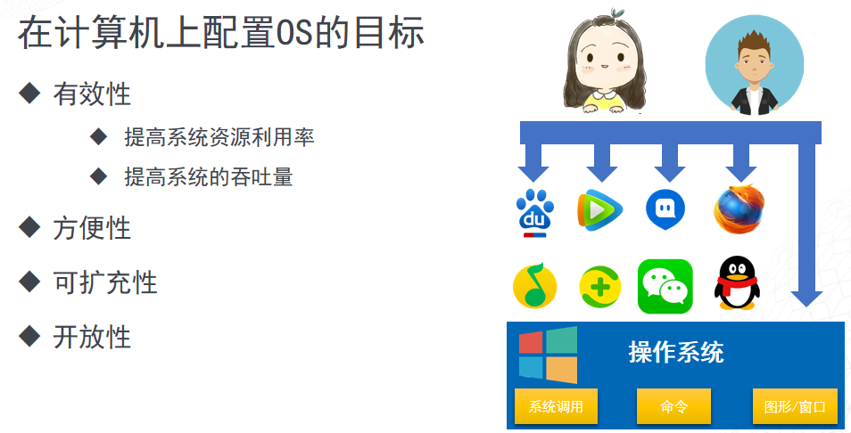
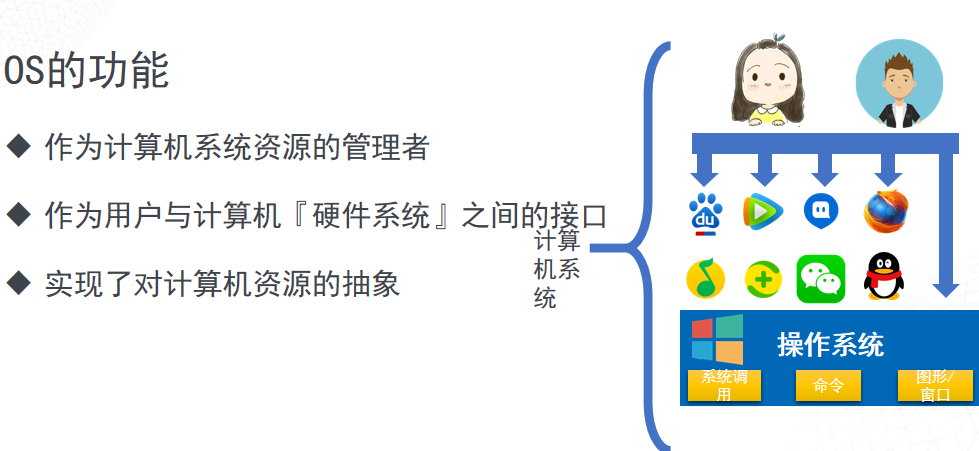
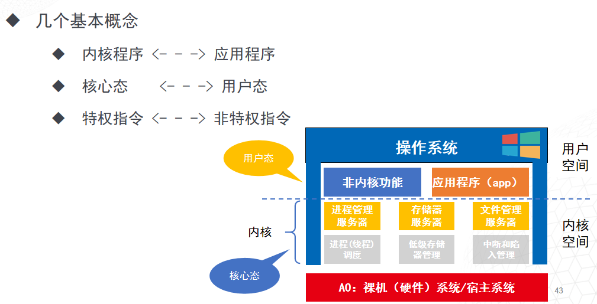
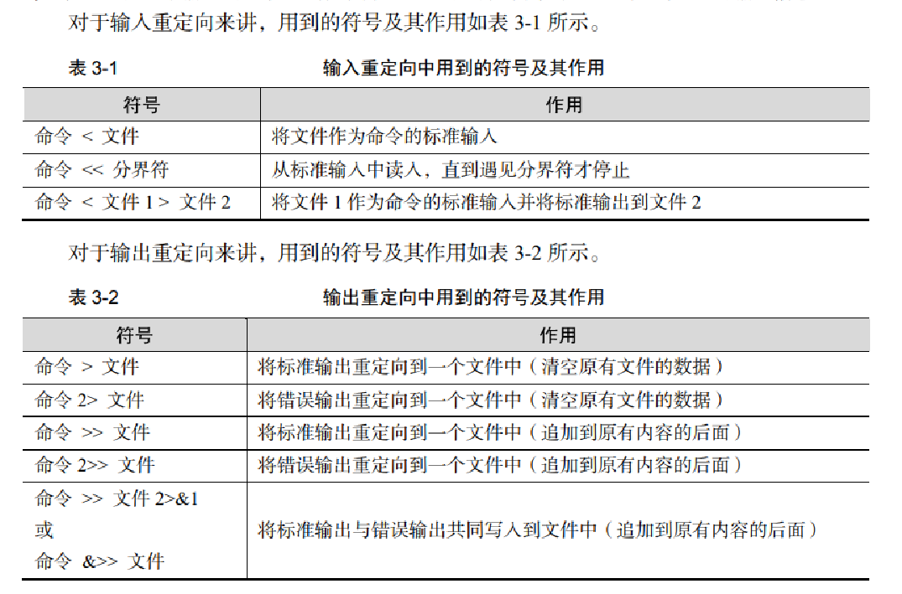

# 信创云运维

## 第一节

### 龙芯云
#### 龙芯云技术工程师
基于mips架构——允许授权商自行更改设计
#### 龙芯中科
核高基：
核：核心电子器件

高端通用芯片：
- GPU
- CPU
- DSP
- SOC
  
基础软件:
- 操作系统
- 数据库
- 办公软件
- 中间件
  

### 架构

|序号|架构|特点|
|:---|---|---|
|1|X86|英特尔和AMD的"专属"，在PC市场上独霸多年，地位不可撼动
|2|ARM|在移动端和便捷设备上有着不可替代的优势
|3|MIPS|在网关和机顶盒等市场非常受欢迎
|4|RISC-V|虽然出来不久，但在智能穿戴产品上应用广泛，前景广阔

## 第二节

## 第三节
### 操作系统

#### 功能

#### 特征

OS的共享性（Sharing）：
即资源共享，系统中的资源供多个『并发执行』的应用程序共同使用
- 同时访问方式：同一时段允许多个程序同时访问共享资源
- 互斥共享方式：也叫独占式，允许多个程序在同一个共享资源上独立而互不干扰的工作
- 共享打印机、音频设备、视频设备

#### 操作系统发展过程

推动操作系统发展的动力：
- 不断提高计算机资源的利用率
- 方便用户
- 器件的不断更新换代
- 计算机体系结构的不断发展

#### 运行机制

#### 结构设计

### 国产操作系统
- 龙芯操作系统
- 银河麒麟操作系统
- 统信UOS操作系统
- 其他操作系统

### 如何定义云计算
云计算是一种按使用量付费的模式。这种模式提供可用的、便捷的、按需的网络访问， 进入可配置的计算资源共享池（资源包括网络，服务器，存储，应用软件，服务）。这些资源能够被快速提供，只需投入很少的管理工作，或与服务供应商进行很少的交互。
—— 美国国家标准与技术研究院

云计算是一种基于互联网的计算方式。通过这种方式，共享的软硬件资源和信息可以按需求提供给计算机和其他设备。云计算依赖资源的共享以达成规模经济，类似基础设施（如电力网）。
—— 维基百科

#### 云计算时代

#### 云计算商业模式

#### 云计算部署模式

#### 云计算的虚拟化技术
##### 虚拟机

##### Docker容器

##### 基于虚拟机的虚拟化
它通过一个软件层的封装，提供和物理硬件相同的输入输出表现，实现了操作系统和计算机硬件的解耦，将OS和计算机间从1对1变成了多对多（实际上是1对多）的关系。 该软件层称为虚拟机管理器（VMM/Hypervisor），它可以直接运行在裸机上（Xen、VMware ESXi），也可以运行在操作系统上（KVM、VMware workstation）。

这项技术已经发展了40多年，但仍然存在以下几个问题：
- 在虚拟机上运行了一个完整的操作系统（GuestOS），在其下执行的还有虚拟化层和宿主机操作系统，一定比直接在物理机上运行相同的服务性能差；  
- 有GuestOS的存在，虚拟机镜像往往有几个GB甚至几十个GB，占用的存储空间大，便
携性差；  
- 想要使用更多硬件资源，需要启动一台新的虚拟机，要等待GuestOS启动，可能需要几十秒到几分钟不等
##### 基于容器的虚拟化

##### 云服务器分层
“云”其实是互联网的一个隐喻，“云计算”其实就是使用互联网来接入存储或者运行在远程服务器端的应用，数据，或者服务。
任何一个在互联网上提供其服务的公司都可以叫做云计算公司。其实云计算分几层的，分别是Infrastructure（基础设施）-as-a-ServicePlatform（平台）-as-a-Service，Software（软件）-as-a-Service。基础设施在最下端，平台在中间，软件在顶端。别的一些“软”的层可以在这些层上面添加。

##### 本地部署、Iaas、Pass、SaaS

##### 私有云-本地部署
需要客户提供场地，购买硬件设施交换机、服务器、PC机，软件系统、软件平台以及软件系统搭建服务和硬件设施后期维保服务。
- 优点：软硬件设施完全私有化，不用担心和其他用户的运行冲突
- 缺点：不仅前期投入高且后期维护成本高

##### Iaas基础设施服务层
提供给消费者的服务是对所有计算基础设施的利用，包括处理CPU、内存、存储、网络和其它基本的计算资源，用户能够部署和运行任意软件，包括操作系统和应用程序。消费者不管理或控制任何云计算基础设施，但能控制操作系统的选择、存储空间、部署的应用，也有可能获得有限制的网络组件（例如路由器、防火墙、负载均衡器等）的控制
油、肉、配料、酱料等原材料云端已经准备好了。你只需要提供剩下的东西。相当于一个半成品，回家加做熟就可以吃了。
- 优点：相对其他几种服务，它的自由度、灵活度非常的高
- 缺点：它的维护成本比较高。使用它会导致Cpu、内存等等计算资源浪费

##### Paas平台即服务
提供给消费者的服务是把客户采用提供的开发语言和工具（例如Java，python, .Net等）开发的或收购的应用程序部署到供应商的云计算基础设施上去。客户不需要管理或控制底层的云基础设施，包括网络、服务器、操作系统、存储等，但客户能控制部署的应用程序，也可能控制运行应用程序的托管环境配置
你都不需要自己做，只需要提供桌子、板凳。直接在网上点个鱼香肉丝的外卖，送到家直接吃就好。
- 优点：减少的搭建各种平台的损耗，为云端和用户节省了资源
- 缺点：相对IaaS来说，PaaS的自由度和灵活度比较低，不太适合专业性比较高的IT技术从业人员

##### Saas软件即服务
提供给消费者完整的软件解决方案，你可以从软件服务商处以租用或购买等方式获取软件应用，组织用户即可通过 Internet 连接到该应用（通常使用 Web 浏览器）。所有基础结构、中间件、应用软件和应用数据都位于服务提供商的数据中心内。服务提供商负责管理硬件和软件，并根据适当的服务协议确保应用和数据的可用性和安全性。SaaS 让组织能够通过最低前期成本的应用快速建成投产。
桌子板凳都不用准备，你直接去店里去吃。
- 优点：方便快捷，资源利用可以非常优化。用户使用直接管理这些软件产生的数据就可以了。
- 缺点：软件多而且杂乱、安装复杂、使用复杂、运维复杂。用户如果不是批量采购的话购买价格昂贵。
、

---
# LINUX系统安全

1）物理系统的安全性：
    通过设置GRUB密码来保护Linux服务器

2）磁盘分区
　　使用不同的分区很重要，对于可能得灾难，这可以保证更高的数据安全性。通过划分不同的分区，数据可以进行分组并隔离开来。当意外发生时，只有出问题的分区的数据才会被破坏，其他分区的数据可以保留下来。你最好有以下的分区，并且第三方程序最好安装在单独的文件系统/opt下。
　　/       /boot　　/usr　　/var　　/home　　/tmp　　/opt

3）最小包安装，最少漏洞
你真的需要安装所有的服务么?建议不要安装无用的包，避免由这些包带来的漏洞。这将最小化风险，因为一个服务的漏洞可能会危害到其他的服务。找到并去除或者停止不用的服务，把系统漏洞减少到最小。

4）检查网络监听端口
　　在网络命令 ‘netstat‘ 的帮助下，你将能够看到所有开启的端口，以及相关的程序。使用我上面提到的 ‘chkconfig‘ 命令关闭系统中不想要的网络服务。
　　# netstat -tulpnLinux 网络管理中的20条 Netstat 命令

5）除非必要，永远都不要直接登录 root 账户。
使用“sudo”执行命令。sudo 由 /etc/sudoers 文件制定，同时也可以使用“visudo”工具编辑，它将通过 VI 编辑器打开配置文件。

　　同时，建议将默认的 SSH 22 端口号改为其他更高的端口号。打开主要的 SSH 配置文件并做如下修改，以限制用户访问。

　　# vi /etc/ssh/sshd_config关闭 root 用户登录
　　PermitRootLogin no特定用户通过
　　AllowUsers username使用第二版 SSH 协议
　　Protocol 2SSH 服务器安全维护五条最佳实践

6）打开SELinux
　　SELinux(安全增强linux)是linux内核提供的一个强制的访问控制安全机制。禁用SELinux意味着系统丢掉了安全机制。要去除SELinux之前仔细考虑下，如果你的系统需要发布到网络，并且要在公网访问，你就要更加注意一下。

7）移除KDE或GNOME桌面
　　没必要在专用的LAMP服务器上运行X Window桌面比如KDE和GNOME。可以移掉或关闭它们，以提高系统安全性和性能。打开/etc/inittab然后将run level改成3就可以关闭这些桌面。如果你将它彻底的从系统中移走

8）关闭IPv6
　　如果不用IPv6协议，那就应该关闭掉它，因为大部分的应用和策略都不会用到IPv6，而且当前它不是服务器必需的。

9）限制用户使用旧密码、检查用户密码过期、增强密码

10）启用Iptable(防火墙)
强烈推荐启用linux防火墙来禁止非法程序访问。使用iptable的规则来过滤入站、出站和转发的包。我们可以针对来源和目的地址进行特定udp/tcp端口的准许和拒绝访问。

---
# 散装知识
- linux 文件名不能超过256个字符
>
- 快捷键：
Tab :自动补全
ctrl + l (clear) :清屏
ctrl + Shift + c :复制
ctrl + Shift + v :粘贴
ctrl + c :终止当前输入，或者当前任务和程序
>
- 快照：备份系统
>
- &&：

        命令1 && 命令2
        只有命令1 成功了，才能执行命令2

- ||：

        命令1 || 命令2
        只有命令1 失败了，才能执行命令2
>
- 
>
- 
>
- 
>
- 
>
- 
>
- .*abc  为abc前面为任意
>
- 127.0.0.1 本地回环地址 对应centos7中的lo接口，网卡对虚拟机内的进程之类的接口
>
- 192.168.xxx.xxx 对外ip地址，centos7中的ens33接口，网卡的对外的网络配置器，路由器等的接口

