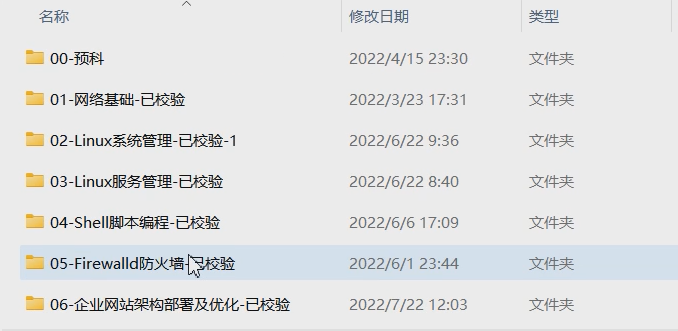
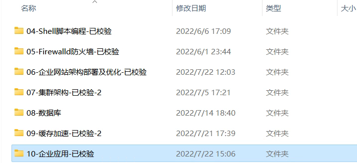
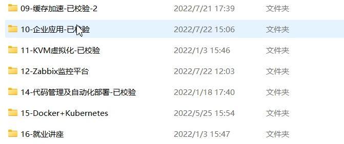
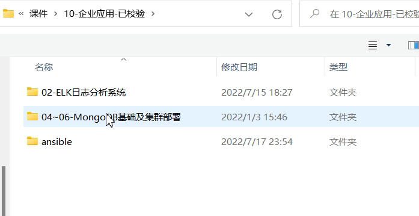

# 掌握find,awk,sed
# 了解万国字符集
# 整理LAMP
# 整理LAMT
# 下载jpress源码包
# 学会使用Wordpress
# 学会使用Ubuntu
# 学会使用dnf
# 创建ftp文档
# 创建vnc文档
# 解决服务遗留的知识点
# 最小安装改为桌面化
# 邮件服务器
# 安装Wordpress
# rpm 命令掌握
# 完善docker
# yaml语言使用
# 学习英语，为了到软件的官网上进行学习
# 提高打字速度

